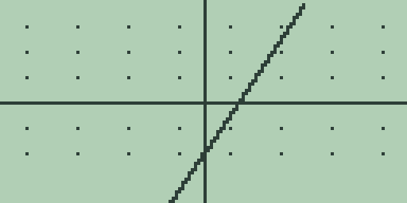
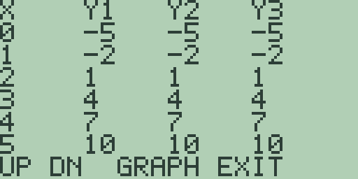
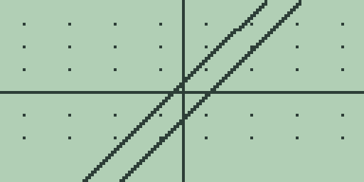
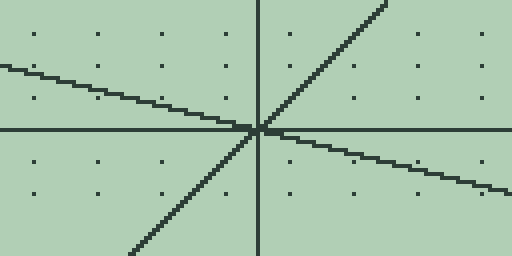
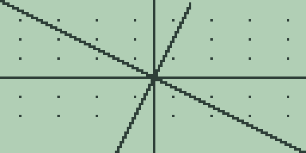
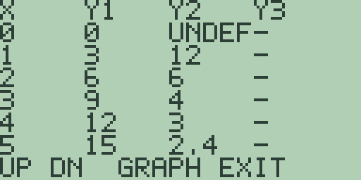
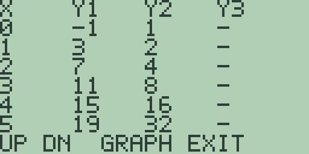

# Chapter 1: Explorations in Lines and Patterns

A straight line is the first thing in algebra that is worth graphing, and it
is the last thing most courses let you look at properly. You are taught
three ways to write one, told they are equivalent, and moved on before you
have seen the equivalence with your own eyes.

This chapter is where you see it. Three forms of one line in three graph
slots, drawing one line. Then the two facts about slopes that everything
else in coordinate geometry rests on, and a screen that lies about one of
them until you tell it not to. Then two tables side by side, showing what
makes a proportional relationship a different animal from an inverse one.
And last, sequences, which turn out not to be a new topic at all: they are
the curves of the first three sections with only the whole numbers kept.

Nothing here needs anything the machine cannot do easily. Store an equation
with [GRAPH], let the plot finish before pressing anything, and press
[CLEAR] before typing on the home screen. The function graphing itself is
the Guidebook, chapter 4.

## 1.1 Three forms, one line

Here is a line described three ways.

    y = 3x - 5
    y - 1 = 3(x - 2)
    6x - 2y = 10

The first is slope-intercept, the second is point-slope through the point
(2, 1), the third is standard form. Your textbook says these are the same
line. They do not look the same, and being told is not the same as knowing.

The machine has three graph slots. That is exactly enough.

1. Press [CLEAR]. Type `3*X-5` and press [GRAPH]. A line appears, climbing
   left to right and crossing the y axis below the origin.

2. Press [2nd] [2] to move to slot 2. The entry line clears itself for the
   new slot.

   The second form has to be rearranged before the machine will take it,
   because every slot must say what y *is*. From y - 1 = 3(x - 2), add 1 to
   both sides: y = 1 + 3(x - 2). Type `1+3*(X-2)` and press [GRAPH].

   Wait for it. Then look at the screen and notice that you cannot tell
   anything has happened.

3. Press [2nd] [3] for slot 3, and rearrange the third form the same way.
   From 6x - 2y = 10, subtract 6x and divide by -2, or just divide the
   whole thing by 2 and rearrange. Either way you can type the arithmetic
   and let the machine do it: `(6*X-10)/2`. Press [GRAPH].

   

   Three slots are storing three different expressions and one line is on
   the screen. Every point of the second landed on a point of the first,
   and the third landed on both.

That is a demonstration, but it is not proof, and it is worth being clear
about the difference. The screen has 128 columns. Two lines that differ by
less than the width of a pixel are one line as far as it is concerned, and
you have already seen, if you tried the fourth exercise below, how easy
that is to arrange.

So do it again where the machine cannot round anything away.

4. Press [MORE] for the table.

   

   Read across. At `X=0` all three read `-5`. At `X=1`, `-2`. Then `1`, `4`,
   `7`, `10`. Three columns, one set of numbers, no rounding involved
   because these are the machine's fourteen digits and they agree in all of
   them.

   Read down the `X=2` row while you are here: all three say `1`. That is
   the point (2, 1) that the second form was built around, and it is on the
   first and third forms too, which is what "the same line" means.

The table is the better picture, and I would rather you took that away from
this section than the plot. A graph shows you that two things are close. A
table of exact values shows you that they are equal. When the two disagree,
believe the table.

**Try it.**

1. Rearrange 4x + 2y = 6 into a form the machine will take, store it, and
   store `3-2*X` in slot 2. Predict what the table will show before you
   press [MORE].
2. Put the line through (1, 4) with slope -2 into slot 1 in point-slope
   form and slot 2 in slope-intercept form. Say what both should read at
   `X=1` before you look.
3. Store `3*X-5` in slot 1 and `3*X-5.0001` in slot 2, and press [GRAPH].
   Then press [MORE]. Which of the two screens can tell them apart, and
   what does that say about the demonstration in step 3?
4. A classmate writes the line through (2, 1) with slope 3 as
   `y = 3x - 5`, and another writes `y = 3(x - 2) + 1`. Without graphing
   anything, multiply out the second and say why the argument in this
   section never really needed a calculator. Then say what the calculator
   was actually for.

## 1.2 Parallel, perpendicular, and a window that lies

Two facts, both from the textbook, both about slopes.

Parallel lines have equal slopes. Perpendicular lines have slopes that
multiply to -1, so a line of slope 2 is crossed at a right angle by a line
of slope -1/2.

The first of those the machine will show you honestly. The second it will
lie about until you stop it.

1. Press [CLEAR], type `2*X+1`, and press [GRAPH]. Press [2nd] [2], type
   `2*X-3`, and press [GRAPH].

   

   Two lines going the same way, one four units below the other, and no
   suggestion anywhere on the screen that they will ever meet. Equal slopes
   look like equal slopes. Nothing is wrong here.

2. Now the other pair. Press [CLEAR], type `2*X`, and press [GRAPH]. Press
   [2nd] [2], type `-X/2` with the [(-)] key for the sign, and press
   [GRAPH].

   Two times minus a half is minus one, so on paper these cross at exactly
   ninety degrees.

   

   That is not a right angle and you do not need a protractor to say so.
   The shallow line is far too shallow.

   Before you doubt the arithmetic, the arithmetic is fine. What is wrong
   is the screen.

3. Here is the reason, and it is worth having properly because it will
   affect every picture you draw from here on.

   The display is 128 pixels across and 64 down. The standard window runs
   from -10 to 10 in both directions. So 20 units of x are spread over 128
   pixels and 20 units of y are squeezed into 64, which makes a horizontal
   pixel worth half as much as a vertical one. Every picture in the
   standard window is squashed flat by a factor of two.

   A slope of 2 is drawn as though it were 1. A slope of -1/2 is drawn as
   though it were -1/4. The right angle between them is not being computed
   wrongly; it is being drawn onto a grid that is not square.

4. Press [2nd] [-], the square window, and let the replot finish.

   

   There it is. The same two equations, the same two slopes, and now a
   right angle you would be happy to measure.

   What that key did was leave the x range alone and adjust the y range so
   that one pixel across is worth the same as one pixel down. Nothing about
   the mathematics changed. The only thing that changed is whether the
   picture is entitled to be believed about angles.

I built the standard window to be -10 to 10 both ways because that is the
first window anybody wants and the numbers are easy to think about, and I
would do it again. But it is worth saying plainly what that costs: in that
window, angles are wrong, circles are eggs, and anything you conclude by
eye about perpendicularity is a guess. When the question is about shape,
press [2nd] [-] first. When the question is about values, the standard
window is fine and the table is better.

**Try it.**

1. In the square window, store `3*X` and the line through the origin
   perpendicular to it. Work out the second slope on paper first, and say
   what it is about the number 3 that makes this pair easier to check by
   eye than the pair in step 2.
2. Go back to the standard window with [2nd] [+] and store `X` in slot 1
   and `-X` in slot 2. These are perpendicular. Do they look it? Explain
   why this particular pair survives the squashing when the pair in step 2
   did not.
3. Store `2*X` and `-X/2` again and press [2nd] [-]. Now press [+] twice,
   waiting for each replot. Is the angle still right? Say what [+] does to
   the two ranges and why that answers the question.
4. Two lines have slopes 5 and -0.2. Without graphing, say whether they are
   perpendicular. Then graph them in the square window and say how easy
   that was to see, and whether you would trust your eye on a pair like
   this one.

## 1.3 Direct and inverse, in two columns

Two relationships that beginners mix up constantly, and one screen that
separates them for good.

Direct variation is y = kx: double x and y doubles. Inverse variation is
y = k/x: double x and y halves. Both are called "varying with x" in
ordinary speech, which is most of the trouble.

Take k = 3 for the direct one, and k = 12 for the inverse.

1. Press [CLEAR], type `3*X`, and press [GRAPH]. Press [2nd] [2], type
   `12/X`, and press [GRAPH].

2. Press [MORE] for the table.

   

   Take the columns one at a time, because everything is in them.

   `Y1`, the direct one, reads `0`, `3`, `6`, `9`, `12`, `15`. Even steps of
   3, all the way down. Divide each by its x and you get 3 every time. That
   constant ratio is what "direct" means, and the even spacing is what it
   looks like.

   `Y2`, the inverse one, reads `UNDEF`, `12`, `6`, `4`, `3`, `2.4`. The
   steps are not even and they are getting smaller. But multiply each by
   its x: 1 times 12, 2 times 6, 3 times 4, 4 times 3, and 5 times 2.4.
   Twelve, every time.

   So one has a constant ratio and the other has a constant product. That
   is the whole distinction, it is visible in two columns, and it is worth
   more than any number of sentences about them.

3. Now the row that is not a number. `Y2` at `X=0` says `UNDEF`.

   That is not the machine giving up. It is the honest answer. Twelve
   divided by nought is not a number, so there is no value to put there,
   and the table says so rather than printing something.

   The direct column has no such trouble: at x = 0 it reads `0`, and a
   direct relationship always passes through the origin. The inverse one
   never can. That single missing row is the deepest difference between the
   two, and it is the one that survives when you have forgotten which is
   which: ask what happens at nought.

4. Press [EXIT] to go back to the plot and look at the two shapes together.
   The direct one is the straight line of section 1.1. The inverse one is
   two separate branches that approach the axes without reaching them.

   They are not the same kind of object at all, and after the table you
   should not be able to confuse them again.

**Try it.**

1. A relationship gives y = 20 when x = 4. Store both a direct and an
   inverse model that fit that one point, then read both columns at `X=2`
   and at `X=4`. Which one doubles as x doubles, and which one halves? And
   why must they agree at `X=4` whatever the models are?
2. Read the `Y2` column and say what the product x times y is at `X=5`,
   using only the displayed `2.4`. Then check it by pressing [CLEAR] and
   asking the machine.
3. Store `12/X` alone and press [MORE], then press [-] twice to halve the
   table step. Read the rows either side of nought. What happens to the
   values as the step gets smaller, and does the `UNDEF` row ever go away?
4. Say which of these is direct, which inverse, and which neither: the cost
   of apples against their weight; the time for a journey against the speed
   travelled; the area of a square against its side. Then build a table for
   the one that is neither and say how the table gives it away.

## 1.4 Sequences, which are functions in disguise

A sequence is a list of numbers with a rule. Arithmetic sequences add the
same amount each time, geometric ones multiply by the same amount, and
school treats them as a separate topic with its own formulas.

They are not a separate topic. An arithmetic sequence is the line of
section 1.1 with only the whole numbers kept, and a geometric sequence is
an exponential curve with the same restriction. Once you have seen that,
the formulas stop being things to memorise.

Take 3, 7, 11, 15, adding 4 each time, and 2, 4, 8, 16, doubling each time.

1. The first is a line. It goes up 4 every step, so its slope is 4, and
   working backwards to where it would cross at n = 0 gives -1. So the rule
   is 4n - 1. Press [CLEAR], type `4*X-1`, and press [GRAPH].

2. The second doubles, which is 2 to the power of n. Press [2nd] [2] for
   slot 2, type `2^X`, and press [GRAPH].

   Be patient with this one. An exponential is much slower to draw than a
   line, and a press that arrives mid-draw goes nowhere. Let it reach the
   right-hand edge.

3. Press [MORE] for the table.

   

   `Y1` reads `-1`, `3`, `7`, `11`, `15`, `19`. `Y2` reads `1`, `2`, `4`,
   `8`, `16`, `32`.

   There are both sequences, side by side, and the difference between the
   two kinds is visible rather than defined. Go down the first column
   subtracting: 4 every time. Go down the second dividing: 2 every time. A
   constant difference against a constant ratio, which is exactly the
   distinction section 1.3 drew between direct and inverse variation, one
   level up.

4. Notice where each sequence starts. The table opens at `X=0`, and at
   nought the columns read `-1` and `1`, neither of which is in the
   sequences you were given. Your 3 and your 2 are on the `X=1` row.

   That is not the machine being wrong. It is the difference between a
   function, which is happy to be asked about nought, and a sequence, which
   usually starts counting at one. The function is defined everywhere and
   you are choosing which part of it to call the sequence.

5. Now the other tool, for when you want a term a long way out. Four
   program slots hold eight lines each, and a counted loop is the natural
   shape.

   Press [PRGM], then [F1], `NEW`, and type:

   | Line | Text |
   |---|---|
   | 1 | `FOR A,3,15,4` |
   | 2 | `DISP A` |
   | 3 | `END` |
   | 4 | `STOP` |

   Press [F2] to run it. The screen shows `15`, then `DONE`.

   `FOR A,3,15,4` counts from 3 to 15 in steps of 4, which is the sequence
   exactly: 3, 7, 11, 15. The step is the third argument and it has been
   there since firmware 2.19, along with the freedom to write the bounds as
   expressions rather than single digits.

6. But look at what the screen shows, because it is not what you might have
   hoped. One number, `15`, and not the four terms.

   `DISP` writes to the same place every time round the loop, so each term
   overwrites the one before and only the last survives. The loop computed
   the whole sequence and showed you the end of it.

   That sounds like a limitation and it is, but it also tells you what this
   tool is for. The table is how you look at a sequence: all of it at once,
   in order, with the pattern visible. The program is how you ask for a
   term you do not want to read your way down to. Two tools, two questions,
   and using the wrong one is most of the frustration people have with
   loops.

**Try it.**

1. From the table, state the common difference of the first sequence and
   the common ratio of the second. Then say what the `X=6` row will read in
   both columns before you scroll to it.
2. Write a program to find the twentieth term of 3, 7, 11, 15. Then notice
   what you had to know in order to write the loop's upper bound, and say
   what that tells you about whether `FOR` was the right tool for this
   particular question.
3. Change the geometric program to double ten times starting from 1, using
   `FOR A,1,10` with a line multiplying a stored value by 2. What does it
   report, and is that the tenth term of 2, 4, 8, 16 or something else?
   Explain the off-by-one either way.
4. Section 1.1 said a line is fixed by two points. A sequence is usually
   given by its first term and its common difference. Say why those are the
   same two pieces of information, and use the table to check your claim on
   `Y1`.
