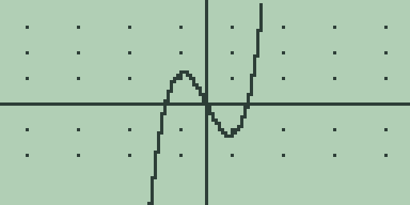
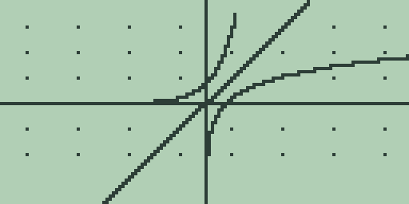
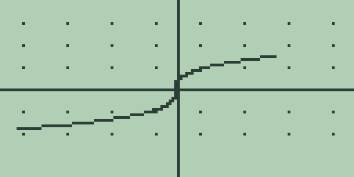

# Chapter 1: Explorations in precalculus

Precalculus is where functions stop being formulas to evaluate and become
objects to study: things with graphs, zeros, symmetries, and families of
relatives. This chapter uses the Free85 graph screen as a laboratory for
that shift. Each section opens with a question about functions, walks it
through on the machine, and leaves you with exercises to continue on your
own. The mechanics of graphing (slots, windows, tracing, the analysis keys)
are covered in full in the Guidebook, chapter 4; this chapter uses them
rather than re-explains them. Every key sequence and every quoted number in
this chapter was run in the emulator on a fresh machine.

Each exploration ends with a "Try it" block of exercises. They are all
answerable on the calculator with the techniques just shown, and no answers
are printed: the machine is the answer key.

## 1.1 Functions and their windows

A graph is a partnership between a function and a window. The function
decides what there is to see; the window decides what you actually see, and
a badly chosen window can hide a zero, flatten a wiggle, or crop the only
interesting part of the curve. The working example is the cubic

f(x) = x^3 - 4x,

which has three zeros and a small hill-and-valley between them: a shape
worth framing deliberately.

1. On the home screen, type [x-VAR] [^] [3] [-] [4] [×] [x-VAR] so the
   entry line reads `X^3-4*X`, then press [GRAPH]. The home entry line is
   the equation editor: [GRAPH] stores the line into the active slot `Y1`
   and plots it in the standard window, -10 to 10 on both axes.

   

2. Press [▶] twice to trace two columns right of centre. The readout gives
   `X=0.393700787402` and `Y=-1.5137794055131`: trace positions are the
   exact sample columns, spaced one 127th of the window width apart, and
   the second line is the function evaluated there in full precision.

3. Ask the window itself where it is. Press [+] once (the quick zoom-in)
   and the plot redraws with every bound halved; back on the home screen,
   typing `XMIN` (each letter is [ALPHA] plus the key carrying it) and
   pressing [ENTER] answers `= -5`. From the standard window, one press of [-]
   instead answers `= -20`. The window bounds `XMIN`, `XMAX`, `YMIN`, and
   `YMAX` are read-only system values: Free85 changes the window through
   the zoom keys and panels, not by typing bounds, so a deliberate window
   is built from zooms. [2nd] [+] restores the standard window whenever an
   experiment has taken you somewhere unhelpful.

4. Now the zeros. With the cubic replotted in the standard window, press
   [F1]: the answer is `= 0` with the residual line `R=0`. The root search
   starts from the traced position, and the trace reference sits at `X=0`
   after a replot, which happens to be a zero of this cubic already. To
   find a different zero, move the trace first: press [◀] thirteen times,
   taking the trace near `X=-2`, and press [F1] again. The answer is
   `= -2` with `R=0`, the exact leftmost zero.

5. Zeros of a pair meet the same way. Press [2nd] [2] on the graph screen
   to switch to slot `Y2` (the entry line comes back empty), type
   [x-VAR], and press [GRAPH]: the line `X` joins the cubic. Trace
   fourteen columns left, then press [2nd] [F1], the intersection search.
   The answer is `= -2.2360679774997` with `R=-3E-13`: the negative square
   root of five, where `X^3-4*X` and `X` cross, with the residual showing
   how nearly the two sides agree.

The lesson to carry forward: trace to the neighbourhood you care about,
then ask. The analysis keys answer questions about the window and the
traced position you give them.

**Try it.**

1. `Y1` holds `X^3-4*X` and `Y2` holds `X`. There are three
   intersections in the standard window. Find the other two with trace
   and [2nd] [F1], and check that the positive one is the square root
   of five.
2. Plot `X^3-4*X+3` and find all three of its zeros with trace and [F1].
   Which of them could you have read straight from the table?
3. Zoom in with [+] repeatedly until the cubic of this section looks like
   a straight line through the origin, and read `XMIN` after each press.
   How many presses does it take, and what line does the curve resemble?

## 1.2 Families of curves three at a time

A single graph answers a question about one function; a family answers a
question about a parameter. What does the coefficient m do to y = mx? What
does a do to y = ax^2? Free85 keeps three function slots, `Y1`, `Y2`, and
`Y3`, so a family is explored three members per plot: choose three values
of the parameter that bracket the behaviour, plot them together, and read
the differences.

1. Store the slope family. Type [x-VAR] [÷] [2] and press [GRAPH] to put
   `X/2` in `Y1`. Press [2nd] [2] on the graph screen, type [x-VAR], and
   press [GRAPH] for `Y2`. Press [2nd] [3], type [3] [×] [x-VAR], and
   press [GRAPH] for `Y3`. Three lines through the origin appear, fanning
   anticlockwise as the slope grows:

   

2. Press [MORE] on the graph screen for the table, which puts the family
   side by side in columns. The `X=4` row reads `2`, `4`, `12` across
   `Y1`, `Y2`, `Y3`: doubling and sextupling the slope doubles and
   sextuples every value. [EXIT] returns to the plot.

3. Re-store the slots with a parabola family: `X^2/4` in `Y1`, `X^2` in
   `Y2`, and `4*X^2` in `Y3` (the [x²] key types `^2`). The plot shows
   one bowl nested inside the next, and the table says why: the `X=2`
   row reads `1`, `4`, `16`, and the `X=5` row reads `6.25`, `25`, `100`.
   The coefficient scales every height, which narrows or widens the bowl
   without moving its vertex.

4. Re-store once more with the vertex form: `X^2` in `Y1`, `(X-4)^2` in
   `Y2`, and `(X-4)^2+3` in `Y3`. In the table, the `X=0` row reads `0`,
   `16`, `19` and the `X=4` row reads `16`, `0`, `3`: the second bowl is
   the first moved four units right, and the third is the second lifted
   three units, its vertex now at (4, 3).

Three slots is the boundary to design within: a family of five is two
plots, with one member kept in a slot across both as the anchor. The graph
format panel can also switch a stored slot off and on without erasing it
(the Guidebook, chapter 4), which lets you flick single members of a
family in and out of the picture.

**Try it.**

1. Plot the family `X+4`, `X`, `X-3`. What do the three lines share, and
   where does each cross the y axis?
2. Build a family that shows what the sign of a does to y = ax^2, and
   check your reading against the table.
3. The vertex form says `(X+2)^2-5` has its vertex at (-2, -5). Confirm
   it with a plot and the table, then write down the slot text for a
   parabola with vertex (1, 7) and test it.

## 1.3 Symmetry and transformations

A function is even when f(-x) = f(x), mirror-symmetric about the y axis,
and odd when f(-x) = -f(x), unchanged by a half-turn about the origin. The
definitions compare three expressions, and Free85's three slots let you
plot all three at once: the function, its reflection in the y axis, and
its reflection in the x axis. Whichever pair of curves coincides names the
symmetry.

1. Store the test trio for f(x) = x^3 - 4x. Put `X^3-4*X` in `Y1`. In
   `Y2`, type the y-axis reflection f(-x) as `(-X)^3-4*(-X)`, using the
   [(-)] key for the minus signs. In `Y3`, type the x-axis reflection
   -f(x) as `-(X^3-4*X)`. Plot all three:

   

2. Three equations are stored, but the screen shows only two curves:
   `Y2` and `Y3` land on exactly the same pixels. The table confirms it
   digit for digit. The `X=1` row reads `-3`, `3`, `3` and the `X=3` row
   reads `15`, `-15`, `-15`: f(-x) and -f(x) agree everywhere, so the
   cubic is odd. For an even function it is the `Y1` and `Y2` columns
   that agree instead.

3. Transformations move a curve without changing its shape, and the
   simplest curve to watch is the absolute-value kink. The custom menu
   comes preloaded with `ABS` on its first slot, so [CUSTOM] [F1] types
   `ABS(`. Store `ABS(X)` in `Y1`, `ABS(X+5)` in `Y2`, and `ABS(X)-6` in
   `Y3`, and plot: one V at the origin, one moved five units left, one
   moved six units down. The table rows carry the same story, `0`, `5`,
   `-6` at `X=0` and `5`, `10`, `-1` at `X=5`: adding inside the
   brackets slides the graph horizontally, opposite to the sign, and
   adding outside slides it vertically with the sign.

**Try it.**

1. Run the three-slot symmetry test on `X^2-6` and on `X^3+1`. One is
   even, one is neither: how does each verdict show up on the screen and
   in the table?
2. Predict what `2*ABS(X)` and `ABS(2*X)` look like, then plot both with
   `ABS(X)` as the anchor. Why do two different transformations give the
   same picture here, and for which functions would they differ?
3. Invent a function that is neither even nor odd but whose plot looks
   symmetric in the standard window, and use the table to expose the
   difference.

## 1.4 Exponential and logarithmic functions

Exponential growth multiplies: each unit step in x scales y by the same
factor. The natural versions are `EXP(`, typed with [2nd] [LN], and its
inverse `LN(`, on the [LN] key. The Guidebook, chapter 3 covers them as
functions; here they earn their keep as graphs.

1. Store the growth-and-decay family: `EXP(X)` in `Y1`, `EXP(-X)` in
   `Y2`, and `EXP(X/2)` in `Y3`. Exponentials are heavier work per
   sample than polynomials, so each plot draws noticeably more slowly;
   let it finish. In the table, the `X=0` row reads `1`, `1`, `1`, every
   member starting from the same value, and the `X=2` row reads `7.389`,
   `0.135`, `2.718` in the five-character table cells: growth, decay,
   and slower growth, told apart entirely by what multiplies each step.

2. Now the inverse pair. Store `EXP(X)` in `Y1`, `LN(X)` in `Y2`, and
   `X` in `Y3`, then press [2nd] [-] on the graph screen for the square
   window, which makes one unit the same length on both axes. The two
   curves are reflections of one another in the third slot's line y = x,
   the picture of "inverse" itself, and the square window is what keeps
   the mirror at forty-five degrees:

   

3. Compound growth at six percent per year is the function 1.06 to the
   power x, and here Free85 shapes the mathematics: the `^` operator
   takes whole exponents from -9 to 9 only. `1.06^2` answers `= 1.1236`,
   but `1.06^2.5` answers `DOMAIN ERROR`, and a slot holding `1.06^X`
   plots axes with no curve at all, because almost every sample column
   asks for a fractional power. The identity b to the x equals e to the
   x ln b is the way through: `EXP(2.5*LN(1.06))` answers
   `= 1.1568170026417`, and the slot text `EXP(X*LN(1.06))` plots the
   whole curve. As a taste of where this leads, 500 invested at six
   percent for eight years is `500*EXP(8*LN(1.06))`, which answers
   `= 796.92403726725`; Chapter 2 (Explorations in business mathematics)
   takes the mathematics of money much further.

**Try it.**

1. Add `LN(X)` to a plot of `EXP(X)` without the square window. What
   happens to the mirror symmetry, and why does the window carry the
   blame?
2. Plot `EXP(X*LN(2))`, the base-two exponential, and use trace to find
   where it passes 8. Check the answer with `LN(8)/LN(2)` on the home
   screen.
3. A quantity halves every unit of time. Write its slot text with `EXP(`
   and `LN(`, plot it, and read from the table how much is left after
   five units.

## 1.5 Trigonometric functions

Periodic phenomena repeat, and their graphs only make sense in windows
matched to the period. Nowhere does the window matter more. The angle mode
matters too: everything here runs in `RAD`, the fresh-boot default shown
in the status line, until the walkthrough says otherwise.

1. Store `SIN(X)` in `Y1` and plot it in the standard window. The result
   is honest but unflattering: a ripple a few pixels tall hugging the x
   axis, because the window allows for values from -10 to 10 and the
   sine never leaves -1 to 1. This is the badly chosen window of
   section 1.1 meeting a function that deserves better.

2. Open the zoom panel with [2nd] [GRAPH], press [MORE] for its second
   page, and press [F5], the trigonometric window. The replot shows two
   full waves. Reading the bounds from the home screen: `XMIN` answers
   `= -6.2831853071796` and `XMAX` answers `= 6.2831853071796`, two pi
   either side of the origin, with `YMIN` at `= -4` and `YMAX` at `= 4`.

3. Amplitude and period are the family parameters. Keeping the trig
   window, store `2*SIN(X)` in `Y2` and `SIN(2*X)` in `Y3`: one curve
   twice as tall, one twice as frequent, and the plot separates the two
   effects at a glance.

4. Phase is subtler, and the table settles it. Re-store the slots with
   `SIN(X)` in `Y1`, `SIN(X+PI/2)` in `Y2` (the `π` legend on [2nd] [^]
   types `PI`), and `COS(X)` in `Y3`. In the table, the `X=1` row reads
   `0.841`, `0.540`, `0.540`, and every later row agrees the same way:
   sine led by a quarter turn is cosine. The `X=0` row shows `0.999`
   beside `1`, the stored fourteen-digit `PI` falling a whisker short of
   the exact half turn; the Guidebook, chapter 3 tells that story at
   `SIN(PI/2)`.

5. Angle mode belongs to the graph as much as to the home screen. Open
   the mode screen with [2nd] [MORE] from the home screen, press [F1]
   for `ANGLE DEG`, press [EXIT], and replot `SIN(X)`: the curve
   collapses onto the axis, because -10 to 10 now spans twenty degrees
   of a wave 360 degrees long. The trigonometric window is no rescue:
   it sets the same two-pi bounds whatever the angle mode, so in `DEG`
   it frames barely thirteen degrees. Degree-mode trigonometry wants
   windows hundreds of units wide, and the quick zooms are the way
   there. Return to `RAD` before moving on.

6. Trigonometry earns its place modelling data. Here is a model built
   for this chapter: at a latitude of about fifty-five degrees north,
   the hours of daylight run roughly 4.3 hours above twelve in
   midsummer and 4.3 below in midwinter. With `X` counting months after
   the March equinox, store the departure from twelve hours as
   `4.3*SIN(PI*X/6)` and plot it in the standard window:

   

   The table reads `0`, `2.15`, `3.723`, `4.299`, `3.723`, `2.149` down
   its first six rows: the equinox itself, a June solstice 4.3 hours
   over twelve (the cell shows `4.299`, the truncated fourteen-digit
   value just under it), and the symmetric slide back down. One period
   is twelve months, which is exactly what the `PI*X/6` inside the sine
   was chosen to say.

**Try it.**

1. In the trig window, plot `SIN(X)`, `SIN(X)+2`, and `SIN(X+2)`
   together and say which slot does what to the wave before checking
   the table.
2. In `DEG` mode, zoom out from the standard window until a full wave
   of `SIN(X)` fits, reading `XMAX` as you go. How wide is the window
   that first shows a whole period?
3. Rebuild the daylight model for a town near the equator, where the
   swing is about one hour, and decide what window shows a year of it
   clearly. What does the standard window hide?

## 1.6 Inverse functions by parametric pair

The inverse of a function swaps the roles of input and output: the graph
of the inverse is the graph of the function with its coordinates
exchanged. Function slots cannot plot a sideways curve, but the
parametric mode can, because it plots any pair x(t), y(t) you give it,
and swapping the pair is exactly the coordinate exchange.

1. Switch modes. On the graph screen press [2nd] [MORE], then [MORE]
   until the `GRAPH MODE` page appears, then [F3] for parametric mode;
   [EXIT] closes the panel. The mode keeps one coordinate pair: slot 1
   is x(t), slot 2 is y(t), slot 3 is never plotted, and [x-VAR] types
   the parameter, shown as `X`. The parameter sweeps from `XMIN` to
   `XMAX` in 128 samples (the Guidebook, chapter 6 has the full tour).

2. Draw a function as a pair first. Store `X` in slot 1 and `X^3/10` in
   slot 2, and the plot is the ordinary graph of f(t) = t^3/10, drawn
   point by point as (t, f(t)).

3. Now exchange the coordinates. Press [2nd] [1], press [CLEAR], type
   `X^3/10`, and press [GRAPH]; then [2nd] [2], [CLEAR], `X`, [GRAPH].
   The pair is now (f(t), t), and the plot is the inverse function, the
   cube-root-shaped curve lying on its side:

   

4. The trace readout says the same thing pointwise. Two presses of [▶]
   from the centre of the sweep show `X=0.0061023744094928` and
   `Y=0.393700787402`: the first coordinate is the old output, the
   second is the old input, the swap made visible one sample at a time.
   The table agrees, its `Y1` column reading `0`, `0.1`, `0.8`, `2.7`,
   `6.4`, `12.5` beside a `Y2` column that is simply `0` through `5`,
   with `-` down the unplotted `Y3`.

One pair is the design to work within: the mode draws one curve at a
time, so a function and its inverse are compared across two plots rather
than overlaid, and the mirror line of section 1.4 cannot join them on
screen. What makes the comparison workable is that each graphing mode
keeps its own equations and window: press [F1] on the `GRAPH MODE` page
to return to function mode and the slots hold exactly what you left in
them (a session that left `X^3-4*X` in slot 1 finds it still there), so
you can flick between the function-mode picture and the parametric
inverse without retyping either.

**Try it.**

1. Plot the inverse of f(t) = 2t - 6 by parametric pair, and read from
   the trace where the inverse crosses the x axis. Where did that
   number live on the original line?
2. Draw the inverse of `EXP(X)` as a pair and compare it, across a mode
   switch, with the `LN(X)` plot of section 1.4. Why must the two
   pictures agree?
3. The pair `X^2` and `X` draws the inverse of the squaring function,
   which is not a function. Plot it, trace it, and explain what the
   sweep from `XMIN` to `XMAX` did that a function slot never could.
