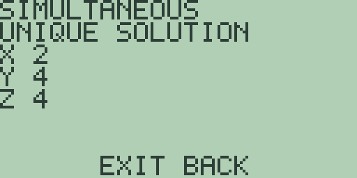
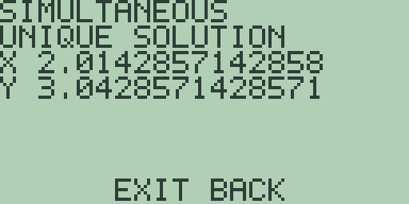
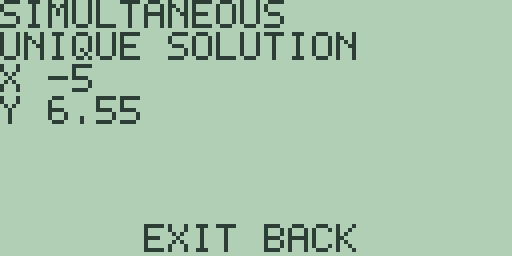
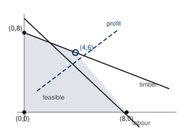
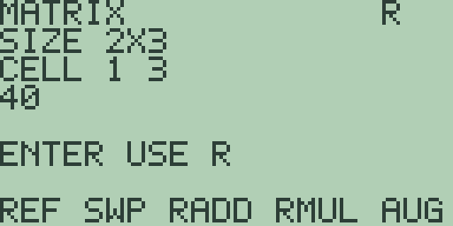
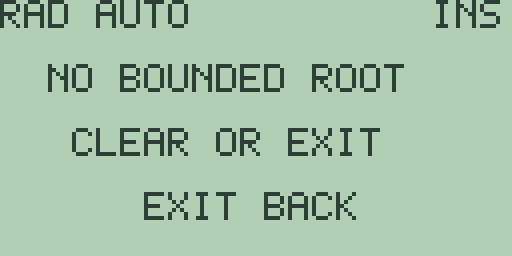
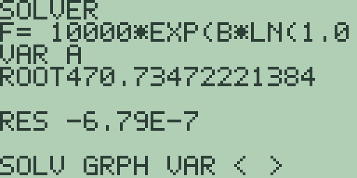
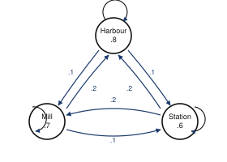
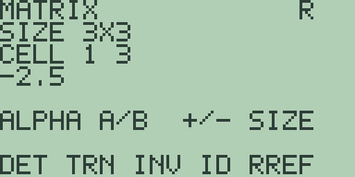

# Chapter 2: Explorations in Business Mathematics

Business mathematics runs on a few small machines. Linear systems that turn
receipts into price lists. Inequalities that turn scarce resources into
best plans. Exponentials that turn interest rates into balances. Transition
tables that turn this week's customers into next year's market shares.

Free85 has a tool for each, and this chapter visits them in turn: the
simultaneous editor, the graph screen, the matrix editor's row operations,
the solver workspace, and matrix multiplication.

Chapter 1 ended section 1.5 with money growing at six per cent through
`EXP(` and `LN(`, because the power key would not take a fractional
exponent. This chapter picks that thread up and follows it a long way.

## 2.1 Prices from receipts

A receipt is a linear equation.

Two coffees and five pastries for 7.90 says 2c + 5p = 7.9, and one more
receipt with different quantities pins both prices down. Recovering a price
list from receipts is solving a linear system, and Free85 keeps a dedicated
editor for exactly that.

1. Press [2nd] [STAT] (the `SIMULT` legend) to open the simultaneous
   editor, described in full in the Guidebook, chapter 14. A fresh machine
   shows `SIZE 2`, two equations in two unknowns.

   Each row takes its coefficients left to right and then its right-hand
   side, so the morning's two receipts, 2 coffees and 5 pastries for 7.90,
   then 4 coffees and 5 pastries for 12.30, are typed as [2] [ENTER] [5]
   [ENTER] [7] [.] [9] [ENTER] [4] [ENTER] [5] [ENTER] [1] [2] [.] [3]
   [ENTER].

2. Press [F1], the `SOLVE` key. The result screen answers
   `UNIQUE SOLUTION` with `X 2.2` and `Y 0.7`: coffee is 2.20 and a pastry
   0.70.

   Check it in your head before you believe it. The second receipt doubled
   the coffees and kept the pastries, so the difference between the two
   receipts is two coffees for 4.40. That is what made this system easy,
   and it is worth noticing which pairs of receipts are easy and which are
   not, because section 2.2 is entirely about the difference.

3. Three unknowns work the same way. A tea merchant blends three leaves
   costing 12, 9 and 6 per kilogram into a 10 kilogram batch worth 84, with
   twice as much of the cheapest leaf as the dearest.

   The first two conditions are equations already. The proportion becomes
   one by writing z = 2x as -2x + 0y + z = 0, and writing that zero
   explicitly is the part people forget.

   Press [EXIT] to leave the result screen, then [2nd] [STAT] to reopen the
   editor, and press [F3] for `3X3`. Enter the three rows: 1, 1, 1, 10,
   then 12, 9, 6, 84, then -2, 0, 1, 0, using [(-)] for the minus sign.

   `SOLVE` answers `X 2`, `Y 4` and `Z 4`: two kilograms of the dear leaf
   and four of each of the others.

   

4. Not every pair of receipts is bookkeeping in good order, and the editor
   will tell you which kind of trouble you are in.

   Press [EXIT], reopen the editor, press [F2] for `2X2`, and enter 2, 1,
   5, then 4, 2, 9: two coffees and a bun for 5.00, then exactly double the
   order for 9.00.

   `SOLVE` answers `NO SOLUTION`. No price list can explain those two
   receipts, because doubling an order must double its price, and the
   machine has spotted the discrepancy.

5. Now repair the till roll. Reopen the editor and step to the last cell:
   the cells keep their values, and five presses of [▼] bring the selection
   to row 2's right-hand side, still holding `9`.

   (The `CELL` line's first figure is the row you are in; its second always
   reads `3` in this release, so keep count as you step. That is a wart. It
   should show the column and it shows the row width instead.)

   Type [1] [0] [ENTER], and `SOLVE` now answers `UNDERDETERMINED`.

   With the second receipt exactly double the first, every price list that
   explains one explains both. A single figure on the till roll separated
   impossible from unhelpfully many, which is a fair summary of most
   accounting disputes.

The editor reaches `4X4` through [F4] or the [+] key. That ceiling, and the
way the two degenerate verdicts mirror the matrix editor's
`SINGULAR MATRIX` guard, are in the Guidebook, chapter 14.

**Try it.**

1. A juice stand's till roll shows 3 juices and 2 flapjacks for 12.30, then
   2 juices and 3 flapjacks for 10.70. Price both items. Then check your
   answer by working out what each receipt would cost.
2. The tea merchant scales up: a 12 kilogram batch worth 105, still with
   twice as much of the cheapest leaf as the dearest. Predict whether the
   proportions stay the same before you re-solve.
3. Invent two receipts that no price list can explain, and two that
   infinitely many price lists explain, and check the machine names each
   verdict correctly.
4. What would a *third* café receipt have to look like to contradict the
   first two of step 1? Write one down, add a row, and see what the editor
   says.

## 2.2 When the answer will not stay still

Section 2.1 solved two systems and both answers were solid. This section is
about the systems where they are not, and it is the most useful half hour
in the chapter if you ever intend to trust a number somebody else computed.

Real data carries small errors. A quantity is misread, a price is rounded,
a measurement is taken to the nearest unit. The question is what those
small errors do to the answer, and the answer is that it depends entirely
on the system, by factors of hundreds.

1. Start with a well-behaved pair: x + 2y = 8 and 3x - y = 3, which cross
   at (2, 3).

   Press [2nd] [STAT], press [F2] for `2X2` if you need it, and enter 1, 2,
   8, then 3, -1, 3. `SOLVE` answers `X 2` and `Y 3`.

2. Now spoil the data very slightly. Press [EXIT], reopen the editor, step
   to row 1's right-hand side, and change the 8 to 8.1. That is a change of
   a bit over one per cent, the sort of thing a rounded invoice would do.

   `SOLVE` answers `X 2.0142857142858` and `Y 3.0428571428571`:

   

   A one and a quarter per cent change in the data moved the answers by
   under one per cent and one and a half per cent. That is what you would
   hope for, and it is easy to assume it always happens.

3. It does not. Try a pair of receipts that nearly say the same thing:
   x + 2y = 8 and 1.01x + 2y = 8.05. Two orders that differ by one per cent
   in one item, which is exactly the sort of pair a real till roll produces
   when two customers buy nearly the same thing.

   Press [EXIT], reopen the editor, and enter 1, 2, 8, then 1.01, 2, 8.05.
   `SOLVE` answers `X 5` and `Y 1.5`.

   A perfectly definite answer, delivered without hesitation.

4. Now make the same one-per-cent nudge as step 2: change the 8 to 8.1.

   `SOLVE` answers `X -5` and `Y 6.55`:

   

   Read that twice. The first unknown has gone from 5 to minus 5. A change
   of one part in eighty in one number has moved the answer by two hundred
   per cent and flipped its sign, and if x is a price you have just been
   told that coffee costs minus five pounds.

   The machine gave no warning on either run, and it was right not to.
   Both answers are correct. It solved exactly the system you typed, and
   the system you typed was a bad question.

5. Why the difference? Look at the two lines. In step 1 they cross
   decisively, one going up and one going down. In step 3 they are very
   nearly parallel, so their crossing point is a long shallow wedge, and
   moving one line a hair slides the crossing an enormous distance along
   it.

   That is the whole idea, and it has a name: the system is
   ill-conditioned. Chapter 6 measures it with a single number, `COND`, and
   you should read section 6.3 before you next trust a solve. But it is
   worth meeting here, in receipts, because this is where you will actually
   hit it, and because the fix is often commercial rather than
   mathematical: get a pair of receipts that are genuinely different.

**Try it.**

1. Make the two lines of step 3 even closer, 1.001 instead of 1.01, and
   repeat the nudge. Predict roughly how much worse it gets before you run
   it.
2. Go the other way: find a pair of receipts whose lines are perpendicular,
   and see how little the nudge moves the answer. What does that suggest
   about how to plan a set of measurements?
3. In step 3's system, work out on paper what happens when the coefficient
   1.01 becomes exactly 1. Which of section 2.1's two verdicts do you get,
   and why is that the honest end of this road?
4. The tea blend of section 2.1 has three equations. Nudge the batch value
   84 by one per cent and see how far the three answers move. Is it
   well-behaved or not?

## 2.3 The best plan on a graph

A joinery makes bookcases and benches. A bookcase uses one sheet of timber
and three workshop hours; a bench uses two sheets and two hours; the week
holds 16 sheets and 24 hours.

With x bookcases and y benches, the constraints are x + 2y at most 16 and
3x + 2y at most 24, and the profit to maximise is 30x + 40y.

The feasible plans fill a region of the plane, the best plan sits at a
corner of it, and the graph screen can find every corner. Why the best plan
must be at a corner is worth convincing yourself of before you start, and
step 5 shows you the picture that does it.

1. Solve each constraint's boundary for y and store the lines. Type [(] [1]
   [6] [-] [x-VAR] [)] [÷] [2] and press [GRAPH] to put `(16-X)/2`, the
   timber line, in `Y1`. Press [2nd] [2] on the graph screen, type
   `(24-3*X)/2`, the labour line, and press [GRAPH].

   In the standard window the feasible region is the four-sided patch above
   both axes and below both lines.

2. One corner is where labour runs out along the bottom edge. Press [F1],
   the root key: it reads the active slot, which is the labour line stored
   last, and answers `= 8` with `R=0`. The corner is (8, 0), eight
   bookcases and no benches.

3. Two more corners hide in the table. Press [GRAPH] to redraw the plot,
   then [MORE] for the table.

   The `X=0` row reads `8` and `12` under `Y1` and `Y2`: the two
   intercepts, of which only the lower is feasible, giving the corner
   (0, 8). And the `X=4` row reads `6` and `6`, the two lines agreeing,
   which is the remaining corner caught red-handed. [EXIT] returns to the
   plot.

4. Ask for that crossing properly. The plot redraws itself after the table,
   so let it finish before touching the arrows, because presses during a
   redraw are lost.

   Press [▶] twenty-five times, taking the trace to `X=4.015748031496`
   with `Y=5.976377952756` on the labour line, and press [2nd] [F1], the
   intersection search. It answers `= 3.9999999999999` with `R=5E-13`, the
   corner's x under a grain of dust.

   Its height is the timber line there: press [CLEAR], type `(16-4)/2`, and
   [ENTER] answers `= 6`. The crossing corner is (4, 6).

5. The profit has lines of its own, and this is the picture worth having.

   Every plan earning 240 sits on 30x + 40y = 240, which solves to
   `(240-30*X)/40`. Press [CLEAR], then [GRAPH] to return to the plot, then
   [2nd] [3], type the line, and press [GRAPH]: it cuts straight through
   the middle of the region, so plenty of feasible plans earn 240.

   Now press [2nd] [3], [CLEAR], type `(360-30*X)/40`, and press [GRAPH]:

   

   The 360 line settles onto the region's outermost corner, touching it at
   (4, 6) alone.

   That is the whole of linear programming in one picture. Slide a line of
   constant profit outwards until it is about to leave the region; the last
   thing it touches is the best plan; and because the region is a polygon,
   the last thing it touches is a corner, unless the line happens to lie
   along an edge, in which case the whole edge ties.

6. The corners settle it numerically. Press [EXIT] for the home screen and
   [CLEAR], then evaluate the profit at each corner with stored letters:
   [4] [STO▶] [ALPHA] [A] [ENTER], [CLEAR], [6] [STO▶] [ALPHA] [B]
   [ENTER], [CLEAR], then `30*A+40*B` and [ENTER]: `= 360`.

   Store 0 and 8 the same way and replay the profit entry with three
   presses of [2nd] [ENTER], the entry recall of the Guidebook, chapter 1,
   then [ENTER]: `= 320`. Store 8 and 0 and recall again: `= 240`.

   The best week is four bookcases and six benches for 360.

### What one more sheet of timber is worth

The plan is settled. Now ask the question a business actually asks: if you
could buy more timber, how much should you be willing to pay for it?

7. Raise the timber from 16 sheets to 18 and find the new crossing corner.
   Press [2nd] [STAT] for the simultaneous editor and enter the two
   boundaries as equations: 1, 2, 18, then 3, 2, 24.

   `SOLVE` answers `X 3` and `Y 7.5`.

   Press [EXIT], [CLEAR], and evaluate the profit there: `30*3+40*7.5`
   answers `= 390`.

8. Do it once more at 20 sheets. The editor gives `X 2` and `Y 9`, and
   `30*2+40*9` answers `= 420`.

   | Timber | Best plan | Profit |
   | --- | --- | --- |
   | 16 | (4, 6) | `360` |
   | 18 | (3, 7.5) | `390` |
   | 20 | (2, 9) | `420` |

   Thirty pounds of extra profit for every two extra sheets, twice running.
   So a sheet of timber is worth exactly 15 to this business, and if you
   can buy one for less than 15 you should.

   That number has a name, the shadow price, and it is the single most
   useful thing linear programming produces. It is not the price you paid
   for the timber. It is what the *constraint* is costing you, which is a
   different quantity entirely and usually the one worth knowing.

9. It does not go on forever, and finding where it stops is the exercise.
   As timber increases, the best corner slides up the labour line towards
   (0, 12). Once it arrives, timber has stopped being the binding
   constraint and buying more buys nothing. Work out from the two lines
   where that happens before you test it.

The intersection key reads slots `Y1` and `Y2` only, so the pair of lines
you ask about must live in those two slots, and the third slot is where the
profit line visits without disturbing the question. Three slots also bound
the constraints a single plot can carry: a fourth constraint means swapping
a line in and out, or testing its corner candidates on the home screen as
step 6 does.

**Try it.**

1. Prices shift: profit moves to 60 per bookcase and 30 per bench.
   Predict which corner wins before you compute anything, from the slope of
   the new profit line, then evaluate the corners and check.
2. A delivery contract caps benches at five a week. Put `5` in `Y3`, find
   the new corner where the cap meets the timber line, and notice that the
   best corner no longer has whole coordinates. What whole-number plans
   deserve a check, and why is that a harder problem than it looks?
3. Work out the shadow price of an extra workshop *hour* the way steps 7
   and 8 did for timber. Which of the two resources should the joinery buy
   more of first?
4. Find the timber level at which the shadow price drops to zero, as step 9
   describes, and confirm it by solving the system there.
5. Design a third resource of your own whose boundary passes exactly
   through (4, 6), and show that adding it leaves the best plan unchanged.
   What is its shadow price?

## 2.4 Elimination as bookkeeping

Section 2.1's `SOLVE` answers in one press, which is convenient and opaque.
The matrix editor's row operations let you watch the same arithmetic done
slowly, receipt by receipt, the way a clerk would cross-check a ledger.

A picture framer sells prints and frames: two prints and a frame for 110,
one print and three frames for 130. As a tableau, coefficients beside
takings, that is a 2 by 3 matrix, and it fits the matrix editor exactly.

1. Press [2nd] [7] (the `MATRX` legend) for the matrix editor of the
   Guidebook, chapter 13, then [x-VAR] [+] to grow the columns: `SIZE 2X3`.

   Type the tableau row by row, [2] [ENTER] [1] [ENTER] [1] [1] [0]
   [ENTER] [1] [ENTER] [3] [ENTER] [1] [3] [0] [ENTER], and the entry wraps
   back to `CELL 1 1`, leaving row 1 selected.

2. Press [MORE] [MORE] for the row-operation page `REF SWAP RADD RMUL` (its
   fifth name overruns the screen, which is a wart I have not fixed).

   Elimination is easiest when the pivot is a 1, and the second receipt
   starts with one, so press [F2], `SWAP`. The banner's register letter
   changes to `R`, where every result lands, and stepping through with [▶]
   reads `1`, `3`, `130`, `2`, `1`, `110`: the receipts in the friendlier
   order.

3. The row operations read register `A`, so the result must be carried
   forward by hand. The three registers share a single selection cursor, so
   where you step in one view is where you stand in the next.

   The fifth [▶] left the selection at `CELL 2 3`; one more wraps it home
   to `CELL 1 1`. Press [ALPHA] twice, cycling the view from `R` through
   `B` back to `A`, and retype the six values in their new order: 1, 3,
   130, 2, 1, 110.

   That copying is the price of watching each move separately. The editor
   keeps the original safe in `R` until the next operation overwrites it,
   and I will not pretend the arrangement is elegant: results landing in a
   read-only register is what makes every operation inspectable, and
   carrying them forward by hand is what it costs.

4. Now the clerk's move: subtract twice receipt 1 from receipt 2.

   The scale rides in `B`'s top-left cell, so press [ALPHA] to show `B`,
   type [(-)] [2] [ENTER], and press [ALPHA] again to return to `A`, where
   the trip has stepped the selection to `CELL 1 2`. Press [▼] three times
   to reach `CELL 2 2`, any cell of row 2, and press [F3], `RADD`: the
   selected row gains the scale times the following row, wrapping to row 1.

   Stepping through `R` reads `1`, `3`, `130`, `0`, `-5`, `-150`. The
   prints have cancelled out of the second row, which now says that minus
   five frames cost minus 150.

5. Tidy the pivot. Wrap the selection home, press [ALPHA] twice, and retype
   1, 3, 130, 0, -5, -150 into `A`. Store the scale -0.2, the reciprocal of
   -5, in `B`'s top-left cell as before, return to `A`, press [▼] three
   times for row 2, and press [F4], `RMUL`: row 2 of `R` becomes `0`, `1`,
   `30`. One frame costs 30.

6. One move remains: clear the frames out of receipt 1. Carry the result
   forward once more, store the scale -3 in `B`, and return to `A`, where
   the selection already sits in row 1 at `CELL 1 2`. Press [F3], `RADD`,
   and `R` reads `1`, `0`, `40`, `0`, `1`, `30`:

   

   A print is 40 and a frame is 30, each row of the finished tableau naming
   one price.

7. The machine will also do the whole dance in one key. Retype the original
   tableau, 2, 1, 110, 1, 3, 130, into `A`, press [EXIT] and [2nd] [7] to
   bring back the first soft-key page, and press [F5], `RREF`: the same
   `1`, `0`, `40`, `0`, `1`, `30` in one step.

   That is the reduced row-echelon form of the Guidebook, chapter 13, doing
   steps 2 through 6 unwatched. Use it once you believe the steps and not
   before.

The tableau register is the design to work within. A matrix holds at most
`SIZE 3X3`, so a two-unknown system's 2 by 3 tableau fits and a
three-unknown system's 3 by 4 does not.

That ceiling is also why the simplex method, which is what a real linear
programme uses instead of section 2.3's picture, is not in this book. Even
the joinery's little two-product problem needs a tableau of three rows and
six columns once the slack variables are in, and there is nowhere to put
it. Three unknowns and their takings belong to the simultaneous editor of
section 2.1, or to the matrix editor's `SOLVE` key, which reads the
coefficients from `A` and the right-hand sides from `B`'s first column.

**Try it.**

1. Rework the café receipts of section 2.1 as a tableau: 2, 5, 7.9 and 4,
   5, 12.3. No swap is needed and four row operations reach the identity.
   Which scales do you store along the way? Write them down first.
2. The `AUG` key on the same page appends `B`'s columns to `A`. Build the
   framer's tableau a second way: coefficients in a 2 by 2 `A`, takings in
   a 2 by 1 `B`, then `AUG`. Where does the result land, and what must you
   do before row operations can touch it?
3. Swap the rows of the finished tableau, 0, 1, 30 above 1, 0, 40, and run
   `RREF` on it. Predict the answer before you press the key.
4. Count the row operations `RREF` must be doing internally for the
   framer's tableau, from your work in steps 2 to 6. Then count them for a
   3 by 4 tableau, and say why the 3 by 3 ceiling bites so much harder than
   it looks.

## 2.5 The mathematics of money

Section 1.5 left money compounding through `EXP(` and `LN(`, because `^`
takes whole exponents from -9 to 9 and the identity b to the x equals e to
the x ln b carries the fractional cases.

The solver workspace turns that identity from a formula you evaluate into
an equation you can interrogate from any side. The same line answers what
rate, how long and how much, depending only on which letter you name as the
unknown, and that is a genuinely different way of working.

1. First the reconciliation. On the home screen, `500*EXP(8*LN(1.06))`
   (with `EXP(` on [2nd] [LN] and `LN(` on [LN]) answers
   `= 796.92403726725`, exactly the figure section 1.5 promised for 500
   invested at six per cent for eight years.

2. Now the general equation. The solver hunts for a zero, so write the
   savings story as a difference: growth minus balance.

   Store the knowns first: press [CLEAR], then [8] [STO▶] [ALPHA] [Y]
   [ENTER] for the years, then [CLEAR] and `900->Z` for a target balance.

   Press [CLEAR] once more, type `500*EXP(Y*LN(1+X))-Z`, and press [2nd]
   [GRAPH]: the `SOLVER` workspace of the Guidebook, chapter 14 opens with
   the equation stored (the `F=` line clips at the screen's right edge; the
   tail is kept), and `VAR X` names the unknown, which is the rate.

3. What rate turns 500 into 900 in eight years? Rates live between zero and
   one, so fence the search: press [F5], the `>` key, three times, and
   store `0` on the `LOWER` page and `1` on `UPPER`.

   Press [F1], `SOLV`, and after a moment the field area answers a `ROOT`
   of `0.07623983640223` with `RES 5.327E-7`: a little over 7.6 per cent,
   with the residual reporting how nearly the equation balances there.

4. How long to double money at six per cent? Press [EXIT], [CLEAR], store
   `.06->X` and `1000->Z` with a [CLEAR] between and after the stores, and
   press [2nd] [GRAPH]: an empty entry line keeps the stored equation, so
   the workspace reopens with everything kept.

   Press [F3], `VAR`, once, turning `VAR X` into `VAR Y`, page to the
   bounds, and store `0` and `50`. `SOLV` answers a `ROOT` of
   `11.895661056043`.

   Money at six per cent doubles in just under twelve years, whatever the
   starting sum. Notice that the 500 never entered the question: doubling
   is a ratio and the starting amount cancels. Check that on paper.

5. And the balance itself? Press [EXIT], [CLEAR], store `8->Y` again, press
   [CLEAR], and reopen the workspace with [2nd] [GRAPH]; press `VAR` once
   more for `VAR Z`, set the bounds to `0` and `1000`, and `SOLV` answers a
   `ROOT` of `796.9240378587` with `RES -5.9145E-7`.

   Compare step 1: the workspace bisects until the residual passes the
   `1E-6` tolerance, so its root carries the home screen's exact figure to
   within a millionth, and the `RES` line names that gap. Bisection gives
   you an answer and an error bar to go with it, which is more than most
   methods manage.

6. Loans are the same equation read in reverse: the debt grows while
   payments shrink it.

   For 10000 borrowed at one per cent a month with payment A over B months,
   press [EXIT], [CLEAR], store `24->B`, press [CLEAR], type
   `10000*EXP(B*LN(1.01))-A*(EXP(B*LN(1.01))-1)/.01`, and press [2nd]
   [GRAPH].

   Press `VAR` once for `VAR A`, and try the bounds a hopeful borrower
   would: `0` and `300`. `SOLV` stops at the `NO BOUNDED ROOT` notice:

   

   No payment up to 300 clears this loan in 24 months. That screen is an
   answer, not a failure, and it is the answer to a question worth asking.

7. Press [CLEAR] (the notice dismisses to the home screen with the
   workspace kept), reopen with [2nd] [GRAPH], page to `UPPER`, and raise
   it to `1000`. `SOLV` answers a `ROOT` of `470.73472221384`:

   

   The true monthly payment.

8. If 300 a month is all there is, ask for the term instead. Press [EXIT],
   [CLEAR], store `300->A`, press [CLEAR], and reopen with [2nd] [GRAPH];
   press `VAR` once for `VAR B`, page to `UPPER`, store `100`, and `SOLV`
   answers a `ROOT` of `40.748907154197`.

   Nearly 41 months, which is the price of the smaller payment: seventeen
   extra months of interest.

9. One trap deserves its own look, because it is the one that ruins people.

   Press [EXIT], [CLEAR], store `100->A`, which is exactly the monthly
   interest on 10000, press [CLEAR], reopen, and `SOLV`: `NO BOUNDED ROOT`
   again.

   A payment that only covers the interest never ends the loan. The
   balance is the same every month forever, so no term between the bounds
   can make the equation balance, and the machine is telling you something
   true and important rather than failing.

One design habit makes the workspace pleasant. `VAR` steps forward through
the alphabet, one letter per press, wrapping from `Z` to `A`. Equations
whose letters march forward, `X`, `Y`, `Z` for the savings account, then
`A` and `B` for the loan, keep every change of unknown to a single press.
That is worth planning for when you write the equation.

**Try it.**

1. How long does money take to treble at six per cent? Predict it from
   step 4's doubling time first, then solve, then compare with
   `LN(3)/LN(1.06)` on the home screen.
2. A car loan of 8000 at 0.8 per cent a month runs for 36 months. Adapt the
   loan equation, mind which letters you reuse, and find the payment.
3. Store the exact payment from step 7 into `A` and solve for the term `B`.
   How close to 24 does the root come, and what does the residual say about
   the last penny?
4. Find the payment at which the loan of step 6 takes exactly 100 months.
   Then find the payment at which it takes 1000. What are those two numbers
   converging on, and why?

## 2.6 Loyalty in the long run

Three coffee shops share a harbour town: the Harbour, the Mill and the
Station.

Each Saturday, 80 per cent of the Harbour's customers return and ten per
cent defect to each rival. The Mill keeps 70 per cent, losing 20 to the
Harbour and 10 to the Station. The Station keeps 60, losing 20 to each.

A table of switching fractions is a transition matrix, its powers are
forecasts, and the matrix editor can raise them and find where the
switching settles.

1. Press [2nd] [7], then [+] [x-VAR] [+] [x-VAR] to reach `SIZE 3X3`, and
   type the matrix row by row, one row per shop: .8, .1, .1, then .2, .7,
   .1, then .2, .2, .6.

   Each row lists where one shop's customers stand next Saturday, and each
   row sums to one, because customers go somewhere. Check that as you type;
   a row that does not sum to one is a typing error and the machine will
   not tell you.

2. The editor's `MUL` multiplies `A` by `B`, so the square of P needs P in
   both. Press [ALPHA] for `B`, grow it to `SIZE 3X3` the same way, retype
   the nine values, and press [ALPHA] to return to `A`.

3. Press [MORE] [F3], `MUL`, and give the 3 by 3 product a moment.

   The banner switches to `R` holding the two-week forecast: the selection
   sits at `CELL 1 1` reading `0.68`, and stepping right reads `0.17` and
   `0.15` across row 1.

   Two Saturdays out, a Harbour regular is at the Harbour with probability
   0.68. The 0.8 loyalty has already eroded, and the erosion is the point:
   a customer's history stops mattering surprisingly fast.

4. Forecasts further out are more of the same. Step through the rest of `R`
   (row 3 ends at `0.4` in `CELL 3 3`), press [▶] once more to wrap home,
   then [ALPHA] twice to return to `A`, and retype the nine two-week
   values: .68, .17, .15, .32, .53, .15, .32, .28, .4.

   `MUL` again answers three weeks, row 1 reading `0.608`, `0.217`,
   `0.175`. Carry that forward the same way and `MUL` once more: four weeks
   out, the first column reads `0.5648`, `0.4352`, `0.4352` down the three
   rows, and row 3 ends at `0.25`.

   The rows are converging on one another, which is the thing to watch for.
   Where a customer started is washing out of the forecast.

5. Where is it all heading? You could keep multiplying, but there is a much
   better question: what share-out would not change?

   Call the standing shares x, y and z. Next Saturday the Harbour collects
   .8x from its own regulars plus .2y and .2z from the switchers, and a
   share-out that stands still must collect exactly x again:
   .8x + .2y + .2z = x, which is -.2x + .2y + .2z = 0.

   The Mill and the Station give two more rows of the same shape, each a
   column of P with one subtracted on the diagonal.

   Retype `A` as that matrix: -.2, .2, .2, then .1, -.3, .2, then .1, .1,
   -.4. Press [EXIT] and [2nd] [7] to bring back the first soft-key page,
   and press [F5], `RREF`.

   Stepping through `R` reads `1`, `0`, `-2.5`, then `0`, `1`, `-1.5`, then
   a row of zeros:

   

   The row of zeros is not a failure. It is the system telling you that the
   three equations are not independent, which they cannot be: if two shares
   are known the third is whatever is left. So the answer comes as a
   proportion rather than three numbers, 2.5 to 1.5 to 1, and dividing by
   their sum, 5, gives 0.5, 0.3 and 0.2.

6. The claim deserves its own check. Wrap the selection home, press [ALPHA]
   twice for `A`, and press [-] twice: `SIZE 1X3`, a single row. Type .5,
   .3, .2, and press [MORE] [F3]: `B` still holds P, and the product of a
   share-out with the transition matrix is next Saturday's share-out.

   `R` answers `SIZE 1X3` reading `0.5`, `0.3`, `0.2`, unchanged to the
   last digit.

   Half the town ends at the Harbour, three tenths at the Mill, a fifth at
   the Station, and no further Saturday moves the needle. The Station keeps
   the fewest customers and ends with the smallest share, which is not a
   surprise; what is a surprise is how little the starting position
   mattered.

Every result landing in `R` is the register design of the Guidebook,
chapter 13, and the copying forward in steps 4 and 5 is the cost of
iterating inside one editor: the fourth power arrives in three
multiplications and three retypings, and the steady-state matrix is a
fourth retype.

The reward is that nothing is hidden. Every forecast you quote is one you
watched being made, and on a machine that could raise a matrix to the
fortieth power in one keystroke you would never have noticed that the rows
converge, which is the actual mathematics here.

**Try it.**

1. Start the whole town at the Station: a `SIZE 1X3` row holding 0, 0, 1 in
   `A`, with P in `B`. Multiply repeatedly, carrying each result back into
   `A`. After how many Saturdays does the Harbour's share first pass 0.45?
   Guess first.
2. The `TRN` key transposes `A` into `R`. Rebuild step 5 without arithmetic
   on paper: transpose P, carry it to `A`, put an identity in `B`, and
   subtract with `SUB` before `RREF`. Which registers did the answer pass
   through?
3. The Station renovates and its loyalty rises to 0.8, losing 0.1 to each
   rival. Predict whether that is enough to reorder the long-run shares
   before you rebuild the steady state.
4. Start the town at the steady state and multiply once. Then start it at
   0.5, 0.3, 0.2 with the *Station's* improved matrix from exercise 3 and
   multiply once. What does the difference between those two runs tell you
   about how quickly a change in service shows up in the books?
