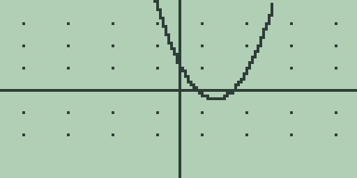
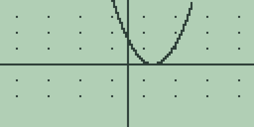
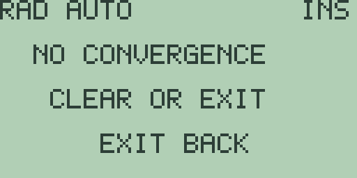
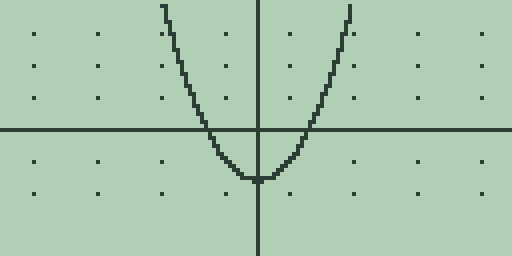

# Chapter 2: Explorations in Quadratics

A straight line goes one way for ever. A quadratic turns round, and almost
everything interesting about it comes from that turn: where it happens, how
far above or below the axis it sits, and whether the curve gets across the
axis at all on its way past.

Two questions carry this chapter. Where does the curve cross the axis, and
where does it turn? School algebra answers both exactly, with the
discriminant and with `-b/2a`, and you can do both on paper in a minute.
That is exactly why they are worth doing here. When you already know the
right answer, you can watch what the machine does with the same question,
and the places where it disagrees with you are where you learn something.

Everything here runs on the function graphing of the Guidebook, chapter 4.
Store with [GRAPH], let plots finish, and press [CLEAR] before typing on the
home screen.

## 2.1 The discriminant against the picture

Three quadratics, differing in one number:

    y = x^2 - 4x + 3
    y = x^2 - 4x + 4
    y = x^2 - 4x + 5

Do the discriminant on paper first. It is b^2 - 4ac, and with a = 1 and
b = -4 that is 16 - 4c. So the three come out 4, 0 and -4: two crossings,
one, and none. Write those down before you touch a key, because the point of
this section is what happens when you check them.

1. Press [CLEAR]. Type `X^2-4*X+3`, using the [x²] key for the square, and
   press [GRAPH]. Let the plot finish.

   

   It crosses twice, left and right of the dip. Two crossings, as the
   discriminant said.

2. Press [F1], the root search, and let it work: `= 1`.

   Exactly 1, with no dust after it. Hold on to that, because it is the last
   clean answer in this section.

3. Press [CLEAR], type `X^2-4*X+4`, and press [GRAPH].

   

   Now look carefully, and then admit what you cannot see. The curve comes
   down to the axis and goes back up. Whether it touched, dipped a hair
   below, or stopped a hair above is not a question this picture can answer.
   The screen is 128 columns wide and 64 rows tall, and a hair is a great
   deal smaller than a row.

   The discriminant is 0, so on paper the curve touches at exactly one
   place, x = 2. The picture agrees with that and with both of the other
   possibilities equally well.

4. Press [F1] and wait.

   

   `NO CONVERGENCE`, and underneath it `CLEAR OR EXIT`. Press [CLEAR] to
   dismiss it.

   That is a refusal, not a failure, and the reason is worth having because
   it is the same reason in every root finder you will ever meet. The search
   works by holding two x values whose heights have opposite signs and
   squeezing them together. A sign change is the only evidence it has that a
   crossing is trapped between them.

   This curve never changes sign. It comes down to nought and goes back up,
   staying positive on both sides. There is a root at x = 2, the search
   cannot see it, and it says so rather than inventing a number.

5. Press [CLEAR], type `X^2-4*X+5`, press [GRAPH], then press [F1].

   The same `NO CONVERGENCE`. Press [CLEAR].

   Two different situations, one answer. In step 4 there was a root and the
   method could not reach it; here there is genuinely no root to reach. The
   notice does not distinguish them, and it is not being lazy: from inside a
   sign-change hunt those two cases look identical. The discriminant tells
   them apart in one subtraction and the search cannot tell them apart at
   all.

6. One more thing to notice before you leave the three. Press [CLEAR], type
   `X^2-4*X+3` again, press [GRAPH], and press [F2], the minimum search:
   `= 1.9997326856359`. Now do the same with `X^2-4*X+4` and with
   `X^2-4*X+5`.

   All three answer `1.9997326856359`, digit for digit.

   Of course they do. Changing c slides the whole parabola straight up or
   down, and sliding a curve vertically cannot move its lowest point
   sideways. The three curves have the same turning place and differ only in
   how high it sits. The next section is about that number, and about why it
   is not 2.

**Try it.**

1. Before pressing anything, say which of `X^2-6*X+9`, `X^2-6*X+8` and
   `X^2-6*X+10` the root search will answer for, and which will refuse.
   Then check all three.
2. Ask `EVAL(2)` on each of this section's three quadratics, pressing
   [CLEAR] first each time. Predict the three answers from the
   discriminants before you run them, and say what the middle one being
   exactly `0` proves that the picture in step 3 could not.
3. `X^2-4*X+4` has a root the search will not find. Find it anyway, using
   the minimum search and nothing else, and explain why that works here and
   would not work on `X^2-4*X+3`.
4. Turn `X^2-4*X+5` upside down by storing `-X^2+4*X-5` instead, and press
   [F1]. Predict the answer first. What does that tell you about whether
   the refusal is about the curve or about the method?

## 2.2 The vertex, exactly and approximately

The turning point of a quadratic is at `-b/2a`. That is the whole formula,
it comes out of completing the square, and it is exact.

For this section take

    y = x^2 - 4

because it makes the paper work as short as it can possibly be. Here a = 1
and b = 0, so `-b/2a` is nought over two, which is nought. Not nought to
fourteen places. Nought. The curve turns at x = 0, and the height there is
0 - 4, which is -4. Two exact numbers, no arithmetic worth checking.

Now watch the machine answer the same question.

1. Press [CLEAR], type `X^2-4`, and press [GRAPH].

   

   The dip sits on the y axis where it should, and the curve crosses at -2
   and 2.

2. Press [F2], the minimum search, and let it work. It publishes
   `= 0.00059911711827895`.

   That is the *location* of the minimum, not its height, and it is not
   nought. It is nought to three decimal places and then it drifts.

   Nothing has gone wrong. The search closes a bracket around the turning
   point and stops when the bracket is tight enough, not when the digits
   come out round. What it hands you is where it stopped.

3. The home screen version takes bounds you choose instead of the window,
   which lets you do something the graph screen cannot: ask the same
   question several ways and watch the answer move.

   Press [EXIT] to leave the graph screen, then press [CLEAR]. That order
   matters. [CLEAR] on the graph screen does not empty the entry line, so if
   you skip the [EXIT] your typing lands on the end of `X^2-4` and you will
   get an answer to a question you did not ask.

   Spell `FMIN(-10,10)`, letter by letter with [ALPHA], and press [ENTER]:
   `= 0.00059911711827895`.

   The same digits as step 2, all fifteen of them. The standard window runs
   from -10 to 10, so that was the same search with the same bounds by
   another route. The graph keys and the home commands are one algorithm
   wearing two faces.

4. Now narrow the net. Press [CLEAR] between each of these:

   | Bounds | Answer |
   |---|---|
   | `FMIN(-10,10)` | `0.00059911711827895` |
   | `FMIN(-3,3)` | `0.00017973513547795` |
   | `FMIN(-2,2)` | `0.00011982342365967` |
   | `FMIN(-1,1)` | `0.000059911711827895` |
   | `FMIN(-0.5,0.5)` | `0.00002995585591688` |

   Five answers to one question, none of them nought, and every one of them
   wrong by a different amount.

   Read the column again and the pattern is hard to miss: the miss shrinks
   in step with the interval. Halve the bounds and you roughly halve the
   error. That is the search telling you what it actually does. It does not
   hunt until the answer is right, because it has no way of knowing what
   right is. It divides the interval you handed it a fixed number of times
   and reports where it had got to.

   So the accuracy is not a property of the curve. It is a property of how
   wide a net you cast. That is worth knowing before you next trust one of
   these keys.

5. Press [CLEAR] and ask `FMIN(-1,4)`: `= -0.000083203340918115`.

   Negative. Every previous answer was a whisker to the right of nought and
   this one is a whisker to the left. Give the search an interval that is
   not centred on the answer and it approaches from the other side. Neither
   direction is more correct. The error has no preferred sign, which is
   another way of saying there is no correction you could apply to these
   answers to improve them.

6. Now ask about the height, and the picture changes completely. Press
   [CLEAR] and ask `EVAL(0)`: `= -4`.

   Exactly -4. No dust.

7. Press [CLEAR] and ask `EVAL(0.00011982342365967)`, which is step 4's
   answer from the bounds -2 to 2: `= -3.9999999856424`.

   Look at where those two answers differ. The x values differed in the
   fourth decimal place. The heights differ in the *eighth*. The horizontal
   error was squared on its way into the vertical one, and on this curve you
   can see exactly why: the height above the vertex is x^2 - 4 minus -4,
   which is x^2. Nothing else. A horizontal miss of about a ten-thousandth
   costs you about a hundred-millionth of height.

   That is the whole difficulty in one line. Being flat at the bottom is
   what makes a minimum a minimum. A search that compares heights is trying
   to find the flattest place by looking at a quantity that has stopped
   changing, and the flatter it gets the less the heights have left to tell
   it. Expect three or four good digits from these searches and do not go
   hunting for more.

8. It is not something about nought, before you wonder. Press [CLEAR], type
   `X^2-4*X+3`, and press [GRAPH]. On paper `-b/2a` is 4 over 2, which is
   exactly 2. Press [EXIT], press [CLEAR], and ask `FMIN(0,4)`:
   `= 2.0001198234237`.

   Compare that with the `FMIN(-2,2)` answer in step 4. The same interval
   width of 4, the same miss of about a ten-thousandth, this time landing
   past 2 instead of past nought. Press [CLEAR] and ask `EVAL(2)`: `= -1`,
   exactly, and the vertex is (2, -1) as the paper said.

So the two methods divide the work in a way worth remembering. Tell the
machine where to look and it answers exactly. Ask it to find where, and it
gives you three or four digits and an honest stopping place. `-b/2a` costs
you one subtraction and one division and it is exact, which is why nobody
should be using a search to find the vertex of a quadratic. The search
earns its keep on the curves where there is no formula, and this chapter is
the last place in the book where you can check its work against something
you already know.

**Try it.**

1. `y = 2x^2 - 6x + 1` has its vertex at x = 1.5 on paper. Confirm that
   with `-b/2a`, then ask `FMIN(0,3)` and `FMIN(-1,4)`. One lands above 1.5
   and one below. Say which will do which before you run them.
2. Using nothing but step 4's table, predict the answer `FMIN(-4,4)` will
   give for `X^2-4`, then run it. How close did you get, and what does the
   size of your error tell you about how exact the halving pattern is?
3. Ask `EVAL(0.00059911711827895)` on `X^2-4`, the answer from the widest
   bounds. Predict the height first, using only the fact that the height
   above the vertex is x^2, and check whether the machine agrees to every
   digit.
4. Store `X^2-4` and press [+] three times, waiting for each replot, to
   zoom into the bottom of the curve. Then say why zooming further will
   never let you read the vertex off the screen to more digits, and what
   the 128 columns have to do with it.
5. `y = x^2 - 6x + 5` has its vertex at x = 3. Asked `FMIN(1.5,4.5)`, over
   bounds 3 units wide, the machine answers `3.0000898675676`. Without
   running anything, say what it will answer to `FMIN(0,6)`. Then run it,
   and say why your prediction was close rather than exact.
