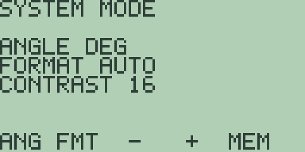
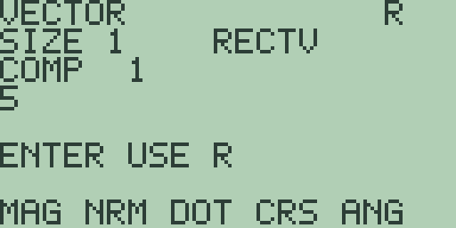

# Chapter 3: Explorations in Geometry and Right Triangles

Right triangles are where geometry stops being about shapes and starts
being about numbers. Three sides and two angles, and any two of them fix
the rest. Trigonometry is the machinery for going between them, and a
calculator is the first tool that makes it quick enough to explore rather
than merely survive.

Two sections here, and both are about the same quiet danger. The machine
will answer whatever you ask it, in whatever units it happens to be
holding, and it will not tell you that you asked the wrong question. The
first section is about the mode that decides what your angles mean. The
second is about reading a distance off two points without ever writing down
the formula.

## 3.1 SOH CAH TOA, and the mode that decides what it means

Before any trigonometry at all, the machine has to be told what an angle
is. This is not a formality and it is the single commonest way to get a
wrong answer out of a right calculation.

1. Press [2nd] [MORE] for the mode screen.

   

   The second line reads `ANGLE RAD` on a fresh machine. Press [F1], `ANG`,
   once and it changes to `ANGLE DEG`. Press [EXIT].

   Do that now, because everything below is in degrees. And make a note to
   put it back, because the rest of this book is not.

2. The specimen is the 3-4-5 triangle: the right angle between a side of 3
   and a side of 4, and a hypotenuse of 5. It is worth using precisely
   because you already know it. If the machine tells you something
   surprising about a 3-4-5 triangle, the machine is not the thing that has
   gone wrong.

   Take the angle at the far end of the side of 4, with the 3 opposite it.

   Tangent is opposite over adjacent, so the tangent of that angle is 3/4.
   To go back from a tangent to an angle you need the inverse, which is
   [2nd] [TAN].

   Press [CLEAR], then [2nd] [TAN] [3] [÷] [4] [)]. The entry line reads
   `ATAN(3/4)`. Press [ENTER]: `= 36.869897645844`.

   About 37 degrees. Put a protractor on a 3-4-5 triangle and that is what
   you will measure.

3. Now go back the other way and check. Sine is opposite over hypotenuse,
   which for this angle is 3/5, so 0.6 exactly.

   Press [CLEAR] and ask `SIN(36.869897645844)`: `= 0.6`.

   Exactly 0.6. Fourteen digits and not a speck of dust on any of them. The
   round trip closed perfectly.

4. So try the cosine, which is adjacent over hypotenuse, 4/5, so 0.8
   exactly.

   Press [CLEAR] and ask `COS(36.869897645844)`: `= 0.80000000000009`.

   Not 0.8. Right in the last two digits.

   Both were the same angle, both should have come out exact, and one did.
   That is worth explaining rather than shrugging at.

   The angle you typed is not the angle. `36.869897645844` is the true
   angle rounded to fourteen digits, so it is very slightly wrong, and the
   sine and cosine of a slightly wrong angle are slightly wrong too. The
   sine happened to round back onto 0.6 and the cosine happened not to.
   Near this angle the cosine is changing faster than the sine, so the same
   small error in the angle costs more on the way out.

   Neither answer is a mistake. What you are seeing is that fourteen digits
   is a finite number of digits, and a round trip through a decimal
   approximation is not obliged to land where it started.

5. Two more, to show it is not about that particular angle. Press [CLEAR]
   between each.

   `SIN(30)`: `= 0.5`. Exactly a half, as the equilateral triangle says.

   `COS(60)`: `= 0.49999999999989`.

   The same number, by two routes that any textbook will tell you are
   equivalent, and the machine gives them differently. And `TAN(45)`, which
   is 1 by an argument a child can follow, comes back
   `= 0.99999999999992`.

   Here is the rule that follows, and it is worth more than any of the
   individual numbers. **Trigonometric values that are exact on paper are
   usually not exact on the machine.** When you want to know whether
   something is a half, do not test whether the machine says `0.5`. Ask
   whether it is a half to as many digits as your problem needs, and then
   stop looking.

6. Now the mistake, which everybody makes once.

   Press [2nd] [MORE], press [F1] once to get back to `ANGLE RAD`, and
   press [EXIT]. Press [CLEAR] and ask `SIN(30)` again.

   `= -0.98803162409183`.

   Look at what just happened. No error, no warning, no notice. A perfectly
   reasonable-looking number, in range, to fourteen digits.

   In radian mode, 30 is not thirty degrees. It is thirty radians, which is
   nearly five complete turns, and the sine of that has no connection to
   any triangle you had in mind. The machine answered exactly the question
   you asked. You asked the wrong one.

   There is one tell, and it is the only one you get. That answer is
   *negative*. Every angle inside a triangle is between 0 and 180 degrees,
   and the sine of every one of them is positive. A negative sine where a
   triangle's angle should be is impossible, and it means the mode is
   wrong.

   I could have made the mode screen shout at you, or refused angles over
   90 in degree mode, and I decided not to. `SIN(30)` in radians is a legal
   question with a correct answer, and a machine that second-guesses which
   question you meant is worse than one that answers the one you asked. The
   cost of that decision is this section. Check the mode before you trust
   an angle, and check it again after anything that might have changed it.

7. Put the machine back to `ANGLE DEG` before the Try it below, and back to
   `ANGLE RAD` before you go on to another chapter.

**Try it.**

1. With the machine in `ANGLE DEG`, find the angle whose sine is 0.6 using
   [2nd] [SIN], and compare it with step 2's answer digit for digit.
   Should they agree exactly? Say what you expect before you look.
2. A ladder 5 metres long leans against a wall with its foot 1.5 metres
   out. Find the angle it makes with the ground, then find the height it
   reaches, and say which of your two answers you would trust to more
   decimal places and why.
3. Ask `SIN(30)` and `COS(60)` again in degree mode and write both answers
   down in full. They are the same number on paper. Say which is exact,
   and say why you cannot tell from the answers alone which of the two the
   machine computed more carefully.
4. Predict what `TAN(90)` will do before you press it, then press it. Then
   ask `TAN(89.999)`. What is the machine telling you, and is it the same
   thing both times?
5. Leave the machine in `ANGLE RAD` and ask `SIN(0.5235987755983)`. Explain
   why that answer is the sine of thirty degrees, and why nobody sane wants
   to work this way.

## 3.2 Distance without the formula

The distance between two points has a formula, you have met it, and it is
the theorem of Pythagoras wearing a coat: the square root of the sum of the
squares of the differences.

The machine has a better way to think about it, and it costs nothing to
learn. A vector is a difference between two points. Its magnitude is the
distance between them. Those are the same statement, and the vector editor
computes the second one with a single key.

1. Take the points (1, 2) and (4, 6).

   Subtract them, one coordinate at a time, and you get across 3 and up 4.
   That is the whole of the arithmetic you have to do by hand, and it is
   subtraction.

2. Press [2nd] [8], the `VECTR` legend. The editor opens on `SIZE 3` with a
   fresh `A` of zeros, and it holds three components because three is what
   makes a cross product mean something. Plane geometry simply leaves the
   third one at nought.

   Type [3] [ENTER] [4] [ENTER] [0] [ENTER].

3. Press [F1], `MAG`.

   

   A `SIZE 1` result reading `5`.

   Five, exactly, with no dust. You have just used Pythagoras without
   writing a square, a sum or a root, and the 3-4-5 triangle of section 3.1
   has turned up again as the distance between two points.

4. Press [F2], `NRM`, and the first component reads `0.6`.

   That is the same 0.6 as section 3.1's sine, and it is not a coincidence
   worth passing over. `NRM` divides the vector by its own length, so it
   answers the direction stripped of the distance. The first component of a
   unit vector is the cosine of the angle it makes with the x axis, and 3
   over 5 is 0.6 whether you got there by a sine, a cosine or a division.

   One triangle, three questions, one number. That is what makes the 3-4-5
   worth memorising.

5. Now a pair that is not designed to be tidy. Press [EXIT] and [2nd] [8]
   again, which restores register `A`, component 1, and the first soft-key
   page in one move.

   From (2, -1) to (7, 9) is across 5 and up 10. Type [5] [ENTER] [1] [0]
   [ENTER] [0] [ENTER], then press [F1]: `= 11.180339887499`.

   That is 5 times the square root of 5, and it is exactly as much of an
   answer as the tidy one was. The method does not care whether the numbers
   come out whole. Only textbook exercises care about that, and only
   because somebody had to mark them.

The thing worth taking from this section is not the key sequence. It is
that "the distance between two points" and "the length of the vector
between them" are the same question, and that noticing this saves you from
remembering a formula with four subscripts in it. Geometry is full of
identifications like that, and each one you make is one less thing to get
wrong under pressure.

**Try it.**

1. Find the distance from (0, 0) to (5, 12) with the vector editor.
   Predict the answer first: 5, 12 and 13 is the second-best-known right
   triangle after 3, 4, 5.
2. Do the same two points as step 1 but enter them in the other order, as
   -5 and -12. Predict what `MAG` will say before you press it, and say
   what that tells you about whether a distance can be negative.
3. Step 5 gave `11.180339887499`. Square it on the home screen and say
   whether you get 125 exactly. Explain the result either way.
4. Why does leaving the third component at nought give the right answer for
   a plane, rather than a wrong one? Say what the third component is
   measuring and why nought is the honest value for it.
5. The midpoint of two points is the average of their coordinates. Work out
   the midpoint of (1, 2) and (4, 6) on paper, then use the vector editor
   to check that it is the same distance from each end. What should that
   distance be, given step 3's answer of `5`?
