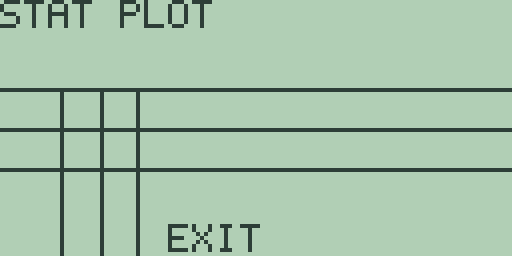
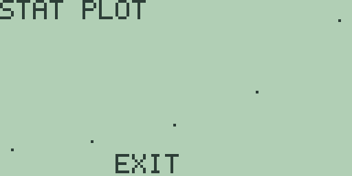
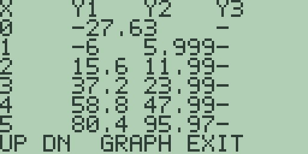
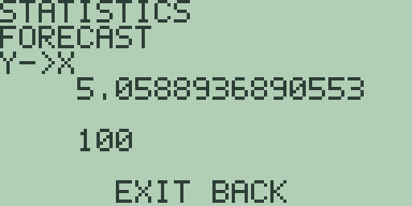
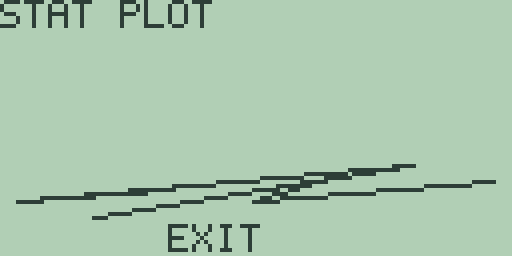

# Chapter 3: Explorations in Probability and Statistics

Statistics is usually taught on data sets too big to think about,
where the machine's summaries have to be taken on trust. Free85 turns
that round: its statistics columns hold eight entries, and eight
numbers are few enough to check every claim the machine makes by
hand. The chapter summarises a small data set and audits the
summary, meets the random number generator and its strictly
repeatable stream, builds simulations in the program environment,
fits competing models to two invented data sets, forecasts from the
better one, and ends with the four statistical plots, leaning
throughout on the statistics editor of the Guidebook, chapter 15.
Every key sequence and every quoted number in this chapter was run
in the emulator on a fresh machine, and each exploration ends with
a "Try it" block whose answers stay on the calculator.

## 3.1 A week of small data

The harbour town of Chapter 2 (Explorations in Business Mathematics)
keeps a lighthouse, and the keeper tallies its visitors: 15 on
Monday, then 12, 17, 15, 19, 21, 18 through the week, and 43 on the
bank holiday Monday that closes the log. Eight numbers, one
suspiciously large: exactly what a summary is for, and few enough to
audit it afterwards.

1. Press [STAT] to open the statistics editor of the Guidebook,
   chapter 15. A fresh machine holds four entries, so press [+] four
   times for eight, then type the diary in order, pressing [ENTER]
   after each value: 15, 12, 17, 15, 19, 21, 18, 43. After the
   eighth [ENTER] the `INDEX` line wraps back to 1: the column is
   full.

2. Press [F1], the `1V` key. The one-variable summary answers
   `MEAN 20`, `MED 18`, `S SD 9.6953597148325`, and
   `P SD 9.0691785736085`.

3. Now the audit. The mean is right: the eight values total 160, and
   160 over 8 is 20. The median is not what a sorted list gives: on
   paper the ordered week reads 12, 15, 15, 17, 18, 19, 21, 43,
   whose middle two values average 17.5, yet the screen says 18. The
   summary reads the column in the order it is stored, so hand it
   sorted data: press [CLEAR] to return to the editor, press [MORE]
   four times to the `P4 FCX FCY SX SY` page, and press [F4], the
   ascending sort `SX`. The selection returns to `INDEX 1`, now
   reading `12`.

4. Press [MORE] once more, to the `SHW XYLN LIN 1V 2V` page, and
   press [F4] for `1V` again: `MED` now reads `17.5`, the paper
   value, the mean and both deviations unchanged. Sorting first is
   the habit to keep: in this release `MED` and the quartiles answer
   for the column as stored, and `SX` is one keypress.

5. The spread audits just as well. Press [CLEAR], press [MORE]
   twice to the `MEAN MED VAR SSD PSD` page, and press [F3], `VAR`:
   the sample variance is `94`, exactly. By hand: the deviations
   from 20 are -8, -5, -5, -3, -2, -1, 1, and 23, their squares
   total 658, and 658 over 7 is 94. The `S SD` line of step 2 is
   its square root, its last digit a whisker under the true
   9.69535971483266: the small print of the last digit is
   arithmetic, not mathematics.

6. Press [CLEAR], then [MORE] for the `MIN MAX Q1 Q3 BOX` page, and
   collect the five-number summary one key at a time, pressing
   [CLEAR] after each result screen: `MIN` answers `12`, `MAX`
   answers `43`, `Q1` answers `15`, and `Q3` answers `20`.

7. Press [F5], `BOX`. The plot hangs the three quartile bars between
   edges that stand for 12 and 43, and all three crowd into the left
   third of the screen:

   

   That crowding is the picture of skew: half the week sits between
   15 and 20, and the bank holiday drags the right edge four
   box-widths further out.

8. The mean-against-median verdict closes the story. Press [EXIT]
   for the home screen, which comes back showing a leftover `= 12`,
   the selected entry handed back, so press [CLEAR] before typing.
   Then `(12+15+15+17+18+19+21)/7` and [ENTER] answers
   `= 16.714285714286`, the mean without the bank holiday: one day
   moved the mean from under 17 to 20, while the median crept from
   17 to 17.5. Means follow outliers; medians stay with the crowd.

Eight entries is the columns' whole capacity, and this section is
the argument for liking it: at this size every summary can be
re-derived by hand, so the machine is never believed, only checked.

**Try it.**

1. The next week is quieter: 11, 14, 14, 16, 17, 18, 20, 22. Predict
   the mean and median before pressing `1V`, and say why the two
   land so much closer together than in the keeper's week.
2. Shrink the sorted column to seven entries with [-] and work out
   `Q1` and `Q3` on paper first. Which value left, which quartile
   moved?
3. The population variance divides the 658 by 8. Work it out, then
   check it by squaring the `P SD` figure on the home screen with
   [x²]: the answer comes back exact.

## 3.2 Random numbers that repeat

A random number generator is a paradox to keep in a pocket: a fixed
rule pretending to be chance. Free85 makes the pretence unusually
plain, and this section is about learning to use that honesty. The
functions, both from the Guidebook, chapter 3, are `RAND()`, a
four-decimal value between 0 and 1, and `RANDI(low,high)`, a whole
number from `low` through `high` inclusive.

1. On a cleared home entry line, spell `RAND()` letter by letter,
   [ALPHA] then the key carrying each letter, with the brackets typed
   directly, and press [ENTER]: the answer is `= 0.7968`.

2. The entry line keeps its text after an evaluation, so [ENTER]
   alone asks again. Three more presses answer `= 0.8984`, then
   `= 0.4492`, then `= 0.7246`.

3. Those four values are not a sample of anything: they are the
   opening of a fixed sequence, and a fresh machine answers `0.7968`
   then `0.8984` every time, the stream carrying on from wherever
   the last call left it. The generator is deterministic by design,
   and for an experimenter that is reproducibility: any simulation
   in this chapter, rerun from a fresh start with the same keys in
   the same order, delivers the same figures. It also makes the
   functions fit for experiments and for nothing secret.

4. Dice come from the same stream. Press [CLEAR], spell
   `RANDI(1,6)`, and press [ENTER]: the answer is `= 6`, the
   stream's fifth draw dressed as a die, and five more presses of
   [ENTER] roll `4`, `6`, `1`, `1`, `4`. On a fresh machine the dice
   open `3`, `5`, `3`, `5`, `6` instead: same stream, different
   entry point, the four `RAND()` calls having consumed four draws.
   `RANDI(0,1)` flips coins, `RANDI(0,9)` draws digits, and every
   draw, whatever its costume, advances the one sequence one step.

**Try it.**

1. From a fresh machine, roll `RANDI(1,6)` ten times and tally the
   faces. Which face never appears, and how far is the tally from
   uniform?
2. Two dice are two draws: evaluate `RANDI(1,6)+RANDI(1,6)`
   repeatedly and watch middling sums dominate. Why is 1 impossible?
3. Use `RANDI(0,9)` three times to build a three-digit random number
   on paper. How far does the stream advance, compared with calling
   `RANDI(0,999)` once?

## 3.3 Simulation by program

Rolling a die thirty-six times by hand is character-building; a
program does it in one keypress and never loses count. Two builds
follow in the program environment of the Guidebook, chapter 16: a
nine-flip warm-up, then a thirty-six-roll dice experiment.

1. Press [PRGM], then [F1], `NEW`: the editor opens on `EDIT P1`,
   `LINE 1`. Type the six lines, [ENTER] after each; letters are
   [ALPHA] plus the key carrying the letter, spaces are [2nd] [0]
   in this editor, and [STO▶] types the `->` arrow.

   | Line | Text | Keys |
   | --- | --- | --- |
   | 1 | `0->S` | [0] [STO▶] [S] |
   | 2 | `FOR A,1,9` | [F] [O] [R] [2nd] [0] [A] [,] [1] [,] [9] |
   | 3 | `S+RANDI(0,1)->S` | [S] [+] [R] [A] [N] [D] [I] [(] [0] [,] [1] [)] [STO▶] [S] |
   | 4 | `END` | [E] [N] [D] |
   | 5 | `DISP S` | [D] [I] [S] [P] [2nd] [0] [S] |
   | 6 | `STOP` | [S] [T] [O] [P] |

2. Press [F2], `RUN`. The run screen answers `RUN P1` over `LINE 6`,
   the output line shows `3`, the status reads `DONE`, and the
   footer `ON STOP` names the panic button: three heads in nine
   flips, from the stream section 3.2 was reading.

3. Nine is as far as a counted loop goes in one digit: `FOR` takes
   single-digit bounds, so bigger experiments count down with
   `WHILE`. Press [PRGM] for the list, [▼] to select the second
   slot, and [F1] to open `EDIT P2`. Type its eight lines:

   | Line | Text |
   | --- | --- |
   | 1 | `36->N` |
   | 2 | `0->S` |
   | 3 | `WHILE N` |
   | 4 | `S+INT(RANDI(1,6)/6)->S` |
   | 5 | `N-1->N` |
   | 6 | `END` |
   | 7 | `DISP S` |
   | 8 | `STOP` |

   Line 4 is the interesting one. The editor cannot type `=`, so
   "did the die show six" becomes arithmetic: `INT(RANDI(1,6)/6)` is
   1 exactly when the roll is 6 and 0 otherwise, and `S` tallies it.

4. Press [F2]. After a moment's spinning the run screen answers `8`
   on `LINE 8`: eight sixes in thirty-six rolls, against an expected
   six.

   

5. Run it again, [PRGM] then [F3], and the count is `13`: the stream
   carried on into a patch rich in sixes, and thirteen in thirty-six
   is the wobble small experiments produce. Determinism holds all
   the same: a fresh machine that types and runs exactly this
   section answers 3, then 8, then 13, in that order, every time.

The environment's bounds shape the design: four programs of eight
48-character lines, single-digit `FOR` bounds, and no way to type `=`
or `<`, so conditions are built from arithmetic as line 4 does.

**Try it.**

1. Edit `P2` to roll ninety-nine times and compare the tally of sixes
   with 99/6. Which single line changes?
2. The tails P1 does not display are not lost. Add a line displaying
   `9-S` and decide which figure the run screen leaves on show.
3. Rewrite P1's loop with `REPEAT` and a countdown, remembering
   that `REPEAT` tests before every pass. What test expression
   makes the body run nine times?

## 3.4 Two columns and a family of models

Paired data asks a sharper question than one column can: not "what is
typical" but "what depends on what, and how". The editor fits seven
models to its two columns, and choosing between them is the
exploration. Two invented experiments supply the data: a bean
seedling measured daily, and duckweed spreading across a pond.

1. The bean first. On a fresh machine press [STAT], press [+] twice
   for six entries, and type the days 1 through 6 into `X`. Press
   [ALPHA] to switch to the `Y` column and type the measured heights
   in centimetres: 7, 7, 10, 12, 13, 17.

2. Press [F2], `2V`: `MEANX 3.5`, `MEANY 11`, and the correlation
   `R 0.9725975251592`, strongly linear. Press [CLEAR], then [F3],
   `LIN`: the result screen answers `MOD LIN` with `A 4` and `B 2`,
   the line y = 4 + 2x, growth of two centimetres a day from a
   four-centimetre start. The line predicts 6, 8, 10, 12, 14, 16 for
   the six days, so the data misses it by 1, -1, 0, 0, -1, 1: small
   errors, both directions, no drift, which is what measurement
   noise looks like.

3. Now the duckweed, logged weekly as square metres of the harbour
   master's pond covered: 6, 12, 24, 48, 96 across weeks 1 to 5.
   Press [CLEAR] to leave the result screen, press [-] once for
   five entries, press [ALPHA] to return to the `X` column, type 1
   through 5, press [ALPHA], and type the five areas into `Y`.

4. Fit the straight line anyway: `2V` answers `R 0.9332565252573`,
   and `LIN` answers `A -27.6` with `B 21.6`. The correlation looks
   respectable and the fit is poor, which is the section's central
   lesson: the line predicts -6 for week 1, 37.2 for week 3, and
   80.4 for week 5, against 6, 24, and 96, misses swinging from
   plus to minus and back, a curve's signature, not noise. `R`
   alone does not choose a model; the residuals do.

5. Look at the shape. Press [CLEAR], then [F4], `SCAT`:

   

   The dots hug the floor and then leave it, each gain bigger than
   the last: multiplication, not addition.

6. Fit the multiplying model. Press [EXIT], then [STAT] to reopen
   the editor on its first page, press [MORE] three times to the
   `LNR EXPR PWR P2 P3` page, and press [F2], `EXPR`, which fits
   y = A e^(Bx). The screen answers `MOD EXP` with
   `A 3.0000000000031` and `B 0.69314718055973`, and that `B` is
   ln 2 in costume (`LN(2)` answers `= 0.69314718056122`, the same
   to eleven places): three square metres doubling every week.

7. Put both fits side by side. Press [EXIT], and the home screen
   comes back showing a leftover `= 0.69314718055973` handed out of
   the result screen, so press [CLEAR]. Type `-27.6+21.6*X` ([(-)]
   for the sign) and press [GRAPH] to store the line in `Y1`; press
   [2nd] [2], press [CLEAR], type `3*EXP(.6931*X)` (the fitted
   coefficients to four places, `EXP(` on [2nd] [LN]), and press
   [GRAPH], letting the slow plot finish. Press [MORE] for the
   table:

   

   Down the `X=1` to `X=5` rows, `Y1` reads `-6`, `15.6`, `37.2`,
   `58.8`, `80.4` while `Y2` reads `5.999`, `11.99`, `23.99`,
   `47.99`, `95.97`. One column misses the areas by up to thirty
   square metres, the other by hundredths: residuals by eye settle
   what `R` could not.

The columns cap at eight pairs, so experiments for Free85 are
planned around few, well-spaced observations; five weekly readings
separated two models cleanly.

**Try it.**

1. The bean data minus its noise is 6, 8, 10, 12, 14, 16. Enter it,
   fit `LIN`, and quote `R`: what does noiseless correlation look
   like?
2. Cross the models: fit `EXPR` to the bean heights and test its
   predictions for days 1 and 6 on the home screen. Which way do
   the residuals drift?
3. Invent a five-pair data set that `PWR` (y = A x^B) fits exactly,
   enter it, and check the machine recovers your two constants.

## 3.5 Forecasting the full pond

The pond holds one hundred square metres, and the model of section
3.4 says the duckweed doubles weekly. A model's job is to answer
questions the data has not reached, and the forecast keys do so,
reading their question from the entry the editor stands on.

1. Step off the table screen that closed section 3.4: press [EXIT]
   to the plot, let the slow exponential finish redrawing, and
   press [EXIT] again for the home screen. Then rebuild the fit
   (the forecast keys read whichever model was fitted last, so make
   certain it is the duckweed's): press [STAT], press [MORE] three
   times, and press [F2], `EXPR`, answering the same coefficients;
   press [CLEAR] for the editor.

2. Ask about week 6. Press [+] to grow the columns to six entries,
   press [▲] to wrap the selection to the new `INDEX 6`, type 6,
   press [ENTER], and press [▲] to stand on the new entry again.
   Press [MORE] for the `P4 FCX FCY SX SY` page and press [F3],
   `FCY`, forecast y from x: the `FORECAST` screen answers
   `191.99999999971` over the `6` it read, the model's 192 in
   machine arithmetic. The forecast is absurd, and usefully so: 192
   square metres will not fit a 100 square metre pond, so somewhere
   in week six the model stops being true.

3. So ask when the pond is full: a forecast in the other direction,
   x from y, and `FCX` reads its target from the `Y` side of the
   selected entry. Press [CLEAR], press [ALPHA] to switch to the
   `Y` column, press [▲] to wrap to `INDEX 6`, type 100, press
   [ENTER], and press [▲] to stand on it. Press [F2], `FCX`:

   

   The screen answers `5.0588936890553` over the target `100`: the
   pond closes over early in the sixth week, about half a day in.

4. Audit the forecast. Press [EXIT] (the home screen returns
   showing a leftover `= 100`, so press [CLEAR]) and type
   `LN(100/3)/LN(2)`, the paper solution of 3 times 2^x = 100:
   [ENTER] answers `= 5.0588936890444`, agreeing to ten places, the
   last digits walking different arithmetic routes to one number.

One caution: the fit is not recomputed until a regression key is
pressed again, so the scratch entry holding 6 and 100 never disturbed
the model it was questioning, but it would join the next fit, so
shrink the columns with [-] before fitting anything else.

**Try it.**

1. Move the selection back to `INDEX 6`, store 7 on the `X` side,
   and forecast the area for week 7. How much pond would it need?
2. The town council acts at half cover. Store 50 as a `Y` target,
   forecast the half-full week, and explain on paper why it must
   come exactly one week before the full-pond answer.
3. Store 3 on the `Y` side and forecast the x it comes from. Why
   does the model place three square metres at week zero?

## 3.6 Four pictures of one week

A data set has no single true picture: each plot answers one
question and is silent on the rest. The keeper's week returns, day
against visitors, for its portrait four ways, and the tally sheets
come off the spike in no particular order, which is where it starts.

1. On a fresh machine press [STAT], press [+] four times, and type
   the days as the sheets surface, 3, 1, 6, 8, 2, 5, 4, 7, into
   `X`; press [ALPHA] and type each sheet's count beside its day
   into `Y`: 17, 15, 21, 43, 12, 19, 15, 18.

2. Press [MORE] five times to the `SHW XYLN LIN 1V 2V` page and
   press [F2], `XYLN`, the line plot:

   

   The plot joins the pairs in entry order, so the shuffled sheets
   draw a criss-cross that says nothing about the week: `XYLN` is
   the one plot that trusts your ordering.

3. Sort the pairs. Press [EXIT] (the home screen shows a leftover
   `= 17`; it does no harm here), press [STAT] to reopen the editor
   on its first page, press [MORE] four times, and press [F4],
   `SX`: the days come out 1 through 8, each count still riding
   beside its own day. Press [MORE] once and press [F2] for `XYLN`
   again: now the line ambles along the teens all week and leaps at
   the bank holiday, the week's actual story.

4. Press [EXIT], then [STAT], and press [F4], `SCAT`: the same shape
   as dots. The scatter plot shows where the pairs sit and hides
   their order, which after the sort is no loss; before the sort it
   would have quietly hidden the shuffle instead.

5. Press [EXIT], then [STAT], and press [F5], `HIST`. The histogram
   answers four bars of exactly equal height, and it is not wrong:
   `HIST` reads the `X` column alone, and `X` holds the days 1
   through 8, two to each of four equal-width bins. A plot reads
   the columns, not your intentions.

6. Give it the right column. Press [EXIT], then [STAT]: the editor
   returns with the selection at `INDEX 1` of `X`, so type the
   counts straight over the days, 15, 12, 17, 15, 19, 21, 18, 43,
   pressing [ENTER] after each, and press [F5] again: one tall bar
   of six ordinary days, a single 21 beside it, an empty bin, and
   the bank holiday alone at the far right. This is the arrangement
   section 3.1 used all along, visitors in `X`, and it is what
   `BOX` wants too: both plots read `X` and ignore `Y`.

Four plots, one week: `XYLN` tells the story in time but only if the
pairs are sorted, `SCAT` shows the pairing and hides the order, and
`HIST` and `BOX` show one column's distribution and hide the pairing
altogether. Choosing a plot is choosing a question, and with eight
entries the wrong choice costs thirty seconds.

**Try it.**

1. Draw `BOX` straight after step 6, then sort with `SX` and draw it
   again. Explain the moved bars with what section 3.1 found about
   sorting before summarising.
2. Put the days back in `X` and the counts in `Y`, sort with `SY`,
   and draw `XYLN`. What ordering does the plot follow now, and
   what question does it answer?
3. The histogram's bins span minimum to maximum in four equal
   widths. Predict each count's bin for the keeper's week, and
   check against the bar heights of step 6.
