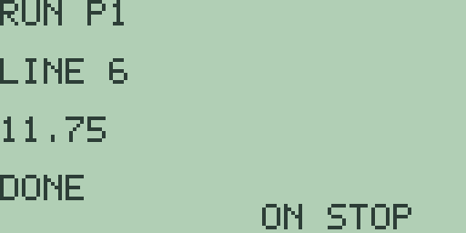
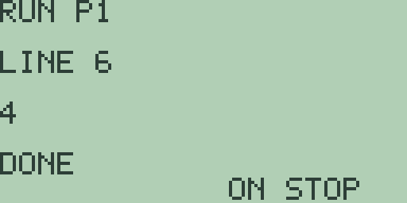

# Chapter 3: Explorations in Probability and Statistics

Statistics is usually taught on data sets too big to think about, where
the machine's summaries have to be taken on trust.

Free85 turns that round, and not by accident. Its statistics columns hold
eight entries. Eight numbers are few enough to check every claim the
machine makes by hand, and that is the whole design: at this size you never
have to believe anything, you can always look.

The chapter summarises a small data set and then audits the summary, meets
the random number generator and its strictly repeatable stream, builds
simulations in the program environment, finds out what "best fit" actually
means by computing it by hand, fits competing models to two invented data
sets, forecasts from the better one, and ends with the four statistical
plots. The statistics editor is the Guidebook, chapter 15.

## 3.1 A week of small data

The harbour town of Chapter 2 keeps a lighthouse, and the keeper tallies
its visitors: 15 on Monday, then 12, 17, 15, 19, 21, 18 through the week,
and 43 on the bank holiday Monday that closes the log.

Eight numbers, one of them suspiciously large. Exactly what a summary is
for, and few enough to audit afterwards.

1. Press [STAT] to open the statistics editor. A fresh machine holds four
   entries, so press [+] four times for eight, then type the diary in
   order, pressing [ENTER] after each value: 15, 12, 17, 15, 19, 21, 18,
   43.

   After the eighth [ENTER] the `INDEX` line wraps back to 1, which is how
   the editor tells you the column is full.

2. Press [F1], the `1V` key. The one-variable summary answers `MEAN 20`,
   `MED 17.5`, `S SD 9.6953597148325`, and `P SD 9.0691785736085`.

3. Now audit it, because you can.

   The mean is right: the eight values total 160, and 160 over 8 is 20.

   The median is the more telling check, because the week was typed in
   diary order and not in size order. On paper the ordered week reads 12,
   15, 15, 17, 18, 19, 21, 43, and its middle two values, 17 and 18,
   average to the `17.5` on the screen. So the summary puts the column in
   order for itself, and its figures do not depend on the order you typed
   them in.

4. The editor is a different matter, and so is the line plot of section
   3.7: both show the column exactly as stored.

   Press [CLEAR] to return to the editor, press [MORE] four times to the
   `P4 FCX FCY SX SY` page, and press [F4], the ascending sort `SX`. The
   selection returns to `INDEX 1`, now reading `12`, with the week in size
   order down the screen.

   Press [MORE] once more, to the `SHW XYLN LIN 1V 2V` page, and press
   [F4] for `1V` again: every figure of step 2 comes back unchanged. Which
   is the point. Sorting changed the editor and changed nothing about the
   statistics.

5. The spread audits just as well. Press [CLEAR], press [MORE] twice to the
   `MEAN MED VAR SSD PSD` page, and press [F3], `VAR`: the sample variance
   is `94`, exactly.

   By hand: the deviations from 20 are -8, -5, -5, -3, -2, -1, 1 and 23,
   their squares total 658, and 658 over 7 is 94.

   The `S SD` line of step 2 is its square root, and its last digit sits a
   whisker under the true 9.69535971483266. That is arithmetic, not
   mathematics: a square root of a fourteen-digit number, rounded once.

6. Press [CLEAR], then [MORE] for the `MIN MAX Q1 Q3 BOX` page, and collect
   the five-number summary one key at a time, pressing [CLEAR] after each
   result screen: `MIN` answers `12`, `MAX` answers `43`, `Q1` answers
   `15`, and `Q3` answers `20`.

   Write those five down before the next step, because you are about to
   look at a picture of them.

7. Press [F5], `BOX`:

   

   The plot hangs the three quartile bars between edges standing for 12 and
   43, and all three crowd into the left third of the screen.

   That crowding is the picture of skew. Half the week sits between 15 and
   20, and one bank holiday drags the right edge four box-widths further
   out.

8. The mean-against-median verdict closes the story. Press [EXIT] for the
   home screen, which comes back showing a leftover `= 12`, the selected
   entry handed back, so press [CLEAR] before typing.

   Then `(12+15+15+17+18+19+21)/7` and [ENTER]: `= 16.714285714286`, the
   mean without the bank holiday.

   One day moved the mean from under 17 to 20, while the median crept from
   17 to 17.5. Means follow outliers. Medians stay with the crowd, and that
   single sentence is most of what descriptive statistics is for.

Eight entries is the columns' whole capacity, and this section is the
argument for liking it: at this size every summary can be re-derived by
hand, so the machine is never believed, only checked.

**Try it.**

1. The next week is quieter: 11, 14, 14, 16, 17, 18, 20, 22. Predict the
   mean and the median before pressing `1V`, and write down why you expect
   the two to land closer together than in the keeper's week.
2. Shrink the sorted column to seven entries with [-] and work out `Q1` and
   `Q3` on paper first. Which value left, and which quartile moved?
3. The population variance divides the 658 by 8 instead of 7. Work it out,
   then check it by squaring the `P SD` figure on the home screen with
   [x²]. Does it come back exact, and should it?
4. Replace the 43 with 19 and re-run everything. Predict, before you do,
   which of the eight figures from steps 2, 5 and 6 change and which do
   not.
5. Invent a week of eight numbers whose mean and median are equal but whose
   box plot is still visibly lopsided. Is that possible? Argue it out
   before you type anything.

## 3.2 Random numbers that repeat

A random number generator is a paradox to keep in a pocket: a fixed rule
pretending to be chance.

Free85 makes the pretence unusually plain, and this section is about
learning to use that honesty rather than being disappointed by it. The two
functions are `RAND()`, a four-decimal value between 0 and 1, and
`RANDI(low,high)`, a whole number from `low` through `high` inclusive.

1. On a cleared home entry line, spell `RAND()` letter by letter, [ALPHA]
   then the key carrying each letter, with the brackets typed directly, and
   press [ENTER]: `= 0.7968`.

2. The entry line keeps its text after an evaluation, so [ENTER] alone asks
   again. Three more presses answer `= 0.8984`, then `= 0.4492`, then
   `= 0.7246`.

3. Those four values are not a sample of anything. They are the opening of
   a fixed sequence, and a fresh machine answers `0.7968` then `0.8984`
   every single time, with the stream carrying on from wherever the last
   call left it.

   That is deterministic by design, and I want to be clear that it is a
   design and not a shortcoming. For an experimenter it is
   reproducibility: any simulation in this chapter, rerun from a fresh
   start with the same keys in the same order, delivers the same figures,
   which means you can check my numbers and I can check yours. It also
   makes these functions fit for experiments and for nothing whatever that
   needs to be secret.

4. Dice come from the same stream. Press [CLEAR], spell `RANDI(1,6)`, and
   press [ENTER]: `= 6`, the stream's fifth draw dressed as a die. Five
   more presses of [ENTER] roll `4`, `6`, `1`, `1`, `4`.

   On a fresh machine the dice open `3`, `5`, `3`, `5`, `6` instead. Same
   stream, different entry point: the four `RAND()` calls of step 2
   consumed four draws before the dice got a look in.

   `RANDI(0,1)` flips coins, `RANDI(0,9)` draws digits, and every draw,
   whatever costume it wears, advances the one sequence by one step.

**Try it.**

1. From a fresh machine, roll `RANDI(1,6)` ten times and tally the faces.
   Which face never appears, and how far is the tally from uniform? Then
   say whether that is evidence of anything at all.
2. Two dice are two draws. Evaluate `RANDI(1,6)+RANDI(1,6)` repeatedly and
   watch middling sums dominate. Why is 1 impossible, and why is 7 the most
   likely?
3. Use `RANDI(0,9)` three times to build a three-digit random number on
   paper. How far does the stream advance, compared with calling
   `RANDI(0,999)` once? Does it matter?
4. Predict what `RANDI(1,1)` does, and how far it advances the stream.
   Then check.

## 3.3 Simulation by program

Rolling a die thirty-six times by hand is character-building. A program
does it in one keypress and never loses count.

Two builds follow, a nine-flip warm-up and a thirty-six-roll dice
experiment, in the program environment of the Guidebook, chapter 16.

1. Press [PRGM], then [F1], `NEW`. The editor opens on `EDIT P1`, `LINE 1`.
   Remember from Chapter 4 that it shows you one line at a time and never a
   listing, so keep the table below in front of you as you type.

   Letters are [ALPHA] plus the key carrying the letter, spaces are
   [2nd] [0] in this editor, and [STO▶] types the `->` arrow.

   | Line | Text | Keys |
   | --- | --- | --- |
   | 1 | `0->S` | [0] [STO▶] [S] |
   | 2 | `FOR A,1,9` | [F] [O] [R] [2nd] [0] [A] [,] [1] [,] [9] |
   | 3 | `S+RANDI(0,1)->S` | [S] [+] [R] [A] [N] [D] [I] [(] [0] [,] [1] [)] [STO▶] [S] |
   | 4 | `END` | [E] [N] [D] |
   | 5 | `DISP S` | [D] [I] [S] [P] [2nd] [0] [S] |
   | 6 | `STOP` | [S] [T] [O] [P] |

2. Press [F2], `RUN`. The run screen answers `RUN P1` over `LINE 6`, the
   output line shows `3`, the status reads `DONE`, and the footer `ON STOP`
   names the panic button.

   Three heads in nine flips, from the stream section 3.2 was reading.

3. Nine is as far as a counted loop goes in one digit. `FOR` takes
   single-digit bounds, so bigger experiments have to count down with
   `WHILE`, exactly as Chapter 8's series do.

   Press [PRGM] for the list, [▼] to select the second slot, and [F1] to
   open `EDIT P2`. Type its eight lines:

   | Line | Text |
   | --- | --- |
   | 1 | `36->N` |
   | 2 | `0->S` |
   | 3 | `WHILE N` |
   | 4 | `S+INT(RANDI(1,6)/6)->S` |
   | 5 | `N-1->N` |
   | 6 | `END` |
   | 7 | `DISP S` |
   | 8 | `STOP` |

   Line 4 is the interesting one and it is worth staring at.

   The editor cannot type `=`, so "did the die show six" has to become
   arithmetic. `RANDI(1,6)/6` is 1 exactly when the roll is a six and
   somewhere in (0, 1) otherwise, so `INT(` of it is 1 for a six and 0 for
   everything else. Then `S` tallies it.

   That trick, turning a test into a whole-part, is the single most useful
   thing to know about programming this machine. Chapter 8 uses it again to
   stop a loop on a tolerance.

4. Press [F2]. After a moment's spinning the run screen answers `8` on
   `LINE 8`:

   

   Eight sixes in thirty-six rolls, against an expected six.

5. Run it again, [PRGM] then [F3], and the count is `13`.

   The stream carried on into a patch rich in sixes, and thirteen in
   thirty-six is the sort of wobble small experiments produce. Determinism
   holds all the same: a fresh machine that types and runs exactly this
   section answers 3, then 8, then 13, in that order, every time.

The environment's bounds shape the design here: four programs of eight
48-character lines, single-digit `FOR` bounds, and no way to type `=` or
`<`, so conditions get built out of arithmetic as line 4 does.

**Try it.**

1. Edit `P2` to roll ninety-nine times and compare the tally of sixes with
   99/6. Which single line changes? Predict the tally's rough size before
   you run it.
2. The tails `P1` does not display are not lost. Add a line displaying
   `9-S` and decide which figure the run screen leaves on show, before you
   try it.
3. Rewrite `P1`'s loop with `REPEAT` and a countdown, remembering that
   `REPEAT` tests before every pass. What test expression makes the body
   run nine times?
4. Line 4 tests for a six. Change it to test for an even roll instead.
   There is more than one way; find one that uses `INT(` and one that does
   not.

## 3.4 Two columns and a family of models

Paired data asks a sharper question than one column can: not "what is
typical" but "what depends on what, and how".

The editor fits seven models to its two columns, and choosing between them
is the exploration. Two invented experiments supply the data: a bean
seedling measured daily, and duckweed spreading across a pond.

1. The bean first. On a fresh machine press [STAT], press [+] twice for six
   entries, and type the days 1 through 6 into `X`. Press [ALPHA] to switch
   to the `Y` column and type the measured heights in centimetres: 7, 7,
   10, 12, 13, 17.

2. Press [F2], `2V`: `MEANX 3.5`, `MEANY 11`, and the correlation
   `R 0.9725975251592`, strongly linear.

   Press [CLEAR], then [F3], `LIN`: the result screen answers `MOD LIN`
   with `A 4` and `B 2`, which is the line y = 4 + 2x. Growth of two
   centimetres a day from a four-centimetre start.

   Check it against the data by hand, because it takes ten seconds. The
   line predicts 6, 8, 10, 12, 14, 16 for the six days, so the data misses
   it by 1, -1, 0, 0, -1, 1. Small errors, both directions, no drift. That
   is what measurement noise looks like, and section 3.5 is about why those
   particular numbers are the best any line could manage.

3. Now the duckweed, logged weekly as square metres of the harbour
   master's pond covered: 6, 12, 24, 48, 96 across weeks 1 to 5.

   Press [CLEAR] to leave the result screen, press [-] once for five
   entries, press [ALPHA] to return to the `X` column, type 1 through 5,
   press [ALPHA], and type the five areas into `Y`.

4. Fit the straight line anyway, because the failure is instructive. `2V`
   answers `R 0.9332565252573`, and `LIN` answers `A -27.6` with `B 21.6`.

   The correlation looks respectable and the fit is terrible, which is this
   section's central lesson. The line predicts -6 for week 1, 37.2 for week
   3 and 80.4 for week 5, against 6, 24 and 96. The misses swing from plus
   to minus and back, which is a curve's signature, not noise.

   A correlation of 0.93 did not warn you. `R` alone does not choose a
   model. The residuals do.

5. Look at the shape. Press [CLEAR], then [F4], `SCAT`:

   

   The dots hug the floor and then leave it, each gain bigger than the last.
   Multiplication, not addition.

6. Fit the multiplying model. Press [EXIT], then [STAT] to reopen the
   editor on its first page, press [MORE] three times to the
   `LNR EXPR PWR P2 P3` page, and press [F2], `EXPR`, which fits
   y = A e^(Bx).

   The screen answers `MOD EXP` with `A 3.0000000000031` and
   `B 0.69314718055973`.

   That `B` is ln 2 in costume. Press [CLEAR] and ask `LN(2)`:
   `= 0.69314718056122`, the same to eleven places. So the model is three
   square metres doubling every week, which is exactly what the data was
   built from.

7. Put both fits side by side. Press [EXIT], and the home screen comes back
   showing a leftover `= 0.69314718055973` handed out of the result screen,
   so press [CLEAR].

   Type `-27.6+21.6*X` ([(-)] for the sign) and press [GRAPH] to store the
   line in `Y1`. Press [2nd] [2], press [CLEAR], type `3*EXP(.6931*X)` (the
   fitted coefficients to four places, `EXP(` on [2nd] [LN]), and press
   [GRAPH], letting the slow plot finish. Press [MORE] for the table:

   

   Down the `X=1` to `X=5` rows, `Y1` reads `-6`, `15.6`, `37.2`, `58.8`,
   `80.4` while `Y2` reads `5.999`, `11.99`, `23.99`, `47.99`, `95.97`.

   One column misses the areas by up to thirty square metres. The other
   misses by hundredths. Residuals by eye settle what `R` could not.

The columns cap at eight pairs, so experiments for Free85 are planned
around few, well-spaced observations. Five weekly readings separated two
models cleanly, which is a reminder that the number of observations
matters much less than where you put them.

**Try it.**

1. The bean data minus its noise is 6, 8, 10, 12, 14, 16. Predict `R`
   before you enter it and fit `LIN`. What does noiseless correlation look
   like?
2. Cross the models: fit `EXPR` to the bean heights and test its
   predictions for days 1 and 6 on the home screen. Which way do the
   residuals drift, and what does that drift tell you?
3. Invent a five-pair data set that `PWR` (y = A x^B) fits exactly, enter
   it, and check the machine recovers your two constants.
4. Fit `LIN` to the duckweed's *logarithms* instead: work out ln of each
   area on paper, type those into `Y`, and fit. Compare the slope with step
   6's `B`. Why should they agree?

## 3.5 What "best fit" actually means

Section 3.4 pressed `LIN` and the machine handed back a line. This section
is about where that line comes from, because "best fit" is a phrase that
sounds like it explains something and does not.

Best in what sense? Nearest to what? The answer is completely definite, and
you can compute it yourself in about five minutes.

Here is the rule. For any line you care to name, go along the data, take
the vertical distance from each point to the line, square it, and add up
the squares. That total is the line's score, and the lower it is the
better. The line `LIN` gives you is the one with the lowest score of all
possible lines. That is the whole of it, and the name for the total is the
sum of squared residuals.

Two questions people always ask, worth answering before you compute
anything. Why vertical distance, and not perpendicular? Because you are
predicting y from x, so a miss in y is what costs you. Why squared, and not
just the size of the miss? Partly so that overshoots and undershoots cannot
cancel, and partly because squaring makes one big miss cost far more than
several small ones, which is usually what you want.

### A program to keep score

The bean data has six points, so the total is six squared misses added
together. That is too long for one entry line, which holds 48 characters,
so it wants a program.

1. Press [PRGM] and [F1], `NEW`, opening `EDIT P1`. Type these six lines.
   The slope lives in `M` and the intercept in `B`, so the program never
   contains a particular line and will score any line you like:

   | Line | Text | Keys |
   | --- | --- | --- |
   | 1 | `0->S` | [0] [STO▶] [S] |
   | 2 | `S+(B+M*1-7)^2+(B+M*2-7)^2->S` | [S] [+] [(] [B] [+] [M] [×] [1] [-] [7] [)] [x²] [+] [(] [B] [+] [M] [×] [2] [-] [7] [)] [x²] [STO▶] [S] |
   | 3 | `S+(B+M*3-10)^2+(B+M*4-12)^2->S` | as line 2, with 3 and 10, then 4 and 12 |
   | 4 | `S+(B+M*5-13)^2+(B+M*6-17)^2->S` | as line 2, with 5 and 13, then 6 and 17 |
   | 5 | `DISP S` | [D] [I] [S] [P] [2nd] [0] [S] |
   | 6 | `STOP` | [S] [T] [O] [P] |

   The six heights 7, 7, 10, 12, 13, 17 are written into lines 2 to 4, two
   points to a line, because at 48 characters that is as many as will fit.
   The days 1 to 6 are the multipliers of `M`.

   The longest line is 30 characters, so there is room to spare. If your
   data were different you would retype these three lines and nothing else.

2. Score a deliberately poor line first, so you have something to beat.
   Press [EXIT] for the home screen and [CLEAR], type [3] [STO▶] [ALPHA]
   [SIN] (the letter `B`) and press [ENTER]: `= 3`. Press [CLEAR], type
   [2] [.] [5] [STO▶] [ALPHA] [8] (the letter `M`), and press [ENTER]:
   `= 2.5`.

   That is the line y = 3 + 2.5x. Press [PRGM], select `P1`, and press
   [F2], `RUN`:

   

   `11.75`.

   That number means nothing on its own. It is only useful compared with
   another one, which is the next step.

3. Now score the line `LIN` gave you in section 3.4, y = 4 + 2x. Press
   [PRGM] to leave the run screen, [EXIT], [CLEAR], store `4->B`, press
   [CLEAR], store `2->M`, then [PRGM] and [F2]:

   

   `4`.

   Much better, as it should be. Note also that it is exactly 4, and you
   can see why from section 3.4: the six residuals were 1, -1, 0, 0, -1, 1,
   and six squares of those add to 4.

4. Now the part that makes the claim real. `LIN` says 4 + 2x is the *best*
   line. Try to beat it.

   Nudge the intercept: store `4.5->B`, keep `2->M`, and run. `5.5`.

   Nudge it the other way, `3.5->B`: you get `5.5` again, by symmetry.

   Nudge the slope instead: back to `4->B`, then `2.1->M` and run. `4.91`.

   Every direction you move in, the score goes up. That is what a minimum
   is, and you have just verified it by hand rather than taking it on
   trust. `LIN` did not find a good line. It found *the* line, in a
   perfectly precise sense that you can now state.

5. One more, to see the shape of the thing. Nudging the slope by 0.1 cost
   0.91. Predict what nudging it by 0.2 will cost, write the number down,
   then store `2.2->M` and run.

   `7.64`. The excess over 4 is 3.64, which is exactly four times 0.91.

   So the score grows like the *square* of how far you move, not in
   proportion to it. That is what makes the minimum a smooth bowl rather
   than a sharp point, it is why a line that is slightly wrong is only
   slightly worse, and it is why fitting is a stable business: small errors
   in the data move the answer by small amounts.

**Try it.**

1. Predict the score for y = 4 + 2x on the noiseless bean data 6, 8, 10,
   12, 14, 16, before running anything. Then edit lines 2 to 4 and check.
2. Work out on paper why nudging the intercept up and down by the same
   amount gives the same score, but nudging the slope up and down does not
   have to. Test your reasoning with `1.9->M`.
3. The mean of the bean heights is 11 and the mean day is 3.5. Check that
   the least-squares line passes exactly through (3.5, 11). Then explain
   why it has to.
4. Score the flat line y = 11, the mean of the heights, by storing `11->B`
   and `0->M`. You should get `74`. Compare it with the 4 of step 3: the
   trend explains all but four seventy-fourths of the variation, and one
   minus that fraction is where the `R` of section 3.4 comes from. Check
   that against `R` squared.
5. Retype lines 2 to 4 for the duckweed data of section 3.4 and score the
   straight line `LIN` gave, A -27.6 and B 21.6. Then score the doubling
   model by hand at the same five points. Which is smaller, and by how
   much?

## 3.6 Forecasting the full pond

The pond holds one hundred square metres, and the model of section 3.4 says
the duckweed doubles weekly.

A model's job is to answer questions the data has not reached, and the
forecast keys do exactly that, reading their question from whichever entry
the editor happens to be standing on. That last detail is the whole trick
and the whole trap.

1. Step off the table screen that closed section 3.4: press [EXIT] to the
   plot, let the slow exponential finish redrawing, and press [EXIT] again
   for the home screen.

   Then rebuild the fit, because the forecast keys read whichever model was
   fitted last and you have fitted several. Press [STAT], press [MORE]
   three times, and press [F2], `EXPR`, which answers the same coefficients
   as before. Press [CLEAR] for the editor.

2. Ask about week 6. Press [+] to grow the columns to six entries, press
   [▲] to wrap the selection to the new `INDEX 6`, type 6, press [ENTER],
   and press [▲] to stand on the new entry again.

   Press [MORE] for the `P4 FCX FCY SX SY` page and press [F3], `FCY`,
   which forecasts y from x. The `FORECAST` screen answers
   `191.99999999971` over the `6` it read: the model's 192 in machine
   arithmetic.

   That forecast is absurd, and usefully so. A hundred and ninety-two
   square metres will not fit in a hundred square metre pond, so somewhere
   in week six the model stops being true. The model does not know that.
   Models never do. Knowing where your model stops is your job and it is
   not a job you can delegate to a fitting key.

3. So ask the better question: when is the pond full? That is a forecast in
   the other direction, x from y, and `FCX` reads its target from the `Y`
   side of the selected entry.

   Press [CLEAR], press [ALPHA] to switch to the `Y` column, press [▲] to
   wrap to `INDEX 6`, type 100, press [ENTER], and press [▲] to stand on
   it. Press [F2], `FCX`:

   

   `5.0588936890553` over the target `100`. The pond closes over early in
   the sixth week, about half a day in.

4. Audit it, because you can do this one on paper. Press [EXIT] (the home
   screen returns showing a leftover `= 100`, so press [CLEAR]) and type
   `LN(100/3)/LN(2)`, which is the paper solution of 3 times 2 to the x
   equals 100.

   [ENTER] answers `= 5.0588936890444`, agreeing to ten places. The last
   digits differ because the two routes walk different arithmetic to the
   same number, which is the ordinary state of affairs and not a fault.

One caution, and it is the kind that bites silently. The fit is not
recomputed until a regression key is pressed again, so the scratch entry
holding 6 and 100 never disturbed the model it was questioning. But it
would join the next fit. Shrink the columns with [-] before fitting
anything else, or your data will quietly acquire a point you invented.

**Try it.**

1. Move the selection back to `INDEX 6`, store 7 on the `X` side, and
   forecast the area for week 7. How much pond would that need? Work out
   the answer from the doubling before you press the key.
2. The town council acts at half cover. Store 50 as a `Y` target, forecast
   the half-full week, and explain on paper why it must come exactly one
   week before the full-pond answer.
3. Store 3 on the `Y` side and forecast the x it comes from. Predict the
   answer first. Why does the model place three square metres at week zero?
4. Forecast the week at which the pond holds 200 square metres. The machine
   will answer. Say precisely what is wrong with the answer, in a sentence
   you would be happy to put in a report.

## 3.7 Four pictures of one week

A data set has no single true picture. Each plot answers one question and
is silent on all the others, so choosing a plot is choosing a question.

The keeper's week returns, day against visitors, for its portrait four
ways. The tally sheets come off the spike in no particular order, which is
where it starts.

1. On a fresh machine press [STAT], press [+] four times, and type the days
   as the sheets surface, 3, 1, 6, 8, 2, 5, 4, 7, into `X`. Press [ALPHA]
   and type each sheet's count beside its day into `Y`: 17, 15, 21, 43, 12,
   19, 15, 18.

2. Press [MORE] five times to the `SHW XYLN LIN 1V 2V` page and press [F2],
   `XYLN`, the line plot:

   

   The plot joins the pairs in *entry order*, so the shuffled sheets draw a
   criss-cross that says nothing whatever about the week.

   `XYLN` is the one plot of the four that trusts your ordering, and that
   makes it the one that can lie to you without any warning at all.

3. Sort the pairs. Press [EXIT] (the home screen shows a leftover `= 17`,
   which does no harm here), press [STAT] to reopen the editor on its first
   page, press [MORE] four times, and press [F4], `SX`: the days come out 1
   through 8, each count still riding beside its own day.

   Press [MORE] once and press [F2] for `XYLN` again: now the line ambles
   along the teens all week and leaps at the bank holiday, which is the
   week's actual story.

4. Press [EXIT], then [STAT], and press [F4], `SCAT`: the same shape as
   dots.

   The scatter plot shows where the pairs sit and hides their order, which
   after the sort is no loss. Before the sort it would have quietly hidden
   the shuffle instead, and you would never have known there was one.

5. Press [EXIT], then [STAT], and press [F5], `HIST`.

   The histogram answers four bars of exactly equal height, and it is not
   wrong. `HIST` reads the `X` column alone, and `X` holds the days 1
   through 8, two to each of four equal-width bins. Four bars of two.

   A plot reads the columns, not your intentions. This is the cheapest
   possible demonstration of that and it is worth remembering the next time
   a chart looks surprising.

6. Give it the right column. Press [EXIT], then [STAT]: the editor returns
   with the selection at `INDEX 1` of `X`, so type the counts straight over
   the days, 15, 12, 17, 15, 19, 21, 18, 43, pressing [ENTER] after each,
   and press [F5] again.

   One tall bar of six ordinary days, a single 21 beside it, an empty bin,
   and the bank holiday alone at the far right. This is the arrangement
   section 3.1 used all along, visitors in `X`, and it is what `BOX` wants
   too: both plots read `X` and ignore `Y`.

Four plots, one week. `XYLN` tells the story in time but only if the pairs
are sorted. `SCAT` shows the pairing and hides the order. `HIST` and `BOX`
show one column's distribution and hide the pairing altogether.

With eight entries the wrong choice costs you thirty seconds, which is the
best argument for learning this on eight entries rather than on eight
thousand.

**Try it.**

1. Draw `BOX` straight after step 6, then sort with `SX` and draw it again.
   The two pictures are identical. Say which one of the four plots would
   have changed, and why `BOX` is not one of them.
2. Put the days back in `X` and the counts in `Y`, sort with `SY`, and draw
   `XYLN`. What ordering does the plot follow now, and what question does
   that answer?
3. The histogram's bins span minimum to maximum in four equal widths.
   Predict each count's bin for the keeper's week, on paper, and check
   against the bar heights of step 6.
4. Which of the four plots would show you that a data set had a value
   entered twice by mistake? Argue for each of the four before you decide.
