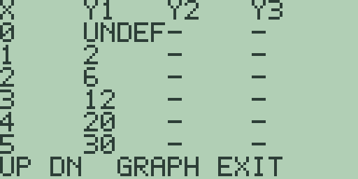
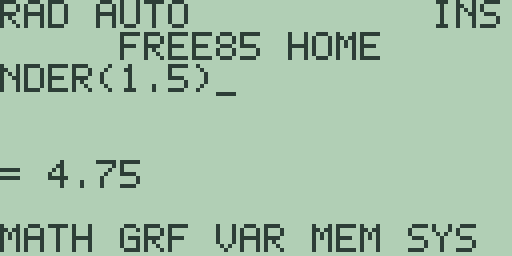
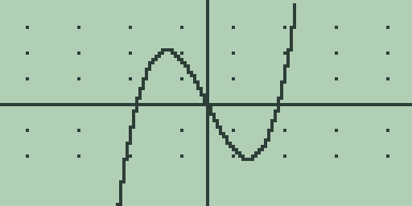
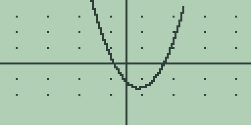
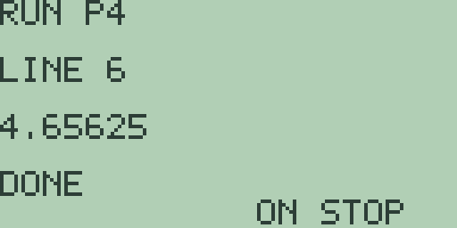
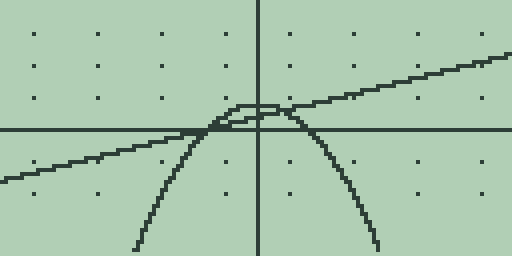

# Chapter 4: Explorations in Calculus I

Calculus asks what functions do at places the eye cannot reach:
infinitesimally close to a point, or summed across infinitely many
slivers. A calculator cannot reach those places either, but it can walk
arbitrarily far towards them and report back. This chapter probes limits
with the table and the zoom keys, builds derivatives from raw difference
quotients before letting `NDER(` take over, hunts extrema with the search
commands, measures areas with `FNINT(` and the graph keys, and programs
Riemann sums to watch an integral assembled. The calculus commands and
the tolerance setting are the Guidebook, chapter 3; the analysis keys are
the Guidebook, chapter 4. Every key sequence and every quoted number in
this chapter was run in the emulator on a fresh machine, and each
exploration ends with a "Try it" block whose answers stay on the
calculator.

One habit pays for itself all chapter: the calculus commands read the
*active stored equation*, so store the function with [GRAPH] before
asking them anything. With no equation stored, `EVAL(` and its family
answer `SYNTAX ERROR`; once one is stored, they answer whether or not
the plot was left to finish.

## 4.1 Limits by table and zoom

A limit asks what value a function is heading for, which is a different
question from what value it has. The sharpest way to feel the difference
is a function undefined at exactly one point and perfectly ordinary
everywhere else. This section's specimen is f(x) = (x^3 + x^2) / x, which
at every x other than 0 equals x^2 + x, and at 0 itself divides zero by
zero: a parabola with one point removed.

1. On the home screen, type [(] [x-VAR] [^] [3] [+] [x-VAR] [x²] [)] [÷]
   [x-VAR] so the entry line reads `(X^3+X^2)/X`, and press [GRAPH]. Let
   the plot draw to the end. The curve is the familiar parabola of
   `X^2+X`, and nothing marks the missing point: the plot samples 128
   columns across the window, and none of them lands exactly on 0.

2. The table is not so easily fooled. Press [MORE] on the graph screen:

   

   The `X=0` row reads `UNDEF`, and the rows below it read `2`, `6`, `12`,
   `20`, `30`, exactly the values of x^2 + x. The graph drew what it
   sampled; the table asked at 0 itself and reported that nothing is
   there.

3. Now walk towards the hole. Press [-] twice to halve the table step to
   0.25: the rows read `UNDEF`, `0.312`, `0.75`, `1.312`, `2`, `2.812`
   (the five-character cells truncate 0.3125 and 1.3125). Press [▲] to
   scroll up: the rows from `X=-1.25` to the hole read `0.312`, `0`,
   `-0.18`, `-0.25`, `-0.18`, `UNDEF`. From both sides the values slide
   towards 0, and the `X=0` row stays `UNDEF` at every step size: the
   limit is 0, and the value does not exist.

4. Zoom at the hole. Press [EXIT] to leave the table and let the plot
   redraw, then press [+] three times, letting each replot finish: the
   window is now -1.25 to 1.25 on both axes. Press [▶] twice and the
   readout gives `X=0.0492125984252` and `Y=0.051634478268959`: this
   close in, the curve is indistinguishable from the line y = x, because
   x^2 + x behaves like x when x is small. However far you zoom, the
   picture stays a clean line with its centre point silently missing.

5. The calculus commands tell the same story in numbers. Press [EXIT]
   (the graph hands `(X^3+X^2)/X` back to the entry line) and press
   [CLEAR]. Spell `EVAL(.1)` letter by letter ([ALPHA] then the key
   carrying each letter, brackets and digits typed directly) and press
   [ENTER]: the answer is `= 0.11`. Press [CLEAR] and ask `EVAL(.01)`:
   `= 0.0101`. Press [CLEAR] and ask `EVAL(-.01)` with the [(-)] key:
   `= -0.0099`. Each probe lands closer to 0 from its own side.

6. Ask for the point itself: [CLEAR], then `EVAL(0)` stops at the
   `SYNTAX ERROR` screen, which is how the calculus commands report an
   evaluation that fails at the requested point. Press [CLEAR] to
   dismiss it (the entry line keeps `EVAL(0)`), press [CLEAR] again, and
   type the division at 0 by hand instead: `(0^3+0^2)/0` answers the
   blunter `DIVIDE BY ZERO`.

Every probe said the values head for 0, and no probe proved it: a machine
tests finitely many points, and a limit is a claim about all of them. The
proof is one line of algebra, (x^3 + x^2)/x = x^2 + x for every nonzero
x, and the right side plainly heads for 0. Numerical evidence points;
algebra pins. The whole chapter uses the machine in that spirit.

**Try it.**

1. Store `(X^2-2*X)/X` and find its hole with the table. What line does
   the plot draw, and which single point of it is a lie?
2. Store `(SQRT(X+9)-3)/X` ([2nd] [x²] types `SQRT(`) and probe the hole
   at 0 with `EVAL(.001)` and `EVAL(-.001)`. What limit do the probes
   suggest? Check by multiplying top and bottom by SQRT(X+9)+3.
3. Store `1/X` and read its table. The `X=0` row shows `UNDEF` here too,
   but no limit exists. What do the table rows either side of the hole do
   that section 4.1's rows did not?

## 4.2 The derivative as a limit

The slope of a curve at a point is the limit of the slopes of secant
lines through it, and unlike most limits, this one can be watched
converging digit by digit. The function under study is f(x) = x^3 - 2x at
x = 1.5, where the derivative 3x^2 - 2 works out on paper to 4.75. The
plan: compute (f(1.5+h) - f(1.5))/h by hand for shrinking h, watch 4.75
emerge, then let the machine's own commands answer in one step.

1. Store the function: type [x-VAR] [^] [3] [-] [2] [×] [x-VAR] so the
   entry line reads `X^3-2*X`, press [GRAPH], and let the plot finish.

2. Slope from the graph first. Press [▶] nine times, which lands the
   trace at `X=1.496062992126` with `Y=0.3563689017143`, the sample
   column nearest 1.5. Press [F4], the derivative key: the home screen
   publishes `= 4.714613425`, the slope at the traced sample, a whisker
   under 4.75 because the trace stopped a whisker short of 1.5.

3. Now the secants. The [F4] result left `X^3-2*X` on the entry line, so
   press [CLEAR]. Spell `(EVAL(1.5+1)-EVAL(1.5))/1` and press [ENTER]:
   `= 10.25`, the slope of the secant from 1.5 to 2.5, far too steep.
   Press [CLEAR] and shrink the step to 0.1 with
   `(EVAL(1.5+.1)-EVAL(1.5))/.1`: `= 5.21`. Pressing [CLEAR] each time,
   step .01 answers `= 4.7951` and step .001 answers `= 4.754501`. Each
   tenfold shrink buys roughly one more correct digit of 4.75.

4. Push harder. With step `1E-6` (the `E` typed with [EE]), the quotient
   `(EVAL(1.5+1E-6)-EVAL(1.5))/1E-6` answers `= 4.7500045`. With `1E-9`
   it answers `= 4.75` exactly, and with `1E-12` it answers `= 4.8`. The
   last two need reading with care. Free85 keeps fourteen decimal digits,
   so as h shrinks, f(1.5 + h) and f(1.5) share ever more leading digits,
   and the subtraction cancels them, leaving ever fewer meaningful ones.
   At 1E-9 the survivors happen to round to exactly 4.75; at 1E-12 one
   digit survives and the quotient comes out 4.8. The clean 4.75 is luck,
   not precision: shrinking h sharpens a difference quotient only until
   cancellation blunts it.

5. The built-in command threads that needle itself. Press [CLEAR], spell
   `NDER(1.5)`, and press [ENTER]:

   

   The answer is `= 4.75`. `NDER(` takes a central difference, sampling
   both sides of the point, which cancels the largest error term of the
   one-sided secants; the Guidebook, chapter 3 documents the command
   family. As a check on paper's terms, press [CLEAR] and type
   `3*1.5^2-2` (the [x²] key types `^2`): `= 4.75`.

**Try it.**

1. With `X^3-2*X` still stored, run the shrinking quotients at a = 0,
   where f(0) = 0 makes the typing short. What slope do they head for,
   and what does `NDER(0)` say?
2. The backward quotient `(EVAL(1.5)-EVAL(1.5-.01))/.01` uses the other
   side. Compute it, compare it with the forward .01 answer, and say
   which side of 4.75 each lands on and why.
3. Ask `NDER(` at 0, 1, and 2, and check each answer against 3x^2 - 2.
   How many keystrokes of retyping did the stored equation save you?

## 4.3 Extrema by search

Where a smooth function turns, its derivative passes through zero, and
finding the turning points is the first genuinely useful service calculus
sells. The specimen is a cubic designed to be checkable: f(x) =
x^3/3 - 4x, whose derivative x^2 - 4 vanishes at x = -2 (a local maximum,
value 16/3) and at x = 2 (a local minimum, value -16/3).

1. Type [x-VAR] [^] [3] [÷] [3] [-] [4] [×] [x-VAR] so the entry line
   reads `X^3/3-4*X`, press [GRAPH], and let the plot finish. The
   S-shaped curve rises to its hill left of the axis and dips to its
   valley right of it:

   

2. Press [F3], the maximum search. The search sweeps the window and takes
   a few seconds; let it finish. It publishes `= -1.9997326856359` on the
   home screen: the *location* of the maximum, not its value, correct to
   about three decimals. The searches stop when their bracket is tight,
   not when the digits are exact, so a short tail of error is normal.

3. The result screen left `X^3/3-4*X` on the entry line, so pressing
   [GRAPH] stores it back unchanged and replots. (Mind the rule: [GRAPH]
   always stores the entry line into the active slot, and storing an
   *empty* line clears the slot, so return to the graph with the equation
   on the line, never from a blank one.) Press [F2], the minimum search,
   and let it settle: `= 1.9997326856359`, the valley mirroring the hill.

4. The home-screen commands take typed bounds instead of the window, and
   the bounds are the search interval, so choose them to bracket one
   extremum. Press [CLEAR], spell `FMIN(0,4)`, press [ENTER], and let it
   work: `= 1.9998801765763`. Press [CLEAR] and ask `FMAX(-4,0)` (the
   sign with [(-)]): `= -1.9998801765763`. Same turning points, slightly
   different last digits: a different interval, a different search path.

5. Values come from `EVAL(` at the found locations, or at the exact ones
   when you know them: [CLEAR], then `EVAL(2)` answers
   `= -5.3333333333333`, and after another [CLEAR], `EVAL(-2)` answers
   `= 5.3333333333333`, the fourteen-digit faces of -16/3 and 16/3.

6. The tolerance setting belongs to this toolkit's small print. Press
   [2nd] [CLEAR], the `TOLER` key: the `TOLERANCE CHANGED` notice
   confirms the cycle from `1E-6` to `1E-8`, and [CLEAR] dismisses it;
   two more cycles return to `1E-6`. The root hunts of this chapter test
   their residuals against the setting (the Guidebook, chapter 3). The
   extremum searches do not consult it: their answers above carry the
   same digits at every tolerance, worth knowing before you cycle
   `TOLER` hoping for more decimals.

**Try it.**

1. Store `X^2*(X^2-4)/4` and find both of its minima with `FMIN(` and
   suitable bounds. What does symmetry predict about the two locations,
   and do the answers agree?
2. On the section's cubic, ask `FMAX(0,4)`. There is no turning maximum
   inside those bounds, so what does the search report, and what is
   special about the value of f there? (Compare `EVAL(` at the answer
   with `EVAL(-2)`.)
3. Find the cubic's maximum from the graph screen after two presses of
   [+], and compare the digits with step 2's whole-window answer. Which
   window's search came closer to -2?

## 4.4 The definite integral

The integral of a function over an interval is the area between its curve
and the x axis, counted with sign: area above the axis adds, area below
subtracts. The specimen dips on purpose: g(x) = x^2 - 2x - 3 factors as
(x - 3)(x + 1), negative between its zeros -1 and 3, positive outside.

1. Type [x-VAR] [x²] [-] [2] [×] [x-VAR] [-] [3] so the entry line reads
   `X^2-2*X-3`, press [GRAPH], and let the plot finish:

   

2. Press [F5], the integral key, and let it work: the home screen
   publishes `= 606.66666666667`. The window is the interval: [F5]
   integrated from -10 to 10, the paper value 1820/3.

3. Typed bounds are the home commands' job. Press [CLEAR] and spell
   `FNINT(-1,3)`: the answer is `= -10.666666666667`. The dip between the
   zeros has area 32/3, and the integral reports it *negative*: below the
   axis, the signed count subtracts.

4. Press [CLEAR] and ask `FNINT(3,5)`: `= 10.666666666667`. By a designed
   coincidence, the hump from 3 to 5 encloses exactly the same area above
   the axis as the dip does below.

5. So the whole run should cancel. Press [CLEAR] and ask `FNINT(-1,5)`:
   `= 0`, exactly. An integral of zero does not mean nothing happened; it
   means the ups and downs balanced. When the question is "how much area,
   regardless of side", integrate the pieces separately and add sizes.

6. Average value is an integral wearing plainer clothes: the average of a
   function over an interval is its integral divided by the width. A
   story to measure: a harbour weather logger records a day running from
   8 degrees at midnight to 20 degrees at noon, modelled for this chapter
   as `14-6*COS(PI*X/12)` with `X` in hours from midnight (`RAD` mode,
   the fresh-boot default; the `π` legend on [2nd] [^] types `PI`).
   Press [CLEAR], type it ([COS] types `COS(`), press [GRAPH], and let
   the plot finish; the standard window shows only the cold midnight
   arc, most of the day sitting above `YMAX`, and the numbers below read
   the stored equation, not the picture.

7. Press [EXIT] and [CLEAR], then check the design: `EVAL(0)` answers
   `= 8`, and after another [CLEAR], `EVAL(12)` answers
   `= 20.000025006855`, the noon peak through the machine's
   fourteen-digit `PI` (the same small print as `SIN(PI/2)` in the
   Guidebook, chapter 3).

8. The day's average: [CLEAR], then `FNINT(0,24)` answers
   `= 336.000035432` degree-hours, and [CLEAR], then `FNINT(0,24)/24`
   answers `= 14.000001476333`. The average temperature is 14 degrees,
   the cosine's contribution cancelling over its full period, and the
   trailing digits are `PI` again, not the weather.

**Try it.**

1. Check the splitting rule on the parabola: compute `FNINT(-1,1)` and
   `FNINT(1,3)` and confirm the two together match step 3's answer for
   the whole dip.
2. Press [+] once and use [F5] on the parabola in the halved window. Work
   out the -5 to 5 integral on paper and compare.
3. An island town's day swings just 3 degrees either side of 17. Write
   the model in the pattern of step 6, and confirm with `FNINT(` that its
   average over 24 hours is 17 up to the machine's `PI`.

## 4.5 Riemann sums by program

`FNINT(` answers in a second and shows nothing of its method. A Riemann
sum is the method: slice the interval, guess each slice's area from one
sample, add the guesses. The program environment of the Guidebook,
chapter 16 lets the machine do the adding while you choose the sampling,
and watching the sums close in on the integral is the best argument for
why the limit of sums deserves the name "integral". The function is
f(x) = x^2 + 1 on [0, 2], whose integral is 14/3.

1. Store the equation first: type [x-VAR] [x²] [+] [1] so the entry line
   reads `X^2+1`, press [GRAPH], let the plot finish, press [EXIT], and
   press [CLEAR]. Then get the target: spell `FNINT(0,2)` and press
   [ENTER]: `= 4.6666666666667`, the fourteen-digit 14/3.

2. The left sum with four slices takes each slice's height from its left
   edge: the slice width is 2/4 = 0.5 and the sample points are 0, 0.5,
   1, 1.5, which is `A/2` for `A` counting 0 to 3. Press [PRGM], then
   [F1], `NEW`: the editor opens on `EDIT P1`. Type the six lines,
   [ENTER] after each; letters are [ALPHA] plus the key carrying the
   letter, spaces are [2nd] [0] in this editor, and [STO▶] types the
   `->` arrow.

   | Line | Text | Keys |
   | --- | --- | --- |
   | 1 | `0->S` | [0] [STO▶] [S] |
   | 2 | `FOR A,0,3` | [F] [O] [R] [2nd] [0] [A] [,] [0] [,] [3] |
   | 3 | `S+EVAL(A/2)->S` | [S] [+] [E] [V] [A] [L] [(] [A] [÷] [2] [)] [STO▶] [S] |
   | 4 | `END` | [E] [N] [D] |
   | 5 | `DISP S/2` | [D] [I] [S] [P] [2nd] [0] [S] [÷] [2] |
   | 6 | `STOP` | [S] [T] [O] [P] |

   Line 3 leans on the chapter's workhorse: `EVAL(` reads the stored
   `X^2+1`, so the program never contains the function and will serve any
   equation you store later. Line 5 shows the tally times the slice
   width: four heights halved are four half-width slices added.

3. Press [F2], `RUN`. The run screen answers `RUN P1` over `LINE 6`, the
   output line shows `3.75`, and the status reads `DONE`: the left sum,
   well under 4.6667, because every left edge of a rising function
   undershoots its slice.

4. The right sum samples 0.5, 1, 1.5, 2 instead, which is the same
   program counting `A` from 1 to 4. Press [PRGM] for the list, [▼] to
   select the second slot, and [F1] to open `EDIT P2`; type the same six
   lines with line 2 as `FOR A,1,4`. Press [F2]: the run screen answers
   `5.75`. The true integral is bracketed: 3.75 below, 5.75 above.

5. The midpoint sum samples the slice centres 0.25, 0.75, 1.25, 1.75,
   which is `(2*A-1)/4` for `A` from 1 to 4. Press [PRGM], [▼], and [F1]
   for `EDIT P3`, and type the variant with line 2 as `FOR A,1,4` and
   line 3 as `S+EVAL((2*A-1)/4)->S`. Press [F2]: `4.625`, inside the
   bracket and only 1/24 shy of the target.

6. Double the slicing. Press [PRGM], [▼], and [F1] for `EDIT P4`, and
   type the eight-slice midpoint sum: line 2 becomes `FOR A,1,8`, line 3
   becomes `S+EVAL((2*A-1)/8)->S`, and line 5 becomes `DISP S/4` (eight
   quarter-width slices). Press [F2]:

   

   The run screen answers `4.65625`. The midpoint error fell from 1/24
   to 1/96, quartering when the slice count doubled, which is the
   midpoint rule's signature; left and right sums only halve theirs per
   doubling.

The environment shapes the design: `FOR` bounds are single digits, so a
counted loop passes at most ten times, and finer slicings hand the count
to a `WHILE` countdown in the style of Chapter 3 (Explorations in
Probability and Statistics). Four program slots held all four sums, with
`EVAL(` keeping every slot ignorant of which function it measures.

**Try it.**

1. Edit the left sum to eight slices (count 0 to 7, sample `A/4`, display
   `S/4`) and run it. Is its error against `FNINT(0,2)` half of P1's, as
   the doubling rule predicts?
2. The trapezoid estimate is the average of the left and right sums.
   Compute it from P1 and P2's answers on the home screen. Why does it
   still overshoot 14/3 for this particular curve?
3. Store a different equation, plot it through, and rerun P4 without
   editing a single program line. Check its answer against `FNINT(` with
   the matching bounds.

## 4.6 Areas between curves

Two curves enclose a region; how much area is in it? The gap between the
curves at each x is the difference of their heights, so the enclosed area
is the integral of the difference function between the crossing points,
and every tool the chapter has built gets a turn. The designed pair is an
arch and a line, y = 2 - x^2/2 and y = x/2 + 1, which cross where
x^2 + x - 2 = 0, at x = -2 and x = 1.

1. Type [2] [-] [x-VAR] [x²] [÷] [2] so the entry line reads `2-X^2/2`,
   and press [GRAPH]. When the plot finishes, press [2nd] [2] to switch
   to slot `Y2` (the entry line comes back empty), type [x-VAR] [÷] [2]
   [+] [1], and press [GRAPH]:

   

2. Press [2nd] [F1], the intersection search, and let it settle: the home
   screen publishes `= -1.9999999999999` with the residual line
   `R=1E-13`. That is the left crossing: the search scans the window from
   its left edge, so it reports the leftmost intersection first.

3. The entry line now holds `X/2+1`, the active slot's text, so press
   [GRAPH] to return to the plot. To reach the *other* crossing, make the
   window exclude the first one: press [+] three times, letting each
   replot finish, which narrows the view to -1.25 to 1.25. Press
   [2nd] [F1] again: `= 1` with `R=0`, the right crossing exactly.

4. Now the difference function. Press [GRAPH], then [2nd] [+] to restore
   the standard window, and let it replot. Press [2nd] [3]: slot `Y3`
   becomes active with an empty entry line. Type [1] [-] [x-VAR] [÷] [2]
   [-] [x-VAR] [x²] [÷] [2] so the line reads `1-X/2-X^2/2`, the arch
   minus the line collected on paper, and press [GRAPH]: the difference
   joins the plot as a low hump, positive exactly where the arch is
   above the line.

5. The hump's zeros should be the crossings, and the root search confirms
   it: press [F1] and let it settle. The answer is `= -1.9999999999999`,
   the same figure the intersection search produced, because the two
   questions are the same question. ([F1] reads the active equation,
   which is now the difference in `Y3`.)

6. The area. Press [CLEAR], spell `FNINT(-2,1)`, and press [ENTER]:
   `= 2.25`. Nine quarters of area sit between the arch and the line.
   That is the whole workflow: plot the pair, search out the crossings,
   store the difference, integrate it between them. The difference was
   typed positive on the arch's side; had the line been on top, the same
   integral would have come out negative, the sign convention of section
   4.4 arriving exactly where it is usually unwanted.

**Try it.**

1. Retype `Y3` as the line minus the arch, `X/2+1-(2-X^2/2)`, replot, and
   integrate from -2 to 1 again. What changes, and what stays the same?
2. Replace `Y2` with `X/2` and find the new crossings with [2nd] [F1] and
   a zoom. The exact answers are no longer whole numbers; what do the
   residual lines report instead?
3. Extend the section's integral to `FNINT(-2,4)`. The line crosses back
   over the arch at x = 1, so say what the answer mixes, and how to get
   the total enclosed area on both sides instead.
