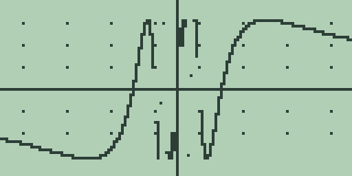
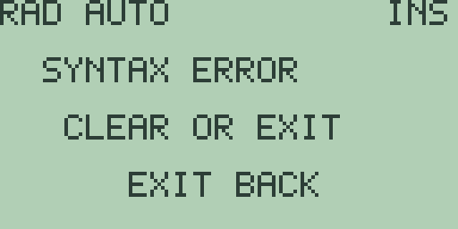
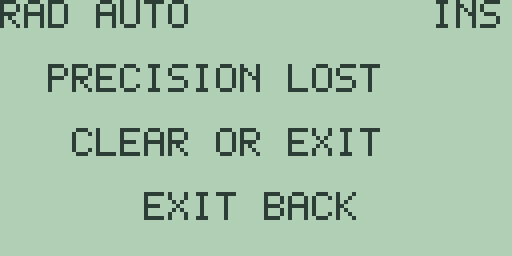
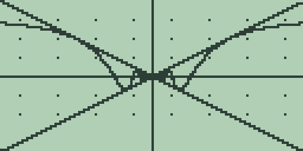
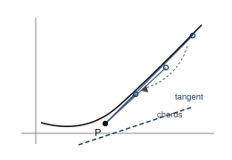
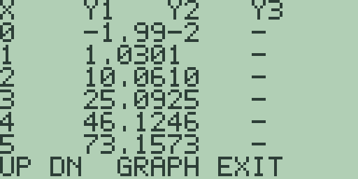
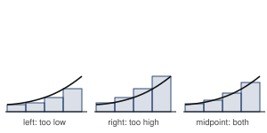
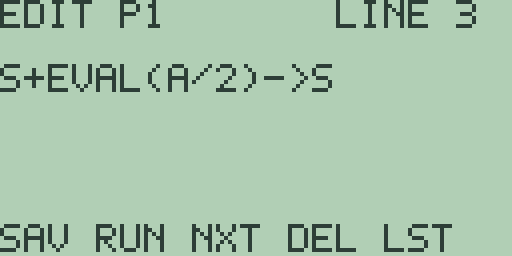

# Chapter 4: Explorations in Calculus I

Calculus asks what functions do at places you cannot reach: infinitely
close to a point, or added up across infinitely many slivers. A calculator
cannot reach those places either. What it can do is walk a very long way
towards them and report back, and this chapter is largely about learning to
read those reports properly, including the ones that are lying to you.

We probe limits with the table and the zoom keys, then meet a limit that
does not exist at all. We build a derivative out of raw difference
quotients before letting `NDER(` take over, and hunt turning points with
the search commands. We measure an integral as an average before measuring
it as an area, and program Riemann sums to watch one being assembled.

The calculus commands and the tolerance setting are the Guidebook, chapter
3; the analysis keys are the Guidebook, chapter 4.

One habit pays for itself all chapter. The calculus commands read the
*active stored equation*, so store the function with [GRAPH] before asking
them anything. With nothing stored, `EVAL(` and its family answer
`SYNTAX ERROR`. Once something is stored they answer whether or not you let
the plot finish drawing.

## 4.1 Limits by table and zoom

What is sin x divided by x, when x is nought?

Nothing. There is no answer. Nought over nought is not a number, and in a
few minutes the machine will tell you so in as many words.

That is not the interesting question though. The interesting one is what
the thing is *nearly*, when x is *nearly* nought. That does have an answer,
a perfectly definite one, and going and getting it is what a limit is.

I have not chosen this example to be clever. It is the one every calculus
course does, and for a good reason: it is the fact that makes the
derivative of sine come out as cosine. Get this one and you have paid for
most of the chapter in advance.

We will go at it four ways. Draw it, tabulate it, probe it, and then do
some paper. Three of those will point at the answer. Only the last one will
actually deliver it, and the difference between pointing and delivering is
most of what this section is about.

### Getting it into the machine

1. Press [CLEAR]. There is probably something left on the entry line from
   whatever you did last, and the machine will cheerfully add your new
   typing onto the end of it.

2. Press [SIN]. You get `SIN(`, bracket included. Then [x-VAR], [)], [÷],
   [x-VAR].

   Read the line before you go on. It should say `SIN(X)/X`. If it says
   `SIN((X)/X` you have pressed [(] out of habit after [SIN], which
   everybody does once. Press [CLEAR] and type it again.

3. Press [GRAPH]. That stores the line into `Y1` and draws it in the
   standard window, -10 to 10 both ways.

   Sine is slow work for this machine. Let the curve reach the right-hand
   edge before you touch anything, because presses that land mid-draw go
   nowhere and you will decide the key is broken.

   

### The graph, which is no help at all

Look at what you have got. A small bump over the origin, ripples either
side, the whole thing squashed into a band a few pixels high.

That is the window's doing. You have made room for heights from -10 to 10,
and this function never leaves the range -0.3 to 1, so nine tenths of the
screen is empty sky. It is section 1.1's complaint in its natural habitat.

Fix it and get closer.

4. Press [+] three times, waiting for each replot. Each press halves every
   bound, so you are now looking at -1.25 to 1.25 and the bump fills the
   screen.

5. Press [▶] twice. The readout says `X=0.0492125984252` and
   `Y=0.99959640223576`.

   

   So a twentieth of a unit right of the middle, the function is 0.9996.
   Encouraging.

Now find the hole.

You cannot. Zoom as long as you have patience for and the curve stays a
smooth unbroken arc, straight through the point that is not there.

Here is why, and it is worth having straight because it will come back at
you later in this book. The machine draws by choosing 128 columns across
the window and working out the height at each. Nought is not one of those
columns and no amount of zooming will make it one: halve the window and you
get 128 new columns, and nought is not one of those either. A missing point
one point wide is invisible to something that only ever looks in 128
places.

It is not lying to you. You asked about 128 columns and it answered about
128 columns. The question you wanted to ask was about somewhere it never
looks.

### The table, which is

The table asks at values you choose, nought included. So it can catch what
the plot cannot.

6. Press [2nd] [+] for the standard window, let it redraw, then [MORE] for
   the table.

   

   The `X=0` row says `UNDEF`. There it is. The machine has gone away, tried
   to divide nought by nought, failed, and come back and told you.

   Underneath: `0.841`, `0.454`, `0.047`, `-0.18`, `-0.19`. Those are the
   ripples, not the answer. By `X=1` we are down to 0.841 and falling.
   Whatever is going on near nought is going on much closer in than a step
   of 1 can see.

7. Press [-] four times. Each press halves the table step, so you go 1,
   0.5, 0.25, 0.125, 0.0625. Let each redraw settle before the next press.

   

   Read the rows below the hole *upwards*, towards it: 0.983, 0.989, 0.994,
   0.997, 0.999. And the `X=0` row still says `UNDEF`.

   That is the whole shape of it. Walk in towards nought and the values
   climb towards 1 without ever arriving, and at nought itself there is
   simply nothing at all.

8. Press [▲] to see the other side. From `X=-0.31` the rows read `0.983`,
   `0.989`, `0.994`, `0.997`, `0.999`, then `UNDEF`.

   The same five numbers in the same order, and that is not luck. Sine is
   odd, so sin(-x) over -x is the same thing as sin x over x. The function
   is a mirror image about the y axis with one point missing out of the
   middle, so both sides always had to climb to the same place.

### Squeezing better numbers out of it

The table gives you three decimal places, because that is all a
five-character cell will hold. The calculus commands will do better.

9. Press [EXIT] to leave the table, [EXIT] again for the home screen, and
   [CLEAR] to get rid of the equation the graph has just handed back to
   you.

10. Spell out `EVAL(.1)` (letters are [ALPHA] and then the key with that
    letter on it) and press [ENTER]. You get `0.99833416646834`.

11. Now smaller. Press [CLEAR] before each one:

    | Ask this | Get this |
    | --- | --- |
    | `EVAL(.01)` | `0.99998333341673` |
    | `EVAL(.001)` | `0.9999998333334` |
    | `EVAL(-.001)` | `0.9999998333334` |
    | `EVAL(.0001)` | `0.9999999983334` |

    Watch the nines. Two more of them every time x shrinks by a factor of
    ten. That is a rate, rates are worth noticing, and in a few minutes we
    will work out exactly where this one comes from.

    Notice too that `.001` and `-.001` agree in every last digit. That is
    step 8's mirror again, now stated to fourteen places.

12. Push it harder. `EVAL(1E-6)`, with the `E` typed as [EE], gives
    `0.9999999999999`. `EVAL(1E-9)` gives `1`, flat.

    Be careful with that last one. It does not mean the function equals 1 at
    a billionth.

    A number in this machine is fourteen significant digits. That is seven
    bytes of packed decimal, two digits to the byte, and it is all the room
    a number gets. At a billionth, sine of x and x agree in all fourteen of
    them, so the division comes out as exactly 1. Nothing has been
    discovered. The machine has simply run out of places to keep the
    difference.

    That is a fact about seven bytes, not a fact about sine. Confusing the
    two is the classic way to fool yourself with a calculator, and knowing
    the byte count does not make you immune. It just means that when a
    number looks too clean, you know which drawer to go and look in.

13. Now ask it the original question. Press [CLEAR], spell `EVAL(0)`, and
    press [ENTER]:

    

    `SYNTAX ERROR`, with `CLEAR OR EXIT` underneath.

    That message is wrong and it is my fault. There is nothing whatever
    wrong with the syntax of `EVAL(0)`. What has actually happened is that
    the evaluation failed at the point you asked about, and the calculus
    commands report every failure of that kind through the error the parser
    already had to hand. Laying it out again I would give it its own
    message, one that mentioned the point rather than your typing.

    So read it as "there is nothing there", because that is what it means,
    and it will go on meaning that every time a calculus command lands on a
    point where a function has no value.

    Press [CLEAR] to clear the notice. The entry line still holds `EVAL(0)`,
    so press [CLEAR] again to empty that too. Two presses of [CLEAR] after
    any error screen: the first kills the message, the second empties the
    line. Get into the habit early and you will save yourself a lot of
    puzzled retyping.

### Why it is 1, which none of that proved

Stop and take stock for a moment. Everything so far points at 1. Nothing so
far has proved 1.

That is not a quibble. A machine can try a hundred values, or a million; a
limit is a claim about all of them at once, and no amount of trying will
ever get you there. Pointing you at what to go and prove is what the
machine is genuinely good for. It cannot do the other job and it is
important not to let it pretend otherwise.

So here is the proof, and it is a nice one.

Draw a unit circle and take a small angle x at the centre. There are three
regions, each sitting inside the next: the triangle inside the sector, the
sector itself, and the larger triangle outside it.

Their areas are sin x over 2, then x over 2, then tan x over 2. Divide the
lot through by sin x over 2, turn the inequality upside down, and what is
left is that cos x sits below sin x over x, which sits below 1.

Now let x head for nought. Cosine heads for 1. The quotient is trapped
between a thing heading for 1 and 1 itself, so it has nowhere to go but 1.

That is the squeeze, and you can watch it close.

14. Press [CLEAR] and ask `COS(.1)`: `0.99500416527802`. Step 10 gave
    `0.99833416646834` at the same x. Sure enough, the quotient is sitting
    between them, in a gap five thousandths wide.

    Press [CLEAR] and ask `COS(.01)`: `0.99995000041666`, against the
    quotient's `0.99998333341673`. The gap is down to five
    hundred-thousandths. Push the walls together and whatever is between
    them has no say in the matter.

There is a second route, and it explains those nines from step 11.

Sine of x is x, take away x cubed over 6, plus smaller stuff. Divide by x
and sin x over x is 1, take away x squared over 6, plus smaller stuff
still. So the error ought to go like x squared over 6: shrink x by a factor
of ten and the error should shrink by a hundred, which is two more nines.
Which is exactly what you saw.

15. Test it. Press [CLEAR] and type `1-.1^2/6`: `0.9983333333334`, against
    the quotient's `0.99833416646834`. Agreement to six decimals. Press
    [CLEAR] and type `1-.01^2/6`: `0.9999833333334`, against
    `0.99998333341673`. Nine decimals.

    That one is worth carrying around in your head. For small x, sin x over
    x is 1 take away x squared over 6, and you can do it without a machine
    at all.

### The bit nobody tells you

The answer 1 is not really a fact about sine. It is a fact about sine
*measured in radians*, and I can show you that in about ten key presses.

16. Press [2nd] [MORE] for the mode screen, press [F1] once so the second
    line reads `ANGLE DEG`, and press [EXIT].

17. Press [CLEAR], type `SIN(X)/X` again, and press [GRAPH]. Let it draw.
    It comes out as a flat line lying on the axis, which is your first clue
    that something has changed underneath you.

18. Press [EXIT], press [CLEAR], and ask `EVAL(.1)`: `0.017453283658983`.
    Press [CLEAR] and ask `EVAL(.001)`: `0.017453292519057`.

    Still converging. Converging on something else entirely. Press [CLEAR]
    and type `PI/180`, with the `π` legend on [2nd] [^]:
    `0.017453292519943`. That is where the probes are heading, and by
    x = .001 they have got nine decimal places of the way there.

    It is the chain rule wearing a false moustache. A degree is π/180 of a
    radian, so working in degrees quietly multiplies every angle by π/180
    before the sine ever gets a look at it, and the limit gets multiplied by
    the same thing. Radians are simply the unit that makes the constant come
    out as 1. That is the real reason calculus insists on them, and it is a
    much better reason than "because the book says so".

19. Press [2nd] [MORE], press [F1] once to get back to `ANGLE RAD`, and
    press [EXIT].

    Do not skip that. I have left a machine sitting in `DEG` and then spent
    a quarter of an hour deciding the firmware was broken, when every
    trigonometric answer in the next section was simply being quietly
    scaled by π/180. It is a very cheap way to waste an afternoon.

**Try it.**

1. Try the same four ways on `(1-COS(X))/X`. Table first, then probes at
   .1, .01, .001. Where is it heading? Then do the same for
   `(1-COS(X))/X^2` and work out what dividing by the extra x changed.
2. Guess before you press anything: `SIN(2*X)/X`. The limit is not 1. Work
   out what it should be from the series in step 15, write your answer
   down, and then go and check it at .01 and .001. Being wrong here is
   useful, so write the guess down before you look.
3. In step 7 you halved the table step four times and got to 0.999. Halve
   it four more times and read the same row. How many nines does the cell
   give you now, and what is stopping it giving you more? (The answer is
   about the cell, not about the mathematics.)
4. `EVAL(1E-9)` came back as exactly 1 in step 12, and we said that was the
   machine running out of room. Find the largest power of ten at which the
   answer is still visibly short of 1. That number tells you something
   about the machine you are holding. What?
5. Turn it upside down: store `X/SIN(X)` and probe from both sides. Its
   limit has to be 1 as well, and you can say why in one line. Then try to
   run the squeeze argument of step 14 on it unchanged and see where it
   goes wrong. Fixing it is a two-line job once you spot the trouble.
6. Put the machine in `DEG` and redo exercise 2. Predict the answer before
   you press a key, using what step 18 showed you. Then set it back to
   `RAD`, because you will want it there for section 4.2.

## 4.2 A limit that is not there

Section 4.1 could have left you with a comfortable and wrong idea: that if
you probe hard enough, a number turns up. It does not always. Some
functions have no limit at all at a point, and the useful skill is telling
which kind you are looking at.

The specimen is sin of one over x. As x heads for nought, one over x runs
away to infinity, so the sine is asked for its value at angles that get
larger and larger without stopping, and it goes on doing what sine does:
up, down, up, down, faster and faster. It never settles anywhere, because
there is nowhere for it to settle.

Then we will change one thing, multiply the whole lot by x, and watch a
limit appear out of the same oscillation.

### Watching it fail to settle

1. Press [CLEAR], then [SIN], [1], [÷], [x-VAR], [)]. The line reads
   `SIN(1/X)`. Press [GRAPH] and let it finish, which takes a while.

   

   Away from the origin it is calm enough. It is the middle that matters.

2. Press [+] three times, letting each replot finish.

   

   Now compare that with section 4.1. There, zooming in made the picture
   *calmer* every time, until the curve was nearly a straight line. Here
   zooming in makes it worse. The wiggles do not spread out as you
   magnify, they crowd together, because there are infinitely many of them
   packed into any interval you care to draw round nought.

   Those vertical strokes near the middle are the plotter losing the race.
   It has one column to spend on a stretch of x that contains several
   complete waves, so it joins two samples that happen to be far apart and
   draws a near-vertical line between them. The picture is not wrong, it is
   just badly outnumbered.

3. Probe it and the numbers say the same thing. Press [EXIT], press
   [CLEAR], and ask `EVAL(` at a few points, [CLEAR] before each:

   | Ask this | Get this |
   | --- | --- |
   | `EVAL(.1)` | `-0.544021085826` |
   | `EVAL(.05)` | `0.91294525072816` |
   | `EVAL(.02)` | `-0.26237485369997` |
   | `EVAL(.01)` | `-0.50636564109442` |
   | `EVAL(.005)` | `-0.87329729713503` |
   | `EVAL(.003)` | `0.31884634470865` |

   Put those beside section 4.1's column of nines. There, every probe was
   closer to the answer than the one before it. Here they are all over the
   place, and getting closer to nought does not help at all. Down, up,
   down, down, down, up. That is what no limit looks like when you meet one
   in the wild.

### Where the machine gives up, and why

4. Keep going. Press [CLEAR] and ask `EVAL(.0025)`:

   

   `-0.85091935964129`. One over .0025 is 400, and the machine takes the
   sine of 400 radians without hesitating.

   Keep pushing and it keeps answering. `EVAL(1E-6)` asks for the sine of
   a million radians and gets `-0.3499934460541`. That is the edge of the
   guarantee: `SIN` and `COS` are supported through one million radians,
   or one hundred million degrees, and across that range they are held to
   about 1E-7.

   Go past it and the machine stops, but not with a shrug. Press [CLEAR]
   and ask `EVAL(9E-7)`, which wants the sine of about 1.11 million:

   

   `PRECISION LOST`, and that name is the whole point. It is not saying
   the sine has no value there. It is saying that your input carries
   fourteen digits, and by the time an angle that large has been folded
   back into a single turn, those fourteen digits no longer pin down where
   in the turn you are. The answer would be a number, and it would be
   meaningless, and the machine would rather tell you than let you quote
   it.

   Being told is worth more than being answered. A calculator that
   returned something here would be inviting you to publish it.

   > **Historical note.** Firmware 2.10 reduced the angle by taking 2π off
   > repeatedly and gave up after 63 goes, which put the wall at 395.84
   > radians, so `SIN(399)` refused. Reducing by quotient instead of by
   > repeated subtraction moved the wall out by a factor of two and a half
   > thousand. If you are reading an older edition of this book, that is
   > why its numbers stop where they do.

   So the limit is real but it is now a long way out: this machine follows
   sin of one over x down to about x = 1E-6, and no further. What that
   does not mean is that you have learned nothing. You have watched the
   function refuse to settle across six orders of magnitude in x, and the
   mathematics tells you it goes on refusing forever, at a rate no
   calculator was ever going to keep up with.

### The same oscillation with a limit

5. Now change one thing. Press [CLEAR], type [x-VAR], [×], [SIN], [1], [÷],
   [x-VAR], [)] so the line reads `X*SIN(1/X)`, and press [GRAPH]. Let it
   draw.

   The sine is still doing exactly what it did before, swinging between -1
   and 1 infinitely often. But now it is being multiplied by x, and x is on
   its way to nought.

6. Put the walls up so you can see it. Press [2nd] [2] to move to slot
   `Y2`, type [x-VAR], and press [GRAPH]. Press [2nd] [3] for slot `Y3`,
   type [(-)], [x-VAR], and press [GRAPH]. That gives you the lines y = x
   and y = -x on top of the curve.

7. Press [+] three times, letting each replot finish.

   

   There is the whole argument in one picture. The two straight lines close
   on the origin like a pair of scissors, and the curve is trapped between
   them, oscillating as wildly as ever inside a gap that is being squeezed
   shut. It has no room left to oscillate in.

   This is the squeeze of section 4.1 again, and this time you are not
   taking it on trust from a diagram. It is on the screen, and the three
   slots are exactly the right number of slots to show it: the thing, and
   the two walls closing on it.

8. The probes agree. [CLEAR] before each:

   | Ask this | Get this |
   | --- | --- |
   | `EVAL(.1)` | `-0.0544021085826` |
   | `EVAL(.05)` | `0.045647262536408` |
   | `EVAL(.02)` | `-0.0052474970739994` |
   | `EVAL(.01)` | `-0.0050636564109442` |
   | `EVAL(.005)` | `-0.0043664864856752` |
   | `EVAL(.003)` | `0.00095653903412595` |

   Still bouncing between positive and negative, exactly as before, because
   the sine has not changed its mind about anything. But the size is
   collapsing: five hundredths, then five thousandths, then one thousandth.
   The sign is still random and the magnitude is not. The limit is 0.

   Compare the two tables directly. Same function inside, same oscillation,
   same refusal to settle on a sign. One has no limit and the other has a
   perfectly good one, and the entire difference is the x out in front.

### A test you can actually apply

There is a way to make "settles down" precise, and the graph screen is
unusually well suited to it, because the thing you need is a rectangle and
a window *is* a rectangle.

Say you claim a function heads for L as x heads for a. Someone who doubts
you names a tolerance: they will believe it if the curve stays within that
much of L. Your job is to find a window narrow enough that the curve does
not leave the top or bottom of the screen anywhere inside it, apart from at
a itself.

If you can always do that, however mean the tolerance, the limit is L. If
there is a tolerance you cannot beat by any narrowing at all, there is no
limit.

That is the whole of the epsilon-delta definition, in a form you can carry
out with the zoom keys.

Try it on both of this section's functions and the difference is immediate.
For `X*SIN(1/X)` every squeeze you try succeeds. For `SIN(1/X)` you cannot
even get started, because the curve fills the band from -1 to 1 no matter
how narrow you make the window.

**Try it.**

1. Before pressing anything, write down what you expect the plot of
   `SIN(1/X)` to do far from the origin, out at x = 5 or 10. Then look.
   Why is it so calm out there when it is so violent near nought?
2. Work out on paper the x at which sin of one over x is exactly 1 for the
   first time going left from x = 1, then the next one, then the next. How
   fast are they bunching up? Check one of them with `EVAL(`.
3. `X*SIN(1/X)` is squeezed by `X` and `-X`. Predict what walls would
   squeeze `X^2*SIN(1/X)`, put all three in the slots, and check that the
   picture looks the way you said it would.
4. What about `SIN(1/X)/X`? Predict first: does it settle, blow up, or
   oscillate worse? Then probe it at .1, .05 and .02 and see.
5. `SIN` and `COS` are supported to one million radians. Work out the
   smallest x at which you could still ask for `SIN(1/X)`, then find the
   place the machine actually stops and explain why the two do not have to
   agree to the last digit.
6. Run the rectangle test of the last part properly on `X*SIN(1/X)`. Start
   from the standard window, pick a tolerance, and count how many presses
   of [+] it takes to satisfy it. Then halve the tolerance and do it again.
   Is the number of presses growing in a way you could have predicted?

## 4.3 The derivative as a limit

The slope of a curve at a point is the limit of the slopes of chords
through it. Unlike most limits, this one can be watched converging digit by
digit, which is what makes it a good second exploration.

The function is f(x) = x^3 - 2x, and we will work at x = 1.5. On paper the
derivative is 3x squared take away 2, so at 1.5 it is 4.75. Knowing the
answer in advance is deliberate. It is much easier to see what a method is
doing when you can tell how wrong it is at every stage.

### Chords closing on a tangent

Take two points on the curve, join them, and measure the slope of the join.
That is a chord, and its slope is the change in height divided by the
change in x. Now slide the second point towards the first. The chord pivots
and, if the curve is well behaved, settles onto a definite direction.

That settling is the whole idea. The tangent is not something you can
measure directly, because it touches at only one point and one point does
not give you a slope. What you can measure is chords, and then argue about
where they are going.

1. Store the function. Press [CLEAR], then [x-VAR], [^], [3], [-], [2],
   [×], [x-VAR] so the line reads `X^3-2*X`, press [GRAPH], and let the
   plot finish.

2. Take the slope off the graph first, because it is one key. Press [▶]
   nine times, which lands the trace at `X=1.496062992126` with
   `Y=0.3563689017143`. Press [F4], the derivative key: the home screen
   publishes `= 4.714613425`.

   That is not 4.75, and the reason is not the method. The trace stopped at
   the nearest sample column, which is 1.496 rather than 1.5, and the slope
   there really is a shade under. The machine answered the question you
   actually asked.

3. Now do it by hand, so you can see the limit happening. The [F4] result
   left `X^3-2*X` on the entry line, so press [CLEAR]. Spell
   `(EVAL(1.5+1)-EVAL(1.5))/1` and press [ENTER]: `= 10.25`.

   That is the chord from 1.5 all the way out to 2.5. Far too steep, and it
   should be: the curve bends upwards, so a long chord overshoots.

4. Shrink the step, pressing [CLEAR] before each:

   | Step | Chord slope |
   | --- | --- |
   | 1 | `10.25` |
   | .1 | `5.21` |
   | .01 | `4.7951` |
   | .001 | `4.754501` |

   Each tenfold shrink buys roughly one more correct digit of 4.75. Compare
   section 4.1, where each tenfold shrink bought two, and you can already
   tell these are different kinds of approximation. There the error went
   like x squared; here it goes like the step itself.

### Where shrinking stops helping

5. Push further. With the step `1E-6`, typed with [EE], the quotient
   `(EVAL(1.5+1E-6)-EVAL(1.5))/1E-6` answers `= 4.7500045`. With `1E-9` it
   answers `= 4.75` exactly. With `1E-12` it answers `= 4.8`.

   Read those last two carefully, because the tidy one is the liar.

   Section 4.1 said a number here is fourteen digits in seven bytes. As the
   step shrinks, f(1.5 + h) and f(1.5) come to agree in more and more of
   those fourteen, and the subtraction throws away every digit they share.
   At a step of 1E-9 you are subtracting two numbers that agree in nine
   digits, so about five survive, and those five happen to round to 4.75. At
   1E-12 barely one survives and the answer staggers out as 4.8.

   So the clean 4.75 at 1E-9 was luck, not precision. Shrinking the step
   sharpens a chord only until cancellation blunts it, and then it makes
   things rapidly worse. There is a best step somewhere in the middle, and
   on this machine it is around 1E-6.

   This is not a defect you can fix by buying a better calculator. Every
   machine that keeps a fixed number of digits has this cliff. It moves; it
   does not go away.

6. The built-in command threads that needle for you. Press [CLEAR], spell
   `NDER(1.5)`, and press [ENTER]:

   

   `= 4.75`. `NDER(` takes a central difference, sampling on both sides of
   the point and dividing by twice the step, which cancels the largest
   error term of the one-sided chords you have been computing. The
   Guidebook, chapter 3 documents the family.

   Press [CLEAR] and check against paper with `3*1.5^2-2`: `= 4.75`.

### The derivative is a function

Everything so far has produced one number, the slope at one place. But
every point of the curve has a slope, so the slopes are themselves a
function of x, and that function is the thing calculus actually cares
about.

You can plot it directly, and there is one wrong way to ask that is worth
meeting first.

7. With `X^3-2*X` still in `Y1`, press [2nd] [2] for slot `Y2`, spell
   `NDER(X)`, and press [GRAPH].

   `Y2` stops with `RECURSION ERROR`, and `Y1` carries on drawing.

   `NDER(x)` in that form reads *the active stored equation*, so a slot
   holding it is asking the machine to differentiate the equation it is in
   the middle of evaluating. Rather than chase its own tail it says so, and
   says so once rather than at every sample.

   Name the slot you actually mean and it is ordinary work. Press [CLEAR],
   spell `NDER(1,X)`, and press [GRAPH]: slot 2 now reads slot 1, and the
   derivative draws as a curve in its own right. One nested evaluation is
   available, which is enough for a slot to read another slot but not
   enough for the two of them to read each other; a pair that does stops
   with the same `RECURSION ERROR`.

8. It is still worth typing the quotient out in full. It is longer but it has no
   such problem, because it mentions no commands at all. Press [2nd] [1],
   press [CLEAR], and type

   `((X+.01)^3-2*(X+.01)-(X^3-2*X))/.01`

   which is the chord slope of step 4, at step .01, but with the point left
   as `X` instead of pinned at 1.5. Press [GRAPH] and let it draw.

9. Now put the true answer beside it. Press [2nd] [2], press [CLEAR], type
   `3*X^2-2`, and press [GRAPH]. Press [MORE] for the table:

   

   Reading `Y1` against `Y2` down the rows: `-1.99` against `-2`, `1.030`
   against `1`, `10.06` against `10`, `25.09` against `25`, `46.12` against
   `46`, `73.15` against `73`.

   The quotient is above the truth everywhere, by a little at the left and
   by more at the right, and the gap is growing. That is the chord
   overshooting a curve that bends upwards, which you already met at step 3
   as a single number. Now you can see it happening at every x at once.

10. Shrink the step and watch the columns close. Press [EXIT], press
    [2nd] [1], press [CLEAR], and retype the slot with `.001` in place of
    both `.01`s. Press [GRAPH], then [MORE]. The columns now agree to the
    precision the cells will show.

    That is the limit again, and this time it is a limit of *functions*.
    The difference quotient is not creeping up on a number, it is creeping
    up on a whole curve.

**Try it.**

1. Predict, before pressing a key, what the difference quotient of
   `X^2` will look like beside `2*X`. Will it sit above or below? By how
   much, and does the gap grow? Write it down, then build both slots and
   find out.
2. Run the shrinking chords of step 4 at a = 0 instead of 1.5, where f(0)
   is 0 and the typing is short. What slope do they head for, and does
   `NDER(0)` agree? (It answers `-1.9999999999`, which is worth a moment's
   thought on its own.)
3. The backward chord `(EVAL(1.5)-EVAL(1.5-.01))/.01` comes at the point
   from the other side. Compute it, compare with the forward .01 answer,
   and say which side of 4.75 each lands on and why. Then average the two
   and see what you get.
4. Ask `NDER(` at 0, 1 and 2 and check each against 3x squared take away 2.
   The answers are `-1.9999999999`, `1` and `10`. Why is only the first one
   dusty?
5. Find your own worst step. Compute the chord at 1.5 with steps 1E-4,
   1E-5, 1E-6, 1E-7 and 1E-8 and find which is closest to 4.75. That is the
   best this machine can do with a one-sided chord, and now you know the
   number.

## 4.4 Extrema by search

Where a smooth curve turns, its slope passes through zero. Finding the
turning points is the first genuinely useful thing calculus sells, and the
machine has four different ways to do it, which disagree in the last few
digits for reasons worth understanding.

The specimen is built to be checkable: f(x) = x^3/3 - 4x, whose derivative
x squared take away 4 vanishes at -2 and at 2. On paper the hill is at -2
with height 16/3, the valley at 2 with height -16/3.

1. Press [CLEAR], type [x-VAR], [^], [3], [÷], [3], [-], [4], [×], [x-VAR]
   so the line reads `X^3/3-4*X`, press [GRAPH], and let the plot finish.

   

2. Press [F3], the maximum search. It sweeps the window and takes a few
   seconds, so let it work. It publishes `= -1.9997326856359`.

   Two things about that. First, it is the *location* of the maximum, not
   its value; the searches tell you where, and `EVAL(` tells you what.
   Second, it is not -2. It is -2 to about three decimal places and then it
   drifts.

   That drift is not a mistake. These searches close a bracket around the
   turning point and stop when the bracket is tight enough, not when the
   digits are exact.

   Near a smooth maximum the curve is almost flat, so an enormous range of
   x values all look equally like the top. Being flat is what makes a
   maximum a maximum, and it is exactly what makes it hard to locate
   precisely. Expect three or four good digits from these keys and do not
   go hunting for more.

3. The result screen left `X^3/3-4*X` on the entry line, so pressing
   [GRAPH] stores it back unchanged and replots.

   Mind that rule, because it bites. [GRAPH] always stores the entry line
   into the active slot, and storing an *empty* line clears the slot. Go
   back to the graph with the equation on the line, never from a blank one.

   Press [F2], the minimum search, and let it settle: `= 1.9997326856359`.
   The valley mirrors the hill, digit for digit, as the symmetry of the
   function demands.

4. The home-screen commands take typed bounds instead of the window, which
   means you choose the search interval rather than inheriting it. Press
   [CLEAR], spell `FMIN(0,4)`, press [ENTER], and let it work:
   `= 1.9998801765763`. Press [CLEAR] and ask `FMAX(-4,0)`, using [(-)] for
   the sign: `= -1.9998801765763`.

   The same turning points, and different last digits from step 2's. A
   different interval means a different sequence of brackets and a
   different place to stop. Neither answer is more correct than the other;
   both are about as correct as this kind of search gets.

5. Values come from `EVAL(` at the locations, or at the exact ones when you
   know them. Press [CLEAR] and ask `EVAL(2)`: `= -5.3333333333333`. Press
   [CLEAR] and ask `EVAL(-2)`: `= 5.3333333333333`. Those are the
   fourteen-digit faces of -16/3 and 16/3.

6. One piece of small print, because it will save you a wasted experiment.
   Press [2nd] [CLEAR], the `TOLER` key: a `TOLERANCE CHANGED` notice
   confirms a cycle from `1E-6` to `1E-8`, and [CLEAR] dismisses it. Two
   more presses bring it back to `1E-6`.

   The root hunts of this chapter test their residuals against that
   setting. The extremum searches do not consult it at all: run step 2
   again at any tolerance and the digits do not move. So tightening
   `TOLER` to sharpen a maximum is effort spent on nothing, and now you
   know before you spend it.

**Try it.**

1. Before pressing anything, say where the two minima of `X^2*(X^2-4)/4`
   must be, using nothing but the symmetry of the formula. Then find them
   with `FMIN(` and suitable bounds and see how close you were.
2. On this section's cubic, ask `FMAX(0,4)`. There is no turning maximum
   inside those bounds. Predict what the search will report before you run
   it, then run it, then compare `EVAL(` at the answer with `EVAL(-2)`.
3. Find the cubic's maximum from the graph screen after two presses of [+],
   and compare the digits with step 2's whole-window answer. Which window
   came closer to -2, and can you say why before you look?
4. Step 2 said a maximum is hard to locate precisely because the curve is
   flat there. Test that: compute `EVAL(-2)` and `EVAL(-1.99)` and see how
   little the height changes for a hundredth of movement in x. Now do the
   same either side of x = 0, where the curve is steep.

## 4.5 The definite integral as an average

Most books introduce the integral as an area. This one does it as an
average, and then shows you the area afterwards, because the average is the
idea that survives contact with reality and the area is the one that needs
apologising for.

Here is the question. A quantity varies over an interval. What is its
average value?

If it takes only a few values you add them up and divide. If it varies
continuously there is nothing to count, and you need a different move: add
up the whole of it, then divide by the width of the interval you added it
over. Adding up the whole of a continuously varying quantity is exactly
what the integral does, so the average is the integral divided by the
width. That is the definition and there is nothing more to it.

### A day's temperature

A harbour weather logger records a day that runs from 8 degrees at midnight
to 20 at noon and back down. Modelled for this chapter as
`14-6*COS(PI*X/12)`, with `X` in hours from midnight.

1. Press [CLEAR], type it ([COS] supplies `COS(`, and the `π` legend on
   [2nd] [^] types `PI`), press [GRAPH], and let the plot finish.

   The standard window shows you almost nothing: only the cold arc around
   midnight fits, and most of the day sits above `YMAX`. That does not
   matter here, because everything that follows reads the stored equation
   rather than the picture. It is worth noticing all the same, because it
   is easy to assume a command is looking at what you are looking at.

2. Check the model does what it claims before you trust it with anything.
   Press [EXIT], press [CLEAR], and ask `EVAL(0)`: `= 8`. Press [CLEAR] and
   ask `EVAL(12)`: `= 20.000025006855`.

   Midnight is 8 and noon is 20, near enough. That trailing dust is the
   machine's fourteen-digit `PI` and not the weather. You will see it in
   every answer in this section, and once you know what it is you can stop
   looking at it.

3. Now guess. Before you press another key, write down what you think the
   day's average temperature is. It is worth doing properly, because the
   answer is prettier if you have committed to something first.

4. Press [CLEAR] and ask `FNINT(0,24)`: `= 336.000035432`.

   That is degree-hours, which is not a unit anybody wants. Press [CLEAR]
   and divide it by the width of the day, `FNINT(0,24)/24`:
   `= 14.000001476333`.

   Fourteen degrees, exactly halfway between the 8 at midnight and the 20
   at noon.

   If that is what you guessed, you guessed it because the cosine spends as
   much time above its centre line as below it, so over a whole period the
   two cancel exactly. The `.000001476` on the end is `PI` again.

5. Two things worth checking, since they cost one key each.

   Press [CLEAR] and ask `FNINT(0,12)/12`: `= 14.000001475932`. Press
   [CLEAR] and ask `FNINT(12,24)/12`: `= 14.000001475926`.

   The morning averages 14 and the afternoon averages 14, which is not
   obvious and is a consequence of the symmetry rather than of the
   arithmetic.

6. And one that is genuinely surprising the first time. Press [CLEAR] and
   ask `EVAL(6)`: `= 14.00000000039`.

   At six in the morning the temperature *is* the day's average. Not near
   it, not roughly it: the curve actually passes through its own mean
   value, and it does so twice, at 6am and again at 6pm.

   That is not a coincidence about cosines. A continuous quantity that
   spends part of its time above its average and part below it has to cross
   the average on the way, and it is the whole content of the mean value
   theorem for integrals. Your model just handed it to you.

### And now the area

The average is the honest idea. The area is the one everybody teaches
first, and it comes with a wrinkle.

If you multiply the average back by the width you recover the integral, and
if you draw a rectangle of that height across that width, it has the same
area as the region under the curve. So the integral *is* an area. It is the
area of the rectangle that would do the same job as the curve.

The wrinkle arrives the moment the curve goes below the axis.

7. The specimen dips on purpose: g(x) = x^2 - 2x - 3 factors as
   (x - 3)(x + 1), so it is negative between -1 and 3 and positive outside.

   Press [CLEAR], type [x-VAR], [x²], [-], [2], [×], [x-VAR], [-], [3] so
   the line reads `X^2-2*X-3`, press [GRAPH], and let it finish:

   

8. Press [F5], the integral key, and let it work: `= 606.66666666667`. The
   window is the interval, so that is the integral from -10 to 10, and on
   paper it is 1820/3.

9. Typed bounds are the home command's job. Press [CLEAR] and spell
   `FNINT(-1,3)`: `= -10.666666666667`.

   The dip between the zeros encloses an area of 32/3, and the integral
   reports it *negative*. Below the axis, the count subtracts.

10. Press [CLEAR] and ask `FNINT(3,5)`: `= 10.666666666667`. By a designed
    coincidence, the hump from 3 to 5 encloses exactly as much above the
    axis as the dip does below.

11. So the whole run should cancel. Press [CLEAR] and ask `FNINT(-1,5)`:
    `= 0`, exactly.

    An integral of zero does not mean nothing happened. It means the ups and
    the downs balanced, which is an entirely sensible thing for an average
    to say and a slightly mad thing for an area to say. This is why the
    average is the better story: the average of that stretch really is zero,
    while "the area is zero" needs the word *signed* smuggled in front of it
    to be true at all.

    When the question is how much area regardless of side, integrate the
    pieces separately and add their sizes.

**Try it.**

1. An island town's temperature swings just 3 degrees either side of 17.
   Write the model in the pattern of step 1, predict its 24-hour average
   before you press a key, and then confirm it with `FNINT(`.
2. Find the two times of day at which the harbour model reaches its own
   average, by hand from the formula rather than by searching. Then check
   both with `EVAL(`.
3. Check the splitting rule on the parabola: compute `FNINT(-1,1)` and
   `FNINT(1,3)` and confirm they add up to step 9's answer for the whole
   dip.
4. Work out the -5 to 5 integral of the parabola on paper. Then press [+]
   once on the plot and use [F5] on the halved window, and compare.
5. What is the average value of `X^2-2*X-3` over -1 to 3? Compute it from
   step 9, then find where the curve takes that value, and check that your
   answer sits inside the interval as the mean value theorem promises.

## 4.6 Riemann sums by program

`FNINT(` answers in a second and tells you nothing about how. A Riemann sum
is the how: cut the interval into slices, guess each slice's area from one
sample of the height, add up the guesses. Watching those sums close in on
the integral is the best argument there is for why a limit of sums deserves
to be called an integral at all.

The function is f(x) = x^2 + 1 on the interval 0 to 2, whose integral is
14/3.

1. Store the equation first, because every program below reads it. Press
   [CLEAR], type [x-VAR], [x²], [+], [1] so the line reads `X^2+1`, press
   [GRAPH], let the plot finish, press [EXIT], and press [CLEAR].

   Then get the target: spell `FNINT(0,2)` and press [ENTER]:
   `= 4.6666666666667`, the fourteen-digit face of 14/3.

### The left sum

With four slices the width is 2/4 = 0.5, and the left edges are at 0, 0.5,
1 and 1.5. That is `A/2` for `A` counting from 0 to 3.

2. Press [PRGM], then [F1], `NEW`. The editor opens on `EDIT P1`. Type
   these six lines, pressing [ENTER] after each. Letters are [ALPHA] plus
   the key carrying the letter, a space is [2nd] [0] in this editor, and
   [STO▶] types the `->` arrow.

   | Line | Text | Keys |
   | --- | --- | --- |
   | 1 | `0->S` | [0] [STO▶] [S] |
   | 2 | `FOR A,0,3` | [F] [O] [R] [2nd] [0] [A] [,] [0] [,] [3] |
   | 3 | `S+EVAL(A/2)->S` | [S] [+] [E] [V] [A] [L] [(] [A] [÷] [2] [)] [STO▶] [S] |
   | 4 | `END` | [E] [N] [D] |
   | 5 | `DISP S/2` | [D] [I] [S] [P] [2nd] [0] [S] [÷] [2] |
   | 6 | `STOP` | [S] [T] [O] [P] |

   One thing about the editor that nobody warns you about: it shows you a
   single line at a time. There is no listing on screen, no scrolling view
   of the program, just the line you are standing on and its number in the
   corner. Press [▲] four times when you have finished typing and you land
   back on line 3:

   

   That is worth knowing before you start, because it means you cannot see
   your program. You have to hold it in your head or on paper, and check it
   by walking [▲] and [▼] through the lines one at a time. With eight lines
   that is livable. It is also why the listings in this book are printed as
   tables: the table is the view the machine will not give you.

   Line 3 is the workhorse. `EVAL(` reads whichever equation is stored, so
   the program never contains the function and will happily measure any
   equation you store later. Line 5 multiplies the tally of heights by the
   slice width: four heights halved are four half-width slices.

3. Press [F2], `RUN`. The run screen answers `RUN P1` over `LINE 6`, the
   output line shows `3.75`, and the status reads `DONE`.

   Well under 4.6667, and it had to be. This function rises across the whole
   interval, so taking each slice's height from its left edge takes the
   lowest height in the slice every time.

### The right sum, and a relation you can check exactly

4. The right sum samples 0.5, 1, 1.5 and 2 instead, which is the same
   program counting `A` from 1 to 4. Press [PRGM] for the list, press [▼]
   to select the second slot, and press [F1] to open `EDIT P2`. Type the
   same six lines with line 2 as `FOR A,1,4`.

   Press [F2]: `5.75`.

   So the true answer is now bracketed. Somewhere between 3.75 and 5.75,
   and we already know it is 4.6667.

5. Here is something better than a bracket. Press [PRGM], press [EXIT] for
   the home screen, press [CLEAR], and type `5.75-3.75`: `= 2`.

   That 2 is not luck and you can predict it without running anything. Going
   from left sampling to right sampling swaps one height in and one height
   out: you lose f at the left end of the interval and gain f at the right
   end, each weighted by one slice width. So the difference is exactly
   (f(2) - f(0)) times the slice width, which is (5 - 1) times 0.5, which is
   2.

   That relation holds for any rising function and any number of slices, and
   it tells you something useful: double the slices and the gap between the
   two sums halves, because the slice width halves. Both sums are therefore
   converging, and doing so at the same unhurried rate.

### Midpoint, and why it is so much better

6. The midpoint sum samples the slice centres 0.25, 0.75, 1.25 and 1.75,
   which is `(2*A-1)/4` for `A` from 1 to 4. Press [PRGM], press [▼], press
   [F1] for `EDIT P3`, and type the variant with line 2 as `FOR A,1,4` and
   line 3 as `S+EVAL((2*A-1)/4)->S`.

   Press [F2]: `4.625`. Inside the bracket, and only 1/24 short.

7. Double the slicing. Press [PRGM], press [▼], press [F1] for `EDIT P4`,
   and type the eight-slice midpoint sum: line 2 becomes `FOR A,1,8`, line 3
   becomes `S+EVAL((2*A-1)/8)->S`, and line 5 becomes `DISP S/4`.

   Press [F2]:

   

   `4.65625`.

   Put the errors side by side. Press [PRGM], [EXIT], [CLEAR], and compute
   each against the target, [CLEAR] between them:

   | Estimate | Value | Error |
   | --- | --- | --- |
   | left, 4 slices | `3.75` | `-0.9166666666667` |
   | right, 4 slices | `5.75` | `1.0833333333333` |
   | midpoint, 4 slices | `4.625` | `-0.0416666666667` |
   | midpoint, 8 slices | `4.65625` | `-0.0104166666667` |

   The midpoint error fell from 1/24 to 1/96 when the slice count doubled.
   Quartered, where the left and right sums only halve. That is the
   midpoint rule's signature and the reason nobody uses left sums for
   anything except explaining what a Riemann sum is.

### Two estimates for free

You now have four numbers on paper and no more programs to write. Two more
rules fall straight out of them.

8. The trapezoid rule joins the tops of the slices with straight lines
   instead of flat ones, and it turns out to be exactly the average of the
   left and right sums. Press [CLEAR] and type `(3.75+5.75)/2`: `= 4.75`.

   Out by 1/12, which is twice the midpoint's error and on the other side.
   That is worth pausing on: the trapezoid, which looks like the more
   sophisticated idea, is beaten by the midpoint rule, which looks like the
   cruder one. A trapezoid cuts the corner of a curve that bends upwards
   and so overshoots; a midpoint rectangle is too low on one half of its
   slice and too high on the other, and the two errors very nearly cancel.

9. Simpson's rule takes that seriously. If the trapezoid is wrong one way
   by twice as much as the midpoint is wrong the other way, then two parts
   midpoint to one part trapezoid should cancel both. Press [CLEAR] and
   type `(2*4.625+4.75)/3`:

   `= 4.6666666666667`.

   Which is 14/3, to every digit the machine has. Press [CLEAR] and type
   `14/3` to confirm: `= 4.6666666666667`.

   Not close. Exact. Simpson's rule fits a parabola through each set of
   three points, and this function *is* a parabola, so there is nothing left
   to be wrong about. Four slices of a method you assembled on the home
   screen out of two crude sums have beaten `FNINT(`'s sixty-four panels.

   Do not over-learn that. Simpson is exact on quadratics and cubics and
   merely very good on everything else. But it does show what these
   estimates are for: not one of them is the answer, and combining them
   cleverly is worth more than computing any one of them harder.

The environment shaped the design here and it is worth saying how. When
this chapter was written `FOR` bounds were single digits, so a counted loop
passed at most ten times, which is why the finer slicings in Chapter 3 hand
the count to a `WHILE` countdown instead. Firmware 2.19 gave `FOR`
evaluated bounds and an optional step, so that particular wall is gone; the
countdown shape is kept here because it is still a good way to see a loop's
state, not because anything forces it. Four program slots held all four sums, and `EVAL(` kept
every one of them ignorant of which function it was measuring.

**Try it.**

1. Predict, before running anything, the left sum with eight slices. You
   know the four-slice answer and you know from step 5 how the left and
   right sums move. Write your number down, then edit `P1` to eight slices
   (count 0 to 7, sample `A/4`, display `S/4`) and see.
2. Check step 5's relation on the eight-slice sums: run left and right at
   eight slices and confirm their difference is exactly (f(2) - f(0)) times
   the new slice width.
3. Store a different equation, plot it through, and rerun `P4` without
   editing a single program line. Check its answer against `FNINT(` with the
   matching bounds. What did you have to be careful about?
4. Build Simpson from the eight-slice numbers instead of the four-slice
   ones and see whether it is still exact. Then try the whole thing on
   `X^3+1`, which is a cubic, and then on `1/X` from 1 to 2, which is
   neither. Where does exactness stop?
5. The midpoint rule quarters its error per doubling and the trapezoid
   halves. Work out how many midpoint slices you would need to match
   `FNINT(`'s answer to six decimals, and say whether the eight-line slot
   could ever run it.

## 4.7 Areas between curves

Two curves enclose a region. How much is in it?

The gap between them at each x is the difference of their heights, so the
enclosed area is the integral of the difference function taken between the
crossing points. Every tool this chapter has built gets a turn, and the
order matters: plot the pair, find the crossings, store the difference,
integrate it.

The designed pair is an arch and a line, y = 2 - x^2/2 and y = x/2 + 1,
which cross where x^2 + x - 2 = 0, at x = -2 and at x = 1.

1. Press [CLEAR], type [2], [-], [x-VAR], [x²], [÷], [2] so the line reads
   `2-X^2/2`, and press [GRAPH]. When the plot finishes, press [2nd] [2] to
   move to slot `Y2`, type [x-VAR], [÷], [2], [+], [1], and press [GRAPH]:

   

2. Press [2nd] [F1], the intersection search, and let it settle:
   `= -1.9999999999999` with the residual line `R=1E-13`.

   That is the left crossing. The search scans the window from its left
   edge, so it reports the leftmost intersection it finds and then stops.
   There is a second crossing on the screen and it will not go looking for
   it.

3. So make the window exclude the first one. The entry line now holds
   `X/2+1`, the active slot's text, so press [GRAPH] to return to the plot.
   Press [+] three times, letting each replot finish, which narrows the view
   to -1.25 to 1.25. Press [2nd] [F1] again: `= 1` with `R=0`.

   The right crossing, exactly. Zooming was not cosmetic here: it was how
   you told the search which root you wanted. The window is an argument you
   pass to these keys, and this is the clearest case of it in the book.

4. Now the difference. Press [GRAPH], then [2nd] [+] for the standard
   window, and let it replot. Press [2nd] [3] for slot `Y3`, type [1], [-],
   [x-VAR], [÷], [2], [-], [x-VAR], [x²], [÷], [2] so the line reads
   `1-X/2-X^2/2`, and press [GRAPH].

   That is the arch take away the line, collected on paper. It joins the
   plot as a low hump, positive exactly where the arch is above the line.

5. The hump's zeros ought to be the crossings, and the root search confirms
   it. Press [F1] and let it settle: `= -1.9999999999999`, the same figure
   the intersection search gave in step 2.

   Those are the same question asked twice. Where do two curves meet, and
   where does their difference vanish, are one question wearing two hats,
   and this is worth internalising because the second form is almost always
   the easier one to compute with.

   ([F1] reads the active equation, which is now the difference in `Y3`.)

6. The area. Press [CLEAR], spell `FNINT(-2,1)`, and press [ENTER]:
   `= 2.25`.

   Nine quarters of area between the arch and the line.

That is the whole workflow, and it is worth keeping: plot the pair, search
out the crossings, store the difference, integrate between them.

One trap, and it is section 4.5's sign convention arriving where nobody
wants it. The difference was typed with the arch on top, which is the curve
that really is on top over this interval, so the integral came out
positive. Type it the other way round and the same region gives you -2.25.
The machine has no idea which of your two curves you think of as the upper
one; it only knows which you subtracted from which.

**Try it.**

1. Retype `Y3` as the line minus the arch, `X/2+1-(2-X^2/2)`, replot, and
   integrate from -2 to 1 again. Predict the answer before you press
   [ENTER]. What changed and what did not?
2. Replace `Y2` with `X/2` and find the new crossings with [2nd] [F1] and a
   zoom. The exact answers are no longer whole numbers. What do the residual
   lines report instead, and what does that tell you about how hard the
   search had to work?
3. Extend the integral to `FNINT(-2,4)`. The line crosses back over the arch
   at x = 1, so say what that answer mixes together before you compute it.
   Then work out how to get the total enclosed area on both sides instead.
4. Design your own pair that crosses at -1 and 3, using the same method:
   pick the crossings first, build a difference that vanishes there, then
   split it into two curves. Check your crossings with [2nd] [F1].
