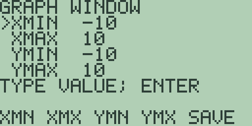
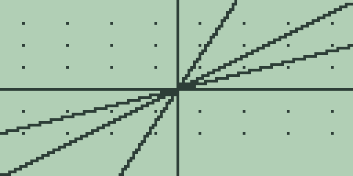
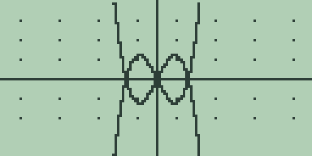
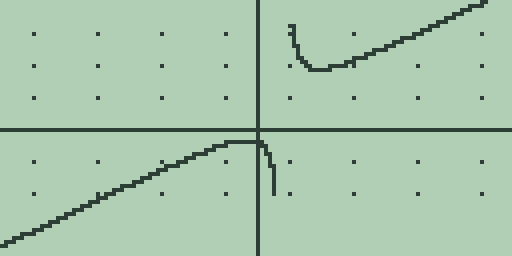
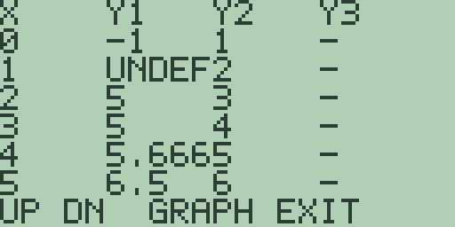
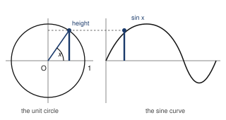
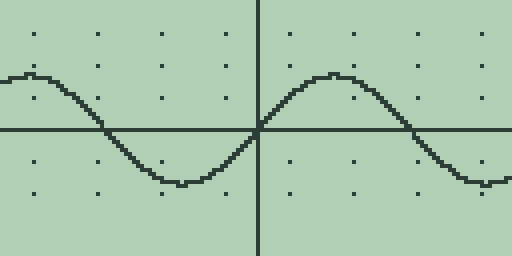

# Chapter 4: Explorations in Precalculus

Precalculus is where functions stop being formulas to evaluate and become
objects to study: things with graphs, zeros, symmetries, families of
relatives, and places they cannot go.

This chapter uses the graph screen as a laboratory for that shift. The
mechanics of graphing, the slots and windows and tracing and analysis keys,
are covered in full in the Guidebook, chapter 4. This chapter uses them
rather than re-explaining them.

If you read only one section of this chapter, read the first. Almost every
mistake anybody makes with a graphing calculator is a window mistake, and
they all look like mathematics going wrong.

## 4.1 Functions and their windows

A graph is a partnership between a function and a window.

The function decides what there is to see. The window decides what you
actually see, and a badly chosen window can hide a zero, flatten a wiggle,
or crop the only interesting part of the curve. It will do all of that
without any indication that it has, which is what makes it worth a section
of its own.

The working example is the cubic f(x) = x^3 - 4x, which has three zeros and
a small hill and valley between them: a shape worth framing deliberately.

1. On the home screen, type [x-VAR] [^] [3] [-] [4] [×] [x-VAR] so the
   entry line reads `X^3-4*X`, then press [GRAPH].

   The home entry line is the equation editor. [GRAPH] stores the line into
   the active slot `Y1` and plots it in the standard window, -10 to 10 on
   both axes.

   

2. Press [▶] twice to trace two columns right of centre. The readout gives
   `X=0.393700787402` and `Y=-1.5137794055131`.

   Those are not round numbers and they are not meant to be. Trace
   positions are the exact sample columns, spaced one 127th of the window
   width apart, and the second line is the function evaluated there at full
   precision. The trace does not go where you point it; it goes to the
   nearest place the machine actually computed.

3. Ask the window where it is. Press [+] once, the quick zoom-in, and the
   plot redraws with every bound halved.

   Press [EXIT] to return to the home screen, where the graph hands
   `X^3-4*X` back to the entry line, and press [CLEAR] to empty it. Typing
   `XMIN` (each letter is [ALPHA] plus the key carrying it) and pressing
   [ENTER] answers `= -5`. From the standard window, one press of [-]
   instead answers `= -20`.

   The window bounds `XMIN`, `XMAX`, `YMIN` and `YMAX` are read-only *on
   the home screen*. To set one exactly, there is an editor: from the graph
   screen press [2nd] [GRAPH] for the zoom panel, [MORE] twice, then [F5],
   `WIN`.

   

   [F1] to [F4] pick a bound, you type a value, [ENTER] puts it in a draft,
   and [F5] (`SAVE`) commits all four together after checking that the
   minimums really are below the maximums. Nothing reaches the plot until
   `SAVE`, so a half-typed window cannot leave you looking at nonsense and
   wondering which press did it.

   What you type is an expression, not just digits, which is the whole
   value of the thing: `2*PI` is a legal `XMAX`.

   There was no editor when this book was first written, and I defended
   that at some length here: four fields, cursor handling and validation
   against zoom keys that cost one press each and almost no code. It was a
   reasonable trade and I no longer think it was the right one, because
   "one press each" is only cheap when you do not care exactly where you
   land, and section 4.6 is full of windows where you do.

   [2nd] [+] restores the standard window whenever an experiment has taken
   you somewhere unhelpful. Learn that one now.

4. Now the zeros. With the cubic replotted in the standard window, press
   [F1]: the answer is `= 0` with the residual line `R=0`.

   The root search starts from the traced position, and the trace
   reference sits at `X=0` after a replot, which happens to be a zero of
   this cubic already. So that answer is correct and tells you nothing
   about the search.

   To find a different zero, move the trace first: press [◀] thirteen
   times, taking the trace near `X=-2`, and press [F1] again. The answer is
   `= -2` with `R=0`, the exact leftmost zero.

   That is the pattern for every analysis key in this book. Trace to the
   neighbourhood you care about, then ask. The keys answer questions about
   the window and the traced position you give them, and they have no way
   of knowing which root you meant.

5. Zeros of a pair meet the same way. Press [2nd] [2] on the graph screen
   to switch to slot `Y2` (the entry line comes back empty), type [x-VAR],
   and press [GRAPH]: the line `X` joins the cubic.

   Trace fourteen columns left, then press [2nd] [F1], the intersection
   search. The answer is `= -2.2360679774997` with `R=-3E-13`: the negative
   square root of five, where `X^3-4*X` and `X` cross, with the residual
   showing how nearly the two sides agree there.

**Try it.**

1. `Y1` holds `X^3-4*X` and `Y2` holds `X`. There are three intersections
   in the standard window. Predict all three on paper first, then find the
   other two with trace and [2nd] [F1], and check that the positive one is
   the square root of five.
2. Plot `X^3-4*X+3` and find all three of its zeros with trace and [F1].
   Which of them could you have read straight from the table, and why?
3. Zoom in with [+] repeatedly until the cubic looks like a straight line
   through the origin, reading `XMIN` after each press. How many presses,
   and what line does the curve come to resemble? Work out the line from
   the formula before you count.
4. Find a window in which `X^3-4*X` appears to have only one zero. Then
   find one in which it appears to have none. Neither is a lie; say what
   question each window is answering.

## 4.2 Families of curves three at a time

A single graph answers a question about one function. A family answers a
question about a parameter, which is usually the more interesting question.

What does the coefficient m do to y = mx? What does a do to y = ax^2?
Free85 keeps three function slots, so a family is explored three members
per plot: choose three values of the parameter that bracket the behaviour,
plot them together, and read the differences.

Three is a small number and it is worth knowing that it was chosen rather
than fallen into. Each slot costs stored text, a parsed expression kept
ready, and a column of the table. Three fits comfortably in the memory
this machine has and leaves room for everything else; a fourth would have
come out of somewhere else you would rather keep. It also happens to be
exactly the number you need for the commonest comparison in mathematics: a
thing, and one of it either side.

1. Store the slope family. Type [x-VAR] [÷] [2] and press [GRAPH] to put
   `X/2` in `Y1`. Press [2nd] [2] on the graph screen, type [x-VAR], and
   press [GRAPH] for `Y2`. Press [2nd] [3], type [3] [×] [x-VAR], and press
   [GRAPH] for `Y3`.

   Three lines through the origin, fanning anticlockwise as the slope
   grows:

   

2. Press [MORE] on the graph screen for the table, which puts the family
   side by side in columns. The `X=4` row reads `2`, `4`, `12` across `Y1`,
   `Y2`, `Y3`.

   Doubling and sextupling the slope doubles and sextuples every value,
   which is the whole content of "linear" written out in three numbers.
   [EXIT] returns to the plot.

3. Re-store the slots with a parabola family: `X^2/4` in `Y1`, `X^2` in
   `Y2`, and `4*X^2` in `Y3`. The [x²] key types `^2`, and each slot key
   hands its old text back to the entry line, so press [CLEAR] before
   typing the new member.

   The plot shows one bowl nested inside the next, and the table says why:
   the `X=2` row reads `1`, `4`, `16`, and the `X=5` row reads `6.25`,
   `25`, `100`. The coefficient scales every height, which narrows or
   widens the bowl without moving its vertex.

4. Re-store once more with the vertex form: `X^2` in `Y1`, `(X-4)^2` in
   `Y2`, and `(X-4)^2+3` in `Y3`.

   In the table, the `X=0` row reads `0`, `16`, `19` and the `X=4` row
   reads `16`, `0`, `3`. The second bowl is the first moved four units
   right, and the third is the second lifted three units, its vertex now at
   (4, 3).

Three slots is the boundary to design within, and designing within it is a
skill. A family of five is two plots, with one member kept across both as
the anchor so you can line the pictures up. The graph format panel can also
switch a stored slot off and on without erasing it (the Guidebook, chapter
4), which lets you flick single members in and out of the picture without
retyping anything.

**Try it.**

1. Plot the family `X+4`, `X`, `X-3`. Predict first: what do the three
   lines share, and where does each cross the y axis?
2. Build a family that shows what the *sign* of a does to y = ax^2, and
   check your reading against the table.
3. The vertex form says `(X+2)^2-5` has its vertex at (-2, -5). Confirm it
   with a plot and the table, then write down the slot text for a parabola
   with vertex (1, 7) and test it.
4. Explore a five-member family of your own across two plots, keeping one
   member as the anchor. Which member did you choose to keep, and why does
   the choice matter?

## 4.3 Symmetry and transformations

A function is even when f(-x) = f(x), mirror-symmetric about the y axis,
and odd when f(-x) = -f(x), unchanged by a half-turn about the origin.

The definitions compare three expressions, and three slots let you plot all
three at once: the function, its reflection in the y axis, and its
reflection in the x axis. Whichever pair of curves coincides names the
symmetry, and the machine will not tell you which pair to look at.

1. Store the test trio for f(x) = x^3 - 4x. Put `X^3-4*X` in `Y1`. In `Y2`,
   type the y-axis reflection f(-x) as `(-X)^3-4*(-X)`, using the [(-)] key
   for the minus signs. In `Y3`, type the x-axis reflection -f(x) as
   `-(X^3-4*X)`. Plot all three:

   

2. Three equations are stored and the screen shows two curves. `Y2` and
   `Y3` land on exactly the same pixels.

   The table confirms it digit for digit. The `X=1` row reads `-3`, `3`,
   `3` and the `X=3` row reads `15`, `-15`, `-15`: f(-x) and -f(x) agree
   everywhere, so the cubic is odd.

   For an even function it is the `Y1` and `Y2` columns that agree instead,
   and for a function that is neither, no two columns agree anywhere except
   by accident. Learn to read which pair matched rather than just noticing
   that something did.

3. Transformations move a curve without changing its shape, and the
   simplest curve to watch is the absolute-value kink.

   The custom menu comes preloaded with `ABS` on its first slot, so
   [CUSTOM] [F1] types `ABS(`. Store `ABS(X)` in `Y1`, `ABS(X+5)` in `Y2`,
   and `ABS(X)-6` in `Y3`, and plot: one V at the origin, one moved five
   units left, one moved six units down.

   The table carries the same story, `0`, `5`, `-6` at `X=0` and `5`, `10`,
   `-1` at `X=5`. Adding inside the brackets slides the graph
   horizontally, opposite to the sign, and adding outside slides it
   vertically with the sign.

   That opposite-to-the-sign business catches everybody. It is worth
   spending a minute on rather than memorising: `ABS(X+5)` is 0 when X is
   -5, so the kink has to be at -5, so the graph moved *left*.

**Try it.**

1. Run the three-slot symmetry test on `X^2-6` and on `X^3+1`. One is even
   and one is neither. Predict which is which before you plot, then say how
   each verdict shows up on the screen and in the table.
2. Predict what `2*ABS(X)` and `ABS(2*X)` look like, then plot both with
   `ABS(X)` as the anchor. Why do two different transformations give the
   same picture here, and for which functions would they differ?
3. Invent a function that is neither even nor odd but whose plot looks
   symmetric in the standard window, and use the table to expose the
   difference.
4. Can a function be both even and odd? Argue it from the definitions
   before you go near the machine, then find the one that is and check it
   with the three-slot test.

## 4.4 Rational functions and the lines they approach

Every function so far has been defined everywhere. Divide one polynomial by
another and that stops being true, and what happens near the places it
stops is the whole subject.

The specimen is (x^2 + 1)/(x - 1). It is undefined at x = 1, and it is
worth knowing what it does far away as well as near that point.

1. Press [CLEAR] and type [(] [x-VAR] [x²] [+] [1] [)] [÷] [(] [x-VAR] [-]
   [1] [)] so the entry line reads `(X^2+1)/(X-1)`. Press [GRAPH] and let
   it finish:

   

   Two separate branches, and between them a gap where the curve rushes off
   the top and comes back from the bottom. That gap is at x = 1 and the
   near-vertical strokes either side of it are the plotter joining samples
   that are very far apart, exactly as in Chapter 7's oscillating sine.

   The machine is not drawing a vertical line there. It is drawing a very
   steep one, because it joined a sample high above the screen to one far
   below it.

2. The table is the honest instrument again. Press [MORE]:

   The `X=1` row reads `UNDEF`. Compare Chapter 7's `SIN(X)/X`, which also
   read `UNDEF` at its bad point. These are not the same kind of bad point
   at all. There, the function was heading somewhere definite and simply
   had no value at the destination. Here it is not heading anywhere: it
   runs away to plus infinity from one side and minus infinity from the
   other.

   A table cell reading `UNDEF` tells you the machine could not compute a
   value. It does not tell you which of those two situations you are in.
   Only the neighbouring rows do.

3. Now the interesting part, which is what happens far from the trouble.

   Do the division on paper: (x^2 + 1)/(x - 1) is x + 1 with a remainder of
   2 over (x - 1). So the function is a straight line plus something that
   shrinks as x grows, which means that far out, the curve should look like
   the line y = x + 1.

   Test it. Press [EXIT], press [2nd] [2] for slot `Y2`, type [x-VAR] [+]
   [1], and press [GRAPH]. Press [MORE] for the table:

   

   Reading `Y1` against `Y2`: at `X=0`, `-1` against `1`. At `X=1`, `UNDEF`
   against `2`. At `X=2`, `5` against `3`. At `X=3`, `5` against `4`. At
   `X=4`, `5.666` against `5`. At `X=5`, `6.5` against `6`.

   The gaps are 2, 1, 0.666, 0.5, which is 2 over (x - 1) exactly, as the
   division promised. The two curves are converging and the table is
   showing you the rate.

4. Put a number on it. How far out must you go before the curve and the
   line differ by less than a thousandth?

   Work it out first: the gap is 2/(x - 1), so you want x - 1 greater than
   2000, so x greater than 2001. Write that down.

   Press [EXIT] twice, press [CLEAR], and spell `EVAL(2001)`:
   `= 2002.001`.

   The line at 2001 is 2002. The curve is 2002.001. A thousandth, on the
   nose, exactly where the algebra said it would be.

   That is a satisfying thing to have done, and it is worth noticing why it
   worked: you predicted a number from the structure of the formula, and
   the machine confirmed it. That is the direction this book wants you
   working in. The other direction, poking around until something looks
   interesting, is much less useful and very much slower.

5. One more, for contrast. Press [CLEAR], type `(X^2+1)/(X^2-1)`, and press
   [GRAPH]. Let it finish, then press [MORE].

   This one has two vertical asymptotes rather than one, at 1 and -1, and
   far out it approaches a horizontal line rather than a slanted one,
   because the top and bottom now grow at the same rate. Work out which
   horizontal line before you read the table.

**Try it.**

1. Divide out `(X^2-4)/(X-2)` on paper before plotting it. What does the
   table read at `X=2`, and why is this a completely different situation
   from step 2's?
2. Find the slant asymptote of `(2*X^2-X+3)/(X+1)` by division, put both in
   slots, and check the gap at `X=10` against your formula for the
   remainder.
3. `(X^2+1)/(X-1)` never touches its slant asymptote. Prove that from the
   remainder term, then find a rational function that *does* cross its own
   asymptote, and plot it.
4. Work out how far out you must go before `(X^2+1)/(X^2-1)` differs from
   its horizontal asymptote by less than a thousandth. Predict, then check
   with `EVAL(`.

## 4.5 Exponential and logarithmic functions

Exponential growth multiplies: each unit step in x scales y by the same
factor. The natural versions are `EXP(`, typed with [2nd] [LN], and its
inverse `LN(`, on the [LN] key. The Guidebook, chapter 3 covers them as
functions; here they earn their keep as graphs.

1. Store the growth-and-decay family: `EXP(X)` in `Y1`, `EXP(-X)` in `Y2`,
   and `EXP(X/2)` in `Y3`.

   Exponentials are heavier work per sample than polynomials, so each plot
   draws noticeably more slowly. Let it finish.

   In the table, the `X=0` row reads `1`, `1`, `1`, every member starting
   from the same value, and the `X=2` row reads `7.389`, `0.135`, `2.718`
   in the five-character cells. Growth, decay, and slower growth, told
   apart entirely by what multiplies each step.

2. Now the inverse pair, and the window matters more here than anywhere
   else in the chapter. Store `EXP(X)` in `Y1`, `LN(X)` in `Y2`, and `X` in
   `Y3`, then press [2nd] [-] on the graph screen for the square window,
   which makes one unit the same length on both axes:

   

   The two curves are reflections of one another in the third slot's line
   y = x, which is the picture of "inverse" itself. The square window is
   what keeps the mirror at forty-five degrees. In any other window the
   reflection is still true and no longer looks true, which is exactly the
   sort of thing section 4.1 warned about.

### Two routes to the same power

3. Compound growth at six per cent per year is the function 1.06 to the
   power x. Type it directly and it simply works: `1.06^2` answers
   `= 1.1236`, `1.06^2.5` answers `= 1.1568170026417`, and a slot holding
   `1.06^X` plots the whole curve.

   So far so dull. What is worth knowing is that two quite different
   machines live behind that one key, and which of them answered you
   decides how much of the answer to believe.

   A whole-number exponent is done by repeated squaring. Squaring and
   multiplying are exact, so the answer is exact: `1.06^2` really is
   `1.1236` and nothing has been rounded on the way. Any other real
   exponent, on a positive base, is done as e to the power x ln b: a
   logarithm and an exponential, each rounded to fourteen digits.

   Three cases have no answer to give, and say so instead of guessing. A
   negative base with a fractional exponent has no real value, so
   `(-2)^0.5` answers `DOMAIN ERROR`. Zero to a negative power is a
   division by zero, so `0^(-1)` answers `DIVIDE BY ZERO`. Anything too big
   for the numeric range answers `NUMERIC OVERFLOW`.

4. You can see the join between the two routes, and you should, because it
   is the clearest look at rounding you will get in this chapter.

   That identity, b to the power x is e to the power x ln b, is exactly
   what the key does for the general case. So type it yourself and compare.
   Press [CLEAR] and type `EXP(2*LN(1.06))`: `= 1.1236000000004`. The
   power key answered `= 1.1236`.

   Same number in mathematics. Different number here, from the eleventh
   digit on. One is two exact multiplications; the other is a logarithm and
   an exponential, each rounded, and the roundings do not cancel.

   Try `1.06^9` against `EXP(9*LN(1.06))`: `= 1.6894789590026` against
   `= 1.6894789590072`. The gap has grown, because nine steps of rounding
   is more than two.

   Neither is a bug and neither is the "real" answer. They are two
   calculations of the same quantity, and the exact one is available only
   when the exponent is a whole number. Knowing which route your expression
   took is the whole of the skill here.

5. As a taste of where this leads, 500 invested at six per cent for eight
   years is `500*1.06^8`, which answers `= 796.9240372654`, while
   `500*EXP(8*LN(1.06))` answers `= 796.92403726725`. Not quite two
   hundredths of a penny apart, on five hundred pounds, from nothing but
   the route taken. Chapter 5 takes the mathematics of money much further,
   and it takes this identity with it.

**Try it.**

1. Add `LN(X)` to a plot of `EXP(X)` *without* the square window. What
   happens to the mirror symmetry, and why does the window carry the blame
   rather than the mathematics?
2. Plot `EXP(X*LN(2))`, the base-two exponential, and use trace to find
   where it passes 8. Predict the answer first, then check it with
   `LN(8)/LN(2)` on the home screen.
3. A quantity halves every unit of time. Write its slot text with `EXP(`
   and `LN(`, plot it, and read from the table how much is left after five
   units.
4. Work out `1.06^9` two ways, with the power key and with the identity,
   and compare all fourteen digits. Which do you trust more, and why?
5. Predict which route each of `1.06^-3`, `1.06^10` and `1.06^0.5` takes
   before you press it, and therefore which of the three is exact. Then
   check by computing each one again through `EXP(` and `LN(` and seeing
   which answers move.

## 4.6 Trigonometric functions

Periodic phenomena repeat, and their graphs only make sense in windows
matched to the period. Nowhere does the window matter more than here, which
is why section 4.1's window editor earns its keep in this section: a period
is rarely a round number, and `2*PI` typed into `XMAX` is exact where four
presses of a zoom key are merely close.

The angle mode matters too. Everything here runs in `RAD`, the fresh-boot
default shown in the status line, until the walkthrough says otherwise.

That picture is where sine and cosine come from, and it is worth having in
front of you: the sine of an angle is the *height* of a point going round a
circle of radius 1, and the cosine is how far along it is. Everything in
this section follows from that, including why the values never leave -1
to 1.

1. Store `SIN(X)` in `Y1` and plot it in the standard window.

   The result is accurate and unflattering: a ripple a few pixels tall
   hugging the x axis. The window allows for values from -10 to 10 and the
   sine never leaves -1 to 1, so nine tenths of the screen is empty. This
   is section 4.1's badly chosen window meeting a function that deserves
   better.

2. Open the zoom panel with [2nd] [GRAPH], press [MORE] for its second
   page, and press [F5], the trigonometric window. The replot shows two
   full waves.

   Read the bounds from the home screen ([EXIT], then [CLEAR] to empty the
   handed-back equation): `XMIN` answers `= -6.2831853071796` and `XMAX`
   answers `= 6.2831853071796`, two pi either side of the origin, with
   `YMIN` at `= -4` and `YMAX` at `= 4`.

   That window exists because I got tired of building it out of zooms every
   time. It is the one shape of window this machine will hand you ready
   made, and it is the one you need in nine trigonometric problems out
   of ten.

3. Amplitude and period are the family parameters. Keeping the trig window,
   store `2*SIN(X)` in `Y2` and `SIN(2*X)` in `Y3`: one curve twice as
   tall, one twice as frequent. The plot separates the two effects at a
   glance, which is exactly what three slots are for.

4. Phase is subtler, and the table settles it. Re-store the slots with
   `SIN(X)` in `Y1`, `SIN(X+PI/2)` in `Y2` (the `π` legend on [2nd] [^]
   types `PI`), and `COS(X)` in `Y3`.

   In the table, the `X=1` row reads `0.841`, `0.540`, `0.540`, and every
   later row agrees the same way: sine led by a quarter turn is cosine.

   The `X=0` row shows `0.999` beside `1`, which is the stored
   fourteen-digit `PI` falling a whisker short of the exact half turn. The
   Guidebook, chapter 3 tells that story at `SIN(PI/2)`, and Chapter 8's
   cardioid meets it again.

5. Angle mode belongs to the graph as much as to the home screen. Open the
   mode screen with [2nd] [MORE], press [F1] for `ANGLE DEG`, press [EXIT],
   and replot `SIN(X)`.

   The curve collapses onto the axis, because -10 to 10 now spans twenty
   degrees of a wave 360 degrees long.

   The trigonometric window is no rescue: it sets the same two-pi bounds
   whatever the angle mode, so in `DEG` it frames barely thirteen degrees.
   Degree-mode trigonometry wants windows hundreds of units wide, and the
   quick zooms are the way there. Return to `RAD` before moving on, and see
   Chapter 7's warning about what happens if you forget.

6. Trigonometry earns its place modelling data. At a latitude of about
   fifty-five degrees north, the hours of daylight run roughly 4.3 hours
   above twelve in midsummer and 4.3 below in midwinter.

   With `X` counting months after the March equinox, store the departure
   from twelve hours as `4.3*SIN(PI*X/6)` and plot it in the standard
   window:

   

   The table reads `0`, `2.15`, `3.723`, `4.299`, `3.723`, `2.149` down its
   first six rows: the equinox itself, a June solstice 4.3 hours over
   twelve, and the symmetric slide back down.

   One period is twelve months, which is exactly what the `PI*X/6` inside
   the sine was chosen to say. Work out why that factor gives a year before
   you accept it: the sine repeats every 2 pi, so you want PI*X/6 to reach
   2 pi when X reaches 12.

**Try it.**

1. In the trig window, plot `SIN(X)`, `SIN(X)+2` and `SIN(X+2)` together.
   Predict which slot does what to the wave before checking the table.
2. In `DEG` mode, zoom out from the standard window until a full wave of
   `SIN(X)` fits, reading `XMAX` as you go. How wide is the first window
   that shows a whole period, and could you have predicted it?
3. Rebuild the daylight model for a town near the equator, where the swing
   is about one hour, and decide what window shows a year of it clearly.
   What does the standard window hide?
4. From the unit circle picture, predict the value of `COS(X)` at the four
   places where `SIN(X)` is 0, 1, 0 and -1. Then check all four with the
   table.
5. Build a model for the tide, which turns roughly every 6 hours 13
   minutes. What goes inside the sine, and what window shows two days?

## 4.7 Inverse functions by parametric pair

The inverse of a function swaps the roles of input and output. The graph of
the inverse is the graph of the function with its coordinates exchanged,
which is the same as reflecting it in the line y = x.

Function slots cannot plot a sideways curve, because a function slot
computes y from x and an inverse very often has two y values for one x. The
parametric mode can, because it plots any pair x(t), y(t) you give it, and
swapping the pair is exactly the coordinate exchange.

1. Switch modes. On the graph screen press [2nd] [MORE], then [MORE] until
   the `GRAPH MODE` page appears, then [F3] for parametric mode; [EXIT]
   closes the panel.

   The mode keeps one coordinate pair: slot 1 is x(t), slot 2 is y(t), slot
   3 is never plotted, and [x-VAR] types the parameter, shown as `X`. The
   parameter sweeps from `XMIN` to `XMAX` in 128 samples (the Guidebook,
   chapter 6 has the full tour).

2. Draw a function as a pair first, so you can see that nothing has changed
   yet. Store `X` in slot 1 and `X^3/10` in slot 2, and the plot is the
   ordinary graph of f(t) = t^3/10, drawn point by point as (t, f(t)).

3. Now exchange the coordinates. Press [2nd] [1], press [CLEAR], type
   `X^3/10`, and press [GRAPH]; then [2nd] [2], [CLEAR], `X`, [GRAPH].

   The pair is now (f(t), t), and the plot is the inverse function: the
   cube-root-shaped curve lying on its side.

   

4. The trace readout says the same thing pointwise. Two presses of [▶] from
   the centre of the sweep show `X=0.0061023744094928` and
   `Y=0.393700787402`.

   Look at those two numbers against step 2's. The first coordinate is the
   old output and the second is the old input: the swap made visible one
   sample at a time.

   The table agrees, its `Y1` column reading `0`, `0.1`, `0.8`, `2.7`,
   `6.4`, `12.5` beside a `Y2` column that is simply `0` through `5`, with
   `-` down the unplotted `Y3`.

One pair is the design to work within, and it costs you something real
here. The mode draws one curve at a time, so a function and its inverse are
compared across two plots rather than overlaid, and the mirror line of
section 4.5 cannot join them on screen.

What makes the comparison workable is that each graphing mode keeps its own
equations and window. Press [F1] on the `GRAPH MODE` page to return to
function mode and the slots hold exactly what you left in them, so a
session that left `X^3-4*X` in slot 1 finds it still there. You can flick
between the function-mode picture and the parametric inverse without
retyping either.

That was worth the memory it costs. Losing your work every time you changed
modes would have made the modes almost unusable together, and half the
interesting things in this book happen when two modes are used on the same
problem.

**Try it.**

1. Plot the inverse of f(t) = 2t - 6 by parametric pair, and read from the
   trace where the inverse crosses the x axis. Predict the number first:
   where did it live on the original line?
2. Draw the inverse of `EXP(X)` as a pair and compare it, across a mode
   switch, with the `LN(X)` plot of section 4.5. Why must the two pictures
   agree?
3. The pair `X^2` and `X` draws the inverse of the squaring function, which
   is not a function. Plot it, trace it, and explain what the sweep from
   `XMIN` to `XMAX` did that a function slot never could.
4. Find a function that is its own inverse, so the swapped pair draws the
   same picture as the unswapped one. There is more than one; find two that
   are not the same shape.
