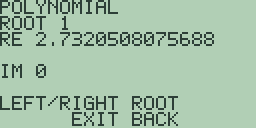
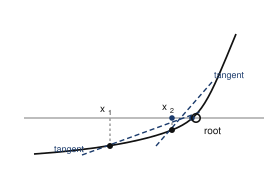
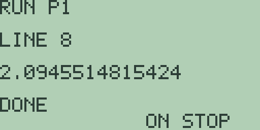
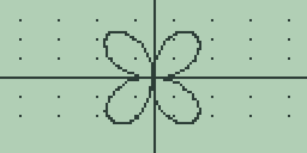
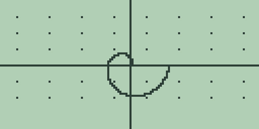
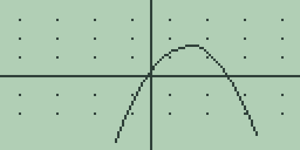
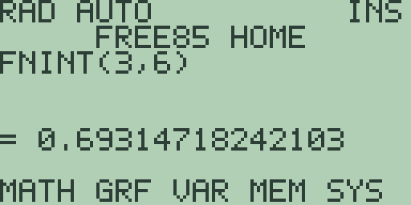
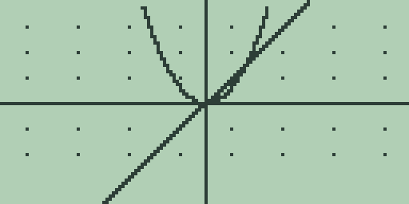
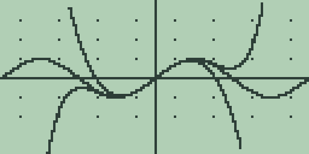
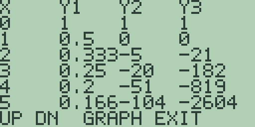

# Chapter 5: Explorations in Calculus II

The second course in calculus widens the field of play.

Equations whose roots have to be hunted rather than factored. Curves that
refuse to be the graph of any function. Motion through time. Functions
built out of integrals. Polynomials impersonating transcendental functions,
and getting away with it over a range you can measure.

Free85 keeps a tool for each: the polynomial editor and solver workspace of
the Guidebook, chapter 14, the polar and parametric modes of chapters 5 and
6, and the calculus commands of chapter 3.

The habits from Chapter 4 still govern. The calculus commands read the
active stored equation, so store with [GRAPH] before asking them anything.
Let plots draw to the end, because presses arriving mid-draw are dropped.
And press [CLEAR] at home before typing a command, because the graph hands
its equation back to the entry line.

## 5.1 Zeros of functions two ways

Factoring finds the roots the algebra teacher chose. Most polynomials met
in the wild need a hunter, and Free85 keeps two: the polynomial editor,
which answers every root at once, and the solver workspace, which hunts one
root of any equation whatever.

The specimen is designed on paper so you know the answers before you start.
Multiplying x^2 - 2 by x^2 - 2x - 2 gives the quartic
x^4 - 2x^3 - 4x^2 + 4x + 4, whose roots are plus and minus the square root
of 2, and 1 plus or minus the square root of 3.

1. Press [2nd] [PRGM], the `POLY` legend, and the polynomial editor opens on
   a fresh `DEGREE 2`. Press [F4], `QRT`, for degree 4, and type the
   coefficients highest power first, [ENTER] after each: [1] [ENTER],
   [(-)] [2] [ENTER], [(-)] [4] [ENTER], [4] [ENTER], [4] [ENTER]. The
   `COEFF` line steps down a power per entry.

2. Press [F1], `SOLV`, and give the search a few seconds. The root browser
   replaces the editor:

   

   `ROOT 1` shows `RE 2.7320508075688` with `IM 0`, which is 1 plus root 3,
   one digit of dust short of the paper value.

   Press [▶] three times for the rest: `ROOT 2` is `RE -0.73205080756887`,
   `ROOT 3` is `RE -1.4142135623731`, and `ROOT 4` is `RE 1.4142135623731`,
   every `IM` line reading `0`.

   Four roots, one press, no guessing and no bounds. That is the editor's
   whole appeal and it is worth using whenever the thing in front of you
   really is a polynomial.

3. Now the same roots one at a time, by hunting. Press [EXIT] for the home
   screen, type `X^4-2*X^3-4*X^2+4*X+4` (the [x²] key types `^2`), and press
   [2nd] [GRAPH]: the solver workspace opens with the equation stored, the
   `F=` line clipping at the screen's edge with the tail kept.

   Press [F1], `SOLV`, and let it work: a `ROOT` of `-1.4142134785654` with
   `RES` `-6.704614E-7`.

   From the fresh guess 0 and bounds -10 to 10, the scan stops at the first
   sign change it meets coming from the left, which is minus root 2. It
   found *a* root, not *the* root, and it had no way of knowing you wanted
   a different one.

4. The bounds are the fence that picks a root, and this is the thing to
   learn here. Press [F5], the `>` key, three times to reach the `LOWER`
   page, and store bounds 0 and 2: [0] [ENTER], [2] [ENTER]. `SOLV` answers
   a `ROOT` of `1.4142136573793`.

   Re-fence at 2 and 5 the same way and `SOLV` answers `2.7320508360865`
   with `RES` `5.39787E-7`, which is the browser's first root re-found by
   hunt.

   The guess is tried before any scanning, so it picks roots too. Page to
   `GUESS`, type the browser's own `1.4142135623731`, press [ENTER], and
   `SOLV` answers it straight back with `RES` `0`. Handing a root hunter
   the root is not cheating; it is how you check that it agrees with you.

5. What the editor cannot do is leave polynomials. Press [EXIT] and
   [CLEAR], type `COS(X)-X`, and press [2nd] [GRAPH]: `SOLV` answers a
   `ROOT` of `0.7390856742858`, the one crossing of cosine and the line,
   and a number no polynomial tool can reach.

So: `POLY` for polynomials of degree 2 to 4, all roots at once with no
guessing. The solver for everything else, one root per hunt, steered by
guess and bounds. Neither is a substitute for the other and the choice is
usually obvious once you have both in mind.

**Try it.**

1. Design your own quartic by multiplying two quadratics on paper, expand
   it, and let `POLY` recover the roots you built in. How many digits do
   you get back?
2. Give `POLY` the quadratic x^2 + 2x + 3, then give the solver the same
   equation. One answers a conjugate pair, the other stops at a notice.
   Predict both before you try, and say what each tool is telling you.
3. Aim the solver at the quartic with bounds -5 and 0 and guess 3. Which
   negative root does it report, and how do you fence in the other?
4. The residual `RES` was `-6.704614E-7` in step 3 and `0` in step 4. What
   is the residual actually measuring, and why should handing it the exact
   root produce zero?

## 5.2 Newton's method

The solver of section 5.1 hunts roots and does not tell you how. This
section builds the method that most root hunters are made of, in four
useful lines, and then breaks it.

The idea is one you already have from Chapter 4. At any point on a curve
you can compute the tangent. A tangent is a straight line, and finding
where a straight line crosses the axis is arithmetic. So: stand somewhere,
follow the tangent down to the axis, and stand there instead. Repeat.

If x is the current guess, the tangent crosses the axis at x minus f(x)
over f'(x), and that is the whole method.

The specimen is x^3 - 2x - 5, an old favourite with exactly one real root,
near 2.09.

### Four lines that do it

1. Store the function. Press [CLEAR], type [x-VAR] [^] [3] [-] [2] [×]
   [x-VAR] [-] [5], press [GRAPH], and let the plot finish. Press [EXIT]
   and [CLEAR].

2. Press [PRGM] and [F1], `NEW`, opening `EDIT P1`. Type these eight lines:

   | Line | Text | Keys |
   | --- | --- | --- |
   | 1 | `2->R` | [2] [STO▶] [R] |
   | 2 | `1->N` | [1] [STO▶] [N] |
   | 3 | `WHILE N` | [W] [H] [I] [L] [E] [2nd] [0] [N] |
   | 4 | `R-EVAL(R)/NDER(R)->R` | [R] [-] [E] [V] [A] [L] [(] [R] [)] [÷] [N] [D] [E] [R] [(] [R] [)] [STO▶] [R] |
   | 5 | `N-1->N` | [N] [-] [1] [STO▶] [N] |
   | 6 | `END` | [E] [N] [D] |
   | 7 | `DISP R` | [D] [I] [S] [P] [2nd] [0] [R] |
   | 8 | `STOP` | [S] [T] [O] [P] |

   Line 4 is Newton's method entire, in twenty characters. `EVAL(` gives
   the height and `NDER(` gives the slope, both reading whichever equation
   is stored, so this program will hunt the root of anything you care to
   put in the slot. It contains no function at all.

   Line 2 is the step count, and you are going to edit it repeatedly, which
   is how you watch the method work rather than just seeing its answer.

3. Press [F2], `RUN`. It takes a moment, because each step evaluates the
   stored equation twice.

   `2.1`.

   Check that by hand, because it is the only step you will be able to.
   f(2) is 8 - 4 - 5 = -1, and f'(2) is 12 - 2 = 10, so the tangent crosses
   at 2 minus -1 over 10, which is 2.1. The machine and the arithmetic
   agree.

4. Now run it again with more steps, editing line 2 each time. Press
   [PRGM], [F1], [▼], [CLEAR], type the new count, then [F2]:

   | Steps | Iterate |
   | --- | --- |
   | 1 | `2.1` |
   | 2 | `2.0945681211042` |
   | 3 | `2.0945514816982` |
   | 4 | `2.0945514815424` |
   | 5 | `2.0945514815424` |

   

   Read down the correct digits: 2, then 5, then 10, then all fourteen, and
   then it stops moving because there is nowhere left to move to.

   The number of correct digits roughly *doubles* at every step. That is
   what quadratic convergence means, and it is why Newton's method is the
   one everybody reaches for. Compare Chapter 7's Euler, which halved its
   error per halving of the step, or the bisection the solver uses, which
   buys one bit a go. This buys everything it already has, again, every
   time.

### Now break it

The doubling comes with conditions, and the conditions matter more than the
method. Newton needs a start close enough to the root and a derivative that
is not too small, and if it does not get them it does not degrade
gracefully. It leaves.

5. Change line 1 to `0->R` and set line 2 back to `1->N`. Zero is a
   perfectly reasonable-looking place to start: the curve is smooth there
   and it is only a couple of units from the root.

   Run it, then work up through the step counts as before:

   | Steps | Iterate |
   | --- | --- |
   | 1 | `-2.5000000125` |
   | 2 | `-1.5671641902429` |
   | 3 | `-0.5025924653538` |
   | 4 | `-3.8207066344471` |
   | 6 | `-1.6081115996896` |
   | 8 | `-4.5977119699788` |

   It is not converging. It is not even slowly converging. After eight
   steps it is further from the root than it started, on the wrong side of
   the axis, and still wandering.

   Here is why, and you can see it from the picture rather than the
   algebra. At x = 0 the slope of this cubic is -2, which is shallow. A
   shallow tangent runs a long way before it meets the axis, so the first
   step throws the guess to -2.5, a place with no relation to the root at
   all. Out there the cubic is nearly flat over a stretch, so the next
   tangent throws it somewhere else, and the method spends its time
   bouncing around a region that contains no root whatever.

   Newton's method converges beautifully when it converges. It has no
   opinion at all about whether it will.

6. So give it help, which in practice is what everybody does. Plot the
   function first and look. Press [PRGM], [EXIT], press [GRAPH] and let the
   cubic draw. The curve crosses the axis once, a little past 2, and the
   crossing is steep. Start there and the method is safe.

   That is the working method for Newton in practice: use a picture or a
   coarse search to get close, then let the doubling take you the rest of
   the way.
   The solver of section 5.1 does something similar internally, which is
   why it asks you for bounds.

**Try it.**

1. Predict, then check: start Newton at 3 rather than 2. How many steps to
   fourteen digits, and is it more or fewer than from 2? Why?
2. Start at 0.8, where the cubic's slope is very close to zero. Predict
   what the first step does before you run it. Then run it and see how far
   it went.
3. Store `X^2-2` instead and hunt root 2 from a start of 1. Work out on
   paper what line 4 does to this particular function, and you will find
   you have rediscovered a very old algorithm for square roots.
4. Put `COS(X)-X` in the slot and run Newton from 1. Compare the answer
   with section 5.1's solver result of `0.7390856742858`, and compare how
   long each took.
5. Newton needs `NDER(` at every step, which is two evaluations of the
   stored equation. Count the evaluations for four Newton steps against the
   solver's bisection to the same accuracy. Which is actually cheaper here?

## 5.3 Conic sections by parametric pair

A circle fails the vertical line test, so no function slot can draw one.
The parametric mode can, because it plots any pair x(t), y(t) you give it,
and a pair has no opinion about whether the result is a function.

The pair A cos t, B sin t sweeps an ellipse with half-width A and
half-height B. The story is a garden design: an ornamental pond 10 metres
by 5 at one metre per unit, so A is 5 and B is 2.5.

1. Switch modes. On the graph screen press [2nd] [MORE], then [MORE] twice
   to the `GRAPH MODE` page, press [F3] for parametric, and [EXIT].

   Slot 1 is x(t), slot 2 is y(t), and [x-VAR] types the parameter, shown
   as `X`.

   Type [5] [×] [COS] [x-VAR] [)] so the line reads `5*COS(X)`, and press
   [GRAPH]. Nothing draws, and that is correct: a pair needs both slots.

   Press [2nd] [2], type `2.5*SIN(X)`, and press [GRAPH] again. Both slots
   evaluate at every sample, which roughly doubles the plot time, so let it
   run to the end.

   The pond appears squashed. The pixels are not square.

2. Press [2nd] [-], the square window, and let the replot finish:

   

   Now one unit is the same length on both axes and the ellipse shows its
   true proportions, twice as wide as tall. Any time a circle looks like an
   ellipse or an ellipse looks wrong, this is the key to reach for.

3. Press [▶] once and the readout gives `X=4.861147193253` and
   `Y=0.58507434688468`, a rim point one sample past the sweep's centre.

   Put it on trial. The rim's equation says (x/5)^2 + (y/2.5)^2 must be 1,
   so press [EXIT], press [CLEAR], type
   `(4.861147193253/5)^2+(.58507434688468/2.5)^2`, and press [ENTER].

   `= 1`, exactly. The traced point sits on the designed ellipse to all
   fourteen digits, which is a stronger check than it looks: it says the
   trace readout and the plot are computing the same thing.

4. Where did the sweep come from? Parametric mode has no angle settings at
   all. The parameter t runs from `XMIN` to `XMAX` in 128 samples, so the
   window doubles as the parameter range.

   The standard window sweeps t from -10 to 10, which is over three
   revolutions of the rim, and the square window kept those bounds. A
   window narrower than one full turn leaves the rim partly drawn, which is
   a surprise the first time and obvious once you know where t comes from.

The mode holds one pair, so a pond and a path around it are two plots. The
design scales freely: a 12 by 6 pond, stored as `6*COS(X)` and `3*SIN(X)`,
draws its whole rim including the right-hand vertex.

**Try it.**

1. Retype the pair as a fountain basin 8 metres across and 8 deep, plot it
   in the square window, and check a traced point against the circle's
   equation the way step 3 did.
2. Swap the pond's pair, `2.5*COS(X)` and `5*SIN(X)`. Predict the picture
   before the plot finishes.
3. From the square window press [+] twice, letting each replot settle, and
   explain what changed. Remember that the window is also the sweep.
4. Work out what pair draws a circle of radius 3 centred at (4, 1), then
   plot it and trace a point to check.

## 5.4 Polar curves

Some curves are unwieldy in x and y and a single line in polar form, where
each point is named by its distance r from the origin at angle theta.

Free85's polar mode stores r as a function of the angle, typed with
[x-VAR], and always sweeps exactly one revolution, 0 to 2 pi in `RAD` mode,
in 128 samples, whatever the window shows. That last clause is the one to
remember.

1. On the graph screen press [2nd] [MORE], then [MORE] twice, then [F2] for
   polar mode, and [EXIT]. Type [4] [×] [SIN] [2] [x-VAR] [)] so the entry
   line reads `4*SIN(2X)`, and press [GRAPH]. Trigonometry makes this a
   slow plot, so let it sweep to the end. Then press [2nd] [-] for the
   square window and let the replot finish:

   

   Doubling the angle folds the revolution into four petals on the
   diagonals. Work out why four and not two: the radius goes negative for
   half of each cycle, and a negative radius plots opposite.

2. The cardioid. Press [EXIT], press [CLEAR], type `2.5*(1+COS(X))`, and
   press [GRAPH]: a heart lying on its side, cusp at the origin, in the
   kept square window.

   The design says the radius is 5 at angle 0 and 0 at angle pi. Press
   [EXIT], press [CLEAR], and ask `EVAL(0)`: `= 5`. Ask `EVAL(PI)` (the `π`
   legend on [2nd] [^]): `= -0.000010419523`.

   Not zero. That is the cusp sitting under the machine's fourteen-digit
   `PI`, which is not quite pi, so the cosine is not quite -1. The same
   small print as `SIN(PI/2)` in the Guidebook, chapter 3, and worth
   recognising rather than worrying about.

3. The spiral. Press [CLEAR], type `X/2`, and press [GRAPH]:

   

   The radius grows with the angle, half a unit per radian, and the curve
   winds outward until the single revolution is spent, stopping mid-air at
   radius pi on the positive x axis.

   That abrupt end is the boundary. The sweep is one revolution, always, so
   a spiral of many turns is beyond the mode. What there is of it is exact,
   and the stopping point is not a bug to work around but the mode telling
   you where its world ends.

4. Read the spiral's equation off the screen, which is the best trick in
   this section. Press [▶] once: the readout shows `X=-1.6034808029742` and
   `Y=-0.1192134330108`, the Cartesian point just past the sweep's centre.

   Now press [2nd] [MORE], then [MORE] twice, and press [F5], the
   coordinate toggle, flipping the mode page's `GRAPH COORD` line from
   `RECT` to `POLAR`. Press [EXIT] and let the replot run to the end before
   touching the arrows.

   Press [▶] once: the same position now reads `X=1.6079017518373` and
   `Y=3.2158035036746`. That is the radius in the `X=` line and the angle
   in the `Y=` line, with the labels unchanged, which is confusing until
   you have met it once.

   The radius is exactly half the angle, to all fourteen digits. The trace
   has recited `r = theta/2`, which is the equation the slot was given.

**Try it.**

1. Replot the rose as `4*SIN(3X)` and count petals. Predict the number
   first. What does tripling the angle do that doubling did not?
2. Predict which way the cardioid `2.5*(1-COS(X))` faces, plot it, and
   confirm its cusp with `EVAL(` at the angle where you expect it.
3. With the polar readout still on, trace the spiral onward and check the
   half-the-angle rule at each stop.
4. Work out what `4*SIN(2X)` does for theta between pi/2 and pi, where the
   radius is negative, and check your reasoning against which petal gets
   drawn when.

## 5.5 Parametric motion

A parametric pair is a motion, not just a shape. The parameter is time, and
the trace key becomes a slow-motion replay.

The projectile is a pebble from a garden sling, launched from level ground
at 3 metres per second horizontally and 9 vertically, with gravity rounded
to 10: x(t) = 3t and y(t) = 9t - 5t^2. On paper the pebble lands when y is
0 again, at t = 1.8 seconds, 5.4 metres out. Work that out before you plot
it.

1. In parametric mode, store the motion: `3*X` in slot 1, then [2nd] [2]
   and `9*X-5*X^2` in slot 2. Let the plot finish:

   

   The arc rises from the origin and returns to the axis.

   The tail diving off the lower left is not a mistake and it is worth
   understanding rather than ignoring. The standard window sweeps t from
   -10 to 10, so the machine is also plotting the model's pre-launch
   fiction: where the pebble would have been before you threw it, if the
   formula had applied. The window is the time range and it does not know
   when the story starts.

2. Trace is time. Each press is one sample of t, about 0.16 seconds. Press
   [▶] five times, one press at a time: `X=2.598425196849` and
   `Y=4.044268088536`, the pebble near the top of its arc.

   Continue to the tenth press, `X=4.960629921261` and `Y=1.210862421722`,
   and the eleventh, `X=5.433070866141` and `Y=-0.099820199638`.

   Between those two samples the `Y=` line changes sign, so the pebble
   lands between 4.96 and 5.43 metres out. That is as much as trace can
   tell you, and finer answers need finer tools.

3. The apex, exactly. The analysis keys read the active slot as a function
   of t, and slot 2, stored last, is active.

   Press [F1], the root hunt: it answers `= 3E-21` with `R=2.7E-20`. That
   is the launch, not the landing, because the search scans from the
   window's left edge and y is zero at t = 0 too. A perfectly correct
   answer to a question you did not mean to ask.

   Press [CLEAR] and ask `FMAX(0,2)` instead: `= 0.8999585312886`, the apex
   time, a search's whisker under the paper answer 0.9. Press [CLEAR] and
   ask `EVAL(.9)`: `= 4.05`, the apex height in metres.

4. The landing, exactly, from the solver. Press [CLEAR], type `9*X-5*X^2`,
   and press [2nd] [GRAPH].

   The fresh guess 0 already solves the equation and would hand back the
   launch again, so move it: press [F5] twice to the `GUESS` page, store 2,
   then bounds 1 and 3. `SOLV` answers a `ROOT` of `1.7999999523165`.

   The flight lasts 1.8 seconds. Press [EXIT], press [CLEAR], and type
   `3*1.8`: `= 5.4` metres, exactly the range the paper predicted.

Here too there is only one pair, so two pebbles cannot fly together. And
zooming reframes time as well as space: the window is the clock.

**Try it.**

1. Sling a pebble at 2 metres per second horizontally and 12 vertically.
   Work out the apex and landing on paper first, then find them with the
   tools of steps 3 and 4.
2. The apex time 0.9 is exact on paper. Why does `FMAX(` stop a whisker
   short? Chapter 4's extremum searches told the story.
3. Launch from a 2-metre wall at 2 metres per second horizontally: the pair
   is `2*X` and `2+9*X-5*X^2`. Where does the trace say the pebble lands,
   and what guess and bounds make the solver agree?
4. Step 3's root hunt found the launch rather than the landing. Find a
   window that makes it find the landing instead, without using the solver.

## 5.6 Functions defined by integrals

An integral with a variable upper limit is a function. Call it A(x): the
area accumulated under a curve from a fixed start out to x.

The machine has no accumulator button, but `FNINT(` probed at several
different upper limits is exactly that function, one value per call. The
second specimen below is chosen so that the accumulator turns out to be
somebody you already know.

1. Accumulate under f(t) = 2t first, where you can check every answer in
   your head. Type [2] [×] [x-VAR], press [GRAPH], let the plot finish,
   press [EXIT], then [CLEAR].

   Spell `FNINT(0,1)` and press [ENTER]: `= 1`. Pressing [CLEAR] before
   each, ask `FNINT(0,2)`, `FNINT(0,3)` and `FNINT(0,2.5)`: the answers are
   `= 4`, `= 9` and `= 6.25`.

   The pattern names itself. The accumulator of 2t is x squared, which is
   the fundamental theorem of calculus arriving with no fuss at all.

2. Now the interesting curve. Press [CLEAR], type `1/X`, press [GRAPH], and
   let the plot finish.

   The accumulator has to start at 1 rather than 0, because 1/t has no area
   to speak of near zero. Press [EXIT], press [CLEAR], and ask
   `FNINT(1,2)`: `= 0.6931471824209`.

3. That number has a famous face. Press [CLEAR] and ask `LN(2)`:
   `= 0.69314718056122`.

   The area probe matches the logarithm to eight decimals, the difference
   being `FNINT('s` sixty-four panels. So the accumulator of 1/t is the
   natural logarithm, which is a much better definition of the logarithm
   than the one you were probably given.

4. Watch the logarithm's law appear out of the geometry. Pressing [CLEAR]
   between probes, ask `FNINT(1,4)` and `FNINT(1,8)`: `= 1.3862945205897`
   and `= 2.0794461816072`.

   Each doubling of the upper limit added the same 0.6931 again. Equal
   ratios accumulate equal areas, which is the entire personality of a
   logarithm, and here it is a fact about slabs under a hyperbola.

5. The sharpest form of that claim: the area from 3 to 6 should equal the
   area from 1 to 2, both being doublings, even though the two slabs look
   nothing alike. Press [CLEAR] and ask `FNINT(3,6)`:

   

   `= 0.69314718242103`, agreeing with step 2's probe to eleven decimal
   places. Two differently shaped slabs, equal because both are doublings.

### And a way to compute pi

6. One more accumulator, because it produces something worth having. The
   derivative of the arctangent is 1 over 1 plus x squared, so the area
   under that curve from 0 to 1 is the arctangent of 1, which is pi over
   four.

   Press [CLEAR], type `1/(1+X^2)`, press [GRAPH], let it finish, press
   [EXIT], and press [CLEAR]. Type [4] [×] and spell `FNINT(0,1)`, then
   press [ENTER]:

   `= 3.1415926535863`.

   Press [CLEAR] and type [2nd] [^] for the machine's own `PI`:
   `= 3.1415926535898`.

   Eleven places, from an area. That is worth pausing on: you have just
   computed pi without a single trigonometric function, out of nothing but
   a rational function and a sheaf of rectangles.

One route used to be closed and is now open, and the reason it was closed
is the reason the open one looks the way it does.

Called as `FNINT(a,b)`, the command integrates whichever equation is
active. A slot holding *that* form is being asked to integrate itself, and
the machine says so rather than looping: store `FNINT(0,X)` as `Y2` beside
`2*X` in `Y1`, press [GRAPH], and `Y2` stops with `RECURSION ERROR` while
`Y1` draws its line exactly as it would alone.

Name the slot and the ambiguity disappears. `FNINT(1,0,X)` reads
"integrate slot 1, from 0 to x", and nothing in it refers to the slot doing
the asking. Put `2*X` in `Y1` and `FNINT(1,0,X)` in `Y2` and press
[GRAPH]:

`Y1` draws its line and `Y2` draws x², which is what the accumulator of 2x
is. The table carries both columns, so the function you were building by
hand a page ago is now a column you can read down.

Be patient with it. Every plotted column of `Y2` is a complete numerical
integration starting from 0, so that slot costs 127 integrals where an
ordinary slot costs 127 evaluations.

The rest of the calculus commands take a slot the same way: `EVAL(slot,x)`,
`NDER(slot,x)`, `FMIN(slot,a,b)`, `FMAX(slot,a,b)`, `ARC(slot,a,b)` and
`INTER(slot,a,b)`. One nested evaluation is available, so a slot may read
another slot; two slots that read each other stop with `RECURSION ERROR`
while the slots around them carry on.

None of which makes the hand-built table wasted work. Building the
accumulator one probe at a time is how you find out what it *is*; plotting
it is how you check that you were right.

**Try it.**

1. Tabulate the accumulator of `3*X^2` from 0 at x = 1, 2, 3, 4 and name
   the function you have built. Predict it from the first two probes.
2. From your probes of `1/X`, check that `FNINT(2,8)` equals `FNINT(1,8)`
   minus `FNINT(1,2)` before asking the machine, then ask it.
3. Find another pair of intervals with the ratio 2, nowhere near this
   section's, and confirm the equal-area rule with two probes.
4. Step 6 computed pi from 0 to 1. Try `8*FNINT(0,.5)` on the same curve
   and say what it should equal, then check. Why is it not pi?
5. The accumulator of `1/X` starting at 2 instead of 1 is a different
   function. What is the relationship between the two, and can you predict
   `FNINT(2,6)` from step 5's answer without computing it?

## 5.7 Indeterminate forms by table

When the top and bottom of a fraction both head for zero, the quotient's
fate is genuinely undecided. Nought over nought can settle anywhere at all,
and only the route taken decides where. The same holds when both head for
infinity, and when a base heading for 1 is raised to a power heading for
infinity.

Chapter 4 probed limits with the table. Here the same tool takes on three
indeterminate forms, one specimen each.

1. The nought-over-nought specimen divides e to the 2x minus 1 by x, which
   is undefined at 0 where top and bottom both vanish.

   Type it as `(EXP(2X)-1)/X` ([2nd] [LN] types `EXP(`), press [GRAPH], let
   the slow exponential plot finish, then press [MORE] for the table.

   The `X=0` row reads `UNDEF`, and the unit-step rows below grow
   ferociously: `6.389`, `26.79`, `134.1`, `744.9`, `4405.` in the
   five-character cells. Far from 0 the exponential simply runs away, and
   the table is telling you about the wrong part of the function.

2. Press [-] four times, halving the step to 0.0625. The rows now read
   `2.130`, `2.272`, `2.426`, `2.594`, `2.778` beneath the unmoved `UNDEF`:
   from the right, the quotient slides down towards 2.

   Press [▲] once for the left side: from `X=-0.31` the rows read `1.487`,
   `1.573`, `1.667`, `1.769`, `1.880`, climbing towards the same 2 from
   below.

   Both roads point at 2, which is the derivative of e to the 2x at 0
   wearing a disguise. Press [▼] to bring the table back to its 0 anchor
   before moving on.

3. The infinity-over-infinity specimen is (3x^2 + 5x)/(x^2 + 4), where top
   and bottom both blow up.

   Press [EXIT] and let the plot redraw, then [EXIT] again and [CLEAR],
   type `(3*X^2+5*X)/(X^2+4)`, and press [GRAPH]. Press [MORE]: the table
   reopens with the step still 0.0625, position and step being kept across
   equations.

   Press [+] four times for step 1, and the rows read `0`, `1.6`, `2.75`,
   `3.230`, `3.4`, `3.448`: the quotient climbs through 3 and keeps going,
   overshooting.

4. Growing steps are the zoom-out this form needs. Press [+] eight more
   times, doubling the step out to 256: the rows read `3.019` at 256,
   `3.009` at 512, `3.006` at 768, `3.004` at 1024, and `3.003` at 1280.

   The overshoot has drained away and the far right of the table settles
   onto 3, the ratio of the leading coefficients. As in Chapter 4, the
   probes point and the algebra pins: dividing top and bottom by x squared
   proves it in one line.

### The third form, and a number you know

5. The last form is 1 to the power infinity, which surprises people because
   1 to any power is 1. The catch is that the base is only *heading* for 1,
   and how fast it heads there competes with how fast the exponent grows.

   The specimen is (1 + h) to the power 1/h as h heads for 0. You cannot
   type that directly, because `^` takes whole exponents from -9 to 9 and
   1/h is neither whole nor small. Section 1.4's identity is the way
   through: b to the power x is e to the power x ln b.

   So type `EXP(LN(1+.1)/.1)` and press [ENTER]. Pressing [CLEAR] before
   each, work down:

   | h | `EXP(LN(1+h)/h)` |
   | --- | --- |
   | `.1` | `2.5937424601248` |
   | `.01` | `2.7048138297089` |
   | `.001` | `2.7169239351903` |
   | `.0001` | `2.7181459484956` |

6. Press [CLEAR] and spell `EXP(1)`: `= 2.7182818284583`.

   That is where the column is going, and the column is going there
   slowly. Compare Chapter 4's `sin x` over `x`, which bought two more
   correct digits for every tenfold shrink. This one buys about one, which
   is the difference between an error that goes like h squared and one that
   goes like h.

   The limit is e, and this is where e comes from: not from a button, but
   from asking what happens when compound interest is compounded
   infinitely often. Chapter 1 left money growing at six per cent through
   `EXP(` and `LN(` without saying where the `EXP(` came from. This is
   where.

**Try it.**

1. Probe `(1-COS(X))/X^2` at 0 with halved steps from both sides. This
   nought-over-nought settles somewhere new: predict it from the series for
   cosine before you look.
2. Probe `(2*X^2-3*X)/(5*X^2+1)` with doubled steps. What limit do the
   leading coefficients predict, and how far out must the table go before
   two cells in a row agree with it?
3. Build a nought-over-nought quotient of your own design that settles at
   exactly 7, and verify it by table.
4. Compute `EXP(LN(1+.06/12)*12)` and compare with `1.06`. What financial
   question have you just answered, and which is bigger?
5. The table in step 5 converges like h. Work out from it how small h would
   need to be for ten correct digits, and say whether the machine's
   fourteen digits would survive the arithmetic.

## 5.8 Improper integrals

An integral to infinity is a limit in disguise: the area out to b, as b
grows without bound. Some settle and some do not, and a machine confined to
finite bounds can still gather the decisive evidence, provided you ask it
carefully.

There are two ways an integral can be improper, and they need different
handling. The interval can be infinite, or the integrand can be. This
section does both, and the second one is where the machine will try to
mislead you.

### The infinite interval

The convergent specimen is 1/x^2 from 1 onward, whose area out to b is
1 - 1/b, so it should settle on 1.

1. Store `1/X^2`, press [GRAPH], let the plot finish, press [EXIT], and
   press [CLEAR]. Probe with growing bounds, [CLEAR] between probes:

   `FNINT(1,10)` answers `= 0.90004882475237`, close to the paper value
   0.9. But `FNINT(1,100)` answers `= 1.0990950153906` where paper says
   0.99, and `FNINT(1,1000)` answers `= 5.313753753657` where paper says
   0.999.

   The probes did not fail. They were stretched. `FNINT(` spreads
   sixty-four panels across whatever interval you give it, so a
   thousand-unit interval puts each panel fifteen units wide and starves
   the spike near 1 that holds nearly all the area.

2. The route that works keeps every probe short: walk to infinity in
   octaves. Pressing [CLEAR] between probes, ask `FNINT(1,2)`,
   `FNINT(2,4)`, `FNINT(4,8)` and `FNINT(8,16)`:

   `= 0.50000000769193`, `= 0.2500000038458`, `= 0.12500000192296`, and
   `= 0.062500000961443`.

   Each doubling of distance halves the slab, and the running totals 0.5,
   0.75, 0.875, 0.9375 climb the geometric staircase whose top is 1. The
   integral converges, and you have watched it converge rather than been
   told.

3. Now the contrast. Press [CLEAR], store `1/X`, let the plot finish, press
   [EXIT], and press [CLEAR]. The same octave walk answers
   `= 0.6931471824209` for `FNINT(1,2)`, `= 0.6931471824212` for
   `FNINT(2,4)`, and `= 0.69314718242097` for `FNINT(4,8)`.

   Section 5.6's logarithm constant, every octave the same. The slabs
   refuse to shrink, the total climbs by 0.693 per octave forever, and the
   integral diverges.

   Convergence was never about the curve heading to zero. 1/x heads to zero
   too. It is about how fast the slabs thin out, and 1/x thins out exactly
   too slowly.

### The infinite integrand

4. The other kind of trouble sits at the near end. The specimen is
   1/sqrt(x) on 0 to 1, where the integrand goes to infinity at the left
   endpoint. On paper the integral from a to 1 is 2 minus twice the square
   root of a, so as a heads for 0 it should climb to 2.

   Store `1/SQRT(X)` ([2nd] [x²] types `SQRT(`), press [GRAPH], let it
   finish, press [EXIT], and press [CLEAR]. Probe with shrinking lower
   bounds, [CLEAR] between each:

   | Lower bound | Answer | Should be |
   | --- | --- | --- |
   | `.25` | `1.0000000248458` | 1 |
   | `.0625` | `1.5000071749317` | 1.5 |
   | `.01` | `1.8016594383027` | 1.8 |
   | `.0001` | `2.3623050025348` | 1.98 |

   Read that last row twice.

   The integral is supposed to be climbing towards 2 and it has gone
   straight past it, to 2.36, with no error and no warning. If you had been
   collecting evidence that the limit is 2, this probe would have destroyed
   your confidence in an answer that was perfectly correct.

   It is Chapter 8's pendulum again, and by now you should recognise the
   shape of it. Sixty-four panels across an interval containing a spike
   that goes to infinity, one panel lands near the spike, and its enormous
   value swamps the honest ones. The narrower you make the interval around
   the singularity, the worse it gets, because the panel that lands nearest
   gets closer to the infinity.

5. So handle it the way Chapter 8 did: change the integral rather than the
   integrator. Substituting x = u squared turns the integrand into a
   constant 2 over the whole range, and the integral becomes trivially 2.

   Or, if you would rather stay numerical, split the difference: use the
   probes at .25 and .0625, where the panels are still coping, and check
   them against the formula. Both agree to seven digits. The evidence for
   the limit being 2 is in the rows where the method was working, not in
   the row where it broke.

The general lesson, which is worth more than either specimen: **an answer
from a numerical method is only evidence if the method was in a position to
compute it.** Knowing when it was not is the actual skill, and it is why
this book keeps asking you to work things out on paper first.

**Try it.**

1. Octave-walk `1/X^3` from 1. By what factor does each slab shrink, and
   what total do the running sums point at? Predict both first.
2. Ask `FNINT(1,1000)` on `1/X^3` and compare it with the octave story.
   Which evidence do you trust, and why?
3. Probe `1/X^(2/3)` near 0 the way step 4 did. This one also converges,
   and to what? Find the value where the panels stop coping.
4. Work through the substitution of step 5 on paper for `1/SQRT(X)` and
   confirm you get a constant integrand. Then do the same for `1/X^(2/3)`.
5. Design an integrand that is infinite at the *right* endpoint instead,
   and predict what `FNINT(` will do before you try it.

## 5.9 Polynomial approximation

Polynomials are the only functions arithmetic can touch directly. Every
machine's sine is secretly a polynomial's impersonation of one, this one
included.

The impersonators are built from a function's derivatives at a single
point. For sine at 0 the recipe gives x, then x - x^3/6, then
x - x^3/6 + x^5/120, each new term paying for a wider stretch of agreement.

Free85's three slots hold a target and two impersonators side by side,
which is exactly the right number for the comparison this section needs.

### Sine, where more terms always help

1. Store `SIN(X)` and let the slow plot finish. The standard window
   flattens a sine, so press [2nd] [GRAPH] for the zoom panel, press
   [MORE], then [F5], the trigonometric window, and let the replot run to
   the end.

2. Press [2nd] [2], type `X-X^3/6`, and press [GRAPH]; then [2nd] [3], type
   `X-X^3/6+X^5/120`, and press [GRAPH], letting each replot finish. The
   powers are whole and inside `^`'s range, and the factorials are typed as
   divisors:

   

   Near the origin three curves travel as one. The cubic peels off first,
   diving where the sine turns; the quintic holds the pose almost a full
   half-wave longer before shooting skyward.

3. The table says where the company parts. Press [MORE] and read the rows.

   At `X=1` the columns `Y1 Y2 Y3` read `0.841`, `0.833`, `0.841`, the
   quintic already faithful to the cell's precision. At `X=2` they read
   `0.909`, `0.666`, `0.933`. At `X=3` the cubic has left the stage at
   `-1.5` against the true `0.141`, while the quintic still offers `0.525`.
   By `X=5` the pretence is over everywhere: `-0.95`, `-15.8`, `10.20`.

4. Put numbers on the parting. Press [EXIT] to leave the table, let the
   plot redraw, then press [EXIT] again and [CLEAR]. Slot 3, stored last,
   is the active equation, so `EVAL(2)` answers `= 0.93333333333337`, and
   typing `SIN(2)` answers `= 0.90929742646148`.

   At 2 radians the quintic is generous by 0.024.

   The important thing about that table is the direction of travel. Every
   time you add a term, the agreement gets wider. Add enough terms and you
   can match sine as far out as you like. That is not true of every
   function, and section 5.9's second half is about the ones where it
   fails.

### A function where more terms do not help at all

5. The function is 1/(1+x), whose impersonators are the geometric series:
   1 - x, then 1 - x + x^2, then 1 - x + x^2 - x^3, and so on.

   Press [EXIT], press [2nd] [1], press [CLEAR], type `1/(1+X)`, and press
   [GRAPH]. Press [2nd] [2], press [CLEAR], type `1-X+X^2-X^3`, and press
   [GRAPH]. Press [2nd] [3], press [CLEAR], type `1-X+X^2-X^3+X^4-X^5`, and
   press [GRAPH].

   Press [2nd] [+] for the standard window if you have wandered, then press
   [MORE] for the table:

   

   Down the `X=0` to `X=5` rows, `Y1` reads `1`, `0.5`, `0.333`, `0.25`,
   `0.2`, `0.166`. `Y2` reads `1`, `0`, `-5`, `-20`, `-51`, `-104`. `Y3`
   reads `1`, `0`, `-21`, `-182`, `-819`, `-2604`.

   Look at what the extra terms bought you. At `X=5` the degree-3
   impersonator is out by 104 and the degree-5 is out by 2604. **The longer
   polynomial is twenty-five times worse.**

   That is the whole difference between this function and sine. Adding
   terms here does not widen the agreement, it deepens the disaster.

6. Now find where the boundary is. Press [-] twice to quarter the table
   step to 0.25 and read across:

   At `X=0.25` the three columns read `0.8`, `0.796`, `0.799`: all three
   agree to two decimals. At `X=0.5`: `0.666`, `0.625`, `0.656`, drifting.
   At `X=0.75`: `0.571`, `0.390`, `0.469`, badly wrong. At `X=1`: `0.5`,
   `0`, `0`. And at `X=1.25`: `0.444`, `-0.64`, `-1.25`, with the longer
   polynomial already the worse of the two.

   The agreement holds while x is comfortably inside 1 and collapses as x
   approaches it. That boundary is not an accident of these two
   polynomials. Every impersonator in this family agrees with 1/(1+x) on
   the interval from -1 to 1 and nowhere else, no matter how many terms you
   take, and the interval never widens.

   It is called the interval of convergence, and the reason it is 1 here is
   visible in the function: 1/(1+x) blows up at x = -1, and a power series
   about 0 cannot reach past the nearest place its function misbehaves. The
   trouble at -1 is what fences off +1 as well.

Three slots shape the comparison: a target and two rivals at a time. The
degree-1 impersonator, the plain line `X`, sat the sine plot out; swapping
it in is a one-slot edit, the family growing three at a time as in Chapter
1.

**Try it.**

1. Replace the cubic with the line `X` and read from the table how far the
   plainest impersonator stays within 0.01 of the sine. Predict the answer
   from the x^3/6 term first.
2. Build the cosine's impersonators `1-X^2/2` and `1-X^2/2+X^4/24` against
   `COS(X)` and find where each parts company by table.
3. Extend the sine recipe one more term, `X-X^3/6+X^5/120-X^7/5040`, in
   slot 2, and measure with `EVAL(` and `SIN(` how much further the
   degree-7 impersonation holds at 2 and at 3 radians.
4. The geometric impersonators fail outside -1 to 1. Predict what happens
   at `X=-0.9`, close to the trouble but inside it, and check. How many
   terms would you need for two decimals there?
5. Work out the interval of convergence for the impersonators of
   `1/(1+X^2)` about 0, by finding where that function misbehaves. It has
   no trouble anywhere on the real line, so you will have to think about
   where else a function can misbehave. Then test your answer by table.
