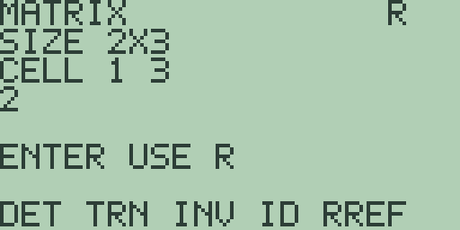
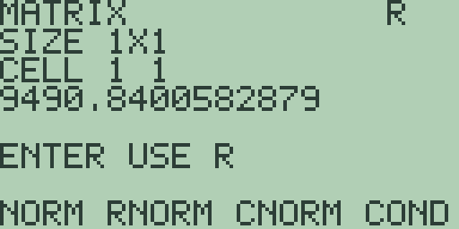
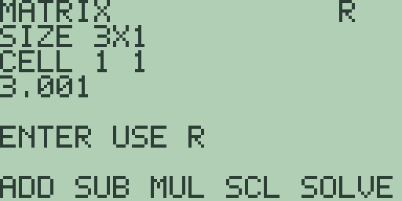
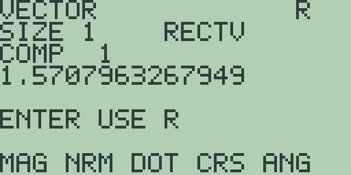
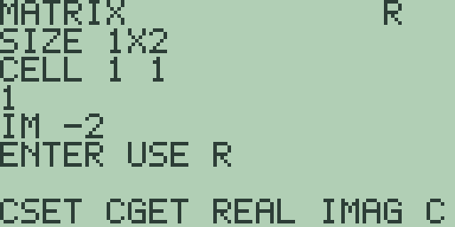
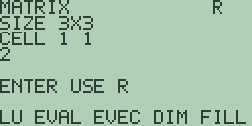

# Chapter 6: Explorations in Linear Algebra

Linear algebra is the mathematics of flat things: lines, planes, and the
transformations that carry them onto one another.

Its habitat on Free85 is small. Matrices at most 3 by 3, vectors of two or
three components. Small enough that every number in every register can be
looked at, which is the point rather than the price.

Chapter 2 used the matrix editor as a bookkeeper. This chapter uses it as a
laboratory: one system solved two ways, elimination watched move by move,
condition numbers, an orthonormal frame built by hand, eigenvectors, and
the `LU` factorisation.

Three habits carry the chapter and they are all consequences of one design
decision.

The editors keep three registers: `A` and `B` hold the operands you type,
and `R` holds the result of whichever key you press, read-only. One
selection cursor is shared by all three, so wherever a walk through one
register leaves it, that is where the next view opens.

Feeding a result into the next operation is one key. While `R` is on the
screen, the line above the soft keys reads `ENTER USE R`, and [ENTER]
copies the whole of it into `A`: dimensions, complex parts and all.

That is worth a note, because the first edition of this book made a virtue
of the alternative. There was no such key then, and I argued that retyping
each result by hand was what kept every intermediate step inspectable. It
did nothing of the kind. `R` is still read-only, results still land
somewhere they cannot be silently overwritten, and every step in this
chapter is still on the screen waiting to be looked at. What the retyping
added was typing, and a fair chance of a transcription slip in the middle
of an elimination you were checking *because* you did not trust it.

Read the result. Then press [ENTER] and carry on.

## 6.1 One system, two tools

A system of two linear equations is a pair of lines, and solving it is
finding their crossing.

Design the answer first, so you know when the machine is right: through the
point (2, 3) run the pair x + 2y = 8 and 3x - y = 3.

Free85 has two tools that recover the crossing from the coefficients alone,
and they explain themselves very differently. One names the point. The
other rewrites the system until it names itself.

1. Press [2nd] [STAT] (the `SIMULT` legend) for the simultaneous editor of
   Chapter 2, section 2.1: a fresh machine shows `SIZE 2`. Each row takes
   its coefficients and then its right-hand side, so type [1] [ENTER] [2]
   [ENTER] [8] [ENTER] for the first line, then [3] [ENTER] [(-)] [1]
   [ENTER] [3] [ENTER] for the second.

2. Press [F1], `SOLVE`. The result screen answers `UNIQUE SOLUTION` with
   `X 2` and `Y 3`: the crossing, named in one press.

3. Now the same system as a tableau. Press [EXIT].

   The home screen keeps a stale `= 3` from the result screen, and this one
   does not wipe: nothing was handed back to the entry line, so [CLEAR]
   answers `ENTRY EMPTY` rather than sweeping the old result away. Leave it
   where it sits.

   Press [2nd] [7] (the `MATRX` legend) for the matrix editor, and
   [x-VAR] [+] to grow the columns: `SIZE 2X3`. Type the same six values,
   [1] [ENTER] [2] [ENTER] [8] [ENTER] [3] [ENTER] [(-)] [1] [ENTER] [3]
   [ENTER], and press [F5], `RREF`.

   Register `R` opens on `CELL 1 1` reading `1`, and two presses of [▶]
   read `0` and then `2`: the first equation has become 1x + 0y = 2, and
   `CELL 1 3` holds the value of x:

   

   Three more presses read the second row, `0`, `1`, `3`, which says y = 3,
   and a sixth wraps the selection home.

   Notice what the tableau did that `SOLVE` did not. It did not compute the
   answer and report it; it rewrote the question until the answer was the
   only thing left written down. Those are genuinely different activities
   and section 6.2 is about the second one.

4. One number certifies that the crossing had to be unique. Press [ALPHA]
   twice to come back to `A`, then [-]: the resize keys still point at
   columns from the earlier [x-VAR], so the tableau narrows to `SIZE 2X2`,
   dealing its leftover values into the smaller square.

   Retype the coefficients from the top, [1] [ENTER] [2] [ENTER] [3]
   [ENTER] [(-)] [1] [ENTER], and press [F1], `DET`: `-7`.

   A nonzero determinant means the lines are not parallel, so they cross
   exactly once. A zero would have promised one of the two degenerate
   verdicts instead, and section 2.2's near-parallel pair is the warning
   about how little comfort a *small* nonzero determinant should give you.

The simultaneous editor scales to four unknowns and names its verdicts in
words, so it is the tool when only the answer matters. The tableau shows
the structure behind the verdict.

An augmented tableau fits the 3 by 3 world only up to two unknowns, so
three unknowns belong to the simultaneous editor, or to the matrix `SOLVE`
key with coefficients in `A` and right-hand sides down `B`'s first column.

**Try it.**

1. Enter the tableau 1, 2, 4, then 1, 2, 5: parallel lines. Predict what
   `RREF`'s bottom row will say before you press it, then check that the
   simultaneous editor answers `NO SOLUTION` for the same six values.
2. Design your own pair of lines through (3, 1), solve with both tools, and
   check the answers agree.
3. Compute `DET` for the coefficients 2, 4, 1, 2. Which verdicts remain
   possible for systems built on them, and which is ruled out?
4. Build a system whose determinant is 0.001 and whose answer is still
   perfectly definite. Then nudge a right-hand side by a thousandth and see
   what happens. What does that say about using `DET` as a safety check?

## 6.2 Row operations as algebra you can watch

Elimination rewrites a system again and again, and the licence for it is
that no row operation moves the solution set.

Adding a multiple of one equation to another, rescaling a row, and swapping
two rows each replace the system with a different description of the same
crossing. Each is reversible, which is the whole proof, and it is worth
convincing yourself of that before you start pressing keys.

Section 2.4 taught the choreography: the scale in `B`'s top-left cell,
results landing in `R`, one selection cursor shared by the three registers.
Here it serves the geometry.

The specimen is x + 2y = 5 and 3x + 4y = 11, two lines designed to cross at
(1, 2).

1. Press [2nd] [7], then [x-VAR] [+] for `SIZE 2X3`, and type the tableau:
   [1] [ENTER] [2] [ENTER] [5] [ENTER] [3] [ENTER] [4] [ENTER] [1] [1]
   [ENTER]. The entry wraps home, and [MORE] [MORE] brings back the
   row-operation page `REF SWAP RADD RMUL`.

2. First move: subtract three copies of row 1 from row 2.

   Press [ALPHA] for `B`, type [(-)] [3] [ENTER], and press [ALPHA] again
   for `A`, where the trip has stepped the shared selection to `CELL 1 2`.
   Press [▼] three times for `CELL 2 2`, any cell of row 2, and press [F3],
   `RADD`.

   Stepping through `R` reads `1`, `2`, `5`, then `0`, `-2`, `-4`.

   Now read that geometrically rather than as arithmetic. The new second
   row says -2y = -4, which is the horizontal line y = 2. The pair of lines
   has changed. The crossing has not: (1, 2) still satisfies both.

3. Carry the result forward as section 2.4 taught. The fifth [▶] left the
   selection at `CELL 2 3`, so one more wraps it home, and [ALPHA] twice
   returns the view to `A`.

   Retype the new tableau: [1] [ENTER] [2] [ENTER] [5] [ENTER] [0] [ENTER]
   [(-)] [2] [ENTER] [(-)] [4] [ENTER].

4. Second move: rescale the new row so its surviving coefficient is 1.
   Press [ALPHA], type [(-)] [.] [5] [ENTER], press [ALPHA], then [▼] three
   times for row 2, and press [F4], `RMUL`.

   Row 2 of `R` reads `0`, `1`, `2`: the line y = 2, the same horizontal
   line wearing its plainest equation. Rescaling changed the writing and
   not the line.

5. Carry forward again (wrap home, [ALPHA] twice, retype 1, 2, 5, 0, 1, 2),
   then make the last move: subtract two copies of row 2 from row 1. Store
   [(-)] [2] [ENTER] in `B` as before; back in `A` the selection sits at
   `CELL 1 2`, already in row 1, so press [F3], `RADD`.

   `R` reads `1`, `0`, `1`, then `0`, `1`, `2`. The lines are now x = 1 and
   y = 2: a vertical and a horizontal, whose crossing can be read off
   without solving anything.

   That is what elimination is for. Not to compute the answer, but to keep
   replacing the picture with an easier picture that has the same crossing,
   until the crossing is obvious.

6. The claim that nothing ever moved deserves a test.

   `A` still holds the half-finished tableau 1, 2, 5, 0, 1, 2 from step 5.
   Press [EXIT], then [2nd] [7]: re-entry always brings back the first
   soft-key page. Press [F5], `RREF`: `R` reads the same `1`, `0`, `1`,
   `0`, `1`, `2`.

   Machine elimination, started half-way through, lands exactly where the
   watched one did. Every stage described the same crossing, which is the
   licence stated at the top of the section, now demonstrated.

The copying between moves is the price of watching them separately. What it
buys is the geometry: three different pairs of lines on the way down, and
one unmoving point beneath all of them.

**Try it.**

1. Rerun the elimination after a [F2], `SWAP`, so the 3, 4, 11 row is on
   top. The moves need different scales; predict whether the finished
   tableau differs before you start.
2. Rescale row 1 of the original tableau by 10 with `RMUL`, carry the
   result to `A`, and apply `RREF`. Why was the answer never in doubt?
3. Enter 0, 2, 6, then 1, 1, 4. Which single row operation lets elimination
   start, and what does the finished tableau read?
4. Work out what row operation would turn the finished tableau back into
   the original one, and confirm that reversibility is not just a claim.

## 6.3 Norms and the condition number

Section 2.2 met a system whose answer would not stay still, and left the
diagnosis for this chapter. Here is the number that does it.

A norm is a size for a matrix, and sizes feed a more useful quantity: how
much a solve can amplify small errors in its data. Real data always carries
small errors, and a matrix sits between data and answer like a lever. The
condition number measures the lever.

This exploration builds one comfortable matrix and one designed trap, with
the fourth soft-key page whose legend overruns the screen edge.

1. Press [2nd] [7], then [+] [x-VAR] [+] [x-VAR] for `SIZE 3X3`, and type
   the comfortable specimen row by row: 1, 4, 0, then 2, 1, 1, then 0, 1,
   3, with [ENTER] after each value. Press [MORE] [MORE] [MORE] for the
   page reading `NORM RNORM CNORM COND`.

2. Press [F1], `NORM`: `5.744562646538`, the square root of 33, which is
   the sum of the nine squared cells. Press [F2], `RNORM`: `5`, the largest
   row sum of absolute values, from the row 1, 4, 0. Press [F3], `CNORM`:
   `6`, the largest column sum, from the middle column 4, 1, 1.

   Three different answers to "how big is this matrix", all reasonable.
   Which one you want depends on what you are about to do with it, and for
   the next step it is the first.

3. Press [F4], `COND`: `4.242640687119`, the square root of 18.

   `COND` multiplies the Frobenius norm of `A` by the Frobenius norm of its
   inverse: the forward stretch times the return stretch. A value this
   small is a promise that answers move on the same scale as the data.

4. Hold the promise to account. This coefficient matrix with right-hand
   sides 5, 4, 4 was designed to solve as x = y = z = 1.

   Press [ALPHA] for `B`, resize it to a column with [+] [x-VAR] [-]
   [x-VAR] (`SIZE 3X1`), type 5, 4, 4 with [ENTER] after each, and press
   [ALPHA] to return to `A`. Press [EXIT], [2nd] [7], then [MORE] for the
   page `ADD SUB MUL SCL SOLVE`, and press [F5], `SOLVE`.

   Stepping through the `SIZE 3X1` result reads `0.9999999999998`, `1`,
   `1.0000000000001`: three ones under a grain of fourteen-digit dust.

5. Now nudge the data. One more [▶] wraps the selection home; press [ALPHA]
   for `B`, type [5] [.] [0] [0] [1] [ENTER] over the first entry, press
   [ALPHA], and press [F5] again.

   `R` reads `0.9999090909089`, `1.0002727272727`, `0.9999090909091`.

   A change of one part in five thousand moved no answer by more than three
   parts in ten thousand. The comfortable matrix keeps its word, and the
   amplification is under one, which is better than `COND` promised.

6. The trap is three rows that nearly repeat each other. Wrap the selection
   home with [▶], press [ALPHA] twice for `A`, and retype it as 1, 1, 1,
   then 1, 1.001, 1, then 1, 1, 1.001, with [ENTER] after each value. Press
   [MORE] [MORE] for the norms page and press [F4], `COND`:

   

   `9490.8400582879`.

   Nothing has gone wrong yet. The number is a forecast, and it forecasts
   trouble on the order of ten thousand to one. Write that down and see
   whether it is fair.

7. Watch the forecast come true. Press [ALPHA] for `B` and type the
   designed right-hand sides [3] [ENTER] [3] [.] [0] [0] [1] [ENTER] [3]
   [.] [0] [0] [1] [ENTER]; press [ALPHA], then [EXIT], [2nd] [7], [MORE],
   and [F5], `SOLVE`.

   Stepping through `R` reads `1`, `1`, `1`, exact to every digit. For
   perfect data the trap stays politely shut, which is exactly why nobody
   notices it until it matters.

8. Give it imperfect data. One more [▶] wraps home; press [ALPHA], type [3]
   [.] [0] [0] [1] [ENTER] over the first entry, press [ALPHA], and press
   [F5]:

   

   `R` now reads `3.001`, `0`, `0`.

   The same one-thousandth nudge that step 5 shrugged off has tripled x and
   thrown y and z from 1 to 0. That is an amplification of roughly two
   thousand, squarely in `COND`'s warned range.

   Nearly repeated rows force the solve to take differences of nearly equal
   numbers, and tiny data errors decide those differences outright. It is
   section 2.2's near-parallel receipts in three dimensions, and the
   condition number is the thing that would have warned you before you ran
   anything.

The lesson travels: before trusting a solve, ask `COND` first. A few is
comfortable, thousands is a warning, and exactly dependent rows end the
story at the `SINGULAR MATRIX` notice, which is the same guard `INV`
raises.

**Try it.**

1. Type the 3 by 3 identity into `A` and ask `COND`. Predict the answer
   before you press it, then say why no 3 by 3 matrix can answer less.
2. Return to the trap system of step 7 and nudge the *third* right-hand
   side to 3.002 instead. Which unknowns jump this time, and by how much?
3. Soften the trap: retype the near-repeats as 1.01 and ask `COND` again.
   How much smaller is the warning, and how big is step 8's jump now?
4. Section 2.2's two-by-two receipts had the same disease. Put both of them
   into `A` in turn and compare their `COND` values. Does the number
   predict what you saw there?

## 6.4 Building a frame of your own

Two directions are orthogonal when they meet at a right angle, and the dot
product turns that geometry into one number: zero exactly when the angle is
right.

This exploration measures a designed pair, straightens one against the
other, and then does the whole job properly: three arbitrary directions
turned into three mutually perpendicular ones. That process has a name,
Gram-Schmidt, and it is the piece of machinery underneath a great deal of
applied linear algebra.

1. Press [2nd] [8] (the `VECTR` legend): a fresh machine shows `SIZE 3`
   with the `RECTV` tag. Type the first arrow, [5] [ENTER] [2] [ENTER] [0]
   [ENTER], press [ALPHA] for `B`, type the second, [1] [ENTER] [2] [ENTER]
   [2] [ENTER], and press [ALPHA] to return to `A`.

2. Press [F1], `MAG`: `5.3851648071345`, the square root of 29. The
   second's length is 3 on paper, since 1 plus 4 plus 4 is 9.

3. Press [F3], `DOT`: `9`, not zero, so the pair is not orthogonal. Press
   [F5], `ANG`: `0.9799235766495`, the angle between them in the fresh
   machine's `RAD` mode, a little over 56 degrees.

4. Straightening is one designed subtraction. The shadow of the first arrow
   along the second has length the dot product over the length squared, and
   9 over 9 is exactly one copy of `B`.

   Press [MORE] for the page `ADD SUB SCL 2D 3D`, then [F2], `SUB`: `R`
   reads `4`, `0`, `-2`, the first arrow with its shadow removed.

5. Carry the result into `A`: two presses of [▶] read the remaining
   components, one more wraps the selection home, [ALPHA] twice returns to
   `A`, and retyping [4] [ENTER] [0] [ENTER] [(-)] [2] [ENTER] stores it.

   Press [EXIT], then [2nd] [8], and the first soft-key page is back. Press
   [F3], `DOT`: `0`, exactly. Press [F5], `ANG`:

   

   `1.5707963267949`: half of `PI` to fourteen digits, the right angle
   confirmed twice over.

### Three at once

That was one straightening. Do it twice more in the right order and you
turn any three independent directions into a frame.

The recipe: keep the first as it is. Take the second and subtract its
shadow on the first. Take the third and subtract its shadows on both of the
first two. Each subtraction removes exactly the part that was not
perpendicular, and because you work in order, each new vector is
perpendicular to everything already fixed.

The three starting directions are (1, 1, 0), (1, 0, 1) and (0, 1, 1), which
are independent and not remotely perpendicular.

6. Keep the first. Press [EXIT] and [2nd] [8], type [1] [ENTER] [1] [ENTER]
   [0] [ENTER] into `A`, and press [F1], `MAG`: `1.4142135623731`, the
   square root of 2.

7. Now the second. Press [ALPHA] and type [1] [ENTER] [0] [ENTER] [1]
   [ENTER] into `B`, press [ALPHA], and press [F3], `DOT`: `1`.

   So the shadow of (1, 0, 1) on (1, 1, 0) is 1 over 2 of it, which is
   (0.5, 0.5, 0), and the straightened second direction is
   (1, 0, 1) minus that, which is (0.5, -0.5, 1). Work that out on paper
   rather than reaching for `SCL` and `SUB`; the arithmetic is easier than
   the register-shuffling.

   Check it. Press [EXIT] and [2nd] [8], type [.] [5] [ENTER] [(-)] [.] [5]
   [ENTER] [1] [ENTER] into `A`, press [ALPHA], type the first direction
   [1] [ENTER] [1] [ENTER] [0] [ENTER] into `B`, press [ALPHA], and press
   [F3], `DOT`: `0`, exactly.

   Press [F1], `MAG`: `1.2247448713916`, which is the square root of 1.5.

8. Now the third, which needs two shadows removed.

   Press [EXIT] and [2nd] [8], type [0] [ENTER] [1] [ENTER] [1] [ENTER]
   into `A`, press [ALPHA], type [1] [ENTER] [1] [ENTER] [0] [ENTER] into
   `B`, press [ALPHA], and press [F3], `DOT`: `1`. So its shadow on the
   first is again a half of it.

   Press [EXIT] and [2nd] [8], type (0, 1, 1) into `A` again, press
   [ALPHA], type the straightened second [.] [5] [ENTER] [(-)] [.] [5]
   [ENTER] [1] [ENTER] into `B`, press [ALPHA], and press [F3], `DOT`:
   `0.5`. Its length squared was 1.5, so the shadow is a third of it.

   Subtracting both shadows on paper: (0, 1, 1) minus (0.5, 0.5, 0) minus a
   third of (0.5, -0.5, 1) gives (-2/3, 2/3, 2/3).

9. Check the frame. Press [EXIT] and [2nd] [8], then type the third
   direction into `A`. Its components are minus two thirds and then two
   thirds twice, so the first is
   [(-)] [.] [6] [6] [6] [6] [6] [6] [6] [6] [6] [6] [6] [6] [7] [ENTER]
   and the other two are the same digits without the sign.

   Press [ALPHA], type the first direction (1, 1, 0) into `B`, press
   [ALPHA], and press [F3], `DOT`: `0`, exactly.

   Now do it against the second. Retype `B` as (0.5, -0.5, 1) and press
   `DOT` again: `-1E-14`.

   Not zero. Look at that carefully, because it is the more instructive of
   the two answers.

   The first check came out exactly zero because the arithmetic happened to
   cancel exactly in fourteen digits. The second did not, because two
   thirds is not a terminating decimal and you typed a rounded version of
   it. `-1E-14` is a computed zero rather than an exact one, and telling
   the two apart is a skill this book keeps asking for.

   Nothing has gone wrong. A dot product of minus a hundred-trillionth
   between two vectors of length around one means an angle that differs
   from a right angle by about that much. It is as perpendicular as
   fourteen digits can express.

10. One key completes the set a different way. With any two of the frame in
    `A` and `B`, press [F4], `CRS`: the cross product is perpendicular to
    both by construction, no subtraction needed.

    That is worth knowing as a shortcut and worth not relying on, because
    it only works in three dimensions and only for the third vector.
    Gram-Schmidt works in any number of dimensions and for any number of
    vectors, which is why it is the method people actually use.

The vector world here has two or three components: the plane and space are
its whole territory. `CRS` insists on all three, since the cross product
only lives in three dimensions, and two-component vectors stop at
`DIMENSION ERROR`. Longer columns of numbers are data, and belong to the
list editor.

**Try it.**

1. Straighten your own pair: with 3, 1, 2 in `A` and 1, 1, 1 in `B`, the
   shadow is two copies of `B`. Build it with `SCL`, carry registers as
   needed, subtract, and confirm with `DOT`.
2. Normalise all three of the frame from step 9 with `NRM` and check that
   each has length 1 with `MAG`. You now hold an orthonormal frame; what
   would you use one for?
3. Run Gram-Schmidt on the same three directions in a *different order*,
   starting with (0, 1, 1). Do you get the same frame? Should you?
4. Try Gram-Schmidt on three directions that are not independent, such as
   (1, 1, 0), (1, 0, 1) and (2, 1, 1). Predict what goes wrong at the last
   subtraction, then watch it happen.
5. Step 9 got an exact zero and a computed one. Construct a case where both
   checks come out exactly zero, and say what is special about the numbers
   you chose.

## 6.5 Eigenvalues and eigenvectors

Multiply a vector by a matrix and its direction usually turns.

The directions a matrix keeps are its eigenvectors, the stretch it applies
along each is the eigenvalue, and between them they are the matrix's
character in summary. This exploration catches a kept direction by
multiplication, then lets the machine find the full set, in two sizes and
one complex surprise.

1. Press [2nd] [7] and type the specimen 5, 2, then 2, 2, with [ENTER]
   after each value.

   Give `B` a test arrow: press [ALPHA], resize to a column with [x-VAR]
   [-] [x-VAR] (`SIZE 2X1`), type [1] [ENTER] [0] [ENTER], and press
   [ALPHA] to return to `A`. Press [MORE] for the arithmetic page, then
   [F3], `MUL`: `R` reads `5` and, one [▶] later, `2`.

   The direction due east went out east-north-east. Turned.

2. Try the arrow the matrix was designed around. One more [▶] wraps the
   two-cell result home; press [ALPHA], type [2] [ENTER] [1] [ENTER], press
   [ALPHA], and press [F3] again: `R` reads `12` and then `6`, which is six
   copies of 2, 1.

   Direction kept, length stretched sixfold. So (2, 1) is an eigenvector
   with eigenvalue 6, and you have found it by trying rather than solving,
   which is worth doing once before you let a key do it.

3. The machine finds the whole set in one press. Press [▶] to wrap home,
   then [MORE] [MORE] [MORE] for the page `LU EVAL EVEC DIM FILL`, and
   press [F2], `EVAL`: a `SIZE 1X2` result reading `6` and, one [▶] later,
   `1`.

   Press [F3], `EVEC`: a `SIZE 2X2` result, one normalised eigenvector per
   column, and stepping through reads `0.89442719099991`,
   `0.44721359549996`, `0.44721359549996`, `-0.89442719099991`.

   The first column is (2, 1) divided by its length; the second, (1, -2)
   over the same root 5, is the direction stretched by 1. Check the first
   against step 2 on paper.

4. A 3 by 3 next, chosen triangular so the answers are visible in advance:
   zeros above the diagonal mean the diagonal itself lists the eigenvalues.

   One more [▶] wraps the selection home; press [ALPHA] twice for `A`, grow
   it with [+] [x-VAR] [+] [x-VAR] (`SIZE 3X3`), and type 2, 0, 0, then 1,
   3, 0, then 4, 5, 6, with [ENTER] after each.

   Press [F2], `EVAL`, and give it time: a 3 by 3's roots take the machine
   far longer than a 2 by 2's. The `SIZE 1X3` result reads
   `6.0000000000007`, then `2.0000000000007`, then `3`.

   The diagonal promised 2, 3 and 6, and the iterative hunt delivered them
   a whisker off in the final digits. That is the difference between
   reading an answer off and searching for it, and it is worth seeing on a
   case where you know the truth.

5. Press [F3], `EVEC`, and give it time again. Stepping through the
   `SIZE 3X3` result, the first column occupies the first, fourth and
   seventh cells: `0`, then `-1.4E-13`, then `-1`.

   That is the third axis direction times minus one, dust included. Any
   rescaling of an eigenvector is the same eigenvector, so a minus sign
   carries no information and neither does the dust.

6. Check it by multiplying, where the arithmetic is exact. Step [▶] three
   times more to wrap home, press [ALPHA] for `B`, grow it to `SIZE 3X1`
   with [+], and type [0] [ENTER] [0] [ENTER] [1] [ENTER]. Press [ALPHA],
   then [EXIT], [2nd] [7], [MORE], and [F3], `MUL`: `R` reads `0`, `0`,
   `6`, exactly six copies of the third axis.

   The dusty search and the clean multiplication agree, which is the right
   way round to check an iterative answer: with an exact one.

7. Last, a matrix that keeps no direction at all. Press [▶] once to wrap
   home, press [ALPHA] twice for `A`, shrink it with [-] [x-VAR] [-]
   [x-VAR] (`SIZE 2X2`), and type 1, -2, then 2, 1, using [(-)] for the
   sign.

   This matrix turns every arrow by the same angle and stretches it by root
   5, so nothing real can be kept. Predict what `EVAL` will say before you
   press it.

   Press [MORE] [MORE] [MORE] for the eigensystem page and press [F2],
   `EVAL`: both cells read `1`.

   That looks wrong and is not. The real parts are only half the story, and
   the other half lives on the final soft-key page: press [MORE], and an
   `IM` line appears under the selected cell:

   

   `IM -2` beneath the first cell, and after [▶], `IM 2` beneath the
   second. The eigenvalues are 1 minus 2i and 1 plus 2i.

   A conjugate pair is how a real matrix says "I rotate", and the pair's
   shared size, root 5, is the stretch. Everything the matrix does is in
   those two numbers, and none of it is visible if you only look at the
   real parts.

**Try it.**

1. Predict the eigenvalues and eigenvectors of 3, 1, 1, 3 from its symmetry
   alone, then let `EVAL` and `EVEC` grade the prediction.
2. On the first specimen 5, 2, 2, 2, check that the two eigenvalues add up
   to the diagonal sum and multiply to `DET`'s answer. Both facts hold for
   every square matrix; verify them on the 3 by 3 too.
3. Ask `EVAL` about 0, -3, 3, 0, a quarter-turn with stretch. Predict the
   cells and the final page before you press anything.
4. The eigenvectors of step 3 came back normalised. Multiply the first
   column by the matrix by hand and confirm you get 6 times it, dust
   included.

## 6.6 LU as elimination's ledger

Elimination does work worth keeping.

The multipliers used on the way down and the triangle left at the bottom
record the entire sweep, and with both in hand any new right-hand side
costs only two short substitution passes. That is why solving many systems
with one matrix is cheap everywhere in computing, and it is the reason `LU`
exists at all.

Free85's `LU` key shows the ledger whole: `U` on and above the diagonal,
the multipliers of the unit lower triangle `L` below.

1. Press [2nd] [7], then [+] [x-VAR] [+] [x-VAR] for `SIZE 3X3`, and type
   the designed specimen 2, 1, 1, then 4, 5, 4, then 2, 10, 11, with
   [ENTER] after each value. Press [F1], `DET`, first: `24`, a figure to
   keep in mind.

2. Press [MORE] four times for the page `LU EVAL EVEC DIM FILL`, and press
   [F1], `LU`. Stepping through the `SIZE 3X3` result reads `2`, `1`, `1`,
   then `2`, `3`, `2`, then `1`, `3`, `4`.

   Read it in two layers. On and above the diagonal sits `U`: rows 2, 1, 1
   and 0, 3, 2 and 0, 0, 4. Below sit the multipliers 2, 1 and 3.

   The ledger replays on paper. Row 2 of the specimen is 2 times (2, 1, 1)
   plus (0, 3, 2), and row 3 rebuilds the same way from its multipliers 1
   and 3. Do that arithmetic yourself; the whole point of a ledger is that
   somebody can check it.

3. The diagonal of `U` reads 2, 3, 4, and their product is 24: the
   determinant is elimination's by-product, which is why `DET` and `LU` sit
   in the same toolbox. Step 1's answer was on the ledger all along, and
   `DET` almost certainly computed it this way.

4. Elimination cannot start on a zero, and the ledger records the repair
   too. Press [▶] once to wrap the selection home, press [ALPHA] twice for
   `A`, and retype it as 0, 2, 1, then 2, 4, 6, then 1, 1, 1, with [ENTER]
   after each value.

   Press [EXIT], then [2nd] [7] for the first page, and press [F1], `DET`:
   `6`. Now press [MORE] four times and press [F1], `LU`:

   

   Stepping through reads `2`, `4`, `6`, then `0`, `2`, `1`, then `0.5`,
   `-0.5`, `-1.5`.

   The top row is the *second* row of the matrix. The factorisation swapped
   rows before starting, exactly as a hand elimination would when the pivot
   position holds a zero.

5. The swap shows up in step 3's shortcut. The diagonal now reads 2, 2,
   -1.5, whose product is -6, while `DET` answered `6`.

   Each row swap flips the determinant's sign, and the ledger keeps the
   flip. So the shortcut is not "multiply the diagonal" but "multiply the
   diagonal and count the swaps", and this is the case that teaches you the
   second half.

   The row order itself, 2 then 1 then 3, lands in the vector editor's
   result register as the factorisation runs, overwriting whatever was
   there. Keep nothing precious in that register when `LU` runs. That is a
   wart and I know it: the permutation had to go somewhere, and a register
   that already existed was cheaper than a new object with a new type and a
   new way of being displayed.

On a machine whose world is 3 by 3, the saving `LU` represents is a lesson
rather than a speed-up. But it is the right lesson: `SOLVE`, `INV` and
`DET` all begin with this same sweep, and `LU` is the receipt showing their
common core.

**Try it.**

1. Run `LU` on 3, 1, 0, then 6, 4, 1, then 0, 2, 5, and read off the
   multipliers and `U`. Check the diagonal's product against `DET`, and say
   whether a swap happened before you look at the top row.
2. Rebuild the third row of step 1's specimen on paper from the ledger's
   multipliers 1 and 3, without looking at `A`.
3. Design a matrix whose elimination needs a swap, and predict the sign
   relation between `DET` and the `LU` diagonal's product before pressing
   either key.
4. Use the ledger of step 2 to solve the system with right-hand sides 4,
   14, 25, by forward substitution down `L` and back substitution up `U`,
   entirely on paper. Then check with `SOLVE`. That is the two short passes
   the section opened with, and doing it once is worth a chapter of
   description.
