# Chapter 7: Explorations in Differential Equations

Most of the equations in this book say what a quantity *is*. A differential
equation says only how fast it is changing, and leaves you to reconstruct
the quantity from that.

Free85 reconstructs it the plainest way there is. It starts at a known
point and walks forward in small straight steps, which is Euler's method
and the whole of the machine's numerical story. There is no adaptive step,
no error control, no cleverness at all.

That plainness is the opportunity. Every choice the method makes is
visible, its error can be measured against solutions you work out yourself,
and the program environment of Chapter 4 can be pointed at the same
equation to see whether a better step does better. A more sophisticated
integrator would hide all of that behind an answer.

The mode is the Guidebook, chapter 7; programs are chapter 16.

Three habits carry the chapter, and the first one catches everybody once.

The initial value is seeded from the ordinary variable `Y` when the mode is
*first entered*, and frozen there. Store it before you switch modes.
Storing a new one afterwards does nothing at all, and section 7.7 has the
deliberately stiff lever that resets it.

The entry line never clears itself: the home screen hands the stored slope
back whenever you leave the plot, and [GRAPH] stores whatever the line
holds, so an empty line pressed into [GRAPH] wipes the equation.

And every plot must be left to draw to its end. Integrating one column at a
time is slow work and presses arriving mid-draw are dropped.

## 7.1 Slope thinking

A differential equation is a rule for the tangent.

Write dy/dx = f(x, y) and you have been handed, at every point of the
plane, the direction a solution through that point must set off in. Nothing
has been solved. A direction has been posted at every address, and reading
those directions before you touch the machine is most of the skill.

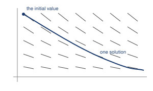

That picture is the way to think about it, and it is worth saying at once
that Free85 will not draw it for you. The mode integrates solutions; it
does not paint directions. The picture is here because you need it in your
head, not because a key produces it.

The model for this chapter is a mixing tank of my own design. A 500-litre
tank has been dosed to 9 grams of tracer dye per litre. Clean water runs in
at 75 litres a minute and the stirred mixture runs out at the same rate, so
each minute the tank loses 75/500, or 15 per cent, of the dye it happens to
hold.

With y for the concentration in grams per litre and x for the time in
minutes, the rule is dy/dx = -0.15y.

1. Read the rule before solving it. Press [CLEAR], type [(-)] [.] [1] [5]
   [×] [9], and press [ENTER]: `= -1.35`. That is the rate of fall at the
   moment of dosing.

   Press [CLEAR] and ask the same at a third of the dose, [(-)] [.] [1]
   [5] [×] [3]: `= -0.45`.

   The slope shrinks in exact proportion to what is left, which already
   gives you the shape without any machinery: a steep drop flattening into
   a long tail, never quite reaching zero, because the rule stops pushing
   when there is nothing left to push.

   Write that shape down. In a moment you will see whether you were right,
   and being right for the right reason here is worth more than the plot.

2. Seed the initial value. Press [CLEAR], type [9] [STO▶] [ALPHA] [0] (the
   letter `Y`), and press [ENTER]: `= 9`.

3. Press [CLEAR], then [GRAPH] for the graph screen, then [2nd] [MORE] for
   the format page and [MORE] twice more for the page reading
   `FN POL PAR DEQ GC`. Press [F4], `DEQ`, and let the replot finish.

   A flat line sits high in the window. With no slope stored the mode
   carries the seeded 9 straight across, which is the receipt for the
   seeding: it tells you the 9 arrived.

4. Press [EXIT] for the home screen, where the entry line is empty. Type
   [(-)] [.] [1] [5] [×] [ALPHA] [0] so the line reads `-.15*Y`, and press
   [GRAPH]:

   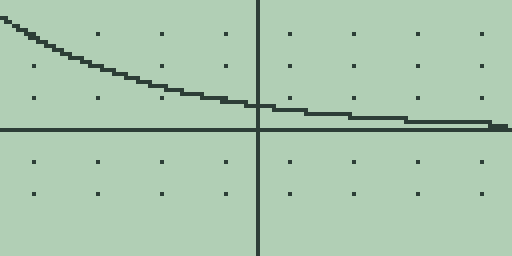

   Let the plot finish.

   The solution starts at the *left window edge* and walks right, which
   fixes the arithmetic of the whole chapter: the tank is dosed at `XMIN`,
   so elapsed time is x + 10 in the standard window. Get that wrong once
   and every reading in this chapter is out by ten minutes.

5. Read the story off the curve. Press [▶] once: `X=0.236220472438` with
   `Y=1.9028746602579`. So ten and a bit minutes after dosing, a fifth of
   the dye is left.

   Press [◀] once, letting the readout settle: `X=0.078740157478` with
   `Y=1.9489119504254`. A column is worth about a twentieth of a gram per
   litre here, which is a fifth of what a column is worth at the left edge
   where the walk begins. The curve is flattening, exactly as step 1 said
   it would.

Slots 2 and 3 exist in this mode but the plot ignores them. One
first-order equation is what the mode integrates, so the habit of stacking
a family three at a time, learned in Chapter 1, does not travel here. That
turns out to matter a great deal in section 7.6, where a family is exactly
what you want.

**Try it.**

1. Work out on paper how long the tank takes to fall to half its dose.
   Write the number down. Then find the same half-way point on the plot
   with [◀] and [▶] and see how close the machine puts it.
2. Store `-.3*Y` instead, by pressing [EXIT], [CLEAR] and retyping, and
   replot. Before you look: where on the new curve does the solution reach
   the value the old one reached at x = 0?
3. Predict the plot of `.15*Y` before pressing [GRAPH], including which
   edge of the window the curve leaves by. Then draw it. Why does the
   initial condition make that inevitable?
4. The slope at any point depends on `Y` and not on `X`. What does that
   tell you about the slope field of the diagram above, and what would you
   expect two solutions started at different times to look like?
5. A tank of twice the volume with the same flow loses 7.5 per cent a
   minute. Predict how its half-way time compares with the original's,
   then check by storing `-.075*Y`.

## 7.2 The window is the step

Euler's method needs a step size, and Free85 never asks you for one.

It takes the step from the window. The solution is sampled once per plotted
column, so the step is the window's width divided by 127. No setting
overrides it and no tolerance tightens it.

That is worth stating plainly because it makes the zoom keys into this
mode's numerical controls, which is not where anybody expects to find them.
Zooming in on a solution does not magnify a picture you already have. It
recomputes the whole thing at a finer step, and gives you a different
answer.

1. With the tank's solution plotted, press [MORE] for the table. The `Y1`
   column holds the integrated solution: `X=0` reads `1.972`, then `1.694`,
   `1.455`, `1.250`, `1.074`, `0.923` at `X=5`.

   Press [▲] to page back five rows: `X=-5` reads `4.213`, and the page
   runs down to `1.972` again.

2. Press [EXIT] to leave the table and let the plot redraw, then [EXIT]
   again for the home screen. It hands `-.15*Y` back to the entry line and
   publishes `= 1.9724874982123`.

   That is the last value the table worked out: the fourteen-digit face of
   the `1.972` cell, whose five-character column truncated the rest away.
   The table is not rounding for effect, it is running out of room.

3. Press [CLEAR] and measure the step: [2] [0] [÷] [1] [2] [7] [ENTER]
   gives `= 0.15748031496063`, twenty units of x across 127 intervals.

   Now get the truth to compare against. A quantity falling at 15 per cent
   of itself per minute is 9 times e to the power -0.15t after t minutes,
   and the `X=0` row is t = 10. Press [CLEAR] and type [9] [×] [2nd] [LN]
   (which inserts `EXP(`) [(-)] [1] [.] [5] [)] [ENTER]:
   `= 2.0081714413361`.

   Euler is low by about 0.036, or 1.8 per cent. Low, not high, and that is
   not luck: each straight step leaves along the tangent, and a tangent
   falls away below a curve that bends upwards.

4. Halve the step by halving the window. Press [CLEAR], retype
   [(-)] [.] [1] [5] [×] [ALPHA] [0], press [GRAPH] to store the equation
   back and replot, then press [+] once and let the replot finish:

   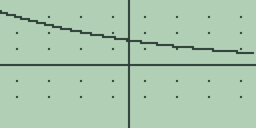

5. Press [MORE] for the table. The `X=0` row now reads `4.232`, not
   `1.972`.

   Nothing about the tank has changed. The *experiment* has.

   Press [▲] to page back: `X=-5` reads `9`, which is the initial condition
   itself, and every row above reads `UNDEF`. Narrowing the window did not
   zoom in on the old solution. It re-based the run, so `X=0` is now five
   minutes after the dose rather than ten.

6. Press [EXIT] twice for the home screen and press [CLEAR]. Type [1] [0]
   [÷] [1] [2] [7] [ENTER]: `= 0.078740157480315`, exactly half the old
   step.

   Press [CLEAR], retype the equation, press [GRAPH], then [2nd] [+] for
   the standard window, and let the replot finish.

So two things moved between step 3 and step 5, and only one of them was the
step size. The run got *shorter* as well as finer, so the comparison proves
nothing on its own. That is a badly designed experiment and it is worth
recognising as one: if you change two things and the answer moves, you have
learned nothing about either.

Section 7.3 turns it into a controlled measurement.

**Try it.**

1. From the standard window press [-] once for the doubled window and read
   the `X=0` row. What is the step now, and how far from the truth at
   twenty minutes does the reading fall? Predict the direction of the error
   before you look.
2. Work out from step 3's figure which column of the standard window lands
   closest to five minutes after the dose. Trace to it and compare with the
   exact value that `9*EXP(-.75)` gives.
3. The `Y2` and `Y3` columns read `-` throughout. Store something in slot 2
   with [2nd] [2], see what the column does, and explain it from the note
   that closes section 7.1.
4. Step 5 said narrowing the window re-bases the run. Work out what the
   `X=0` row would read after *two* presses of [+], before you press
   anything, then check.

## 7.3 Step-size experiments

To measure how a method converges you hold the question still and vary only
the step.

Here the question is: what is the concentration 3.5 minutes after dosing?
The complication is that halving the window moves the dosing point too, so
3.5 minutes after the dose sits at a different `X` in each window: -6.5 in
the standard one, -1.5 in the halved one, 1 in the one after that. Work
that out on paper first, because looking up the wrong row is the easiest
mistake in this section.

1. In the standard window press [MORE] for the table, which opens where
   section 7.2 left it, at `X=-10` in steps of 1. Press [-] once to halve
   the table step to 0.5, then press [▼] once to page down five rows:

   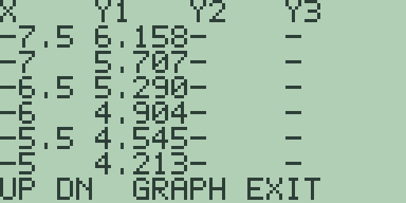

   The rows run `-7.5` to `-5`, and the `X=-6.5` row reads `5.290`.

2. Press [EXIT] to leave the table and press [+] for the halved window,
   letting each replot finish. Press [MORE]: the table opens on rows now
   outside the window, reading `UNDEF` down to `X=-5`, where `9` sits.
   Press [▼] twice, letting each page settle: the `X=-1.5` row reads
   `5.307`.

3. Press [EXIT] and press [+] again. The plot comes up empty, because the
   vertical zoom has come down to -2.5 to 2.5 and the solution spends the
   whole run above it.

   The table does not mind at all. Press [MORE], then [▼] once: the `X=1`
   row reads `5.315`. That is worth remembering: when the zoom has thrown
   the curve off the screen, the table is still the whole instrument.

4. Press [EXIT], press [2nd] [+] to restore the standard window, and let
   the replot finish. Press [EXIT] for the home screen and [CLEAR]. Type
   [5] [÷] [1] [2] [7] [ENTER] for the third step,
   `= 0.039370078740157`, press [CLEAR], and ask for the truth at 3.5
   minutes, [9] [×] [2nd] [LN] [(-)] [.] [5] [2] [5] [)] [ENTER]:
   `= 5.3239982793029`.

| Window | Step | Reading at 3.5 minutes | Gap |
| --- | --- | --- | --- |
| -10 to 10 | `0.15748031496063` | `5.290` at `X=-6.5` | 0.034 |
| -5 to 5 | `0.078740157480315` | `5.307` at `X=-1.5` | 0.017 |
| -2.5 to 2.5 | `0.039370078740157` | `5.315` at `X=1` | 0.009 |

Halve the step and the error halves. That is Euler's signature and its
disappointment: the method is first order, so one more decimal place costs
ten times the work. Compare the midpoint rule of Chapter 4, which quartered
its error per halving, and you can see why nobody integrates anything
seriously with Euler.

Two boundaries showed themselves on the way. Table rows outside the window
read `UNDEF`, because the run *is* the window. And the zoom keys move both
axes together, so a window narrow enough to refine the step may be far too
short to show the curve at all.

**Try it.**

1. Press [+] a third time and hunt for the 3.5-minute reading. Work out
   which `X` it needs from the new bounds first, then look that row up.
   What does the answer tell you about refining a step by zooming?
2. The gaps above are roughly 0.21 times the step. Use that to predict the
   step needed for a gap under 0.001, and say how many halvings that is.
   Then say whether the window that fine would show you anything.
3. Take the doubled window ([-] from standard) and repeat the measurement.
   Predict the gap first from the pattern, then check whether it doubles.
4. The constant 0.21 is not arbitrary. It is roughly half the second
   derivative of the true solution near this point. Work that out on paper
   from the exact solution and see how close 0.21 is.

## 7.4 An Euler program

The window is symmetric, so section 7.3 could not hold the interval fixed
while the step shrank. A program has no such trouble, because the step
becomes a number in a memory instead of a consequence of the picture.

This one walks the same equation with the step in `H` and the number of
steps in `N`.

The program never names the model. `EVAL(` reads the stored slope, so the
calculus command does the modelling and the program does only the
arithmetic. That is worth setting up carefully, so before typing anything,
find out what `EVAL(` is actually reading.

Press [CLEAR] and spell `EVAL(0)`, then press [ENTER]:
`= -0.064835852069246`. Press [CLEAR] and ask `EVAL(5)`: the same answer,
because the stored slope has no `X` in it at all.

What it does contain is `Y`, which is an ordinary variable the mode uses as
scratch while integrating. Press [CLEAR] and ask [ALPHA] [0] [ENTER]:
`= 0.43223901379497`, left there by the last plot at the right-hand window
edge. So the program has to seed `Y` itself, or it will start from wherever
the last plot happened to stop.

1. Press [CLEAR], then [PRGM] and [F1], `NEW`. The editor opens on
   `EDIT P1`. Type the eight lines, [ENTER] after each; letters are [ALPHA]
   plus the key carrying the letter, spaces are [2nd] [0] in this editor,
   and [STO▶] types the `->` arrow.

   | Line | Text | Keys |
   | --- | --- | --- |
   | 1 | `9->Y` | [9] [STO▶] [Y] |
   | 2 | `.5->H` | [.] [5] [STO▶] [H] |
   | 3 | `7->N` | [7] [STO▶] [N] |
   | 4 | `WHILE N` | [W] [H] [I] [L] [E] [2nd] [0] [N] |
   | 5 | `Y+H*EVAL(0)->Y` | [Y] [+] [H] [×] [E] [V] [A] [L] [(] [0] [)] [STO▶] [Y] |
   | 6 | `N-1->N` | [N] [-] [1] [STO▶] [N] |
   | 7 | `END` | [E] [N] [D] |
   | 8 | `DISP Y` | [D] [I] [S] [P] [2nd] [0] [Y] |

   Line 5 is Euler's method entire: the new y is the old y plus the step
   times the slope at the old y. Everything else is bookkeeping.

   Seven steps of 0.5 carry the walk 3.5 minutes from the dose, which is
   section 7.3's question asked a second way, and now with the interval
   held still.

2. Press [F2], `RUN`:

   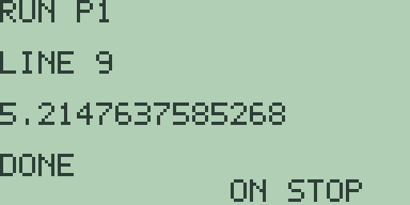

   The run screen answers `RUN P1` over `LINE 9`, the output line shows
   `5.2147637585268`, and the status reads `DONE`. Against the truth of
   `5.3239982793029`, the walk is low by 0.109.

3. Halve the step. Press [PRGM] for the list and [F1] to reopen `EDIT P1`
   at line 1, press [▼] for line 2, press [CLEAR], and type `.25->H`.
   [ENTER] moves to line 3, where [CLEAR] and `14->N` doubles the count.

   Press [F2]: `5.2705124549462`. Repeat, [CLEAR] before each retype, for
   `.125->H` and `28->N`.

   | `H` | `N` | Run screen | Gap |
   | --- | --- | --- | --- |
   | `.5` | `7` | `5.2147637585268` | 0.109 |
   | `.25` | `14` | `5.2705124549462` | 0.053 |
   | `.125` | `28` | `5.2975280205725` | 0.026 |

   The interval never moved and the errors still halve, which is the clean
   version of section 7.3's measurement. And the two tables agree on the
   constant as well: gap over step sits near 0.21 in all six rows, which is
   a stronger result than either table on its own.

4. One more check, and it is the satisfying one. Set the program to the
   mode's own step: reopen the editor and put `20/127->H` on line 2 and
   `64->N` on line 3, pressing [CLEAR] before each retype.

   Press [F2]: `1.9489119504254`.

   Now look back at section 7.1, step 5. That is the trace readout, digit
   for digit. The plot and the program are not two methods that agree; they
   are one walk, computed twice.

The environment shaped two decisions here.

`FOR` bounds are single digits, so a counted loop cannot reach fourteen
passes, and the countdown in `N` is what buys an arbitrary step count.

And `EVAL(` takes the slope at the current `Y` but at a *typed* `X`, so a
model containing `X` would need the running x stepped alongside `Y`, which
is a ninth line the slot has not got. This equation does not mention x,
which is exactly why eight lines suffice. Section 7.6 stays inside that
constraint too, and it is not a coincidence: the models that fit this
machine are the autonomous ones.

**Try it.**

1. Run the program at `.0625->H` with `56->N`. Predict the gap first from
   the halving pattern, then check.
2. Change line 1 to `18->Y`, run at `.5` and `7` again, and say from the
   gap how the error scales with the size of the solution. Was that
   predictable from line 5?
3. Store `-.3*Y` as the equation and rerun the program untouched. Work out
   the true value at 3.5 minutes and say whether the same gap-over-step
   constant holds for the faster tank. If not, what does it depend on?
4. The program seeds `Y` on line 1 because the mode leaves rubbish there.
   Delete line 1, run it twice in a row, and watch what happens. Then put
   it back.

## 7.5 Improved Euler

Euler takes the slope at the start of a step and trusts it for the whole
step, which is why it lags a bending curve. Every improvement on it is some
version of the same idea: look somewhere else as well, and average.

Heun's method takes the slope at the start, guesses where the step ends,
takes the slope *there* too, and steps with the average of the two.

Written so the predictor is reused: k is the slope at y, then y becomes
y + hk, and then y becomes y plus h times half the difference between the
new slope and k. Work through why that is the same as stepping with the
average, because it is not obvious and it is what makes it fit.

That is three statements inside a loop that already needs a test, a
countdown and an `END`. With three setup lines and the `DISP`, an eight-line
slot is two short.

The Guidebook, chapter 16 has the way out: `CALL` runs another slot and
comes back, and variables are shared. So the step can live in its own
program. That is the better design anyway, because swapping the called slot
makes one driver run any method you like.

1. Press [PRGM] for the list, press [▼] to select the second slot, and
   press [F1] to open `EDIT P2`. Type the driver:

   | Line | Text | Keys |
   | --- | --- | --- |
   | 1 | `9->Y` | [9] [STO▶] [Y] |
   | 2 | `.5->H` | [.] [5] [STO▶] [H] |
   | 3 | `7->N` | [7] [STO▶] [N] |
   | 4 | `WHILE N` | [W] [H] [I] [L] [E] [2nd] [0] [N] |
   | 5 | `CALL 3` | [C] [A] [L] [L] [2nd] [0] [3] |
   | 6 | `N-1->N` | [N] [-] [1] [STO▶] [N] |
   | 7 | `END` | [E] [N] [D] |
   | 8 | `DISP Y` | [D] [I] [S] [P] [2nd] [0] [Y] |

2. Press [EXIT] to save and return to the list, press [▼] for the third
   slot, and press [F1] for `EDIT P3`. Type the step itself:

   | Line | Text | Keys |
   | --- | --- | --- |
   | 1 | `EVAL(0)->K` | [E] [V] [A] [L] [(] [0] [)] [STO▶] [K] |
   | 2 | `Y+H*K->Y` | [Y] [+] [H] [×] [K] [STO▶] [Y] |
   | 3 | `Y+H*(EVAL(0)-K)/2->Y` | [Y] [+] [H] [×] [(] [E] [V] [A] [L] [(] [0] [)] [-] [K] [)] [÷] [2] [STO▶] [Y] |
   | 4 | `RETURN` | [R] [E] [T] [U] [R] [N] |

   Line 1 keeps the slope where the step begins. Line 2 makes the Euler
   guess, leaving `Y` at the predicted end, so line 3's `EVAL(0)` reads the
   slope *there*. Half the difference of the two slopes, stepped, turns the
   predictor into the average-slope step.

3. Press [EXIT] for the list, press [▲] to select `P2`, and press [F3],
   `RUN`. The pair takes noticeably longer than a single slot, because
   every step now calls `EVAL(` twice; let it finish:

   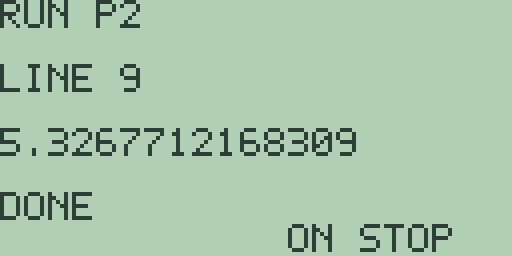

   The run screen answers `5.3267712168309`.

   Euler at the same step landed at `5.2147637585268` against a truth of
   `5.3239982793029`. So seven improved steps miss by 0.0028 where seven
   plain ones missed by 0.109: forty times better for twice the work.

4. Halve twice more. Press [PRGM] for the list, which returns with `P2`
   selected, press [F1], and edit lines 2 and 3 as in section 7.4, [CLEAR]
   before each retype: `.25->H` with `14->N`, then `.125->H` with `28->N`.

| `H` | `N` | Run screen | Gap |
| --- | --- | --- | --- |
| `.5` | `7` | `5.3267712168309` | 0.0028 above |
| `.25` | `14` | `5.3246721242446` | 0.00067 above |
| `.125` | `28` | `5.3241643775915` | 0.00017 above |

Two things changed at once and both are worth naming.

The gaps now quarter per halving rather than halve, which is what second
order means. And they sit on the *far* side of the truth, because averaging
the two slopes overcorrects a curve of this shape where the single slope
undercorrected it.

Seven improved steps beat twenty-eight plain ones by nearly ten to one, and
they ask `EVAL(` half as many times to do it. That is the whole argument
for better methods in one table.

**Try it.**

1. Change `P2`'s line 5 back to `Y+H*EVAL(0)->Y` and delete `P3`. Confirm
   the driver alone reproduces section 7.4's numbers, and say what that
   proves about where the improvement actually lives.
2. Write a midpoint step into the fourth slot: slope at the start, half a
   step forward, slope there, then a whole step from the *original* point
   with that slope. Mind the line that must remember the original `Y`.
3. Run the improved pair at `20/127->H` with `64->N`. How far apart are the
   plot and the better method by the middle of the window?
4. The gaps in the table are all above the truth and section 7.4's were all
   below. Design a differential equation for which you would expect the
   reverse of both, and test it.

## 7.6 Growth with a ceiling

Everything so far has decayed. Now let something grow, and give it
somewhere to stop.

Unlimited exponential growth is the first model anybody meets and it is
almost never the right one, because nothing grows forever. Bacteria run out
of nutrient, a population runs out of habitat, a rumour runs out of people
who have not heard it. What every one of those has in common is a ceiling,
and the interesting question is what shape the approach to the ceiling
takes.

Two models dominate the subject, and they disagree in a way you can see.

### The logistic equation

The logistic model says the growth rate is proportional to the population
*and* to the fraction of the ceiling still unused. Write K for the ceiling:

dy/dx = k y (1 - y/K)

When y is small the bracket is near 1 and growth is nearly exponential.
When y approaches K the bracket approaches 0 and growth shuts off. In
between, something has to give, and where it gives is the whole content of
the model.

Take k = 0.5 and a ceiling of 10.

1. Before touching the machine, work out where the growth is fastest. The
   rate is a product of y and (1 - y/K), which as a function of y is an
   upside-down parabola with zeros at 0 and K. Its top is halfway between,
   at y = K/2 = 5.

   So the population grows fastest when it is exactly half full, and slows
   down after that. Write down the shape that implies: slow, then
   accelerating, then a bend at half the ceiling, then a long flattening.

2. Seed a small starting population. Press [CLEAR], type [1] [STO▶]
   [ALPHA] [0], and press [ENTER]: `= 1`.

3. Press [CLEAR], press [GRAPH], then [2nd] [MORE], [MORE], [MORE] and
   [F4] for `DEQ`. Let the replot finish and press [EXIT].

4. Type the model: [.] [5] [×] [ALPHA] [0] [×] [(] [1] [-] [ALPHA] [0]
   [÷] [1] [0] [)] so the line reads `.5*Y*(1-Y/10)`. Press [GRAPH] and
   let it draw, which takes a while:

   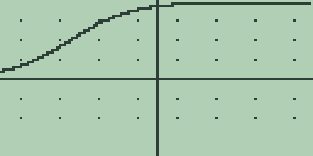

   There is the S. It is one of the most recognisable shapes in applied
   mathematics and you have just made the machine derive it from a rule
   about rates, with no formula for the curve anywhere in sight.

5. Read the bend off the table. Press [MORE], then [▲] twice, letting each
   page settle:

   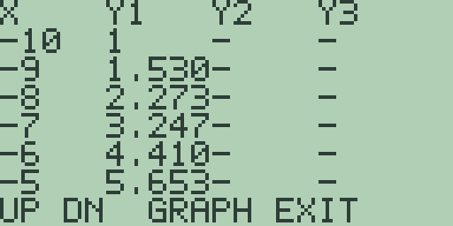

   From `X=-10` the rows read `1`, `1.530`, `2.273`, `3.247`, `4.410`,
   `5.653`.

   Take the differences yourself: 0.530, 0.743, 0.974, 1.163, 1.243. They
   are still growing, so the curve is still accelerating, and the largest
   of them straddles the crossing of 5. That is step 1's prediction
   arriving on screen: the fastest growth is at half the ceiling.

   Page down and the differences shrink the whole way. `X=0` onward reads
   `9.439`, `9.658`, `9.793`, `9.876`, `9.926`, `9.956`, closing on 10
   without ever arriving.

### Gompertz, which bends earlier

The Gompertz model makes a different guess about what slows growth down.
Instead of the fraction of the ceiling left, it uses the *logarithm* of the
ratio of the ceiling to the current size:

dy/dx = k y ln(K/y)

That looks stranger and it is much older, and it is what most tumour growth
and a great deal of reliability work actually use. The reason is that it
bends earlier: real growth very often slows sooner than the logistic
predicts.

6. Find the inflection first, on paper. Differentiate the rate with respect
   to y and you get k(ln(K/y) - 1), which vanishes when ln(K/y) = 1, so
   when y = K/e.

   With K = 10 that is about 3.68, against the logistic's 5. So Gompertz
   should turn its corner at just over a third of the ceiling rather than
   at half of it. Write that down before you look.

7. Reset the mode so a fresh seed takes. Press [MORE] twice from the format
   page for the graph mode page and press [F1], `FN`, then press [EXIT] for
   home. Press [2nd] [+] for the memory browser, press [▼] until the name
   reads `GDEQ`, and press [DEL]. Press [EXIT].

   Section 7.7 explains that ritual properly. Here it is just the price of
   changing your mind about a starting value.

8. Press [CLEAR], type [1] [STO▶] [ALPHA] [0] [ENTER] for the same seed,
   press [CLEAR], press [GRAPH], then [2nd] [MORE], [MORE], [MORE], [F4]
   for `DEQ`, and [EXIT].

9. Type the Gompertz rule: [.] [3] [×] [ALPHA] [0] [×] [LN] [1] [0] [÷]
   [ALPHA] [0] [)] so the line reads `.3*Y*LN(10/Y)`. Press [GRAPH].

   This one is slow. Every Euler step now costs a logarithm on top of
   everything else, and there are 127 of them. Let it finish:

   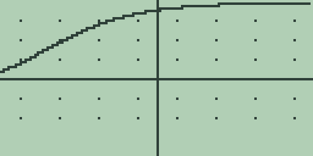

   Put that beside the picture from step 4. Same seed, same ceiling, and a
   visibly different route: the Gompertz curve is already turning while the
   logistic is still climbing hard, and then it spends much longer creeping
   up on the ceiling.

10. Press [MORE] for the table and be patient with it. This is the slowest
    thing in the book: each row is a complete Euler walk from the window
    edge, and each step of each walk wants a logarithm.

    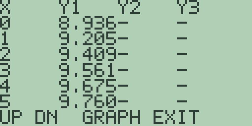

    From `X=0` the rows read `8.936`, `9.205`, `9.409`, `9.561`, `9.675`,
    `9.760`.

    Now compare, row for row, with the logistic's `9.439`, `9.658`,
    `9.793`, `9.876`, `9.926`, `9.956`.

    The Gompertz is behind at every one, and falling further behind. It
    turned earlier, so it gave up its fastest growth sooner, and it pays
    for that with a much longer tail. Which of those two behaviours your
    data actually shows is exactly how you choose between the models, and
    it is a choice you can now make by eye.

One route is closed here and it is the one you most want. There is no way
to put both curves on the screen at once. The mode integrates slot 1 alone,
and there is no picture store to overlay one plot on another, so the
comparison has to be made across two plots and two tables, or by writing
the numbers down as above. On a machine with a picture store this section
would be one screen. It is four, and the numbers are the compensation.

**Try it.**

1. Predict, then check: what does the logistic do if you seed it *above*
   the ceiling, say at 18? Which way does the curve go, and what does the
   bracket in the rule do to make it go that way?
2. Work out on paper the logistic's value at its inflection for k = 0.5 and
   K = 10, then find the two table rows that straddle it and confirm the
   crossing sits between them.
3. Change the logistic's k to 1 and leave the ceiling alone. Predict what
   moves and what does not, in both the picture and the inflection point,
   before you plot it.
4. The Gompertz rule has `LN(10/Y)` in it. What happens if you seed it at
   exactly 10? At 0? Work out both from the formula before you go anywhere
   near the machine, because one of them will not end well.
5. Fit them against each other. Take the logistic's `X=0` reading of
   `9.439` and find, by trying values of k, a Gompertz that passes through
   the same point at the same x. Do the two curves then agree anywhere
   else?

## 7.7 Equilibria, and the lever that resets them

Change one thing in the tank and a whole family appears.

Suppose the incoming water carries dye of its own, so the concentration is
pulled towards a level A rather than towards nothing: dy/dx = k(A - y).

The sign of the bracket does all the thinking. Above A it is negative and
the solution falls. Below A it is positive and the solution rises. At A it
is zero and nothing moves at all, and that last line is a solution in its
own right: the constant one, called an equilibrium.

This section takes A = 3 with k = 0.4, and it needs the initial value to
change, which section 7.1 said the mode will not allow. The lever exists.
It is deliberately stiff, and it is stiff for a reason worth knowing.

1. The seed from section 7.6 is still 1, below A, so start there and come
   back for the other side. Press [PRGM] to leave any run screen, press
   [EXIT] for home, press [CLEAR], type [.] [4] [×] [(] [3] [-] [ALPHA]
   [0] [)] so the line reads `.4*(3-Y)`, press [GRAPH], and let it finish.

2. Press [MORE] for the table. The solution climbs and flattens, squeezing
   onto 3 without arriving: an asymptote seen from below.

3. Now the reset, and here is what is actually happening. The mode writes
   its saved state to a store object called `GDEQ` when you leave it, and
   that object holds the frozen initial condition among other things.
   Deleting it is the only way to make the mode seed itself again.

   I made it work that way so the mode would survive being left and come
   back exactly as you had it, which is the right behaviour ninety-nine
   times out of a hundred and infuriating the other time. This section is
   the other time.

   Press [EXIT] to leave the table, then [2nd] [MORE] and [MORE] twice for
   the graph mode page, and press [F1], `FN`, which is what writes `GDEQ`.
   Let each plot finish before the next press. Press [EXIT] for home.

4. Press [2nd] [+] for the memory browser of the Guidebook, chapter 18,
   which opens on `A`. Press [▼] until the name reads `GDEQ`: it is the
   last entry, and the selection stops there rather than wrapping. The line
   beneath reads `TYPE GRAPH DB`, which confirms you are about to delete
   the right thing.

   Press [DEL]: the selection moves to `GFUNC`, and the mode's memory is
   gone.

5. Press [EXIT] for the home screen and seed the new value from above the
   equilibrium: [(-)] [6] [STO▶] [ALPHA] [0] [ENTER] answers `= -6`.

   Press [CLEAR], press [GRAPH], then [2nd] [MORE], [MORE], [MORE], and
   [F4] for `DEQ`. Let the replot finish: the flat line now sits low in the
   window, the receipt for -6, and the equation slot is empty, because
   deleting `GDEQ` cleared the mode's equations too.

6. Press [EXIT], retype [.] [4] [×] [(] [3] [-] [ALPHA] [0] [)], and press
   [GRAPH]:

   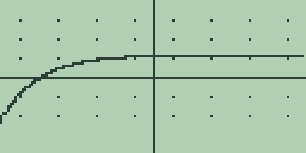

   Let the plot finish. The curve climbs out of the bottom of the window
   and flattens along the same level as before.

   Press [MORE] for the table, which the reset returned to steps of 1:
   `X=0` reads `2.855`, then `2.904`, `2.936`, `2.958`, `2.972`, `2.981`.

   The equilibrium is approached from below just as it was from above, and
   neither solution crosses it. They cannot: crossing means passing through
   a point where the rule says do not move.

7. One sign turns the whole picture over. Press [EXIT] to leave the table,
   let the plot redraw, press [EXIT] for home, and press [CLEAR]. Type
   [(-)] [.] [3] [×] [(] [3] [-] [ALPHA] [0] [)] so the line reads
   `-.3*(3-Y)`, and press [GRAPH].

   Let it finish. The solution leaves through the bottom of the window
   almost at once. Press [MORE] for the table: `X=0` reads `-165.`, then
   `-223.`, `-300.`, `-403.`, `-542.`, `-727.`.

   The equilibrium at 3 is still a solution. Every neighbour now flees it.

   Stable and unstable equilibria differ by nothing more than the sign of
   k, and that is the single most useful thing in this chapter: you can
   tell which you have by looking at the rule, without solving anything and
   without the machine.

The honest scope of the mode ends here, and it is worth being precise about
where.

Free85 integrates one first-order equation from one initial condition. So
the questions this chapter can ask are the questions a single curve can
answer. A predator and its prey, a mass on a spring, any pair of quantities
that drive each other: those are systems of two equations whose natural
picture is the phase plane, one quantity plotted against the other rather
than against x.

Neither is available here, and no arrangement of the slots produces them,
because the plot follows slot 1 alone. I would have liked to give you the
phase plane. Two state variables would have meant a second integrator, a
second initial condition to freeze, and a plotting mode that draws y
against y rather than against x, and there was not room.

What travels instead is the thinking: the sign of the right-hand side, the
equilibria where it vanishes, and whether neighbours join them or leave.
That much you can do on paper for a system of any size, and this chapter is
where you learn to.

**Try it.**

1. Predict, without the machine, what `.4*(3-Y)` does when it is seeded at
   exactly 3. Then run the reset of steps 3 to 5 with `3->Y` and see
   whether you were right.
2. Find the equilibrium of `.2*(8-Y)-.5` by hand, then plot it from a seed
   above and a seed below and confirm the level from the table.
3. The logistic of section 7.6 has *two* equilibria. Find them both from
   the rule, decide which is stable and which is not, and check both by
   seeding near each.
4. On paper, sketch the directions of the pair dx/dt = y, dy/dt = -x at
   eight points around the origin, and say what shape a solution must
   follow. Then say which single Free85 equation, if any, would show you
   the same thing.
5. Design a rule with three equilibria, alternating stable and unstable.
   Predict the fate of a solution started between each pair, then check as
   many as your patience with the `GDEQ` ritual allows.
