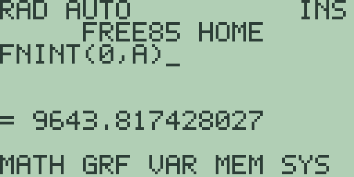
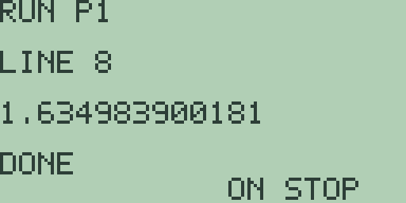
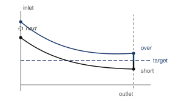
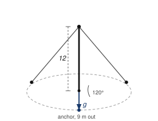

# Chapter 8: Explorations in Engineering Mathematics

Engineering asks the same questions as the earlier chapters and refuses the
same answers.

It wants the period of a real pendulum, not of its linearisation. It wants a
series summed to a stated accuracy, not a limit named. It wants a solution
pinned at both ends of a span, not released from one. It wants forces and
moments in three dimensions, where a sign and a convention will not save
you.

Free85 has a tool pointed at each. `FNINT(` for integrals with no closed
form, the four program slots for sums no hand would face, the DifEq mode of
Chapter 7 working with the solver workspace, and the vector editor for
statics in the round. The Guidebook covers all four: chapter 3 for the
calculus commands, 16 for programs, 14 for the solver, 13 for vectors.

Three habits from earlier chapters apply at once, and this chapter will
punish you for forgetting any of them. The entry line never clears itself,
so press [CLEAR] before typing at home. The calculus commands read the
active stored equation, so store it with [GRAPH] first. And plots must be
left to finish, because presses arriving mid-draw are dropped.

## 8.1 The pendulum, and the integral that will not behave

The formula every textbook prints for a pendulum, 2 pi times the square
root of length over gravity, is not the period of a pendulum.

It is the period of a pendulum's *linearisation*: the fiction in which the
restoring force is proportional to the angle rather than to the sine of the
angle. For small swings the two are near enough identical. For large ones
they are not, and the difference has a name, the circular error, and a size
you can measure.

The true period depends on how far the thing swings, and the dependence is
an integral with no closed form in elementary functions at all. That is a
happy accident for a machine like this one. A quantity nobody can write
down is exactly what `FNINT(` is for.

The specimen is a garden swing: a seat on ropes 2.5 metres long, with
gravity taken as 9.8.

### The fiction first

1. Press [CLEAR] and type [2] [×] [2nd] [^] (the `π` legend) [×] [2nd] [x²]
   (which supplies `SQRT(`) [2] [.] [5] [÷] [9] [.] [8] [)], then press
   [ENTER]: `= 3.1734878129702`.

   A little over three seconds, and the same three seconds whatever the
   swing does. Hold on to that number. Everything in this section is
   measured against it.

### The obvious integral, and what it does to you

Conservation of energy gives the true period directly. Write A for the
amplitude, the angle the swing is released from. Then the period is four
times the square root of L over 2g, times the integral from 0 to A of
d theta over the square root of cos theta minus cos A.

That is a perfectly respectable piece of mathematics and you should type it
in, because what happens next is the most useful thing in this section.

2. Store the amplitude. We will use a quarter turn, 45 degrees. Press
   [CLEAR], type [2nd] [^] [÷] [4] [STO▶] [ALPHA] [LOG] (the letter `A`),
   and press [ENTER]: `= 0.78539816339745`.

3. Press [CLEAR] and type the integrand, `1/SQRT(COS(X)-COS(A))`:
   [1] [÷] [2nd] [x²] [COS] [x-VAR] [)] [-] [COS] [ALPHA] [LOG] [)] [)].
   Press [GRAPH] and let the plot finish.

4. Press [EXIT], press [CLEAR], spell `FNINT(0,A)`, and press [ENTER]. Give
   it time.

   

   `= 9643.817428027`.

Stop and look at that.

The answer should be about 2.31. The machine has returned something four
thousand times too big, and it has done it without a murmur: no error, no
warning, no notice. If you had not known roughly what to expect you would
have written 9643 down and carried it into the next calculation.

Here is what happened, and it is worth having straight because it will
happen to you again with some other integral one day.

At the top of the swing, where theta reaches A, cos theta minus cos A is
zero and the integrand is infinite. The integral still converges, because
the infinity is mild enough, but the *function* is unbounded at the
endpoint. `FNINT(` does not know that. It spreads 64 panels across whatever
interval you give it, evaluates the integrand at each, and adds up. One of
those panels lands close to the top, the integrand there is enormous, and
that single enormous value swamps everything else.

The machine did exactly what it was told. It was told the wrong thing.

I could have made `FNINT(` detect this and refuse. I chose not to, and I
still think that is right: an integrator that second-guesses you is a
worse tool than one that does what you ask. But it does put the
responsibility somewhere, and the place it puts it is on you.

### Doing the mathematics so the machine can succeed

The fix is not a better integrator. The fix is to hand the machine a
different integral, one that means the same thing and has no infinity in
it. This is the lesson of the section and probably of the chapter: **when a
numerical method struggles, the first place to look is the mathematics, not
the method.**

Two steps get you there, and both are standard.

First, use the half-angle identities. Cos theta is 1 minus twice sine
squared of theta over 2, and cos A is 1 minus twice sine squared of A over
2. Subtract, and the difference of cosines becomes twice the difference of
two sine-squares. Write k for sin(A/2) and the integral is now over the
square root of k squared minus sine squared of theta over 2.

Second, substitute. Put sin(theta/2) equal to k sin x. As theta runs from 0
to A, x runs from 0 to a right angle, and after the dust settles the whole
thing collapses to

4 times the square root of L over g, times the integral from 0 to pi over 2
of dx over the square root of 1 minus k squared sine squared x.

The infinity has gone. When x reaches its limit the denominator is the
square root of 1 minus k squared, which is a perfectly ordinary positive
number for any swing short of a full half turn. That integral is the
complete elliptic integral of the first kind, and it is what the machine
should have been given in the first place.

5. Store the *squared* modulus, so that changing the amplitude later costs
   one store rather than a retyped equation. Press [CLEAR] and type
   [SIN] [2nd] [^] [÷] [8] [)] [x²] [STO▶] [ALPHA] [x²] (the letter `K`),
   then press [ENTER]: `= 0.14644660940673`.

   That is sine squared of 22.5 degrees, which is k squared for a
   45-degree swing.

6. Press [CLEAR] and type the new integrand, `1/SQRT(1-K*SIN(X)^2)`:
   [1] [÷] [2nd] [x²] [1] [-] [ALPHA] [x²] [×] [SIN] [x-VAR] [)] [x²] [)].
   Press [GRAPH] and let it finish. On a fresh machine `K` holds 0 and the
   slot draws the constant 1, which is its own sort of receipt.

7. Press [EXIT], press [CLEAR], spell `FNINT(0,PI/2)`, and press [ENTER]:
   `= 1.6335863074566`.

   No drama at all. Same physics, same amplitude, a bounded integrand, and
   an answer you can use.

8. Turn it into a period. Press [CLEAR], type [4] [×] [2nd] [x²] [2] [.]
   [5] [÷] [9] [.] [8] [)] [×] and then spell `FNINT(0,PI/2)`, and press
   [ENTER]: `= 3.3003427304458` seconds.

   Against the textbook's `3.1734878129702`. A 45-degree swing runs about
   four per cent slow, which is a great deal more than most people expect
   and is the subject of section 8.2.

**Try it.**

1. Before you run anything, predict what the naive integral of step 4 will
   do if you shrink the amplitude to `PI/12`. Will the nonsense get better
   or worse? Write down which, and a reason, then store the new `A` and
   find out.
2. Run step 4's integral again but stop short of the top: ask
   `FNINT(0,A-.01)` and then `FNINT(0,A-.001)`. The integrand is bounded on
   those intervals, so the answers should be sensible. Are they, and what
   are they converging on?
3. Check the substitution did not change the answer, by computing the true
   period a third way: take step 2's result for `FNINT(0,A-.001)`, multiply
   by 4 times the square root of L over 2g, and compare with step 8.
4. Take the identity apart on the machine. Store `A` as `PI/4`, then
   compute `COS(.3)-COS(A)` directly, and compute `2*(SIN(A/2)^2-SIN(.15)^2)`.
   They should agree. Do they, and to how many digits?
5. What happens to the transformed integrand when the amplitude reaches a
   full half turn, so `K` is 1? Predict the value of the integrand at
   x = pi/2 before you press a key, then store `1->K` and ask
   `FNINT(0,PI/2)`. What has the substitution failed to save you from?

## 8.2 How wrong is the textbook formula?

Section 8.1 built a working integral. Now use it for something: measure the
circular error across the whole range of swings, from a gentle rock to
nearly upside down, and find out where the textbook formula stops being
good enough.

The quantity to track is the ratio of the true period to the small-angle
one, which is 2 over pi times the integral of section 8.1. If the ratio is
1.01 the swing runs one per cent slow.

1. With the integrand of section 8.1 still stored and `K` holding 0 on a
   fresh machine, press [CLEAR], type [2] [×], spell `FNINT`, and type
   `(0,PI/2)/PI`. Press [ENTER]: `= 1`.

   No amplitude, no correction, and the machine says so exactly. That is a
   good sign the arithmetic is set up right, and it costs one press to
   check.

2. Now walk up through the amplitudes. Each one is two steps: store the new
   `K`, then ask the same ratio. Press [CLEAR] before each.

   For an amplitude of 10 degrees the half-angle is pi over 36, so type
   [SIN] [2nd] [^] [÷] [3] [6] [)] [x²] [STO▶] [ALPHA] [x²] and press
   [ENTER]: `= 0.0075961234938959`. Then [CLEAR] and
   `2*FNINT(0,PI/2)/PI`: `= 1.0019071881423`.

   Five more go the same way:

   | Amplitude | Stored expression | `K` | Ratio | Slow by |
   | --- | --- | --- | --- | --- |
   | 10 degrees | `SIN(PI/36)^2` | `0.0075961234938959` | `1.0019071881423` | 0.19% |
   | 30 degrees | `SIN(PI/12)^2` | `0.066987298107785` | `1.017408797595` | 1.71% |
   | 60 degrees | `SIN(PI/6)^2` | `0.25` | `1.0731820071483` | 6.82% |
   | 90 degrees | `SIN(PI/4)^2` | `0.49999999999999` | `1.1803405990146` | 15.28% |
   | 120 degrees | `SIN(PI/3)^2` | `0.75000000000012` | `1.3728805006153` | 27.16% |
   | 150 degrees | `SIN(5*PI/12)^2` | `0.9330127018918` | `1.7622037294847` | 43.25% |

   The 60-degree row is the one to check your typing against. The sine of
   30 degrees is exactly a half, so `K` comes back as `0.25` with no dust
   at all, while its neighbours carry a grain in the last digit. When a row
   that should be clean is not, you have mistyped something.

   The last column is worked out from the fourth: the fraction of the true
   period that the textbook formula misses is one minus the reciprocal of
   the ratio. For the 30-degree row, press [CLEAR] and type
   `100*.017408797595/1.017408797595`: `= 1.7110917102498`.

3. Read the table before moving on, because the shape of it is the answer
   to the question in the heading.

   A playground swing going through 30 degrees runs under two per cent
   slow, which nobody would notice. At 90 degrees, a swing taken to the
   horizontal, the error is 15 per cent, which is nearly half a second on
   this rope and would ruin any clock. And at 150 degrees the thing takes
   three quarters as long again as the textbook says.

   The textbook formula is not approximately right and then gradually
   wrong. It is extremely right for small swings and then falls apart
   surprisingly fast.

   With `K` still holding the 150-degree modulus, turn the last row into
   seconds. Press [CLEAR], type [4] [×] [2nd] [x²] [2] [.] [5] [÷] [9] [.]
   [8] [)] [×] and spell `FNINT(0,PI/2)`, then press [ENTER]:

   

   The entry line wraps onto a second row rather than clipping, and the
   answer is `= 5.5923320594903` seconds against the fiction's
   `3.1734878129702`. A swing taken almost to the horizontal takes three
   quarters as long again to come back.

### Where the series runs out

The standard rule of thumb for the correction is 1 plus the amplitude
squared over 16, with the amplitude in radians. It is the first two terms
of a series, and it is worth knowing exactly how far you can trust it.

4. Press [CLEAR] and type `1+(PI/18)^2/16`: `= 1.0019038588736`, against
   the table's `1.0019071881423` for 10 degrees. Five decimal places.

5. Press [CLEAR] and try 30 degrees, `1+(PI/6)^2/16`: `= 1.017134729863`
   against `1.017408797595`. Three decimal places.

6. Press [CLEAR] and push it to 90 degrees, `1+(PI/2)^2/16`:
   `= 1.154212568767` against `1.1803405990146`. Not even two.

   So the series is superb where you did not need it and useless where you
   did, which is the usual arrangement with series. Section 8.3 is about
   exactly that trade.

**Try it.**

1. Add the series' next term, eleven times the amplitude to the fourth
   power over 3072, to the rule of step 4, and work out how far up the
   table it survives now. Does it buy you one more row or three?
2. Find the amplitude at which the swing runs exactly one per cent slow.
   You have two routes: interpolate between the 10 and 30 degree rows of
   the table, or put the series of step 4 into the solver workspace and let
   it hunt. Do both and see how far apart they land.
3. Measure your own pendulum, store its length in place of 2.5, and work
   out the amplitude at which its period runs one per cent long. Does the
   answer depend on the length at all? Predict before you compute.
4. An amplitude of a full half turn puts `K` at 1 and the swing exactly
   upside down. Work out from the table's trend what the ratio is heading
   for, then reason out the physics of that swing. Why is the answer not a
   number?
5. The table's ratios are all above 1. Is there any amplitude at all for
   which a real pendulum beats its linearisation? Answer from the shape of
   the integrand rather than by trying values.

One route is closed here, and it is worth knowing why before you go looking
for it. A graph slot cannot hold `FNINT(`, so there is no plot of period
against amplitude. The command integrates whichever equation is active, and
a slot holding it would be asking to integrate itself. Chapter 4 met the
same refusal from `NDER(`, and Chapter 5 meets it again. The table above is
the graph, written out by hand, one store and one probe per row.

## 8.3 Series against closed forms

A closed form is a promise about infinitely many terms. A partial sum is
what you can actually hold. They agree in the limit, so the question worth
asking is not whether but how fast: how many terms buy how many decimals.

That is a program's question, because the answer comes from summing the
same series again at different lengths, and the eight-line slots are long
enough for two very different answers.

The first specimen is the sum of the reciprocal squares, whose closed form
is one of the genuine surprises of the subject: pi squared over six.

### A hundred terms, counted down

1. Press [PRGM] and [F1], `NEW`. The editor opens on `EDIT P1`. Type these
   eight lines, [ENTER] after each:

   | Line | Text | Keys |
   | --- | --- | --- |
   | 1 | `0->S` | [0] [STO▶] [S] |
   | 2 | `10->N` | [1] [0] [STO▶] [N] |
   | 3 | `WHILE N` | [W] [H] [I] [L] [E] [2nd] [0] [N] |
   | 4 | `S+1/N^2->S` | [S] [+] [1] [÷] [N] [x²] [STO▶] [S] |
   | 5 | `N-1->N` | [N] [-] [1] [STO▶] [N] |
   | 6 | `END` | [E] [N] [D] |
   | 7 | `DISP S` | [D] [I] [S] [P] [2nd] [0] [S] |
   | 8 | `STOP` | [S] [T] [O] [P] |

   The countdown in `N` is doing two jobs at once, and both are forced on
   it by the environment.

   It is the loop's test, because `=` and `<` cannot be typed in this
   editor and a condition here has to be arithmetic: `WHILE N` runs while
   `N` is anything but zero. And it is the term index. Since it counts
   down, the smallest terms go in first, which is the order that keeps the
   most digits. Step 5 of this section shows you what that is worth.

2. Press [F2], `RUN`. The run screen answers `RUN P1` over `LINE 8`, with
   `1.5497677311665` on the output line and `DONE` beneath.

3. Lengthen the sum. Press [PRGM] for the list, press [F1] to reopen
   `EDIT P1` at line 1, press [▼] for line 2, press [CLEAR], and type
   `40->N`. [ENTER] moves on and [F2] runs it: `1.6202439630069`.

   Repeat for `100->N`, which takes noticeably longer. Let it finish:

   

4. Now the promise. Press [PRGM] for the list, [EXIT] for the home screen,
   and [CLEAR]. Type [2nd] [^] [x²] [÷] [6] and press [ENTER]:
   `= 1.6449340668482`. Press [CLEAR] and take each gap in turn, [CLEAR]
   between them:

   | Terms | Partial sum | Gap |
   | --- | --- | --- |
   | 10 | `1.5497677311665` | `0.0951663356817` |
   | 40 | `1.6202439630069` | `0.0246901038413` |
   | 100 | `1.6349839001848` | `0.0099501666634` |

   The gaps are almost exactly one over the number of terms. Ten times the
   work buys one decimal place, and a hundred terms have not delivered two.
   This is a series you would not choose to compute pi with.

### The same hundred terms, added the other way

5. Change one thing and watch the last digits move. The order of addition
   should not matter, and in exact arithmetic it does not. In fourteen
   digits it does.

   Press [PRGM], press [F1], and rewrite the program to count *up* and stop
   on a tolerance rather than at a fixed term. Line 3 becomes the
   interesting one:

   | Line | Text | Keys |
   | --- | --- | --- |
   | 1 | `0->S` | [0] [STO▶] [S] |
   | 2 | `1->N` | [1] [STO▶] [N] |
   | 3 | `WHILE INT(1E4/N^2)` | [W] [H] [I] [L] [E] [2nd] [0] [I] [N] [T] [(] [1] [EE] [4] [÷] [N] [x²] [)] |
   | 4 | `S+1/N^2->S` | [S] [+] [1] [÷] [N] [x²] [STO▶] [S] |
   | 5 | `N+1->N` | [N] [+] [1] [STO▶] [N] |
   | 6 | `END` | [E] [N] [D] |
   | 7 | `DISP S` | [D] [I] [S] [P] [2nd] [0] [S] |
   | 8 | `STOP` | [S] [T] [O] [P] |

   Line 3 is how you write "keep going while the term is still worth
   adding" on a machine with no comparison operators. The next term is
   1 over `N` squared. Multiply it by ten thousand and take the whole part,
   and you get something nonzero exactly while the term is at least a ten
   thousandth. When `N` passes 100 the whole part becomes 0 and the loop
   stops. The tolerance is the number you type on line 3, and nothing else
   in the program needs to know about it.

   Press [F2] and let it run:

   

   `1.634983900181`.

   Put that beside step 3's `1.6349839001848`. Same series. Same hundred
   terms. Not the same number.

   The difference is the order. Adding upwards means every one of the last
   ninety additions is a tiny number being added to a total near 1.6, so
   the tiny number gets shifted right to line up and loses its bottom
   digits before it is even added. Adding downwards, the total starts small
   and grows, so the small terms go in while there is still room for them.

   Three digits at the bottom of a fourteen-digit answer is not going to
   ruin anybody's day. But the same effect on a sum of a million terms, or
   a sum where the terms have mixed signs, absolutely will, and this is the
   cheapest place you will ever see it happen.

### A series that actually converges

The second specimen comes from a test rig that drops a weight one metre
onto a damper. Each rebound reaches a quarter of the height of the one
before, so the rebounds measure a quarter of a metre, then a sixteenth,
then a sixty-fourth, and total a third.

6. That series needs no term variable at all, and the saving is what lets
   it fit. Each new partial sum is the old one plus one, all divided by
   four, so from 0 the first pass gives a quarter and the second five
   sixteenths: one line doing the work of two.

   Press [PRGM], press [▼] for the second slot, press [F1] for `EDIT P2`,
   and type `P1`'s original eight lines with two changes: line 2 is `6->N`,
   and line 4 is `(1+S)/4->S`, typed [(] [1] [+] [S] [)] [÷] [4] [STO▶] [S].

7. Press [F2]: `0.333251953125`, six rebounds. Reopen the editor as in step
   3, put `12->N` on line 2, and run again:

   

   `0.3333333134651`. Once more with `24->N` and the run screen shows
   `0.33333333333333`.

8. Press [PRGM] for the list, [EXIT] for the home screen, and [CLEAR],
   since the run screen hands `S` to the entry line on the way out. Press
   [1] [÷] [3] [ENTER]: `= 0.33333333333333`, the same to every digit.

   At twenty-four terms the series has used up the display. Take the gaps
   as before, [CLEAR] between them: `1/3-.333251953125` answers
   `= 0.00008138020833` and `1/3-.3333333134651` answers `= 1.986823E-8`.

   Six more terms divided the gap by 4096, which is 4 to the sixth. Every
   term throws away three quarters of what is left.

Two series, two stories, and the contrast is the whole point of the
section. The reciprocal squares close a smaller and smaller *share* of
their gap with every term, so the gap falls like one over the count and a
decimal place costs tenfold work. The rebounds throw away a fixed fraction
every time, so the gap falls like a power and one or two terms buy a
decimal outright.

The programs are the same shape and the same length. Apart from line 2's
count, retyped before every run anyway, the difference is entirely in line
4. That is worth noticing: the thing that decides whether a computation is
cheap or hopeless is not the code, it is the mathematics the code is
carrying.

The environment shaped one decision and forbade another. `FOR` bounds are
single digits, so no counted loop reaches a hundred passes and the
countdown in `N` is what buys an arbitrary term count. And the run screen
shows only the most recent `DISP`, so the tables above are built one run at
a time.

**Try it.**

1. Predict, before running it, what happens to the tolerance program of
   step 5 if you change the `1E4` on line 3 to `1E6`. How many terms, and
   how long? Write down your estimate of both, then try it and see how
   close you were on each.
2. Change `P1`'s line 4 to `S+1/(N*N+N)->S`. That one has a closed form you
   can find on paper in a line. Find it first, then check how many terms
   four decimals cost.
3. Rewrite `P2` for a damper that returns a *third* of each height rather
   than a quarter. What replaces the 4 on line 4, and what closed form
   should the run screen approach? Both before you type anything.
4. Sum `1/N^3` at 10, 40 and 100 terms. This one has no closed form in
   elementary functions, so you cannot check it against a target. Measure
   the shorter runs against the longest instead, and work out which power
   of the term count the gap follows now.
5. Step 5 showed the order of addition changing the answer. Build the worst
   case you can: sum `1/N` up to 100 terms upwards, then downwards, and see
   how far apart they get. Then say why this series shows the effect more
   clearly than the reciprocal squares did.

## 8.4 Shooting at a boundary

The differential equations of Chapter 7 all started at a known point and
walked forward. Engineering more often knows the two *ends* and not the
beginning: the temperature at both faces of a wall, the deflection at both
supports of a beam, the concentration at the outlet of a treatment works.

The oldest way to answer that with a forward-marching method is the
shooting method, and it is exactly what its name says. Guess the starting
value. Integrate to the far end. See how far you missed. Adjust. Repeat.

The specimen is a reed bed 20 metres from inlet to outlet, treating a
stream whose pollutant the bed removes at a rate proportional to the
*square* of its concentration: dy/dx = -0.02 y squared, with y in
milligrams per litre and x in metres. No more than 2 milligrams per litre
may leave the outlet, and the question is what the inlet may carry.

### The first shot, and the mode digging in

1. The initial value comes from the ordinary variable `Y`, seeded before
   the mode is entered. Press [CLEAR], type [1] [0] [STO▶] [ALPHA] [0] (the
   letter `Y`), and press [ENTER]: `= 10`.

2. Press [CLEAR], then [GRAPH], then [2nd] [MORE] for the format page and
   [MORE] twice more for the page reading `FN POL PAR DEQ GC`. Press [F4],
   `DEQ`. Let the replot finish and press [EXIT] for the home screen.

3. The entry line is empty, as section 7.1 found. Type [(-)] [.] [0] [2]
   [×] [ALPHA] [0] [x²] so the line reads `-.02*Y^2`, and press [GRAPH].
   Let the plot finish.

   The concentration falls steeply out of the top of the window and then
   flattens, which is what a square-law removal looks like: the last
   milligram is the expensive one.

4. Press [MORE] for the table, which opens at `X=0` in steps of 1, then
   press [▼] once and let it settle:

   

   The rows run `X=5` to `X=10`, and the last of them, the outlet, reads
   `1.979` where the paperwork says 2. The seed of 10 has undershot.

5. Press [EXIT] to leave the table, let the plot redraw, and press [EXIT]
   again for the home screen. It hands `-.02*Y^2` back to the entry line
   and publishes `= 1.9796408183505`, the fourteen-digit face of that
   `1.979` cell.

   Now try a second shot, and watch the mode refuse. Press [CLEAR] and
   store a new seed: [1] [2] [STO▶] [ALPHA] [0] [ENTER] answers `= 12`.
   Press [CLEAR], retype `-.02*Y^2`, and press [GRAPH]. Let the plot
   finish and press [MORE]: the table reopens where it was, and the outlet
   still reads `1.979`.

   Nothing moved.

   The initial value was frozen when the mode was created, and the only
   lever that resets it is deleting the `GDEQ` object.

   That is the ritual of section 7.6: leave the mode, delete `GDEQ` in the
   memory browser, reseed, and come back. Then retype the equation, which
   deleting `GDEQ` has also cleared.

   That is around twenty deliberate presses per shot, and shooting wants
   half a dozen shots. I will not defend that as a design. It is the price
   of the mode keeping its state in a store object, and if you want to
   shoot, you want a program.

### So the mode gives the picture and a program gives the practice

6. The walk is the one section 7.4 built: the new y is the old y plus the
   step times the slope, with `EVAL(` reading the stored slope so the
   program never names the model.

   Press [EXIT] to leave the table, let the plot redraw, press [EXIT]
   again, and press [CLEAR]. Press [PRGM], press [▼] twice for the third
   slot, and press [F1], `NEW`, opening `EDIT P3`:

   | Line | Text | Keys |
   | --- | --- | --- |
   | 1 | `10->Y` | [1] [0] [STO▶] [Y] |
   | 2 | `20/127->H` | [2] [0] [÷] [1] [2] [7] [STO▶] [H] |
   | 3 | `127->N` | [1] [2] [7] [STO▶] [N] |

   Lines 4 to 8 are section 7.4's walk, unchanged and typed the same way:
   `WHILE N`, `Y+H*EVAL(0)->Y`, `N-1->N`, `END`, `DISP Y`.

   Only the first three lines are new, and their step and count are the
   plot's own: the mode samples once per column, so 127 steps carry the
   walk from window edge to window edge. That is deliberate. It means the
   program and the picture are the same walk, and step 7 checks it.

7. Press [F2], `RUN`, and let the hundred and twenty-seven steps run. The
   run screen answers `RUN P3` over `LINE 9` with `1.9796408183537`.

   Against the plot's own `1.9796408183505` from step 5. Twelve digits
   agree. Plot and program are one walk, and now the walk costs one line to
   change instead of twenty presses.

8. So take a shot. Press [PRGM] for the list, [F1] for the editor, which
   reopens at line 1, then [CLEAR], type `11->Y`, and press [F2]:
   `2.014907003357`.

   One shot short at 10, one shot over at 11. The target is between them.

### Aiming by straight line

9. Press [PRGM] for the list, [EXIT] for the home screen, and [CLEAR], then
   measure the two misses. `2-1.9796408183537` answers `= 0.0203591816463`
   and, after [CLEAR], `2.014907003357-2` answers `= 0.014907003357`.

   One fell short by 0.0204 and the other went over by 0.0149. If the miss
   were a straight-line function of the seed, the right seed would be at 10
   plus the first miss over the sum of both. Press [CLEAR] and type
   `10+.02036/(.02036+.01491)`: `= 10.577261128437`.

10. Press [CLEAR], [PRGM], [F1], [CLEAR], type `10.577->Y`, and press [F2]:
    `2.0006674214272`. Much closer, and still a hair over.

11. Aim again with the newest pair: 0.00067 over at 10.577 against 0.02036
    short at 10. Press [PRGM], [EXIT], [CLEAR], and type
    `10+.02036*.577/(.02036+.00067)`: `= 10.558617213504`.

    Press [CLEAR], [PRGM], [F1], [CLEAR], type `10.559->Y`, and press [F2]:

    

    `2.0000403856688`. Four shots have found the inlet the bed can take: a
    little over 10.5 milligrams per litre.

### A second opinion, and an uncomfortable answer

12. This model has a closed form, which is exactly the kind of luck you
    should exploit whenever you get it. A square-law decay integrates to
    give the outlet as the inlet divided by 1 plus 0.4 times the inlet.

    Press [PRGM], [EXIT], and [CLEAR], type `X/(1+.4*X)-2`, and press
    [2nd] [GRAPH] for the solver workspace. Press [F5] twice for the
    `GUESS` page and store 8, then bounds 5 and 20, [ENTER] after each.
    Press [F1], `SOLV`: a `ROOT` of `9.999980926514` with `RES`
    `-7.629406E-7`.

    The mathematics says 10. The shooting said 10.559.

That gap is not the shooting's fault and it is worth being clear about
where it comes from, because the temptation is to blame the aiming.

Euler undershoots a curve that bends upwards. So the machine's reed bed
removes slightly *more* pollutant than the real one, and asking it to hit 2
at the outlet means feeding it slightly more at the inlet than the real bed
would need. The error is in the integrator and it comes out dressed as a
modelling answer, which is the most dangerous costume it could have
chosen.

13. Refine the walk and the answer walks back. Press [EXIT], [PRGM], [F1],
    then edit lines 1 to 3 to `10->Y`, `20/254->H` and `254->N`, pressing
    [CLEAR] before each, and press [F2]. The doubled count takes its time:
    `1.9898413540469`.

    An undershoot of 0.0102 where the coarser walk undershot by 0.0204.
    Exactly halved, as a first-order method promises. Shooting the finer
    walk lands at 10.265, whose run reads `1.999981815175`: halfway back to
    10 from 10.559.

So: the machine automates the shot and not the aim. The solver hunts the
root of an expression, and no expression on Free85 runs an Euler walk, so
nothing can go in the `F=` line that would let `SOLV` do the shooting for
you. The outer loop is yours, and a straight line through the last two
misses is the whole method.

What the solver *can* do is what step 12 did: certify a shot against a
closed form where one exists, and show you that the difference between the
two answers is the integrator's error wearing a modeller's coat.

**Try it.**

1. Halve the walk twice more, `20/508->H` with `508->N`, and shoot again.
   Predict the answer first from the halving pattern of step 13, then run
   it. Does it keep halving its distance from 10?
2. Change the consent to 1.5 milligrams per litre and shoot for the new
   inlet, then check it with the solver on `X/(1+.4*X)-1.5`. Now work out
   why the bed has no answer at all for a consent of 3, and say what that
   means physically.
3. Aim on the bed's *length* instead of the inlet. Put line 1 back to
   `10->Y`, change line 2 so the step is your chosen length over 127, and
   find the length at which the outlet meets 2. Step 12's closed form
   checks this one too, with the 0.4 replaced by 0.02 times the length.
4. Step 9 aimed with a straight line through two misses. Try aiming with
   just one: from the shot at 10, guess a correction by eye, and see how
   many shots it costs you. Then say what the second miss is actually
   buying.
5. The closed form of step 12 exists because the equation separates. Solve
   dy/dx = -0.02 y squared on paper from y(0) = c, and check that your
   answer gives step 12's expression at x = 20.

## 8.5 Vectors in the round

Two dimensions let you get away with signed numbers and a convention.
Three do not. A force has a direction that needs naming, a moment has an
axis, and the geometry of a site arrives as bearings and distances rather
than as coordinates.

Free85's vector editor holds three components, which is exactly the number
that makes a cross product mean something, and its coordinate pages
translate between the surveyor's description and the algebra's.

The site is a radio mast 12 metres tall at the origin, held by three guys
running from its top to ground anchors 9 metres out on bearings of 0, 120
and 240 degrees, each tensioned to 1500 newtons.

1. Bearings are degrees, so put the machine in degrees. Press [2nd] [MORE]
   for the mode screen and press [F1], `ANG`, once: the second line changes
   from `ANGLE RAD` to `ANGLE DEG`. Press [EXIT].

   Remember to put it back before Chapter 8 is over. Section 4.1 has the
   cautionary tale.

2. The second anchor arrives as a bearing and a distance, which is a
   cylindrical triple. Press [2nd] [8] (the `VECTR` legend) for the vector
   editor, which opens on `SIZE 3` with the `RECTV` tag and a fresh `A` of
   zeros. Type [9] [ENTER] [1] [2] [0] [ENTER] [0] [ENTER].

   Press [MORE] [MORE] for the third soft-key page, `R>CY CY>R R>SP SP>R`,
   and press [F2], `CY>R`. Register `R` opens on `COMP 1` reading
   `-4.5000000581249`, and [▶] reads `7.794228626888`, with `0` beneath.

   The design values are -4.5 and 7.7942286341. The dust in the eighth
   digit is the price of a degree-to-radian conversion in fourteen digits,
   and knowing which number goes on the drawing is part of the job. Nobody
   is cutting cable to eight decimal places.

3. Now the first guy, which needs no conversion at all: from the top at
   (0, 0, 12) to the anchor at (9, 0, 0) is the vector (9, 0, -12).

   Press [EXIT] and [2nd] [8] again, which restores register `A`, component
   1, and the first soft-key page in one move, and type [9] [ENTER] [0]
   [ENTER] [(-)] [1] [2] [ENTER].

   Press [F1], `MAG`: a `SIZE 1` result reading `15`. That is the length of
   cable to cut. Press [F2], `NRM`: the unit vector, `0.6`, then `0`, then
   `-0.8` as [▶] steps through it. Those direction cosines say the guy runs
   three fifths of its length outward for four fifths downward.

4. The angle between two guys is a dot product away. The second runs from
   the same top to step 2's anchor, so it is (-4.5, 7.7942286341, -12).

   Press [EXIT] and [2nd] [8], type the first guy into `A` again, press
   [ALPHA] for `B`, and type the second with the digits and the [(-)] key.
   Press [ALPHA] to come back to `A`, then [F3], `DOT`: `103.5`. Press
   [F5], `ANG`: `62.612892497387` degrees.

   Two guys 120 degrees apart on the ground stand only 62.6 degrees apart
   in the air, because both lean the same way, inward and down. Predict
   that number before you compute it next time and you will find it is
   harder than it looks.

### Moments, and why masts are guyed in threes

5. A moment is a cross product, and this is the one place where three
   components are not a convenience but the whole subject.

   Each guy is 15 metres long and pulls with 1500 newtons, so a tension is
   a hundred times its guy vector: the first pulls the mast top with
   (900, 0, -1200) newtons at the position (0, 0, 12) metres from the base.

   Press [EXIT] and [2nd] [8], type the position [0] [ENTER] [0] [ENTER]
   [1] [2] [ENTER], press [ALPHA], type the force [9] [0] [0] [ENTER] [0]
   [ENTER] [(-)] [1] [2] [0] [0] [ENTER], press [ALPHA] again, and press
   [F4], `CRS`.

   Stepping through `R` reads `0`, `10800`, `0`. That is 10800 newton
   metres about the y axis alone, trying to fold the mast over towards the
   anchor.

6. One guy would flatten the mast, so the question is what three do
   together. Because all three tensions act at the same point, their
   moments add up to the moment of their sum, which saves you two cross
   products.

   A hundred times step 4's `B` gives the second tension,
   (-450, 779.42286341, -1200), and the third, at 240 degrees, is its
   mirror, (-450, -779.42286341, -1200).

   Press [EXIT] and [2nd] [8], type the first force into `A`, press
   [ALPHA], type the second into `B`, press [ALPHA], then press [MORE] for
   the second soft-key page and [F1], `ADD`: `450`, `779.42286341`,
   `-2400`.

   Carry that into `A` the way Chapter 6 carries a result, by pressing
   [EXIT] and [2nd] [8] and retyping it, put the third force into `B`, and
   press [MORE] [F1] again:

   

   `R` reads `0`, then `0`, then `-3600`.

   The guys pull the mast top sideways not at all and downward with 3600
   newtons. A vector parallel to the mast crosses the mast's own position
   vector to give nothing, so the three moments of 10800 newton metres
   cancel exactly and leave the base in pure compression.

   That is the entire reason for guying a mast in threes, and it is a
   three-line calculation.

### Area, volume, and a distance you cannot see

The cross and dot products have three more jobs that a statics problem will
hand you sooner or later, and none of them needs a new key.

7. The *magnitude* of a cross product is the area of the parallelogram the
   two vectors span. Take a fresh pair to keep the numbers clean: press
   [EXIT] and [2nd] [8], type [3] [ENTER] [4] [ENTER] [(-)] [1] [ENTER]
   into `A`, press [ALPHA], type [(-)] [7] [ENTER] [1] [0] [ENTER] [0]
   [ENTER] into `B`, and press [ALPHA].

   Press [F4], `CRS`: `R` reads `10`, `7`, `58`.

   Now carry that into `A` and take its length. Press [EXIT], [2nd] [8],
   type [1] [0] [ENTER] [7] [ENTER] [5] [8] [ENTER], and press [F1],
   `MAG`: `59.27056605095`.

   That is the area of the parallelogram spanned by the original pair, and
   half of it is the area of the triangle they make. Check it a second way
   if you like: the two lengths are `5.0990195135925` and
   `12.206555615734` and the angle between them is `1.2605820039615`
   radians, and length times length times the sine of the angle gives the
   same area.

8. Take it one dimension further. The *scalar triple product*, the dot of a
   cross with a third vector, is the volume of the box the three of them
   span.

   With (10, 7, 58) still in `A`, press [ALPHA], type [2] [ENTER] [(-)] [5]
   [ENTER] [1] [7] [ENTER] into `B`, press [ALPHA], and press [F3], `DOT`:
   `971`.

   So the three original vectors span a box of volume 971. And the sign
   matters: a negative answer would mean the three vectors form a
   left-handed set rather than a right-handed one. A zero answer would mean
   the box is flat, which is to say the three vectors lie in a plane, which
   is the cheapest coplanarity test there is and worth remembering.

9. Finally the surveyor's other description. Press [EXIT] and [2nd] [8],
   type the first guy (9, 0, -12) into `A`, press [MORE] [MORE] for the
   conversion page, and press [F3], `R>SP`.

   The tag beside `SIZE` becomes `SPHEREV` and `R` reads `15`, then `0`,
   then `143.13010235415`: the cable length, its bearing, and its angle
   down from the upward vertical. So the guy leaves the mast 53.13 degrees
   below the horizontal.

   That tag is a note, not a label. It records the last conversion
   performed rather than tracking each register, so it survives leaving and
   re-entering the editor and will sit over plainly rectangular data until
   a `CY>R` or an `SP>R` sends it back to `RECTV`. Read it as a reminder of
   what you last did, not as a statement about what is in front of you.

10. Press [2nd] [MORE] and [F1] to put the machine back into `ANGLE RAD`
    before you leave the chapter.

**Try it.**

1. Work out the third guy's anchor from its bearing with `CY>R` as step 2
   did, and check that its cable is 15 metres too. Predict both components
   before you press `CY>R`.
2. Compute the moment of the second guy's tension with `CRS`, then take its
   magnitude with `MAG`. Should it be 10800 as well? Answer before you
   compute, from the symmetry of the site.
3. Move the anchors to 6 metres out instead of 9, keeping the tension.
   Which way does the downward force move, and which way the angle between
   two guys? Answer both before you press a key, then check.
4. Use the triple product of step 8 as a coplanarity test. Build three
   vectors you know lie in a plane, and confirm the answer is zero. Then
   nudge one component and watch how quickly it stops being zero.
5. Two guys and the mast itself are three vectors from the same point. Work
   out the volume of the box they span, and say what a small answer would
   tell you about how well the mast is braced.
