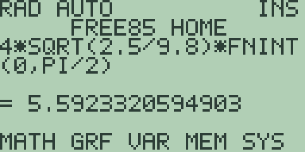
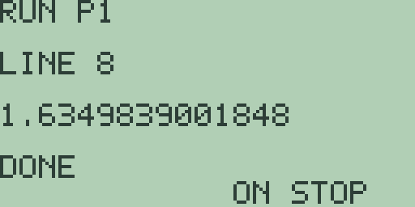
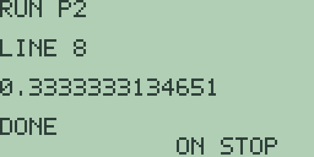
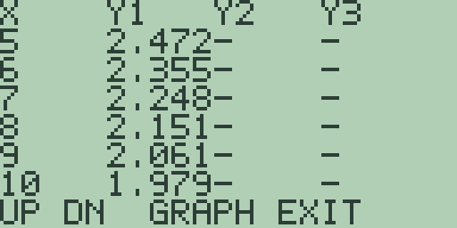
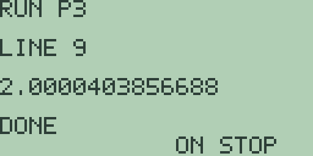
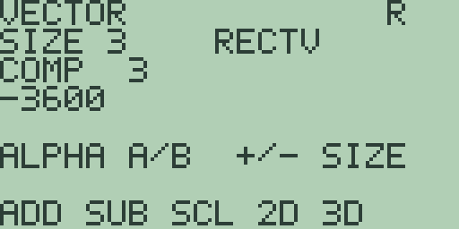

# Chapter 8: Explorations in Engineering Mathematics

Engineering asks the same questions as the earlier chapters and refuses the
same answers. It wants the period of a real pendulum rather than of its
linearisation; a series summed to a stated accuracy rather than a limit named;
a solution pinned at both ends of a span rather than released from one; forces
and moments in three dimensions rather than two. Free85 keeps a tool pointed
at each: `FNINT(` for integrals with no closed form (the Guidebook, chapter
3), the four program slots for sums no hand would face (the Guidebook, chapter
16), the DifEq mode of Chapter 7 (Explorations in Differential Equations)
working in turn with the solver workspace of the Guidebook, chapter 14, and
the vector editor of the Guidebook, chapter 13 for statics in the round. Every
key sequence and every quoted number in this chapter was run in the emulator
on a fresh machine, and each exploration ends with a "Try it" block whose
answers stay on the calculator. Three habits from the earlier chapters apply
at once: the entry line never clears itself, so press [CLEAR] before typing at
home; the calculus commands read the active stored equation, so store with
[GRAPH] first; and plots must be allowed to finish, since presses arriving
mid-draw are lost.

## 8.1 The pendulum and elliptic integrals

The formula every textbook prints for a pendulum, 2 pi times the square root
of length over gravity, is not the period of a pendulum. It is the period of a
pendulum's linearisation, the fiction in which the restoring force is
proportional to the angle rather than to its sine. The true period depends on
how far the thing swings, and the dependence is an integral with no closed
form at all: the complete elliptic integral of the first kind. That is a happy
accident for a machine like this one, since a quantity nobody can write down
in elementary functions is exactly what `FNINT(` is for.

The specimen is a garden swing: a seat on ropes 2.5 metres long, with gravity
taken as 9.8. Write T0 for the small-angle period and T for the truth. The
mathematics says T divided by T0 is 2 over pi times the integral, from 0 to a
right angle, of one over the square root of 1 minus k squared sine squared,
where k is the sine of half the amplitude.

1. The fiction first. Press [CLEAR] and type [2] [×] [2nd] [^] (the `π`
   legend) [×] [2nd] [x²] (which inserts `SQRT(`) [2] [.] [5] [÷] [9] [.] [8]
   [)], then press [ENTER]: `= 3.1734878129702`, a little over three seconds,
   and the same three seconds whatever the swing does.

2. Store the integrand, keeping the *squared* modulus in the variable `K` so
   that a new amplitude costs one store rather than a retyped equation. Press
   [CLEAR] and type [1] [÷] [2nd] [x²] [1] [-] [ALPHA] [x²] (the letter `K`)
   [×] [SIN] [x-VAR] [)] [x²] [)], so the entry line reads
   `1/SQRT(1-K*SIN(X)^2)`, and press [GRAPH]. Let the plot finish: a fresh
   machine holds `0` in `K`, so the slot draws the constant 1.

3. Press [EXIT] for the home screen, which hands the equation back to the
   entry line, and press [CLEAR]. Type [2] [×], spell `FNINT` letter by letter
   ([ALPHA] then the key carrying each letter), and type `(0,PI/2)/PI`, then
   press [ENTER]: `= 1`. With no amplitude there is no correction, and the
   machine says so exactly.

4. Now the amplitudes. An amplitude of 10 degrees is a half-angle of pi over
   36, so press [CLEAR] and type [SIN] [2nd] [^] [÷] [3] [6] [)] [x²] [STO▶]
   [ALPHA] [x²], then press [ENTER]: `= 0.0075961234938959`. Press [CLEAR] and
   ask `2*FNINT(0,PI/2)/PI` again: `= 1.0019071881423`. Five more amplitudes
   go the same way, [CLEAR] before each store and probe:

   | Amplitude | Stored expression | `K` | `2*FNINT(0,PI/2)/PI` |
   | --- | --- | --- | --- |
   | 10 degrees | `SIN(PI/36)^2` | `0.0075961234938959` | `1.0019071881423` |
   | 30 degrees | `SIN(PI/12)^2` | `0.066987298107785` | `1.017408797595` |
   | 60 degrees | `SIN(PI/6)^2` | `0.25` | `1.0731820071483` |
   | 90 degrees | `SIN(PI/4)^2` | `0.49999999999999` | `1.1803405990146` |
   | 120 degrees | `SIN(PI/3)^2` | `0.75000000000012` | `1.3728805006153` |
   | 150 degrees | `SIN(5*PI/12)^2` | `0.9330127018918` | `1.7622037294847` |

   The 60-degree row is the one to check your arithmetic against: the sine of
   30 degrees is exactly a half, so `K` comes back as `0.25` with no dust at
   all, while its neighbours carry a grain in the last digit.

5. A swing of 10 degrees runs two parts in a thousand slow, which no
   playground would notice, and the correction grows as the square of the
   angle while the angle is small. The textbook series for that end is 1 plus
   the amplitude squared over 16, in radians. Press [CLEAR] and type
   `1+(PI/18)^2/16`: `= 1.0019038588736` against the table's
   `1.0019071881423`, agreeing to five decimals. Press [CLEAR] and try 30
   degrees, `1+(PI/6)^2/16`: `= 1.017134729863` against `1.017408797595`,
   agreeing to only three. The series runs out of terms just where the table
   starts to climb.

6. The far end of the table is not a correction at all, it is a different
   swing. The period itself is four times the root of length over gravity
   times the integral, so with `K` still holding the 150-degree modulus press
   [CLEAR], type [4] [×] [2nd] [x²] [2] [.] [5] [÷] [9] [.] [8] [)] [×] and
   then `FNINT(0,PI/2)`, and press [ENTER]:

   

   The entry line wraps onto a second row rather than clipping, and the answer
   is `= 5.5923320594903` seconds against the fiction's `3.1734878129702`. A
   swing taken almost to the horizontal takes three quarters as long again to
   come back.

One route is closed. A graph slot cannot hold `FNINT(`, because the command
integrates whichever equation is active and a slot holding it would be asked
to integrate itself, as Chapter 5 (Explorations in Calculus II) found, so no
plot of period against amplitude exists here. The table above is the graph,
written out by hand, one store and one probe per row.

**Try it.**

1. Measure your own pendulum, store its length in place of 2.5, and find the
   amplitude at which its period runs one per cent long.
2. Add the series' next term, the amplitude to the fourth power over 3072, to
   step 5's rule of thumb, and see how far up the table it survives.
3. An amplitude of 180 degrees puts `K` at 1 and the integrand's denominator
   at 0 at the top of the range. Predict what `FNINT(` does, try it, and say
   what the physics of that swing is.

## 8.2 Series against closed forms

A closed form is a promise about infinitely many terms; a partial sum is what
you can actually hold. The two agree in the limit, so the question worth
asking is the rate: how many terms buy how many decimals. That is a program's
question, since the answer comes from summing the same series again at
different lengths, and the eight-line slots of the Guidebook, chapter 16 are
long enough for two very different answers. The first specimen is the sum of
the reciprocal squares, whose closed form is one of the surprises of the
subject: pi squared over six.

1. Press [PRGM] and [F1], `NEW`: the editor opens on `EDIT P1`. Type the eight
   lines, [ENTER] after each:

   | Line | Text | Keys |
   | --- | --- | --- |
   | 1 | `0->S` | [0] [STO▶] [S] |
   | 2 | `10->N` | [1] [0] [STO▶] [N] |
   | 3 | `WHILE N` | [W] [H] [I] [L] [E] [2nd] [0] [N] |
   | 4 | `S+1/N^2->S` | [S] [+] [1] [÷] [N] [x²] [STO▶] [S] |
   | 5 | `N-1->N` | [N] [-] [1] [STO▶] [N] |
   | 6 | `END` | [E] [N] [D] |
   | 7 | `DISP S` | [D] [I] [S] [P] [2nd] [0] [S] |
   | 8 | `STOP` | [S] [T] [O] [P] |

   The countdown does double duty. It is the loop's test, because `=` and `<`
   cannot be typed here and a condition must be arithmetic; and it is the term
   index, running from `N` down to 1, so the smallest terms are added first,
   the order that keeps the most digits.

2. Press [F2], `RUN`. The run screen answers `RUN P1` over `LINE 8`, with
   `1.5497677311665` on the output line and `DONE` beneath. Lengthen the sum:
   press [PRGM] for the list and [F1] to reopen `EDIT P1` at line 1, press [▼]
   for line 2, press [CLEAR], and type `40->N`; [ENTER] moves on and [F2] runs
   it: `1.6202439630069`. Repeat for `100->N`, which takes noticeably longer,
   and let it finish:

   

3. Now the promise. Press [PRGM] for the list, [EXIT] for the home screen, and
   [CLEAR]. Type [2nd] [^] [x²] [÷] [6] and press [ENTER]: `=
   1.6449340668482`. Press [CLEAR] and take each gap in turn, [CLEAR] between
   them.

   | Terms | Partial sum | Gap |
   | --- | --- | --- |
   | 10 | `1.5497677311665` | `0.0951663356817` |
   | 40 | `1.6202439630069` | `0.0246901038413` |
   | 100 | `1.6349839001848` | `0.0099501666634` |

   The gaps are almost exactly one over the number of terms. Ten times the
   work buys one decimal place, and a hundred terms have not delivered two.

The second specimen comes from a test rig that drops a weight one metre onto a
damper. Each rebound reaches a quarter of the height of the one before, so the
rebounds measure a quarter of a metre, then a sixteenth, then a sixty-fourth,
forever, and total a third.

4. That series needs no term variable at all, and the saving is what lets it
   fit: each new partial sum is the old one plus one, divided by four, so from
   0 the first pass gives a quarter and the second five sixteenths, one line
   doing the work of two. Press [PRGM] for the list, press [▼] for the second
   slot, and press [F1] for `EDIT P2`. Type `P1`'s eight lines again with two
   changes: line 2 is `6->N`, and line 4 is `(1+S)/4->S`, typed [(] [1] [+]
   [S] [)] [÷] [4] [STO▶] [S].

5. Press [F2]: `0.333251953125`, six rebounds. Reopen the editor as in step 2,
   put `12->N` on line 2, and run again:

   

   The answer is `0.3333333134651`. Once more with `24->N` and the run screen
   shows `0.33333333333333`. Press [PRGM] for the list, [EXIT] for the home
   screen, and [CLEAR], since the run screen hands `S` to the entry line on
   the way out, then press [1] [÷] [3] [ENTER]: `= 0.33333333333333` as well.
   At twenty-four terms the series has used up the display. The gaps come the
   same way as the first specimen's. Press [CLEAR] and take each in turn,
   [CLEAR] between them: `1/3-.333251953125` answers `= 0.00008138020833` and
   `1/3-.3333333134651` answers `= 1.986823E-8`: six more terms have divided
   the gap by 4096, which is 4 to the sixth.

Two series, two stories. The reciprocal squares close a smaller and smaller
share of their gap with every term, so the gap falls like one over the count
and a decimal place costs tenfold work; the rebounds throw away three quarters
of their gap at every term, so the gap falls like a power and one or two terms
buy a decimal place outright. The programs are the same shape and the same
length, and apart from line 2's term count, retyped before every run anyway,
the difference is entirely in line 4. The environment shaped one decision and
forbade another: `FOR` bounds are single digits (the Guidebook, chapter 16),
so no counted loop reaches a hundred passes and the countdown in `N` is what
buys an arbitrary term count; and the run screen shows only the most recent
`DISP`, so the tables above are built one run at a time.

**Try it.**

1. Change `P1`'s line 4 to `S+1/(N*N+N)->S`, whose closed form you can find on
   paper in one line, and check how many terms four decimals cost.
2. Rewrite `P2` for a damper that returns a *third* of each height rather than
   a quarter. What replaces the 4 on line 4, and what closed form should the
   run screen approach?
3. Sum `1/N^3` at 10, 40, and 100 terms. This one has no closed form in
   elementary functions, so measure the shorter runs against the longest.
   Which power of the term count does the gap follow now?

## 8.3 Shooting at a boundary

The differential equations of Chapter 7 all began at a known point and walked
forward. Engineering more often knows the two ends and not the beginning: the
temperature at both faces of a wall, the deflection at both supports of a
beam, the concentration at the outlet of a treatment works. The oldest way to
answer such a question with a forward-marching method is the shooting method,
and it is exactly what its name says: guess the starting value, integrate to
the far end, see how far you missed, adjust. The specimen is a reed bed 20
metres from inlet to outlet, treating a stream whose pollutant the bed
removes at a rate proportional to the *square* of its concentration:
dy/dx = -0.02 y squared, with y in milligrams per litre and x in metres. No
more than 2 milligrams per litre may leave the outlet, and the question is
what the inlet may carry.

1. Seed the mode and take the first shot. The initial value comes from the
   ordinary variable `Y`, seeded before the mode is entered, so press [CLEAR],
   type [1] [0] [STO▶] [ALPHA] [0] (the letter `Y`), and press [ENTER]: `=
   10`. Press [CLEAR], then [GRAPH], then [2nd] [MORE] for the format page and
   [MORE] twice more for the page reading `FN POL PAR DEQ GC`, and press [F4],
   `DEQ`. Let the replot finish and press [EXIT] for the home screen.

2. The entry line is empty, as section 7.1 found. Type [(-)] [.] [0] [2] [×]
   [ALPHA] [0] [x²] so the line reads `-.02*Y^2`, and press [GRAPH]. Let the
   plot finish. The concentration falls steeply out of the top of the window
   and then flattens, which is what a square-law removal looks like: the last
   milligram is the expensive one. Press [MORE] for the table, which opens at
   `X=0` in steps of 1, then press [▼] once and let it settle:

   

   The rows run `X=5` to `X=10`, and the last of them, the outlet, reads
   `1.979` where the paperwork says 2: the seed of 10 has undershot.

3. Press [EXIT] to leave the table, let the plot redraw, and press [EXIT]
   again for the home screen: it hands `-.02*Y^2` back to the entry line and
   publishes `= 1.9796408183505`, the fourteen-digit face of the `1.979` cell.
   Now a second shot, which is where the mode digs in. Press [CLEAR] and store
   a new seed: [1] [2] [STO▶] [ALPHA] [0] [ENTER] answers `= 12`. Press
   [CLEAR], retype `-.02*Y^2`, and press [GRAPH]. Let the plot finish and
   press [MORE]: the table reopens on the rows it was left at, and the outlet
   still reads `1.979`. Nothing moved. The initial value was frozen when the
   mode was created, and the only lever that resets it is the deletion of the
   `GDEQ` object, the ritual of section 7.6: leave the mode by pressing `FN`
   on the graph mode page, delete `GDEQ` in the memory browser, reseed, come
   back, and retype the equation, which deleting `GDEQ` has also cleared. That
   is some twenty deliberate presses per shot, and shooting wants half a dozen
   shots.

4. So the mode gives the picture and a program gives the practice. The walk is
   the one section 7.4 built: the new y is the old y plus the step times the
   slope, with `EVAL(` reading the stored slope so the program never names the
   model. Press [EXIT] to leave the table, let the plot redraw, press [EXIT]
   again, and press [CLEAR]. Press [PRGM], press [▼] twice for the third slot,
   and press [F1], `NEW`, opening `EDIT P3`:

   | Line | Text | Keys |
   | --- | --- | --- |
   | 1 | `10->Y` | [1] [0] [STO▶] [Y] |
   | 2 | `20/127->H` | [2] [0] [÷] [1] [2] [7] [STO▶] [H] |
   | 3 | `127->N` | [1] [2] [7] [STO▶] [N] |

   Lines 4 to 8 are section 7.4's walk, unchanged and typed the same way:
   `WHILE N`, `Y+H*EVAL(0)->Y`, `N-1->N`, `END`, `DISP Y`. Only the three
   lines above are new, and their step and count are the plot's own: the mode
   samples once per column, so 127 steps carry the walk from window edge to
   window edge.

5. Press [F2], `RUN`, and let the hundred and twenty-seven steps run. The run
   screen answers `RUN P3` over `LINE 9` with `1.9796408183537`, the table's
   `1.979` opened out to its full face and agreeing with the plot's own
   `1.9796408183505` to twelve digits. Now a shot costs one line: press [PRGM]
   for the list, [F1] for the editor, which reopens at line 1, then [CLEAR],
   type `11->Y`, and press [F2]: `2.014907003357`.

6. Aim by straight line. Press [PRGM] for the list, [EXIT] for the home
   screen, and [CLEAR], then measure the two misses: `2-1.9796408183537`
   answers `= 0.0203591816463` and, after [CLEAR], `2.014907003357-2` answers
   `= 0.014907003357`. One shot fell short and the other went over, so the
   line joining them says where the target sits. Press [CLEAR] and type
   `10+.02036/(.02036+.01491)`: `= 10.577261128437`. Press [CLEAR], [PRGM],
   [F1], [CLEAR], type `10.577->Y`, and press [F2]: `2.0006674214272`. Aim
   again with the newest pair, 0.00067 over at 10.577 against 0.02036 short
   at 10: press [PRGM], [EXIT], [CLEAR], and type
   `10+.02036*.577/(.02036+.00067)` for `= 10.558617213504`. Press [CLEAR],
   [PRGM], [F1], [CLEAR], type `10.559->Y`, and press [F2]:

   

   The run screen answers `2.0000403856688`. Four shots have found the inlet
   the bed can take: a little over 10.5 milligrams per litre.

7. The answer deserves a second opinion, and this model has one, since a
   square-law decay can be solved on paper: the outlet is the inlet divided by
   1 plus 0.4 times the inlet. Press [PRGM], [EXIT], and [CLEAR], type
   `X/(1+.4*X)-2`, and press [2nd] [GRAPH] for the solver workspace. Press
   [F5] twice for the `GUESS` page and store 8, then bounds 5 and 20, [ENTER]
   after each. Press [F1], `SOLV`: a `ROOT` of `9.999980926514` with `RES`
   `-7.629406E-7`, the paper answer 10 under the usual bisection dust.

So the shooting found 10.559 where the mathematics says 10, and the gap is not
the shooting's fault. Euler undershoots a curve that bends upwards, so the
machine's bed removes a little more than the real one, and asking it to hit 2
asks it to be fed a little more. Refine the walk and the answer walks back:
press [EXIT], [PRGM], and [F1], then edit lines 1 to 3 to `10->Y`,
`20/254->H`, and `254->N`, pressing [CLEAR] before each, and press [F2]. The
doubled count takes its time and answers `1.9898413540469`, an undershoot of
0.0102 where the coarser walk undershot by 0.0204, exactly halved as a
first-order method promises. Shooting the finer walk lands at 10.265, whose
run reads `1.999981815175`: halfway back to 10 from 10.559.

That is the honest shape of this exploration. The machine automates the shot
and not the aim, because the solver hunts the root of an expression and no
expression on Free85 runs an Euler walk, so nothing can go in the `F=` line
that would let `SOLV` do the shooting. The outer loop is yours, with a
straight line through the last two misses as the whole method. What the solver
*can* do is what step 7 did: certify a shot against a closed form where one
exists, and show that the difference between the two answers is the
integrator's error in a modeller's clothes.

**Try it.**

1. Halve the walk twice more, `20/508->H` with `508->N`, and shoot again. Does
   the answer keep halving its distance from 10?
2. Change the consent to 1.5 milligrams per litre and shoot for the new inlet,
   then check it with the solver on `X/(1+.4*X)-1.5`. Why does the bed have no
   answer at all for a consent of 3?
3. Aim on the bed's length instead of on the inlet. Put line 1 back to
   `10->Y`, change line 2 so the step is your chosen length over 127, and find
   the length at which the outlet meets 2. Step 7's closed form checks this
   one too, with the 0.4 replaced by 0.02 times the length.

## 8.4 Vectors in the round

Two dimensions let you get away with signed numbers and a convention. Three
dimensions do not: a force has a direction that needs naming, a moment has an
axis, and the geometry of a site arrives as bearings and distances rather than
as coordinates. Free85's vector editor holds three components, exactly the
number that makes a cross product mean something, and its coordinate pages
translate between the surveyor's description and the algebra's. The site is a
radio mast 12 metres tall, standing at the origin, held by three guys running
from its top to ground anchors 9 metres out on bearings of 0, 120, and 240
degrees, each tensioned to 1500 newtons.

1. Bearings are degrees, so put the machine in degrees. Press [2nd] [MORE] for
   the mode screen and press [F1], `ANG`, once: the second line changes from
   `ANGLE RAD` to `ANGLE DEG`, and a second press would change it back. Press
   [EXIT].

2. The second anchor arrives as a bearing and a distance, which is a
   cylindrical triple. Press [2nd] [8] (the `VECTR` legend) for the vector
   editor, which opens on `SIZE 3` with the `RECTV` tag and a fresh `A` of
   zeros, and type [9] [ENTER] [1] [2] [0] [ENTER] [0] [ENTER]. Press [MORE]
   [MORE] for the third soft-key page, `R>CY CY>R R>SP SP>R`, and press [F2],
   `CY>R`. Register `R` opens on `COMP 1` reading `-4.5000000581249`, and [▶]
   reads `7.794228626888`, with `0` beneath that. The design values are -4.5
   and 7.7942286341; the dust in the eighth digit is the price of a
   degree-to-radian conversion in fourteen digits, and knowing which number
   goes on the drawing is part of the job.

3. Now the first guy, which needs no conversion: from the top at (0, 0, 12) to
   the anchor at (9, 0, 0) is the vector (9, 0, -12). Press [EXIT] and [2nd]
   [8] again, which restores register `A`, component 1, and the first soft-key
   page in one move, and type [9] [ENTER] [0] [ENTER] [(-)] [1] [2] [ENTER].
   Press [F1], `MAG`: a `SIZE 1` result reading `15`, the length of cable to
   cut, which the fourth soft-key page's `NORM` answers again (the Guidebook,
   chapter 13). Press [F2], `NRM`: the unit vector, `0.6`, then `0`, then
   `-0.8` as [▶] steps through it. Those direction cosines say the guy runs
   three fifths of its length outward for four fifths downward.

4. The angle between two guys is a dot product away. The second runs from the
   same top to step 2's anchor, so it is (-4.5, 7.7942286341, -12). Press
   [EXIT] and [2nd] [8], type the first guy into `A` again, press [ALPHA] for
   `B`, and type the second with the digits and the [(-)] key, [ENTER] after
   each component. Press [ALPHA] to come back to `A`, then [F3], `DOT`:
   `103.5`. Press [F5], `ANG`: `62.612892497387` degrees. Two guys 120 degrees
   apart on the ground stand only 62.6 degrees apart in the air, because both
   lean the same way, inward and down.

5. A moment is a cross product, the one place where three components are not a
   convenience but the whole subject. Each guy is 15 metres long and pulls
   with 1500 newtons, so a tension is a hundred times its guy vector: the
   first pulls the mast top with (900, 0, -1200) newtons at the position
   (0, 0, 12) metres from the base. Press [EXIT] and [2nd] [8], type the
   position [0] [ENTER] [0] [ENTER] [1] [2] [ENTER], press [ALPHA], type the
   force [9] [0] [0] [ENTER] [0] [ENTER] [(-)] [1] [2] [0] [0] [ENTER], press
   [ALPHA] again, and press [F4], `CRS`. Stepping through `R` reads `0`,
   `10800`, `0`: 10800 newton metres about the y axis alone, trying to fold
   the mast over towards the anchor.

6. One guy would flatten the mast, so the question is what three do together,
   and because all three tensions act at the same point their moments add up
   to the moment of their sum. A hundred times step 4's `B` gives the second
   tension, (-450, 779.42286341, -1200), and the third, at 240 degrees, is its
   mirror, (-450, -779.42286341, -1200). Press [EXIT] and [2nd] [8], type the
   first force into `A`, press [ALPHA], type the second into `B`, press
   [ALPHA], then press [MORE] for the second soft-key page and [F1], `ADD`:
   `450`, `779.42286341`, `-2400`. Carry that into `A` the way Chapter 6
   (Explorations in Linear Algebra) carries a result, by pressing [EXIT] and
   [2nd] [8] and retyping it, put the third force into `B`, and press [MORE]
   [F1] again:

   

   `R` reads `0`, then `0`, then `-3600`. The guys pull the mast top sideways
   not at all and downward with 3600 newtons, and a vector parallel to the
   mast crosses the mast's own position vector to give nothing at all, so the
   three moments, each of 10800 newton metres, cancel exactly and leave the
   base in pure compression. That is the whole reason for guying a mast in
   threes.

7. Work is the other product and it takes the other kind of pair. A mast
   section is dragged up a ramp: the winch rope pulls with (400, 0, 300)
   newtons while the section moves (6, 0, 2) metres. Press [EXIT] and [2nd]
   [8], type the force into `A`, press [ALPHA], type the displacement into
   `B`, press [ALPHA], and press [F3], `DOT`: `3000` joules. The key that
   measured an angle in step 4 measures energy here.

8. Finally, the surveyor's other description. Press [EXIT] and [2nd] [8], type
   the first guy (9, 0, -12) into `A`, press [MORE] [MORE] for the conversion
   page, and press [F3], `R>SP`. The tag beside `SIZE` becomes `SPHEREV` and
   `R` reads `15`, then `0`, then `143.13010235415`: the cable length, its
   bearing, and its angle down from the upward vertical, so the guy leaves the
   mast 53.13 degrees below the horizontal. That tag is a note, not a label:
   it records the last conversion performed rather than tracking each register
   (the Guidebook, chapter 13), so it survives leaving and re-entering the
   editor and sits over plainly rectangular data until a `CY>R` or an `SP>R`
   sends it back to `RECTV`.

**Try it.**

1. Work out the third guy's anchor from its bearing with `CY>R` as step 2 did,
   and check that its cable is 15 metres too.
2. Compute the moment of the second guy's tension with `CRS`, then take its
   magnitude with `MAG`. Should it be 10800 as well, and why?
3. Move the anchors to 6 metres out instead of 9, keeping the tension. Which
   way does the downward force move, and which way the angle between two guys?
   Answer before you press a key.
