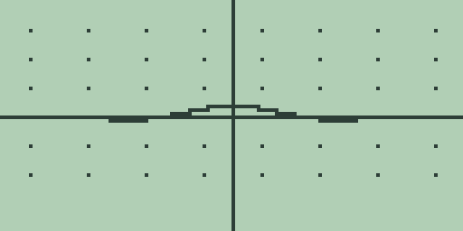
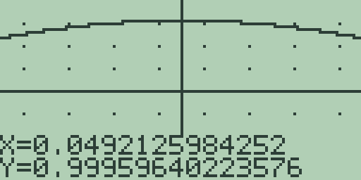
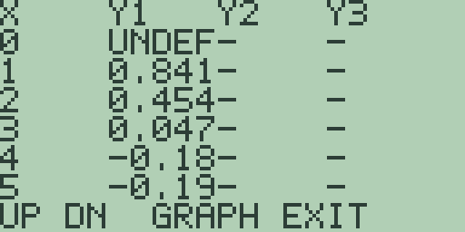
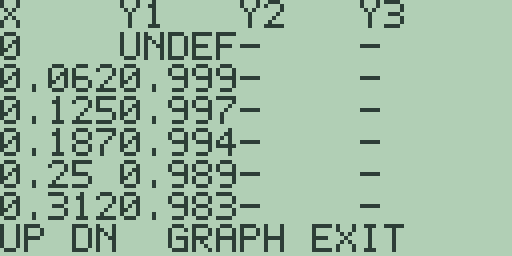
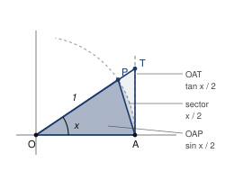

# Second-edition plan for Explorations with Free85

Answering the brief at `REWRITE-BRIEF.md`. Revised after reading the source
book in full: *Explorations with the Texas Instruments TI-85*, Harvey and
Kenelly (eds.), Academic Press, 1993, 374 pages, eight chapters by eight
authors. Nothing in the book has been changed yet.

The method is the one section 1 of the brief prescribes: read the source
for scope, depth and level; take structured notes on what mathematics to
cover and how far to push it; write from the notes in your own words with
your own screens and numbers. What follows is those notes turned into a
plan. No sentence of the source is reproduced anywhere in this book.

## 1. Where the first edition stands, measured

Baseline build from a clean tree:

```
companion: 1818 keycaps, 49 framed screenshots, 1 maths diagram,
           8 chapters, 47 numbered sections, 47 Try it panels
wrote dist/guidebook/Free85-Companion-typeset.pdf (114 pages)
```

## 2. What reading the source changed

The chapter list was already right. The first edition's eight subjects sit
in the same order as the source's, which is the order of a mathematics
course and belongs to nobody. What the reading changed is the *content of
the sections*, and the change is large.

Three things I got wrong in the first version of this plan:

**a. I under-counted the missing mathematics.** I had proposed "push each
section further". Reading the source turned that into a specific list of
about thirty named topics the first edition simply does not contain, most
of them standard. They are in section 4 below. Several are better than
anything I would have invented.

**b. I under-weighted the exercises.** The source closes each section with
around ten exercises; the first edition closes each with three. That ratio
is a large part of "lacking quite a lot" and I treated it as cosmetic. It
is not. More important than the count is the *kind*: the source repeatedly
asks the reader to **sketch or predict first, then check on the machine**.
The first edition almost never does. That single habit is the cheapest
available change that turns a demonstration into a lesson.

**c. I planned to fill gaps that are actually walls.** Several of the
source's best explorations cannot be done on Free85 at all: the simplex
method needs a 3 by 6 tableau against a 3 by 3 ceiling; phase planes and
second-order equations need two simultaneous state variables against one;
overlaying solution families needs a picture store Free85 has not got.
These are not omissions to repair. They are the book's own subject, and
the afterword's thesis. What changes is that I can now name them precisely
instead of gesturing.

What does **not** change: the voice sample in section 7, the figure budget,
the section count, and the build consequences. Those stand as proposed.

## 3. Capability probes already run

Before promising any of this I ran the new candidates on the emulator.
Results that changed the plan:

| Probe | Result | Consequence |
| --- | --- | --- |
| `NCR(5,2)` | `10` | Free85 **has** combinations. Binomial probabilities by formula are open to chapter 3, which I had assumed were not. |
| `DET` of 1,2,3 / 4,5,6 / 7,8,9 | `0`, exactly | Free85 does **not** reproduce the classic singular-matrix round-off trap. I had this pencilled as a headline addition to chapter 6. Dropped: I will not print a failure the machine does not have. |
| `EXP(LN(1+.001)/.001)` | `2.7169239351903` | The 1-to-the-infinity indeterminate form is reachable, routed round `^`'s whole-exponent limit the way section 1.4 already routes compound interest. |
| `-Y*LN(Y/8)` at `Y=3` | `2.9424877590348` | The Gompertz slope evaluates, so it can go in the DifEq slot beside the logistic. |
| `X*SIN(1/X)` with `X` and `-X` in the other two slots | plots, but the interesting part is invisible in the standard window | The squeeze exploration works and needs three presses of [+] to see. That window hunt is the lesson, not an obstacle. |

The remaining feasibility questions (list arithmetic for first differences,
what the DifEq slope does with `X` in it, whether the parametric mode can
carry the unit circle and a sine together) get the same treatment before
the sections that depend on them are written.

## 4. The mathematics to add, by chapter

Every item below is a standard topic of its field, taken from the source
for *scope*, and every one has been checked against what Free85 can
actually do. Items marked **[wall]** are things the source does that Free85
cannot, which the chapter should say plainly and go round.

**Chapter 1, Precalculus.** Rational functions and asymptotes are missing
outright: the source ends its first section with a rational function
rewritten as a quadratic plus a remainder, then asks how far right you must
go before the curve and the quadratic differ by less than a thousandth.
That is a whole section's worth and Free85 can do all of it. Add also the
four-parameter wave `A*SIN(B*X+C)+D` taken one parameter at a time,
and damped harmonic motion. The unit circle becomes a diagram rather than a
plot, because parametric mode holds one pair **[wall]**.

**Chapter 2, Business Mathematics.** Sensitivity analysis: move one
constraint's constant, watch a single corner move and the optimum with it.
The source makes this a named idea in two separate sections and the first
edition has nothing like it. Add also the contrast between a well-behaved
system and a nearly-parallel one, which puts conditioning in chapter 2
where a business reader meets it, rather than only in chapter 6. The
simplex method **[wall]**: a 3 by 6 tableau does not fit a 3 by 3 world.

**Chapter 3, Probability and Statistics.** The biggest single addition in
the book: **fit a line by hand and watch the sum of squared residuals
fall**. Store a slope and an intercept, loop the eight pairs, accumulate
the squared deviations, display the total; try again with a better line;
then press `LIN` and see that the machine's answer is the smallest total
you could have reached. That is what least squares *means*, it fits an
eight-line program, and the first edition merely presses `LIN` and reads
off `A` and `B`. Add also residual plots and what their shapes diagnose,
relative frequency converging on theoretical probability as the trial count
grows, and binomial probabilities by formula now that `NCR(` is confirmed.

**Chapter 4, Calculus I.** The epsilon-delta rectangle: choose the window
as the box, and a limit exists when you can always shrink the box's width
to keep the curve inside its height. Free85's whole thesis is that the
window is an instrument, and this is the sharpest use of it in the source.
Add `SIN(1/X)`, where zooming shows a limit failing to exist, and
`X*SIN(1/X)` squeezed between `X` and `-X` in the other two slots, which is
exactly what three slots are for. Make **the integral an average first and
an area second**, which is how the source orders it and is the better way
round: the average survives a function crossing the axis, and negative area
is the awkwardness you invent to keep the other story consistent. Add the
trapezoid and Simpson estimates to the existing left, right and midpoint
sums, and check the exact bracket relation rather than asserting the error
orders. Inflection points and tangent-line drawing **[wall]**: the graph
analysis keys stop at root, minimum, maximum, derivative and integral.

**Chapter 5, Calculus II.** Newton's method, as planned. Then the interval
of convergence made visible, which is the point the first edition's Taylor
section misses entirely: `1/(1+X)` and its approximating polynomials agree
on a fixed interval that never widens, while sine's agree on an interval
that widens with every term. One picture each and the contrast does the
teaching. Add the error curve `abs(Y1-Y2)` plotted directly, pi recovered
as four times the integral of `1/(1+X^2)` from 0 to 1, the
1-to-the-infinity form now that the route round `^` is confirmed, and
improper integrals of the first kind, where the trouble is at the near end
and the integrand is infinite there. The last is currently one exercise.

**Chapter 6, Linear Algebra.** Gram-Schmidt on three vectors, rather than
the single projection-and-subtract the first edition stops at: Free85's
three-component vectors and its `SCL`, `SUB`, `NRM` and `DOT` keys are
exactly the toolkit, and the result is an orthonormal frame you built
yourself. Add back substitution as an act of its own, so elimination and
solving are two ideas rather than one key. The singular-matrix round-off
trap is **dropped**, per the probe above.

**Chapter 7, Differential Equations.** The logistic and Gompertz equations
become the chapter's spine, with the dye tank demoted to a warm-up, and the
comparison is where their inflection points sit and how each approaches its
ceiling. The slope field becomes a diagram, since the mode draws solutions
and not directions **[wall]**. Overlaying a family of solutions from
different initial conditions **[wall]**: no picture store, and the
existing section on the frozen initial condition already tells that story
honestly.

**Chapter 8, Engineering Mathematics.** The pendulum needs rebuilding, and
this is the chapter's biggest improvement. The first edition hands the
reader a finished integrand with no account of where it came from. The
honest order is the source's: write the period as the integral that
conservation of energy gives you, try it on the machine, watch it fail
because the integrand is infinite at the top of the range, then do the two
trigonometric identities and the substitution that turn it into a proper
integral the machine can take. **Do the mathematics so the machine can
succeed** is the lesson, and it is worth a section on its own. Add the
circular error as a percentage table and use the solver to find the
amplitude at which it reaches one per cent, which is currently only an
exercise. In the vector section add the scalar triple product as a volume,
the cross product's magnitude as a parallelogram's area, and the distance
between two skew lines. In the series section, sum until the term falls
below a tolerance instead of counting a fixed number of terms.

## 5. Exercises

Try it panels go from three exercises to five or six. At least one per
section asks the reader to predict, sketch or compute on paper *before*
pressing a key, and at least one per section is a second route to an answer
the section has already found. This is the change I under-weighted and it
touches all 51 sections.

## 6. Unchanged from the first version of this plan

- **Section count** 47 to 51: a limits split in chapter 4, Newton's method
  in chapter 5, logistic and Gompertz in chapter 7. Each brings its own Try
  it panel, so the build's `tryits >= 40` assertion rises to 51.
- **Figure budget** 49 captures and 1 diagram, to roughly 109 captures and
  28 diagrams, allocated per section rather than one per section. Diagrams
  as SVG at `docs/companion/images/fig-NN-slug.svg`, on
  `fig-08-pendulum.svg`'s palette: navy `#1a3a6b` and ink, no gradients,
  nothing carrying meaning in colour alone.
- **Build**: `maxPages` 200 to 260 (estimate 190 to 215 pages); every
  capture declared in `scripts/companion-screens.js`, generated, and then
  looked at; `SJASMPLUS=<path> npm run update:free85:reproducibility` at the
  end because the web build writes under `public/`; sjasmplus built first
  from source; `npm test` green at 194 throughout.
- **Order of work**: front matter and chapter 4 as the pilot, built and
  shown; then 8, 7, 3, 5, 1, 2, 6.

## 7. The voice, for judgement

Unchanged from the first version of this plan, and still the thing to
accept or reject before anything else is written. Section 4.1 rewritten in
full. Every number and screen was run on the emulator; the figure captions
name captures that do not exist yet.

Against the first edition's 4.1 it is about two and a half times as long,
has four figures instead of one, tells you what to do when the screen is
wrong, works the limit three further ways after the first answer, and does
not once congratulate itself.

---

## 4.1 Limits by table and zoom

A limit asks what value a function is heading for. What value it has
there is a different question. The two come apart most clearly where a
function has no value at all.

The specimen is the one every calculus course meets: sine of x, divided
by x. At every x but one it is an ordinary, well-behaved function. At
x = 0 the top and the bottom are both zero and the division has nothing
to say. That single missing point is the whole subject.

It is worth the trouble for a second reason. The fact that the derivative
of sine comes out as cosine rests entirely on this limit, so the answer
this section arrives at is one the rest of the chapter spends.

Four instruments get pointed at the same hole: the plot, the table, the
calculus commands, and paper. They do not agree, and where they disagree
is the lesson.

### Storing the function

1. Press [CLEAR] to empty the entry line.

2. Press [SIN]. The line reads `SIN(`: the key brings its own opening
   bracket. Press [x-VAR], then [)], then [÷], then [x-VAR].

   The entry line should now read `SIN(X)/X`. If it reads `SIN((X)/X` you
   pressed [(] as well; press [CLEAR] and type the line again.

3. Press [GRAPH]. The line is stored into slot `Y1` and plotted in the
   standard window, -10 to 10 on both axes. Trigonometry is slow work for
   this machine, so let the curve reach the right-hand edge of the screen
   before you press anything else. Presses that arrive during a draw are
   thrown away.

   

### What the plot is worth

The curve is a bump over the origin with small ripples either side, and
the whole of it is squashed into a band a few pixels tall. Section 1.1's
warning is at work: the window allows for heights from -10 to 10, and
this function never leaves -0.3 to 1.

Nothing on the screen suggests a missing point, and nothing could. The
plot samples 128 columns across the window and 0 is not one of them.

4. Press [+] three times, letting each replot finish. Each press halves
   every bound, so the window is now -1.25 to 1.25 on both axes and the
   bump fills the screen.

5. Press [▶] twice. The readout gives `X=0.0492125984252` and
   `Y=0.99959640223576`: a sample column a twentieth of a unit right of
   centre, where the function is within half a thousandth of 1.

   

Zoom as far as you like and the arc stays smooth. No zoom ever lands a
sample column exactly on 0, so a hole one point wide stays invisible to
an instrument that looks in 128 places at a time. The plot is not lying.
It is answering a question about columns, and the hole is not in a
column.

### What the table catches

6. Press [2nd] [+] for the standard window, let the replot finish, and
   press [MORE] for the table.

   

   The `X=0` row reads `UNDEF`. Below it the rows read `0.841`, `0.454`,
   `0.047`, `-0.18`, `-0.19`. The table asked at 0 itself, which the plot
   never did, and got nothing back.

   Those five values are the ripples, not the limit. At `X=1` the
   function is already 0.841 and falling. Whatever is happening at 0
   happens closer in than the table can currently see.

7. Press [-] four times to halve the table step four times, from 1 down
   to 0.0625. Let each redraw settle before the next press.

   

   The rows below the hole now read `0.999`, `0.997`, `0.994`, `0.989`,
   `0.983` reading down, so upward towards the hole they climb 0.983,
   0.989, 0.994, 0.997, 0.999. The `X=0` row still reads `UNDEF`.

8. Press [▲] to page up to the other side. The rows from `X=-0.31` read
   `0.983`, `0.989`, `0.994`, `0.997`, `0.999`, and then `UNDEF`. The two
   sides are the same five numbers in the same order.

   They have to be. Sine is odd, so sin(-x) over -x is sin(x) over x, and
   the function is even: a mirror in the y axis with one point missing
   from the middle. Both sides climb to the same place.

The table has done what the plot could not, twice. It reported the hole,
and it showed the values either side of it converging. Neither fact was
visible in a picture.

### What the commands say

The calculus commands read the stored equation, so `SIN(X)/X` is still
what they are talking about.

9. Press [EXIT] to leave the table, [EXIT] again for the home screen, and
   [CLEAR] to empty the entry line the graph handed back.

10. Spell `EVAL(.1)`, letter by letter with [ALPHA] and the key carrying
    each letter, and press [ENTER]: `= 0.99833416646834`.

11. Pressing [CLEAR] before each, ask four more:

    | Probe | Answer |
    | --- | --- |
    | `EVAL(.01)` | `0.99998333341673` |
    | `EVAL(.001)` | `0.9999998333334` |
    | `EVAL(-.001)` | `0.9999998333334` |
    | `EVAL(.0001)` | `0.9999999983334` |

    Each tenfold shrink in x buys two more nines. That is a rate worth
    noticing, and step 15 explains it.

    The two probes at .001 agree to the last digit, which is the evenness
    of step 8 stated to fourteen places.

12. Push harder. Press [CLEAR] and ask `EVAL(1E-6)`, the `E` typed with
    [EE]: `= 0.9999999999999`. Press [CLEAR] and ask `EVAL(1E-9)`:
    `= 1`, exactly.

    Read that last answer carefully. It does not mean the function equals
    1 at a billionth. It means sine of a billionth and a billionth agree
    in every one of the fourteen digits the machine keeps, so the
    quotient rounds to 1. The machine has run out of room to show the
    difference, which is not the same as there being none.

13. Ask for the point itself. Press [CLEAR] and spell `EVAL(0)`:

    

    The screen reads `SYNTAX ERROR` over `CLEAR OR EXIT`. That is how the
    calculus commands report an evaluation that fails at the point asked
    for. Press [CLEAR] to dismiss it. The entry line keeps `EVAL(0)`, so
    press [CLEAR] a second time to empty it.

    Two presses of [CLEAR] after any error screen is the habit to build:
    the first dismisses the notice, the second clears the line.

### Why it is 1, which no probe proved

Every probe pointed at 1 and not one of them proved it. The machine tests
finitely many points; a limit is a claim about all of them. Two routes
close the gap, and both are checkable here.

The first is the squeeze. For a small positive x, draw the unit circle
and compare three areas: the triangle inside the sector, the sector
itself, and the triangle outside it.



The three areas are sin x over 2, then x over 2, then tan x over 2. Divide
through and turn the inequality over, and cos x is below sin x over x,
which is below 1. Cosine heads for 1 as x heads for 0, so the quotient is
trapped and has nowhere else to go.

14. Test the sandwich on the machine. Press [CLEAR] and ask `COS(.1)`:
    `= 0.99500416527802`. Step 10 gave `0.99833416646834` for the
    quotient at the same x. The quotient sits between cosine and 1, as
    the squeeze says, and the gap it has to live in is five thousandths
    wide.

    Press [CLEAR] and ask `COS(.01)`: `= 0.99995000041666`, against the
    quotient's `0.99998333341673`. The gap has narrowed to five
    hundred-thousandths. Squeeze the walls together and the thing between
    them has no choice.

The second route is the series. Sine of x is x minus x cubed over 6 plus
smaller terms, so sine of x over x is 1 minus x squared over 6 plus
smaller terms still. That predicts the rate of step 11 exactly: shrink x
tenfold and the error falls a hundredfold, which is two more nines.

15. Check the prediction. Press [CLEAR] and type `1-.1^2/6`:
    `= 0.9983333333334`, against the quotient's `0.99833416646834`. They
    agree to six decimals. Press [CLEAR] and type `1-.01^2/6`:
    `= 0.9999833333334`, against `0.99998333341673`. They agree to nine.

    The rule of thumb earns one extra correct decimal for every three the
    argument sheds, which is why it is worth carrying.

### The limit that changes with the mode

The answer 1 is not a fact about sine. It is a fact about sine measured
in radians, and the machine will show you that in about ten key presses.

16. Press [2nd] [MORE] for the mode screen, press [F1] once so the second
    line reads `ANGLE DEG`, and press [EXIT].

17. Press [CLEAR], retype `SIN(X)/X` as in steps 1 and 2, and press
    [GRAPH] to store it again. Let the plot finish. It is a flat line on
    the axis now, which is the first clue.

18. Press [EXIT], press [CLEAR], and ask `EVAL(.1)`:
    `= 0.017453283658983`. Press [CLEAR] and ask `EVAL(.001)`:
    `= 0.017453292519057`.

    The probes still converge, and they converge on something else. Press
    [CLEAR] and type `PI/180`, the `π` legend on [2nd] [^]:
    `= 0.017453292519943`. That is the number the probes are walking
    towards, to nine decimal places at x = .001.

The reason is the chain rule wearing a disguise. One degree is pi over
180 radians, so measuring in degrees multiplies the angle by that factor
before the sine ever sees it, and the whole limit is scaled by the same
amount. Radians are the unit in which the constant is 1, and that is the
entire reason calculus insists on them.

19. Press [2nd] [MORE], press [F1] once to return to `ANGLE RAD`, and
    press [EXIT]. Leaving the machine in `DEG` will quietly spoil every
    trigonometric result in the rest of the chapter.

**Try it.**

1. Store `(1-COS(X))/X` and probe it at .1, .01, and .001 with `EVAL(`.
   Where is it heading? Now do the same for `(1-COS(X))/X^2`, and say
   what dividing by the extra x changed.
2. The table at step 7 climbed to 0.999 next to the hole. Halve the step
   four more times and read the same row. How many nines does the cell
   show, and what stops it showing more?
3. `EVAL(1E-9)` answered exactly 1 in step 12. Find the largest power of
   ten at which the answer is still short of 1, and say what that number
   measures about the machine rather than about the mathematics.
4. Store `SIN(2*X)/X` and probe it at .01 and .001. The limit is not 1.
   Predict it from the series of step 15 before you press a key, then
   check it.
5. Store `X/SIN(X)`, the same specimen upside down, and probe it from
   both sides. Why must its limit be 1 as well, and what would go wrong
   if you tried to argue that from the squeeze of step 14 unchanged?

---

## 8. What is being asked

1. **The voice above.** Unchanged, and still the first thing to settle.
2. **The additions of section 4.** Roughly thirty named topics. This is
   what "not enough mathematics" turns into once the source has been read
   properly, and it is a bigger job than the first version of this plan
   described.
3. **Five or six exercises per section instead of three**, with a predict
   first, check after habit throughout.
4. **The figure budget, 51 sections, and `maxPages` 260**, as before.
