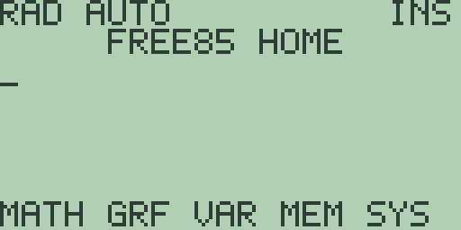
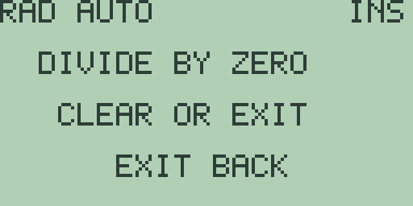

# Chapter 1: Operating the Calculator

This chapter covers the everyday mechanics of the calculator: switching it on
and off, typing and editing on the home screen, recalling previous work,
moving through menus, adjusting the system modes, finding functions in the
catalog, and reading the error screen. Everything else in this book builds on
the habits formed here.

## Power and boot

Press [ON] and the calculator boots straight to the home screen:

Reading from the top: the status line shows the angle mode and display format
on the left (`RAD AUTO` after a fresh boot) and the editor state on the right
(`INS` for insert mode); the banner `FREE85 HOME` names the screen; the
underscore below it is the entry-line cursor; and the bottom row carries the
soft-menu labels `MATH GRF VAR MEM SYS` for [F1] through [F5].

[2nd] [ON] turns the calculator off; the display goes completely blank. Press
[ON] to switch it back on. Pressing [ON] while the calculator is already
running does no harm: a full-screen message answers `ALREADY AWAKE`, with the
hint `CLEAR OR EXIT`, and either of those keys returns you to where you were.

## The home screen and the entry line

Whatever you type appears on the entry line at the cursor. Press [ENTER] and
the expression is evaluated: the result appears in the middle of the screen,
introduced by `=`. Type [2] [+] [3] [ENTER] and the entry line shows `2+3`
with `= 5` below it.

The expression stays on the entry line after evaluation. That is deliberate:
you can keep typing to extend it and press [ENTER] again, or press [CLEAR] to
start fresh. Chapter 3 covers the expression language itself; this chapter
sticks to the machinery around it.

## Editing the entry line

The [◀] and [▶] keys move the cursor along the entry line, and [DEL] deletes
the character just before the cursor. Type [1] [2] [3], press [◀] once, and
press [DEL]: the `2` disappears, leaving `13`.

The editor starts in insert mode, shown as `INS` in the status line, where
typing pushes the characters after the cursor to the right. With `13` on the
line, press [◀] and type [2]: the line becomes `123`.

[2nd] [DEL] toggles overwrite mode; the status indicator changes from `INS`
to `OVR`. In overwrite mode typing replaces the character under the cursor,
so the same [◀] [2] on `13` produces `12` instead. Press [2nd] [DEL] again to
return to insert mode.

[CLEAR] empties the entry line in one press.

## Previous entries and the last answer

The [ENTER] key's shifted function is `ENTRY`, the previous-entry recall.
Evaluate `2+3`, press [CLEAR], then press [2nd] [ENTER]: the entry `2+3`
reappears with the cursor at the end, ready to edit and re-evaluate.

The [▲] and [▼] keys walk the same history one step at a time, and the
calculator keeps your four most recent entries. Evaluate `2+3` and then
`5*7`, press [CLEAR], and [▲] recalls `5*7`; [▲] again replaces it with
`2+3`, and each recall arrives with the cursor at the end. A repeated
[2nd] [ENTER] steps back exactly as [▲] does. [▼] returns towards the
newest entry, and one step beyond it empties the line. A step with
nothing left to show answers the full-screen notice `NO MORE HISTORY`:
[▲] past the oldest entry the calculator holds, [▼] beyond the emptied
line, or either key on a fresh machine with no history yet. [EXIT]
dismisses the notice and the recalled entry stays on the line.

The [(-)] key's shifted function is `ANS`, the most recent numeric result.
With `5` as the last answer, press [CLEAR], then [2nd] [(-)] [+] [1] [0]
[ENTER]: the entry line reads `ANS+10` and the result is `= 15`. `ANS` can
appear anywhere in an expression, as many times as you like, and always means
the most recent numeric result.

## Menus

The home screen's own soft-menu row is the top of the menu system. Its first
page offers `MATH`, `GRF`, `VAR`, `MEM`, and `SYS` on [F1] through [F5];
press [MORE] and the second page offers `LIST`, `MAT`, `VEC`, `STAT`, and
`PGM`; press [MORE] again to cycle back to the first page.

Press [F1] on the first page and the `MATH` menu takes over the screen:

A menu lists up to five items at a time, and the hint line
`F1-F5 INSERT MORE` explains the keys: press the soft key matching an item to
insert it into your entry ([F1] here inserts `ABS(` and returns you to the
home screen), or press [MORE] for the next page, which in the `MATH` menu
starts with `SINH(` and `COSH(`.

Two keys back you out of any menu. [EXIT] goes up one level and leaves your
entry untouched. [2nd] [EXIT] is `QUIT`, which jumps straight back to the
home screen from however deep you have wandered.

## Mode settings

Press [2nd] [MORE] to open the `SYSTEM MODE` screen:

Three settings are listed, and the soft keys `ANG FMT - + MEM` adjust them:

- **Angle.** [F1] (`ANG`) toggles between `ANGLE RAD` and `ANGLE DEG`. The
  choice is echoed in the home-screen status line and affects every
  trigonometric function.
- **Display format.** [F2] (`FMT`) cycles `FORMAT` through `AUTO`, `SCI`,
  `ENG`, and `FIX`, then back to `AUTO`:
  - `AUTO`: ordinary decimal output, switching to an exponent for values
    outside the compact display range (the command catalog lists this
    setting under the names `Normal` and `Float`, which other calculators
    use for the same behaviour);
  - `SCI`: one digit before the decimal point and an explicit exponent, so
    `12345` displays as `1.2345E4`;
  - `ENG`: one to three digits before the point and an exponent divisible by
    three, so `12345` displays as `12.345E3`;
  - `FIX`: a fixed number of decimal places with half-up rounding, so at
    `FIX 2` the result of `2/3` displays as `0.67`.

  While `FIX` is selected, [▲] and [▼] change the number of decimal places,
  from `FIX 0` up to `FIX 11`. The format changes how results are displayed,
  not the precision the calculator stores.
- **Contrast.** `CONTRAST 16` by default. [F3] (`-`) lowers the setting one
  step at a time and [F4] (`+`) raises it; the number updates as you press.

[F5] (`MEM`) opens the memory browser from here; chapter 18 covers it. Press
[EXIT] to leave the mode screen and return home.

> ⚠ **Planned:** mode settings for complex display, vector coordinates,
> graph type, and differentiation (Free85 2.0, work packages 14.5 and
> 14.6).

## The catalog and the custom menu

Every function you can call lives in one alphabetical list, the catalog.
Press [2nd] [CUSTOM] to open it:

The header shows the page number and the current item (the list starts at
`ABS`), with the hint `ARROWS SELECT`. [▲] and [▼] move through the list, and
[ENTER] pastes the highlighted item into your entry line: [2nd] [CUSTOM] [▼]
[▼] [ENTER] pastes `ACOSH(` at the home screen. [EXIT] leaves the catalog
without choosing anything.

While an item is highlighted, pressing one of [F1] through [F5] assigns it to
that slot of the custom menu, and the screen confirms with a message such as
`ASSIGNED F2`.

Press [CUSTOM] (unshifted) to open the custom menu itself. Its five slots
come preloaded with `ABS`, `EXP`, `LIS`, `SQR`, and `STA` as soft labels, and
the screen explains itself: `F1-F5 RUN SLOT` and `MORE: CATALOG`. Pressing a
soft key inserts that slot's function ([CUSTOM] [F1] pastes `ABS(`), and
[MORE] jumps to the catalog so you can reassign slots. Keep your five
most-used functions here and they are always two keypresses away.

## The character palette

Press [2nd] [0] (`CHAR`) to open the character palette, titled `CHARACTERS`.
It shows one character at a time, starting from the space character, so the
middle of the screen looks empty until you move:

All four cursor keys step through the character set: [▶] and [▼] go forward,
[◀] and [▲] go backward, and the ends wrap around (stepping back from the
space character lands on `_`). The hint `ARROWS ENTER` and the label `INSERT`
say the rest: press [ENTER] to insert the shown character into your entry
line, or [EXIT] to leave with the entry untouched. One step right of the
space character is `!`, so [2nd] [0] [▶] [ENTER] types `!`. Chapter 9 covers
the character set and string values in full.

> ⚠ **Planned:** Greek and international characters in the palette
> (Free85 2.0, work package 14.9).

## When something goes wrong

Errors are full-screen and polite. Type [1] [÷] [0] [ENTER]:

The screen keeps the status line and shows three lines: the error name
`DIVIDE BY ZERO`, the hint `CLEAR OR EXIT` beneath it, and `EXIT BACK` at the
bottom. Press [CLEAR] or [EXIT] and you are back on the home screen with
`1/0` intact and the cursor at the end, so you can fix the mistake instead of
retyping it. Appendix C lists every error message.
