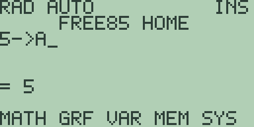
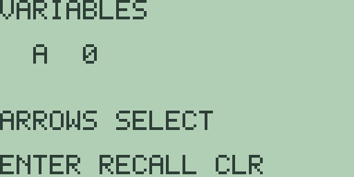
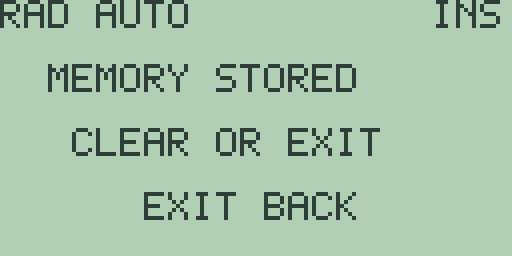

# Chapter 2: Variables and Stored Data

A calculator you cannot save numbers in is only half a calculator. This
chapter covers everywhere Free85 keeps a value for you: the twenty-six named
variables `A` through `Z`, the five quick numeric memories `M1` through `M5`,
the reserved names the system maintains itself, and the typed object store
that holds all of it behind the scenes. Chapter 18 continues the story with
the memory browser, where stored objects are inspected and deleted.

## Storing a value

The [STO▶] key types the store arrow, which appears on screen as `->`. An
expression of the form `value->name` evaluates the value and stores it in the
named variable. Variable names are single letters, typed with the [ALPHA]
modifier followed by the key carrying that letter above it, so [ALPHA] [LOG]
types `A`.

Type [5] [STO▶] [ALPHA] [LOG] [ENTER]:

The entry line reads `5->A`, and the result `= 5` confirms both the value and
the store. The stored value also becomes `ANS`, exactly as if you had
evaluated `5` on its own.

The left-hand side can be any expression; it is evaluated first and the
result is what gets stored. `2+3->C` stores `5` in `C`, and `PI->C` stores
the full fourteen-digit value `3.1415926535898`. The arrow is an ordinary
entry-line character, so you can cursor back and edit either side of it
before pressing [ENTER].

Names are exactly one letter. Storing to a two-letter name such as `AB`
answers with the `SYNTAX ERROR` screen, and so does storing to a lowercase
letter such as `a` (with one exception, `x`, described under reserved names
below). Storing to a variable that already holds a value simply overwrites
it; the previous value is gone.

## Recalling a value

To use a stored value, type its name wherever a number could appear. With `5`
in `A`, typing [ALPHA] [LOG] [×] [3] [ENTER] puts `A*3` on the entry line and
answers `= 15`. A name can appear as often as you like in one expression, and
every variable you have never stored to reads as `0`.

## The variables browser

The [STO▶] key's shifted function is `RCL`. Press [2nd] [STO▶] and the
`VARIABLES` browser takes over the screen:

The same screen opens from `VARS` ([2nd] [3]) and from the home screen's
`VAR` soft key ([F3]).

The browser shows one variable at a time, starting at `A`, with the hint
`ARROWS SELECT` beneath it. All four cursor keys step through the alphabet,
[▶] and [▼] forward, [◀] and [▲] backward, wrapping at either end: one press
of [◀] from `A` lands on `Z`. Press [ENTER]
and the selected letter is pasted into your entry line back on the home
screen, which is handy when you have forgotten which key holds which letter.
[EXIT] leaves without pasting anything.

The readout beside the selected letter shows the variable's stored value, so
with `5` in `A` the browser reads `A 5`. Pressing [CLEAR] performs the `CLR`
action named on the bottom line: it zeroes the selected variable in place,
and the readout updates to `0` immediately. Variables can also be deleted
from the memory browser described in Chapter 18: Memory Management.

## The five numeric memories

The shifted functions of the soft keys are five one-press memories: `M1`
through `M5` on [2nd] [F1] through [2nd] [F5]. They work from the home screen
and need no names.

- **With an expression on the entry line**, the memory key evaluates it and
  stores the result in that memory. Type [4] [2] [2nd] [F1]:

  

  The full-screen notice `MEMORY STORED` confirms, and [CLEAR] or [EXIT]
  returns you to the home screen with your entry intact. If the entry does
  not evaluate, the notice is `MEMORY ERROR` and nothing is stored.

- **With an empty entry line**, the memory key recalls: press [CLEAR] then
  [2nd] [F1] and the home screen shows `= 42` with nothing on the entry
  line. The recalled value becomes `ANS`, so [2nd] [(-)] carries it straight
  into your next expression.

The five memories are independent of each other and of `A` through `Z`. On a
fresh machine each one recalls `0`. They survive switching the calculator off
and warm restarts, and they are only emptied by a full reset from the memory
browser (chapter 18).

## Reserved names

A few names are special:

- **`A` through `Z`** always exist. They are the object store's reserved
  real-number entries, present from first boot with the value `0`, and they
  cannot be removed, only cleared. Deleting one from the memory browser
  resets its value to `0` and keeps its directory entry.
- **`x` and `X`** are the same variable, the graph variable. The [x-VAR] key
  types `X` in one press, and [ALPHA] [x-VAR] types the lowercase `x`; both
  spellings read and store the same value, so `5->x` followed by `X` answers
  `= 5`. The graphing chapters, beginning with
  Chapter 4: Cartesian Graphing, Drawing, Formats, and Persistence, use this
  variable as the plotting coordinate. Lowercase `x` is the only lowercase
  letter accepted in a variable name.
- **`ANS`** ([2nd] [(-)]) always names the most recent numeric result. It is
  maintained by the calculator and is not a storage target: `5->ANS` answers
  `SYNTAX ERROR`.

## The typed object store

Underneath all of this, Free85 2.0 keeps every stored item in one typed
object store (its on-calculator layout is versioned as schema 13): a
directory of up to sixty-four named entries backed by a 22,784-byte
compacting heap. Each entry records a name of up to eight
characters, a type (real numbers, complex numbers, lists, matrices, vectors,
strings, equations, programs, constants, graph databases, and pictures all
have type numbers), and an exact byte size. The accounting is deterministic:
deleting or shrinking an object closes the gap in the heap immediately, so
free space is always a single exact number, and a request that does not fit
is refused without touching what is already stored. Your data is never
silently overwritten.

You will meet the store's bookkeeping face to face in the memory browser,
which lists every object with its type and size; chapter 18 walks through it.
In today's firmware the store's directory holds the twenty-six reserved
reals, so the browser reports `OBJECTS 26`; the remaining types are part of
the storage contract and are exercised by the firmware's own validation
suite, ready for the 2.0 features that will create them.

> ⚠ **Planned:** creating, naming, and managing the store's other typed
> objects (lists, matrices, vectors, strings, and equations) directly from
> the keyboard (Free85 2.0, work package 14.9).

## Deleting stored data

There is no delete operation on the home screen; storing `0` over a variable
is the quick way to neutralise it. Proper deletion, including per-object
sizes and bulk clears, lives in the memory browser, which is the subject of
Chapter 18: Memory Management.
