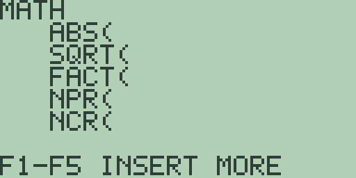
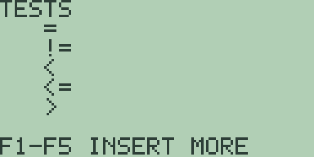
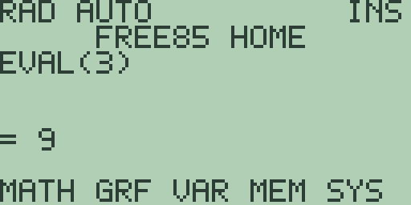

# Chapter 3: Mathematics, Calculus, and Comparisons

This is the book's core reference for calculating with single numbers: the
arithmetic operators and their precedence, powers and roots, logarithms,
trigonometry, hyperbolic functions, factorials and combinatorics, the numeric
utility functions, the comparison operators, and the numerical-calculus
commands that analyse a stored function. Every example below was run on a
fresh machine, and every result is quoted exactly as the calculator displays
it. Free85 works in fourteen significant decimal digits throughout; the
display format only changes how a result is presented, never what is stored
(see the mode screen in Chapter 1: Operating the Calculator).

## Finding the functions

The `MATH` menu ([F1] from the home screen, or the `MATH` legend on
[2nd] [×]) holds the most-used scalar functions:

Its first page carries `ABS(`, `SQRT(`, `FACT(`, `NPR(`, and `NCR(`, and
its second page the hyperbolic family. Everything else in this chapter
lives in the catalog ([2nd] [CUSTOM]), described in chapter 1. Wherever a
function is filed, there is always a shortcut: every name in this chapter
can simply be typed letter by letter with [ALPHA].

## Arithmetic and the order of operations

The four arithmetic keys [+] [-] [×] [÷] type the characters `+`, `-`, `*`,
and `/` on the entry line, and [^] types `^` for powers. Typing
[2] [+] [3] [ENTER] answers `= 5`; `2*3` answers `= 6` and `8/2` answers
`= 4`.

Because the arithmetic is decimal throughout, results that look exact are
exact: `0.1+0.2` answers `= 0.3`, and `12.5-2.75` answers `= 9.75`, with no
binary floating-point noise in the last digit.

The [(-)] key is the unary minus. It types the same `-` character as the
subtraction key, and the calculator reads the sign from context: `-5` on its
own answers `= -5`, `2*-3` answers `= -6`, and `5--3` (a subtraction followed
by a negation) answers `= 8`. Because both keys insert the same character,
you can use whichever is under your thumb; the expression means the same
thing either way.

Expressions follow the usual order of operations:

- `^` binds tightest: `2*3^2` answers `= 18`, not `36`.
- Unary minus binds looser than `^`: `-3^2` answers `= -9`. When you mean
  the square of a negative number, parenthesise it: `(-2)^2` answers `= 4`.
- `*` and `/` come next, then `+` and `-`: `2+3*4` answers `= 14`.
- Operators of equal rank evaluate left to right: `10-3-2` answers `= 5`.
- `^` chains right to left: `2^3^2` is `2^(3^2)` and answers `= 512`.
- Parentheses override everything, exactly as written.

Multiplication can be implicit: `2PI` answers `= 6.2831853071796` (the `π`
legend on [2nd] [^] types the constant `PI`), `2(3+4)` answers `= 14`, and
`3X` multiplies by the graph variable. Implicit
multiplication has the same precedence as the `*` key, so `6/2PI` evaluates
left to right as `(6/2)*PI` and answers `= 9.4247779607694`; parenthesise the
denominator when you mean `6/(2PI)`.

For very large and very small numbers, the [EE] key types the exponent
marker `E`: `1E-3` answers `= 0.001` and `1E3+2` answers `= 1002`. (That is
`E` between digits; standing alone, `E` names Euler's constant instead, as
the logarithms section shows.) Exponents
run from `-128` through `127`, and results that overflow that range stop
with the `NUMERIC OVERFLOW` error screen rather than silently losing
precision.

## Powers and roots

The [x²] key types `^2`, so [3] [x²] [ENTER] puts `3^2` on the entry line
and answers `= 9`. It is a plain piece of entry-line text; you can cursor
back into it and edit it like anything else you typed.

The `^` operator accepts whole-number exponents from `-9` through `9`, and
the exponent may be any expression that evaluates to such a whole number:
`2^9` answers `= 512`, `2^-1` answers `= 0.5`, `2^(3*3)` answers `= 512`,
and `0^0` answers `= 1`. Outside that range, or with a fractional exponent,
the answer is the `DOMAIN ERROR` screen: `2^10`, `2^-10`, and `2^0.5` all
stop there. For larger powers, multiply in stages (`2^9*2^9` answers
`= 262144`, which is 2 to the 18th); for fractional powers, use the root
functions below or the logarithm functions in the next section.

Four function keys cover the most common powers and roots:

- **Square root.** [2nd] [x²] (the `√` legend) inserts `SQRT(`. `SQRT(81)`
  answers `= 9`, and `SQRT(2)` answers `= 1.4142135623731`. Negative
  arguments answer `DOMAIN ERROR`.
- **Powers of ten.** [2nd] [LOG] (the `10^x` legend) inserts `TEN(`, which
  raises 10 to any real power. It works through logarithms, so its results
  are fourteen-digit approximations: `TEN(3)` answers `= 999.99999999938`.
  When the exponent is a whole number from `-9` to `9`, typing `10^3`
  instead answers an exact `= 1000`.
- **The exponential function.** [2nd] [LN] (the `e^x` legend) inserts
  `EXP(`. `EXP(1)` answers `= 2.7182818284583` and `EXP(2)` answers
  `= 7.3890560989266`.
- **Reciprocal.** [2nd] [EE] (the `x^-1` legend) inserts `1/(`, so
  [2nd] [EE] [4] [)] [ENTER] evaluates `1/(4)` and answers `= 0.25`.

For other roots, the catalog function `ROOT(x,n)` takes the nth root of
`x`: `ROOT(27,3)` answers `= 2.9999999999993`, again a fourteen-digit
approximation computed through logarithms. `ROOT(` requires a positive `x`;
`ROOT(-8,3)` answers `DOMAIN ERROR`, so take the root of the absolute value
and reapply the sign yourself when you need the odd root of a negative
number.

## Logarithms

[LN] inserts `LN(`, the natural logarithm, and [LOG] inserts `LOG(`, the
base-ten logarithm:

- `LN(2)` answers `= 0.69314718056122`.
- `LOG(1000)` answers `= 3` and `LOG(2)` answers `= 0.30102999566454`.

Both functions require a positive argument; `LN(0)` answers `DOMAIN ERROR`.
`LN(` and `EXP(` are inverses of one another, as are `LOG(` and `TEN(`, up
to the fourteen-digit arithmetic: `LN(E)` answers `= 1.0000000000006`
because the constant `E` is itself stored to fourteen digits.

## Trigonometry

The [SIN], [COS], and [TAN] keys insert `SIN(`, `COS(`, and `TAN(`. Their
inverses sit on the same keys behind [2nd]: [2nd] [SIN] (the `SIN^-1`
legend) inserts `ASIN(`, [2nd] [COS] inserts `ACOS(`, and [2nd] [TAN]
inserts `ATAN(`.

All six obey the angle mode in the status line, set from the mode screen
described in chapter 1. In `RAD` mode (the fresh-boot default):

- `SIN(PI/6)` answers `= 0.5`.
- `TAN(PI/4)` answers `= 1`.
- `ASIN(1)` answers `= 1.5707963267949`, which is pi over two.

In `DEG` mode ([2nd] [MORE] [F1], status line `DEG AUTO`):

- `SIN(30)` answers `= 0.5`.
- `TAN(45)` answers `= 1`.
- `ASIN(0.5)` answers `= 30` and `ATAN(1)` answers `= 45`.

The fourteen-digit arithmetic shows itself at the edges: in radians,
`SIN(PI/2)` answers `= 0.9999999999939` rather than `1`, because `PI` itself
is a fourteen-digit value; in degrees, `COS(60)` answers
`= 0.49999999999989`. The tiny error is real, not a display artefact, and
it is why results you know should be round sometimes miss by a whisker in
the last digits.

Each trigonometric function takes exactly one argument; `SIN(1,2)` answers
`SYNTAX ERROR`. Out-of-range inverse arguments, such as `ASIN(2)`, answer
`DOMAIN ERROR`. To convert an angle between units explicitly rather than
switching modes, the conversion functions `RAD(` and `DEG(` are available
from the conversions menu: `RAD(180)` answers `= 3.1415926535898` and
`DEG(PI)` answers `= 180`. Chapter 8: Physical and User Constants and
Conversions covers that menu in full.

## Hyperbolic functions

The `MATH` menu's second page carries `SINH(`, `COSH(`, `TANH(`, `ASINH(`,
and `ACOSH(`. The sixth member, `ATANH(`, lives in the catalog. All six
take their argument as a plain number, unaffected by the angle mode:

- `SINH(1)` answers `= 1.1752011936434`.
- `COSH(1)` answers `= 1.5430806348149`.
- `TANH(1)` answers `= 0.76159415595567`.
- `ASINH(1)` answers `= 0.88137358702064`.
- `ACOSH(2)` answers `= 1.316957896926`.
- `ATANH(0.5)` answers `= 0.54930614433465`.

Domain rules follow the mathematics: `ACOSH(` needs an argument of at
least 1, so `ACOSH(0.5)` answers `DOMAIN ERROR`, and so does `ATANH(1)`.

## Factorials, permutations, and combinations

`FACT(`, on the `MATH` menu's first page, computes the factorial
(elsewhere `factorial` or `x!`):

- `FACT(0)` answers `= 1` and `FACT(5)` answers `= 120`.
- The argument must be a whole number from 0 through 69: `FACT(2.5)` and
  `FACT(-1)` answer `DOMAIN ERROR`.
- `FACT(69)` answers `= 1.7112245242814E98`, the largest factorial the
  numeric range holds; `FACT(70)` answers `NUMERIC OVERFLOW`.

`NPR(n,r)` counts permutations, ordered selections of `r` items from `n`,
and `NCR(n,r)` counts combinations, where order does not matter:

- `NPR(5,2)` answers `= 20`.
- `NCR(5,2)` answers `= 10`.
- `NCR(20,10)` answers `= 184756`.

Both expect whole numbers with `r` no larger than `n`; `NCR(2,3)` answers
`DOMAIN ERROR`.

## Numeric utilities

A family of utility functions rounds out the scalar toolkit. None of them
sit on the `MATH` menu, so type the names with [ALPHA], paste them from the
catalog, or keep your favourites on the custom menu (chapter 1):

- **`ABS(`** strips the sign: `ABS(-7)` answers `= 7`.
- **`INT(`** keeps the whole-number part, truncating toward zero
  (elsewhere `iPart`): `INT(12.9)` answers `= 12` and `INT(-12.9)` answers
  `= -12`. Free85 has no separate floor-style `int` that would round
  `-12.9` down to `-13`.
- **`FRAC(`** keeps the fractional part, with the sign of its argument
  (elsewhere `fPart`): `FRAC(12.75)` answers `= 0.75` and `FRAC(-12.75)`
  answers `= -0.75`.
- **`ROUND(x,n)`** rounds to `n` decimal places, 0 through 11:
  `ROUND(PI,4)` answers `= 3.1416`.
- **`SIGN(`** answers `= 1`, `= 0`, or `= -1`: `SIGN(-3)` answers `= -1`
  and `SIGN(0)` answers `= 0`.
- **`MOD(x,y)`** is the remainder of `x` divided by `y` (elsewhere
  `mod`), with the sign taken from `x`: `MOD(17,5)` answers `= 2`,
  `MOD(-7,3)` answers `= -1`, and `MOD(7,-3)` answers `= 1`. `MOD(5,0)`
  answers `DIVIDE BY ZERO`.
- **`GCD(` and `LCM(`** work on whole numbers: `GCD(84,30)` answers `= 6`
  and `LCM(6,8)` answers `= 24`.
- **`MIN(` and `MAX(`** take exactly two arguments: `MIN(-2,3)` answers
  `= -2` and `MAX(-2,3)` answers `= 3`. (`MIN(1,2,3)` answers
  `SYNTAX ERROR`; nest calls for longer lists.)
- **`PCT(x,p)`** answers `p` percent of `x` (elsewhere `percent`):
  `PCT(200,15)` answers `= 30` and `PCT(80,25)` answers `= 20`.
- **`ROOT(x,n)`**, described under powers and roots above, is the nth-root
  companion to this family.
- **`RAND()`** returns a pseudo-random value between 0 and 1 with four
  decimal places. The generator is deterministic: a fresh machine always
  answers `= 0.7968` first and `= 0.8984` second, and the sequence carries
  on from wherever it left off. `RANDI(low,high)` returns a whole number
  from `low` through `high` inclusive, drawn from the same sequence:
  `RANDI(4,9)` on a fresh machine answers `= 6`. Treat both as repeatable
  test sequences, not as a source of secrets.

## Comparisons

Press [2nd] [2] (the `TEST` legend) and the `TESTS` menu lists the six
comparison operators:

Page one offers `=`, `!=`, `<`, `<=`, and `>` on [F1] through [F5]; press
[MORE] for `>=`. Pressing a soft key inserts the operator into your entry
and returns you to the home screen.

A comparison evaluates to a calculator boolean: `1` for true, `0` for
false.

- `5=5` answers `= 1` and `2=3` answers `= 0`.
- `2!=3` answers `= 1`.
- `2<3` answers `= 1`, `2<=2` answers `= 1`, `4>3` answers `= 1`, and
  `2>=3` answers `= 0`.

Note the spellings. Equality is the single `=` character; a doubled `==`,
which some languages and calculators use, answers `SYNTAX ERROR`, and so
does the `<>` spelling of not-equal. The not-equal operator is `!=`, exactly
as the `TESTS` menu inserts it.

Because the result is an ordinary number, comparisons combine freely with
arithmetic: `(2<3)+(5>=5)` answers `= 2`. Comparisons do not chain, though:
`2<3<1` answers `SYNTAX ERROR`, so write the two comparisons separately.
Chapter 16: Calculator Programming puts these operators to work in `If` and
`While` conditions.

## Numerical calculus

Free85's calculus commands analyse the *active graph equation* rather
than taking an expression as an argument. This is a deliberate design: the
short forms keep expressions comfortably inside the entry line. Store a
function once, then evaluate, differentiate, integrate, and search it from
the home screen, from programs, or from the catalog.

To store the function, type it on the home entry line using [x-VAR] for the
variable and press [GRAPH]: [x-VAR] [x²] [GRAPH] stores `X^2` as `Y1` and
plots it. Let the plot run to completion; the calculus commands read the
stored equation, and if you interrupt the plot with [EXIT] the equation is
not yet ready, so `EVAL(3)` answers `SYNTAX ERROR` until you plot it
through once. When the plot finishes, press [EXIT] to return home; your
entry is still on the line, so press [CLEAR] and put the commands to work:

With `X^2` stored as the active equation:

- **`EVAL(x)`** evaluates the active equation: `EVAL(3)` answers `= 9`.
- **`NDER(x)`** takes a central numerical derivative: `NDER(3)` answers
  `= 6`.
- **`FNINT(a,b)`** integrates over `[a,b]` with a 64-panel composite
  Simpson rule: `FNINT(0,2)` answers `= 2.6666666666667`, the fourteen-digit
  8/3.
- **`FMIN(a,b)` and `FMAX(a,b)`** search `[a,b]` and return the *location*
  of the extremum, not its value: `FMIN(-2,2)` answers
  `= 0.00011982342365967`, the numerical minimum of the parabola near zero,
  and `FMAX(-2,2)` answers `= -1.9997326856357`, closing in on the `-2`
  endpoint. Follow up with `EVAL(` on the answer when you want the value
  there; the small residuals are the honest output of the search.
- **`INTER(a,b)`** interpolates linearly between the endpoint values and
  returns the midpoint of that chord: with `X^2` stored, `INTER(0,2)`
  answers `= 2`, halfway between the endpoint values `0` and `4`.
- **`ARC(a,b)`** sums a 64-segment polyline approximation to the arc
  length: `ARC(0,1)` answers `= 1.4789246603114`.

If you are arriving from another calculator's manual, the names map like
this (Free85 spelling first, then the name elsewhere):

- `EVAL(` covers the expression-argument evaluators `eval` and `evalF`.
- `NDER(` covers the numerical derivatives `nDer` and `der1`. There is no
  separate second-derivative command, so for `der2` workflows apply
  `NDER(` to a stored derivative expression.
- `EVAL(` on a stored polynomial covers the polynomial evaluator `peval`;
  the polynomial's roots come from the `POLY` solver in Chapter 14:
  Equation, Polynomial, and Simultaneous Solving.
- `INTER(` and `ARC(` correspond to `inter` and `arc`.

The same analysis (roots, extrema, derivative, and integral, plus
intersection between equations) is available graphically from the graph
screen's soft keys, working on the plotted window instead of an interval
you type. Chapter 4: Cartesian Graphing, Drawing, Formats, and Persistence
covers that workflow, the `Y2` and `Y3` slots, and everything else about
the graph screen.

Finally, [2nd] [CLEAR] (the `TOLER` legend) cycles the numeric tolerance
through `1E-6`, `1E-8`, and `1E-10`, confirming each press with a
`TOLERANCE CHANGED` notice; a fresh machine starts at `1E-6`. The
root-hunting analyses of chapters 4 and 14 test their residuals against
this setting.

## Angle and fraction display

Angles in Free85 are plain decimal numbers, read as radians or degrees
according to the `RAD`/`DEG` mode set on the mode screen (chapter 1). The
`RAD(` and `DEG(` functions convert a value between the two units
explicitly (chapter 8). There is no degrees-minutes-seconds notation yet:
angles like 30 degrees 15 minutes are entered as their decimal equivalent
(`30.25`), and results are displayed the same way. Fractions likewise
always display as decimals.

> ⚠ **Planned:** degrees-minutes-seconds entry and display and fraction
> presentation of results (Free85 2.0, work package 14.2).
