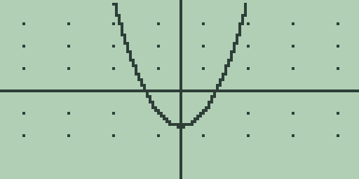
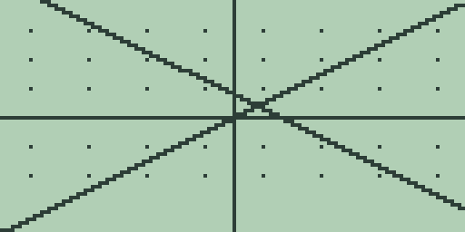
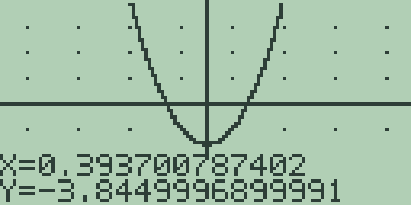
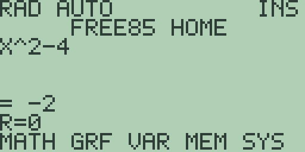
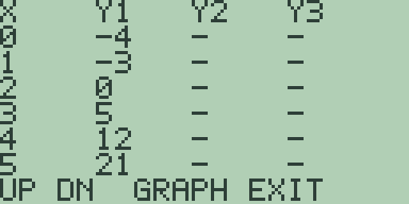

# Chapter 4: Cartesian Graphing, Drawing, Formats, and Persistence

This chapter is the full tour of the graph screen: storing equations in the
three function slots, watching a plot draw, changing the window with the zoom
keys, tracing along a curve, running the root and calculus analyses directly
from the plot, and reading the table of values. It closes with a frank
account of the graph areas that are not built yet, namely drawing commands,
and graph storage. Every key sequence and every
quoted number below was run in the emulator on a fresh machine.

Free85 currently graphs in one mode: real functions of the graph variable
`X` (elsewhere `Func`). The polar, parametric, and
differential-equation modes have their own chapters (5, 6, and 7), which
describe what is planned and what the calculator does today.

> 🔌 **Hardware:** all graphing in this chapter, including plot speed and
> the LCD captures, is validated in the emulator; physical hardware
> validation is reported separately.

## Storing an equation and plotting it

There is no separate equation-entry screen: the home entry line is the
equation editor. Type an expression in `X` using [x-VAR] (the graph
variable is described in Chapter 2: Variables and Stored Data), then press
[GRAPH]. The calculator saves the entry line
into the active function slot and starts plotting. Type
[x-VAR] [x²] [-] [4] [GRAPH] and the parabola `X^2-4` appears:

The plot area is the whole 128 by 64 pixel display. The axes cross at the
origin, and the faint dots are the grid, drawn at a fixed screen spacing
rather than at unit intervals. The ordinary graph screen uses every key
directly; the format and zoom panels add labelled soft-menu rows when opened.

A plot draws column by column from left to right, 128 samples in all. A
single equation takes a few seconds and plots noticeably faster than
three; a heavy expression slows every column. You can leave at any
time: [EXIT] or [CLEAR] cancels the
redraw and returns to the home screen with the equation loaded on the entry
line. Remember the warning in Chapter 3: Mathematics, Calculus, and
Comparisons, though: the home-screen calculus commands such as `EVAL(` need
one completed plot, and after an interrupted plot they answer
`SYNTAX ERROR` until you let a plot run through once.

The plotter is deliberately hard to crash. Discontinuities, domain errors,
and values outside the window leave gaps instead of stopping the plot:
`1/X` plots both branches with a one-column gap at `X=0`, `SQRT(X)` plots
nothing left of the origin, and adjacent samples are joined into a connected
curve only when they are fewer than seventeen pixels apart, so a vertical
asymptote is not smeared into a false vertical line.

Pressing [GRAPH] again on the graph screen replots. Pressing the `GRF` soft
key ([F2] on the home screen's first menu page) opens the same graph screen.

One side effect worth knowing: plotting evaluates the equation at every
sample, and each evaluation stores the sample into the graph variable, so
after a completed plot `X` holds the last sampled value (`X` on the entry
line after the plot above answers `= 9.9999999999959`).

## The three function slots

Free85 has three function slots, `Y1`, `Y2`, and `Y3`. [GRAPH] always saves
the entry line into the *active* slot, and `Y1` is active on a fresh boot.
To switch slots, press [2nd] [1], [2nd] [2], or [2nd] [3] *on the graph
screen*: the calculator makes that slot active and returns to the home
screen with the slot's stored text loaded on the entry line, ready to edit.

To plot two lines together: type [x-VAR] [GRAPH] to store `X` as `Y1`, press
[2nd] [2] to switch to `Y2` (the entry line comes back empty), type
[2] [-] [x-VAR], and press [GRAPH]:

Both slots are now enabled and every replot draws both. A slot is enabled
whenever it holds text: storing an empty entry line disables and clears the
slot, so to switch `Y2` off, press [2nd] [2] on the graph screen, press
[CLEAR], then press [GRAPH]. Equation selection (elsewhere `FnOn` and
`FnOff`) can also be changed without erasing text: open graph format with
[2nd] [MORE], press [MORE] for its second page, then use [F2], [F3], or [F4]
to toggle `Y1`, `Y2`, or `Y3`. An enabled stored equation is on; a disabled
stored equation remains available for later use.

## The window and the zoom keys

The window is described by four values, the minimum and maximum of each
axis: the default window runs from -10 to 10 on both axes, and each
plotted column steps one 127th of the width. The window is changed with
the zoom keys on the graph screen, each of which replots immediately:

- **[+]** zooms in (elsewhere `ZIn`): every window bound is halved,
  closing in on the origin by a factor of two. One press on the default
  window gives -5 to 5 on both axes.
- **[-]** zooms out (elsewhere `ZOut`): every bound is doubled, giving -20
  to 20 from the default window.
- **[2nd] [+]** restores the standard window (elsewhere `ZStd`): -10 to 10
  on both axes, from wherever your zooming has taken you.
- **[2nd] [-]** sets the square window (elsewhere `ZSqr`): -10 to 10
  horizontally and -5 to 5 vertically. Because the LCD is 128 pixels wide
  and 64 tall, this window makes one unit the same length on both axes, so
  circles look like circles.

For the complete zoom panel, press [2nd] [GRAPH]. Its three pages are:

- page 1: [F1] `ZBox`, [F2] `ZIn`, [F3] `ZOut`, [F4] `ZStd`, and [F5]
  `ZSqr`;
- page 2: [F1] `ZDecm`, [F2] `ZFit`, [F3] `ZInt`, [F4] `ZPrev`, and [F5]
  `ZTrig`;
- page 3: [F1] stores the current window, [F2] performs `ZRcl`, and [F3]
  or [F4] selects factor 2 or factor 4 for later zoom-in and zoom-out.

Press [MORE] to cycle pages and [EXIT] to return to the plot. `ZBox` starts
a movable cursor: position one corner with the arrow keys and press [ENTER],
then position the opposite corner and press [ENTER] again. This box is the
free-form `user-defined-zoom`. The factor 2/factor 4 choices are the
`zoom-factors`; they remain selected until changed. `ZFit` retains the
horizontal range and derives a padded vertical range from the active curve.
`ZPrev` exchanges the current and previous windows, while store and `ZRcl`
provide a separate remembered window.

The current bounds are readable on the home screen as `XMIN`, `XMAX`, `YMIN`,
and `YMAX`. They are read-only system values; window changes go through the
zoom controls above.

## Trace

The [◀] and [▶] keys trace along the active equation (elsewhere `Trace`;
there is no separate trace mode to switch on). The trace position starts
at the centre column of the
plot, each press moves it one column, and the readout at the bottom of the
screen shows the exact coordinates. With `X^2-4` plotted, press [▶] twice:

The readout gives `X=0.393700787402` and `Y=-3.8449996899991`: the trace
X values are the exact sample positions, spaced one 127th of the window
width apart, and Y is the active equation evaluated there in full
fourteen-digit precision. The trace stops at the left and right edges of
the window. Two quirks: the readout is drawn over the bottom rows of
the plot (press [GRAPH] to redraw cleanly), and there is no marker on the
curve itself yet, so the readout is the trace.

Press [▲] or [▼] from an ordinary completed plot to start the free cursor at
the centre of the screen. All four arrow keys move it independently of the
curve, and its footer reports the corresponding window coordinate. [EXIT],
[CLEAR], or [GRAPH] leaves free-cursor mode and redraws. Turning coordinate
display off in graph format suppresses both trace and free-cursor footers.

Tracing also sets the reference position used by the analyses in the next
section: the derivative is taken, and the root search begins, at the last
traced `X` (which is `X=0` until you move the trace).

## Analysis from the graph screen

The five function keys run the numerical analyses directly on the plotted
equations, using the current window as the interval. Each publishes its
result on the home screen. With `X^2-4` plotted:

- **[F1] finds a root** of the active equation. The search starts from the
  traced position, then scans the window from the left edge for a sign
  change and closes in by bisection, so with `X^2-4` it answers `= -2`,
  the leftmost root in the window. A second line reports the residual,
  here `R=0`: the value of the equation at the reported root, which the
  tolerance setting (chapter 3) requires to be small.

  

- **[F2] finds a minimum and [F3] a maximum**, searching the whole window
  and answering the *location* of the extremum: [F2] with `X^2` plotted
  answers `= 0.00059911711827895`, the numerical minimum near zero, in the
  same honest-residual style as `FMIN(` and `FMAX(` in chapter 3.
- **[F4] takes the derivative** at the traced position by central
  difference: with `2*X+3` plotted it answers `= 2`, and with `X^2`
  plotted, tracing three columns right of centre and pressing [F4] answers
  `= 1.102362205`, twice the traced `X`.
- **[F5] integrates** the active equation across the window with the same
  64-panel Simpson rule as `FNINT(`: with `X^2` in the standard window it
  answers `= 666.66666666667`, the fourteen-digit 2000/3.
- **[2nd] [F1] finds an intersection** of `Y1` and `Y2` (both slots must
  be enabled). With `Y1=X` and `Y2=2-X` it answers `= 1`, again with a
  residual line.

When a search fails, for instance [F1] on `X^2+1`, which never crosses
zero, the answer is the `NO NUMERIC RESULT` notice rather than a made-up
number; [CLEAR] or [EXIT] dismisses it.

These are the graph-side counterparts of the home-screen calculus commands
(`EVAL(`, `NDER(`, `FNINT(`, `FMIN(`, `FMAX(`) described in chapter 3: same
algorithms, with the window standing in for the interval arguments. The
[GRAPH] key's shifted function `SOLVER` chains two of the steps: with an
expression on the home entry line, [2nd] [GRAPH] stores it, finds a root,
and answers on the home screen in one go ([2nd] [GRAPH] with `X^2-4` on the
line answers `= -2`). Chapter 14: Equation, Polynomial, and Simultaneous
Solving covers the solving tools in full.

## The table

Press [MORE] on the graph screen to open the table of values:

The table shows six rows, an `X` column on the left, and a column per
function slot. It starts at `X=0` and steps by 1, so with `X^2-4` stored
the `X` column reads `0` through `5` and the `Y1` column reads `-4`,
`-3`, `0`, `5`, `12`, `21`. A disabled slot's column shows `-`, and a value
that does not exist shows `UNDEF`: plot `1/X` and open the table, and the
`X=0` row shows `UNDEF` with the reciprocals below it. Cells are five
characters wide, so long values are truncated to fit (`0.333` for a
third).

The table keys are listed on its bottom line, `UP DN GRAPH EXIT`:

- [▲] and [▼] scroll by five rows: one press of [▼] restarts the table at
  `X=5`.
- [+] doubles the step and [-] halves it, so from the default the rows step
  2, 4, 8 apart, or 0.5, 0.25 going the other way.
- [GRAPH] or [EXIT] leaves the table and replots the graph.

The start and step you reach this way survive leaving the table, so a
scrolled table reopens where you left it, but neither value can be typed
in directly: the four keys above are the only controls today.

## Graph formats

Press [2nd] [MORE] on the graph screen to open the persistent format panel.
On its first page, [F1] toggles `AxesOn`/`AxesOff`, [F2] toggles
`CoordOn`/`CoordOff`, [F3] toggles `LabelOn`/`LabelOff`, [F4] toggles
`GridOn`/`GridOff`, and [F5] selects `DrawLine` or `DrawDot`. Line mode joins
adjacent valid samples; dot mode plots only the samples. [.] remains a quick
grid toggle from the ordinary graph screen.

Press [MORE] for the second format page. [F1] selects `SimulG` or `SeqG`:
simultaneous mode samples every enabled equation at each X column, whereas
sequential mode completes one equation before starting the next. Both produce
the same final framebuffer. [F2], [F3], and [F4] toggle `Y1`, `Y2`, and `Y3`;
[F5] moves directly to the zoom panel. [EXIT] applies the persistent settings
and redraws.

## Drawing on a graph

Press [CUSTOM] on a completed graph to open DRAW. The first page maps [F1]
through [F5] to `Line`, `Vert`, `Circ`, `TanLn`, and `Shade`. Press [MORE] for
`PtOn`, `PtOff`, `PtChg`, `DrawF`, and `DrInv`; press it again for the
`freehand-pen` and `ClDrw` plus the picture controls.

Cursor tools begin in the centre. Move with the arrow keys. `Line` and `Circ`
use [ENTER] once to fix their first point and again to draw; vertical, tangent,
and point tools use one [ENTER]. The pen draws as you move. [EXIT] or [CLEAR]
leaves a cursor tool. Shade and function drawing proceed incrementally and can
be cancelled. `ClDrw` discards marks by redrawing the equations and axes.

## Storing and recalling graphs

On DRAW page 3, [F3] `StPic` stores the exact LCD image as `PIC1`, [F4]
`RcPic` recalls it, and [F5] `StGDB` stores the equations, window, table,
format, and mode settings as `GDB1`. Press [MORE] once more and [F1] `RcGDB`
to restore that database and redraw. Re-storing replaces the same named object,
so repeated saves do not consume another directory entry.

Pictures and graph databases are native Free85 objects shown by the memory
browser. They are not TI file-format or binary-compatible objects. Programs
can call the same operations with hexadecimal `DRAW` codes; the complete code
table is in `docs/Free85-graph-drawing-persistence.md`.
