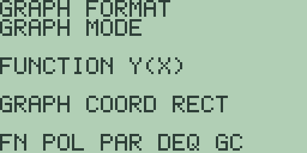
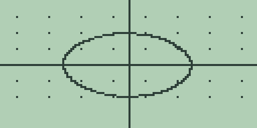

# Chapter 5: Polar Graphing

Polar graphing plots curves given as a radius in terms of an angle, the
natural form for circles about the origin, spirals, and rose curves. The
mode (elsewhere `Pol`) sits on the same graph engine as Chapter 4
(Cartesian Graphing, Drawing, Formats, and Persistence): the same window
and zoom keys, the same format toggles, the same [.] grid shortcut, the
same DRAW tools on [CUSTOM], and the same [MORE] table. This chapter
covers what the mode adds and changes, and every figure in it is quoted
from the machine.

> 🔌 **Hardware:** polar graphing, its plots, and the LCD captures are
> validated in the emulator; physical hardware validation is reported
> separately.

## Switching the graph mode

The graph mode lives on the third page of the graph format panel. On the
graph screen, press [2nd] [MORE] to open graph format, then press [MORE]
twice:

The panel keeps its `GRAPH FORMAT` banner and titles this page
`GRAPH MODE`. The middle line names the current mode,
`FUNCTION Y(X)` on a fresh machine, and the line below it shows the
coordinate readout setting, `GRAPH COORD RECT`. The soft keys are
`FN POL PAR DEQ GC`: [F1] through [F4] select the function, polar,
parametric, and differential-equation modes, and any of the four closes
the panel and replots immediately in the new mode. [F5] is the
coordinate toggle (elsewhere `PolarGC`): it switches the line between
`GRAPH COORD RECT` and `GRAPH COORD POLAR` and stays on the page, and
[EXIT] then returns to the plot. What the toggle changes is described
under tracing below.

## Entering a polar equation

Press [F2] on the mode page for polar. As in chapter 4 there is no
separate equation screen: the home entry line is the editor, [GRAPH]
stores the line into the active slot, and [2nd] [1], [2nd] [2], and
[2nd] [3] on the graph screen switch slots. The difference is the
meaning of slot 1: it holds the radius as a function of the angle.

The angle is typed with [x-VAR]. There is no theta character in the
firmware: [x-VAR] inserts the character `X`, the equation is stored
exactly as typed, and in polar mode the plotter reads that `X` as the
sweep angle. A rose curve is therefore stored as `5*SIN(3X)`.

## The sweep and the window

Polar mode has no angle-range settings. The plotter always sweeps the
angle through one full revolution in 128 samples: 0 to 2 pi in `RAD`
mode, and 0 to 360 in `DEG` mode, so the angle mode on the system mode
screen (Chapter 1: Operating the Calculator) changes where the samples
fall. The window and zoom keys of chapter 4 control the viewport only;
zooming never stretches or trims the sweep.

To draw the worked example, select polar on the mode page, press [EXIT],
type [5], and press [GRAPH]:

A constant radius sweeps a circle of radius 5. In the standard window it
draws as an ellipse because the pixels are not square; [2nd] [-] sets
the square window (`ZSqr`, chapter 4) and rounds it. Replacing slot 1
with `5*SIN(3X)` plots a three-petal rose. Plotting is the same
cancellable column-by-column redraw as chapter 4, one sample per column:
[EXIT] or [CLEAR] cancels mid-plot and returns to the home screen with
the equation on the entry line.

## Tracing a polar curve

[◀] and [▶] trace along the sweep, starting from its centre sample and
moving one sample per press. The readout follows the curve around the
origin rather than left to right. Its labels are always `X=` and `Y=`;
what fills them is the coordinate setting from the mode page:

- With `GRAPH COORD RECT`, the readout is the Cartesian point. On the
  circle above, one press of [▶] shows `X=-4.9862524284893` and
  `Y=-0.37071118578787`.
- With `GRAPH COORD POLAR`, the same position shows the radius in the
  `X=` line and the angle in the `Y=` line: `X=5` and
  `Y=3.2158035036746` in `RAD` mode, or `Y=184.25196850393` for the
  same press in `DEG` mode. The labels do not change with the setting,
  so remember which reading is selected.

Each trace step recomputes its sample, which takes a noticeable moment,
and keypresses that arrive while it works are dropped, so trace at the
calculator's pace rather than by holding the key. The free cursor
([▲] or [▼], chapter 4) is unchanged in polar mode: it reports plain
window coordinates whatever the coordinate setting says.

## The polar table

[MORE] on the graph screen opens the table of chapter 4 with the same
six rows, the same headings `X Y1 Y2 Y3`, and the same scrolling and
step keys. In polar mode the `X` column holds the angle and `Y1` the
radius evaluated there, starting at 0 and stepping by 1. With the
circle stored, the `Y1` column reads `5` in every row; with the rose
`5*SIN(3X)` in `RAD` mode it reads `0`, `0.705`, `-1.39`, and so on
down the rows, truncated to the five-character cells of chapter 4.

## Analysis in polar mode

The five function keys and [2nd] [F1] remain live, but they treat the
stored radius as an ordinary function of the angle over the *window*
interval `XMIN` to `XMAX`, not over one revolution. With the circle
`5` stored and the standard window:

- [F4] answers `= 0`, the derivative of a constant radius;
- [F5] answers `= 100`, the integral of 5 across the 20-unit window;
- [F1] answers the `NO NUMERIC RESULT` notice, since the radius never
  crosses zero;
- `EVAL(2)` on the home screen answers `= 5` after a completed plot,
  the radius at angle 2.

None of these is an arc length or a swept area; read them as chapter 3
calculus applied to the radius function. The intersection search
[2nd] [F1] needs slot 2 enabled, and since slot 2 never plots in polar
mode the search has no honest use here.

## What the mode remembers

Each graph mode keeps its own equations, enabled slots, active slot,
window, table position, and coordinate setting. When you switch modes,
the outgoing mode's state is written to a named object in the store,
`GPOL` for polar (the others are `GFUNC`, `GPAR`, and `GDEQ`), and
switching back restores it exactly. The memory browser of Chapter 18
(Memory Management) lists it as `TYPE GRAPH DB` with `SIZE 213`, and
[DEL] on it resets that one mode to factory state the next time the
mode is entered. Note that the object is written when you *leave* the
mode, so the mode you are currently in has no entry to delete yet.

## Boundaries worth knowing

Slots 2 and 3 never plot in polar mode, but they are not inert: a slot
holding text stays enabled, and the table then shows `UNDEF` in its
column for every row. Clear a leftover slot the chapter 4 way, by
selecting it with [2nd] [2] or [2nd] [3] on the graph screen and
pressing [GRAPH] with the entry line empty, remembering that this also
erases the slot's text. Appendix A catalogues this chapter's workflow
as `polar-editor`, `polar-plot`, `polar-trace`, `polar-table`, and
`polar-analysis`.
