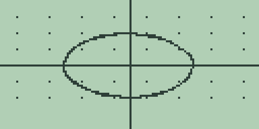

# Chapter 6: Parametric Graphing

Parametric graphing plots curves whose horizontal and vertical
coordinates are each given as a function of a shared parameter, the form
that handles projectile paths, Lissajous figures, and any curve that
doubles back on itself. The mode (elsewhere `Param`) runs on the shared
graph engine of Chapter 4 (Cartesian Graphing, Drawing, Formats, and
Persistence), and every number quoted in this chapter comes straight
from the machine.

> 🔌 **Hardware:** parametric graphing, its plots, and the LCD captures
> are validated in the emulator; physical hardware validation is
> reported separately.

## Switching to parametric mode

Open the graph mode page exactly as in Chapter 5 (Polar Graphing):
press [2nd] [MORE] on the graph screen, then [MORE] twice to reach
`GRAPH MODE`, and press [F3] (`PAR`). The middle line changes to
`PARAM X(T),Y(T)`, the panel closes, and the screen replots in the new
mode.

## Entering a coordinate pair

The three slots take on fixed roles: slot 1 is the horizontal
coordinate x(t), slot 2 is the vertical coordinate y(t), and slot 3 is
never plotted. The two equations form one implicit pair; there is no
second pair. As everywhere else, the home entry line is the editor,
[GRAPH] stores it into the active slot, and [2nd] [1] and [2nd] [2] on
the graph screen switch slots.

The parameter is typed with [x-VAR], which inserts the character `X`;
the equations are stored exactly as typed, and in this mode the plotter
reads that `X` as t. Both slots must hold text before anything draws:
with only x(t) stored, [GRAPH] completes an apparently normal plot that
draws no curve at all, and no notice points at the empty slot, so an
axes-only result in this mode usually means y(t) is missing.

## The parameter range and the window

There are no parameter-range settings. The parameter always runs from
`XMIN` to `XMAX` in 128 samples: the window's horizontal bounds double
as the sweep, so the zoom keys of chapter 4 change the viewport and the
parameter range together. In the standard window t runs from -10 to 10.

A first pair worth trying is `X` in slot 1 and `X^2` in slot 2, which
traces the parabola of chapter 4 point for point. The worked example is
a circle: store `5*COS(X)` as slot 1, switch with [2nd] [2], store
`5*SIN(X)`, and let the plot finish:

Because the standard sweep of -10 to 10 covers about three 2 pi
periods, the circle is retraced as the samples come round again; that
costs nothing but plot time. Plotting is the cancellable column-by-column redraw of chapter 4,
one t sample per step, and takes roughly twice as long as a single
function plot because every sample evaluates both slots.

## Tracing by parameter

[◀] and [▶] step t one sample per press from the centre of the sweep.
The readout shows the point, `X=` holding x(t) and `Y=` holding y(t);
the parameter itself is never displayed, so count presses if you need
to know t. With the parabola pair above, one press of [◀] shows
`X=-0.078740157481` and `Y=0.0062000124001327`, the point one t sample
left of the sweep centre. The coordinate toggle on the mode page has no
effect in this mode, and the free cursor still reports plain window
coordinates. Trace steps take the same noticeable moment as in polar
mode, and keypresses made while one computes are dropped, so step at
the calculator's pace.

## The parametric table

[MORE] opens the chapter 4 table, and its columns fit this mode
naturally: `X` holds the parameter (starting at 0, stepping by 1), `Y1`
holds x(t), `Y2` holds y(t) side by side, and `Y3` shows `-`. With the
parabola pair, the `Y1` column reads `0` through `5` and the `Y2`
column reads `0`, `1`, `4`, `9`, `16`, `25`. All the scrolling and step
controls of chapter 4 apply.

## Analysis in parametric mode

The function keys treat the *active* slot as a function of t over the
window, so [2nd] [1] and [2nd] [2] choose whether the analyses read
x(t) or y(t). One trap: after a completed replot the trace reference
position sits at the sweep's end, t equal to `XMAX`, not at the centre.
With the parabola pair and slot 2 active:

- [F4] straight after a replot answers `= 19.9999995`, the central
  difference of t squared at t equal to 10;
- [F5] answers `= 666.66666666667`, the integral of t squared over the
  sweep;
- [2nd] [F1] answers `= 5.5E-21`. The intersection search solves
  x(t) equal to y(t), a meeting of the two coordinate functions at the
  same t (here the numerical zero of t minus t squared), which is not a
  geometric self-intersection of the drawn curve.

## What the mode remembers

Parametric mode keeps its own equations, enabled and active slots,
window, and table position, written to the store object `GPAR` when you
leave the mode and restored exactly when you return, just as chapter 5
describes for `GPOL`. The memory browser lists it as `TYPE GRAPH DB`,
`SIZE 213`, and deleting it there resets the mode for its next use.

## Boundaries worth knowing

Text stored in slot 3 is silently ignored by the plot and shows `UNDEF`
down its table column until cleared. An axes-only plot with no error is
the missing-y(t) case above. Appendix A catalogues this chapter's
workflow as `parametric-editor`, `parametric-plot`, `parametric-trace`,
`parametric-table`, and `parametric-analysis`.
