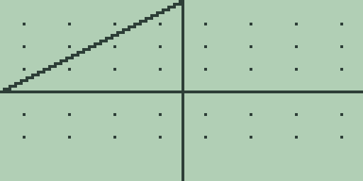

# Chapter 7: Differential-Equation Graphing

Differential-equation graphing plots the solution of a first-order
differential equation from an initial condition, letting you watch a
system evolve without finding a closed-form answer first. The mode
(elsewhere `DifEq`) completes the shared graph engine of Chapter 4
(Cartesian Graphing, Drawing, Formats, and Persistence). It has one
fact every user must know, the frozen initial condition, documented
plainly below; as throughout this book, every quoted figure was read
off the machine.

> 🔌 **Hardware:** differential-equation graphing and its LCD captures
> are validated in the emulator; physical hardware validation is
> reported separately.

## Switching to the mode and entering an equation

Open the graph mode page as in Chapter 5 (Polar Graphing), with
[2nd] [MORE] on the graph screen and then [MORE] twice, and press [F4]
(`DEQ`). The middle line changes to `DIFEQ DY/DX` and the screen
replots. Slot 1 holds the slope expression f in dy/dx = f(x, y),
edited on the home entry line as always: [x-VAR] types the `X` and
[ALPHA] [0] types the letter `Y`. Slots 2 and 3 are ignored by the
plot and, as in the other modes, show `UNDEF` in the table if left
holding text.

## The initial condition

The solver needs a starting value for y, and the mode reads it from
the ordinary variable `Y` (Chapter 2: Variables and Stored Data), but
only once: the value of `Y` at the moment the mode first starts with no
saved state becomes the initial condition, and it is frozen from then
on. Storing a new value into `Y` and replotting changes nothing.

The one way to choose a new initial condition is to reset the mode's
saved state. Switch to any other graph mode (that is when the `GDEQ`
object described below is written), open the memory browser of Chapter
18 (Memory Management) with [2nd] [+], step to `GDEQ`, and press
[DEL]. The next entry into differential-equation mode rebuilds its
state from scratch: the mode's equations are cleared, and the initial
condition is seeded from whatever `Y` holds at that moment. So the
working order is: store the initial value with, say, `3->Y`, delete
`GDEQ`, re-enter the mode, and type the equation again.

## Plotting a solution

The solution starts at the left window edge, x equal to `XMIN`, with y
at the initial condition, and advances by Euler's method in a fixed
step of one 127th of the window width, one sample per plotted column.
There are no solver settings, and the result is deterministic: the same
equation, window, and initial condition always draw the same curve.
Other calculators pair their differential-equation modes with the
differentiation-mode settings `dxDer1` and `dxNDer`; Free85 has no such
settings, and the fixed Euler step is the whole numerical story.

For the worked example, select the mode on a fresh machine (so the
initial condition seeds from `Y` holding 0), press [EXIT], type [1],
and press [GRAPH]:

A constant slope of 1 integrates to the straight line through (-10, 0)
with unit slope. Seeding `3->Y` before the mode's first start moves the
same line up through (-10, 3). For a curve the step size actually
shapes, store `0.05` in `Y`, reset as above, and plot `Y` as the
equation: dy/dx = y grows an Euler exponential across the window.
Plotting draws left to right and cancels like every other mode: [EXIT]
or [CLEAR] mid-plot returns to the home screen with the equation on the
entry line.

## Tracing and the table

Tracing works as in chapter 4, and the readout is the integrated
solution: [◀] and [▶] step the cursor along the plotted curve, and
the footer reports the solution's value at that column. Each step
reintegrates the solution from the left window edge, so the readout
follows the cursor after a brief pause, longest near the right edge.
With the worked example's dy/dx = 1 plotted, two presses of [▶] from
the centre read `X=0.393700787398` and `Y=10.393700787398`, the line
y = x + 10 at that column, and the readout keeps tracking however far
right you step: at `X=6.377952755878` it reports `Y=16.377952755878`.

[MORE] opens the chapter 4 table, and its `Y1` column holds the
integrated solution against the ordinary `X` column: with dy/dx = 1
stored, the fresh table's `X` column reads `0` through `5` and `Y1`
reads `10`, `11`, `12`, `13`, `14`, `15`, the same line row by row.
The query reaches every sample of the plot, so the table reads the
window from edge to edge: one press of [▼] carries `X` on to `10`
with `Y1` reading `20`, and only rows past `XMAX` answer `UNDEF`.

## Analysis reads the slope, not the solution

The function keys and the home-screen calculus commands stay live, but
they apply chapter 3 numerics to the stored *slope expression* as a
plain function of `X` over the window; none of them sees the plotted
solution. With `1` stored, [F4] answers `= 0` and [F5] answers `= 20`,
the derivative and window integral of the constant slope, and [F1]
answers the `NO NUMERIC RESULT` notice because the slope never crosses
zero. With `X` stored, `EVAL(2)` answers `= 2`, the slope at x equal to
2, not the solution's value there. To read a solution value, use the
trace or the table above; the calculus keys see only the slope.

## What the mode remembers

Like the other modes, differential-equation mode saves its equations,
slots, window, table position, and frozen initial condition to the
store object `GDEQ` when you leave it, and restores them exactly when
you return. Its memory-browser entry looks exactly as chapter 5
describes, and deleting it is the reset lever described above, the only
one the mode has. Appendix A catalogues this chapter's
workflow as `diffeq-editor`, `diffeq-plot`, `diffeq-explore`, and
`diffeq-solve`.
