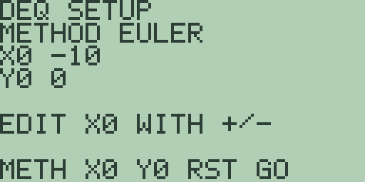
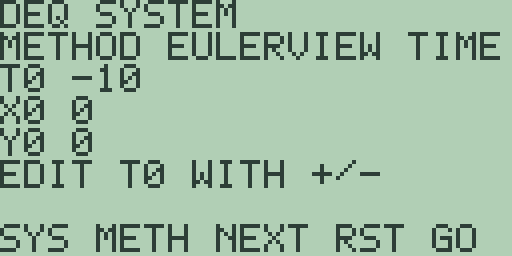

# Chapter 7: Differential-Equation Graphing

Differential-equation graphing plots the solution of a first-order
differential equation from an initial condition, letting you watch a
system evolve without finding a closed-form answer first. The mode
(elsewhere `DifEq`) completes the shared graph engine of Chapter 4
(Cartesian Graphing, Drawing, Formats, and Persistence). It has one
fact every user must know, the frozen initial condition, documented
plainly below; as throughout this book, every quoted figure was read
off the machine.

> 🔌 **Hardware:** differential-equation graphing and its LCD captures
> are validated in the emulator; physical hardware validation is
> reported separately.

## Switching to the mode and entering an equation

Open the graph mode page as in Chapter 5 (Polar Graphing), with
[2nd] [MORE] on the graph screen and then [MORE] twice, and press [F4]
(`DEQ`). The middle line changes to `DIFEQ DY/DX` and the screen
replots. Slot 1 holds the slope expression f in dy/dx = f(x, y),
edited on the home entry line as always: [x-VAR] types the `X` and
[ALPHA] [0] types the letter `Y`. Slots 2 and 3 are ignored by the
plot and, as in the other modes, show `UNDEF` in the table if left
holding text.

## The initial condition

The solution starts from a point you choose, and both of its
coordinates are settings of the mode. Press [2nd] [MORE] four times from
the graph screen to reach `DEQ SETUP`, the fourth graph-format page:

The page names the current method and shows the initial condition as
`X0` and `Y0`, and its soft keys are `SYS METH NEXT RST GO`. [F3] (`NEXT`)
steps the selection from field to field, and the line above the soft keys
names the one you have: `EDIT X0 WITH +/-`. The [+] and [-] keys move the
selected value by the table's step of chapter 4, one unit by default, so
two presses of [+] carry `X0` from `-10` to `-8`. [F2] (`METH`) cycles the
method, [F4] (`RST`) restores the defaults, `X0` at `XMIN`, `Y0` at `0`,
and the method to `EULER`, and [F5] (`GO`) leaves the page and redraws.
[F1] (`SYS`) switches between one equation and a two-state system, which
the section after next covers.

Nothing has to be deleted to change a seed. The equation, the window
and the table position all stay as they are, and the new initial
condition takes effect on the next plot.

## Plotting a solution

The solution starts at `X0` with y at `Y0` and advances in a fixed step
of one 127th of the window width, one sample per plotted column. [F1]
(`METH`) on the setup page cycles the method through `EULER`, `HEUN`
and `RK4`. Euler takes one slope per step, Heun averages the slope at
each end of the step, and `RK4` combines four of them. Halving the step
divides Euler's error by about two, Heun's by about four, and RK4's by
about sixteen, which is what first, second and fourth order mean in
practice. The result stays deterministic: the same equation, window,
initial condition and method always draw the same curve.

The step is set by the window rather than chosen adaptively, so this is
not a stiff solver and does not claim to be one. An equation whose
solution runs away faster than the window can follow gives up rather
than inventing a curve, and reports `NO CONVERGENCE`. Other calculators
pair their differential-equation modes with the differentiation-mode
settings `dxDer1` and `dxNDer`; Free85 has no such settings, and the
method and the window between them are the whole numerical story.

For the worked example, select the mode on a fresh machine, so the
initial condition holds its defaults of `X0` at `-10` and `Y0` at `0`,
press [EXIT], type [1], and press [GRAPH]:

A constant slope of 1 integrates to the straight line through (-10, 0)
with unit slope. Three presses of [+] after [F3] (`Y0`) move the same
line up through (-10, 3), with no deletion and no re-entry. For a curve
the method actually shapes, plot `Y` as the equation: dy/dx = y grows
an exponential across the window, and cycling [F1] through `EULER`,
`HEUN` and `RK4` visibly changes where it ends up on the right.
Plotting draws left to right and cancels like every other mode: [EXIT]
or [CLEAR] mid-plot returns to the home screen with the equation on the
entry line.

## Tracing and the table

Tracing works as in chapter 4, and the readout is the integrated
solution: [◀] and [▶] step the cursor along the plotted curve, and
the footer reports the solution's value at that column. Each step
reintegrates the solution from the left window edge, so the readout
follows the cursor after a brief pause, longest near the right edge.
With the worked example's dy/dx = 1 plotted, two presses of [▶] from
the centre read `X=0.393700787398` and `Y=10.393700787398`, the line
y = x + 10 at that column, and the readout keeps tracking however far
right you step: at `X=6.377952755878` it reports `Y=16.377952755878`.

[MORE] opens the chapter 4 table, and its `Y1` column holds the
integrated solution against the ordinary `X` column: with dy/dx = 1
stored, the fresh table's `X` column reads `0` through `5` and `Y1`
reads `10`, `11`, `12`, `13`, `14`, `15`, the same line row by row.
The query reaches every sample of the plot, so the table reads the
window from edge to edge: one press of [▼] carries `X` on to `10`
with `Y1` reading `20`, and only rows past `XMAX` answer `UNDEF`.

## Systems of two equations, and the phase plane

[F1] (`SYS`) on the setup page turns the mode from one equation into two,
and the banner changes from `DEQ SETUP` to `DEQ SYSTEM`:

In system mode the two graph slots hold the two derivatives: slot 1 is
dX/dT and slot 2 is dY/dT. The variables you may name in them are `T`, `X`
and `Y`, and the initial condition gains a third field, so the page lists
`T0`, `X0` and `Y0`. [F3] (`NEXT`) steps between all three and [+] and [-]
move the selected one, exactly as in the single-equation page.

`METH` still cycles `EULER`, `HEUN` and `RK4`, and in system mode both
derivatives are evaluated from the same old stage before either state
advances. That is what makes the pair a system rather than two independent
equations: neither may see the other's new value part-way through a step.

[MORE] switches the view, which the page shows as `VIEW TIME` or
`VIEW PHAS`:

- **`TIME`** plots the first state `X` against `T`, using the graph window
  as usual, and the table exposes both states.
- **`PHASE`** plots `X` against `Y`, with the graph window giving the
  bounds of the *state space* rather than of time. Its integration step is
  the table step, and it takes 128 samples, so the table step sets how far
  round an orbit the picture goes.

The worked example is the harmonic oscillator. Put `Y` in slot 1 and `-X`
in slot 2, which is dX/dT = y and dY/dT = -x, set `X0` to 1 with `Y0` at 0,
and plot. In `TIME` you get a cosine; in `PHASE` you get a circle, and the
circle is the better picture, because it shows the conserved quantity that
the time trace only implies.

A closed orbit is also a test of the method. Euler spirals outward on this
problem, because its error always points the same way round; `RK4` closes
the loop to the width of a pixel. Cycling `METH` and replotting shows the
difference more plainly than any table of numbers.

Saved state grows with the mode. A `GDEQ` written by an earlier firmware
loads as a single equation, and is rewritten as a two-state object only
when you next save.

## Analysis reads the slope, not the solution

The function keys and the home-screen calculus commands stay live, but
they apply chapter 3 numerics to the stored *slope expression* as a
plain function of `X` over the window; none of them sees the plotted
solution. With `1` stored, [F4] answers `= 0` and [F5] answers `= 20`,
the derivative and window integral of the constant slope, and [F1]
answers the `NO NUMERIC RESULT` notice because the slope never crosses
zero. With `X` stored, `EVAL(2)` answers `= 2`, the slope at x equal to
2, not the solution's value there. To read a solution value, use the
trace or the table above; the calculus keys see only the slope.

## What the mode remembers

Like the other modes, differential-equation mode saves its equations,
slots, window, table position, and now its initial condition and method
to the store object `GDEQ` when you leave it, and restores them exactly
when you return. Its memory-browser entry looks exactly as chapter 5
describes. A `GDEQ` saved by an earlier firmware still loads, and gains
the setup fields on the next save; deleting the object remains a way to
clear the mode entirely, but it is no longer how an initial condition
is changed. Appendix A catalogues this chapter's workflow as
`diffeq-editor`, `diffeq-plot`, `diffeq-explore`, `diffeq-solve`, and
`diffeq-setup`.
