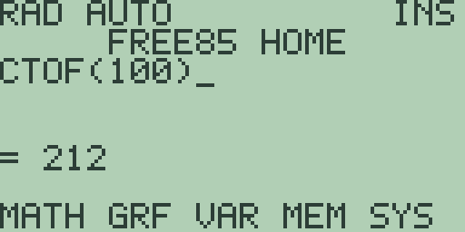

# Chapter 8: Physical and User Constants and Conversions

Two shifted keys turn the calculator into a small reference book. [2nd] [4]
(the `CONS` legend) opens the constants menu, holding the mathematical and
physical constants, and [2nd] [5] (the `CONV` legend) opens the conversions
menu, holding a pair of unit-conversion functions for each of eleven
categories. Both menus work exactly like the `MATH` menu of Chapter 3
(Mathematics, Calculus, and Comparisons): press the soft key under an item
to insert it into your entry line and return to the home screen, or [MORE]
for the next page. As everywhere else, whatever a menu inserts can also be
typed letter by letter with [ALPHA], or pasted from the catalog (Chapter 1:
Operating the Calculator).

## The constants menu

Press [2nd] [4] and the `CONSTANTS` menu lists its first page:

Page one carries `PI`, `E`, `LIGHT`, `GRAV`, and `PLANCK` on [F1] through
[F5]; press [MORE] for `BOLTZ` and `AVOG`. Each item is a plain name: the
menu inserts it, and the name on its own evaluates to the stored value.
Every value below is quoted from the machine:

- **`PI`**, the circle constant: `PI` answers `= 3.1415926535898`. It is
  the same `PI` the `π` legend on [2nd] [^] types.
- **`E`**, Euler's number: `E` answers `= 2.718281828459`. Standing alone,
  `E` is this constant; between digits it is the exponent marker typed by
  [EE], as chapter 3 explains, so `1E3` is a thousand, not a multiple
  of Euler's number.
- **`LIGHT`**, the speed of light in a vacuum, in metres per second:
  `LIGHT` answers `= 299792458`.
- **`GRAV`**, standard gravity, in metres per second squared: `GRAV`
  answers `= 9.80665`.
- **`PLANCK`**, the Planck constant, in joule seconds: `PLANCK` answers
  `= 6.62607015E-34`.
- **`BOLTZ`**, the Boltzmann constant, in joules per kelvin: `BOLTZ`
  answers `= 1.380649E-23`.
- **`AVOG`**, the Avogadro constant, per mole: `AVOG` answers
  `= 6.02214076E23`.

A constant behaves like any other number in an expression. `2*LIGHT`
answers `= 599584916`, and `GRAV*70` answers `= 686.4655`, the weight in
newtons of a 70 kilogram mass.

## User constants

The "user" half of this chapter's title is not in today's firmware: there
is no way yet to define, name, edit, or delete a constant of your own. In
the meantime the variables of Chapter 2 (Variables and Stored Data) do the
job for a working session: `1.602E-19` stored to `Q` with [STO▶] recalls
just like a built-in name, though it lives with your other variables
rather than on the `CONSTANTS` menu.

> ⚠ **Planned:** user-defined constants, including creating, naming,
> editing, and deleting them (Free85 2.0, work package 14.9).

## The conversions menu

Press [2nd] [5] and the `CONVERSIONS` menu pages through twenty-two
functions, five at a time. Each is named source-unit-first, so `INCM(`
reads "inches to centimetres" and `CMIN(` the reverse, and each category
contributes one such pair:

| Category | Functions | Units |
| --- | --- | --- |
| Length | `CMIN(`, `INCM(` | centimetres and inches |
| Area | `SQMFT(`, `SQFTM(` | square metres and square feet |
| Volume | `LGAL(`, `GALL(` | litres and US gallons |
| Mass | `KGLB(`, `LBKG(` | kilograms and pounds |
| Temperature | `CTOF(`, `FTOC(` | degrees Celsius and Fahrenheit |
| Time | `MINS(`, `SMIN(` | minutes and seconds |
| Speed | `KMHMPH(`, `MPHKMH(` | kilometres per hour and miles per hour |
| Pressure | `BARPSI(`, `PSIBAR(` | bar and pounds per square inch |
| Energy | `JCAL(`, `CALJ(` | joules and calories |
| Power | `WHP(`, `HPW(` | watts and horsepower |
| Angle | `RAD(`, `DEG(` | degrees and radians |

The menu lists them in exactly this order, reading down the table row by
row: page one starts with `CMIN(` and page five holds `RAD(` and `DEG(`.

A conversion is an ordinary one-argument function. To convert the boiling
point of water, press [2nd] [5] [MORE] [F4] to insert `CTOF(`, then type
`100)` and press [ENTER]:

`CTOF(100)` answers `= 212`. More examples, one from each category, all
quoted from the machine:

- `INCM(1)` answers `= 2.54`: one inch in centimetres.
- `SQMFT(1)` answers `= 10.76391041671`: a square metre in square feet.
- `GALL(1)` answers `= 3.785411784`: a US gallon in litres.
- `KGLB(1)` answers `= 2.2046226218488`: a kilogram in pounds.
- `FTOC(32)` answers `= 0`: temperature conversions include the offset,
  not just a scale factor, so `CTOF(0)` answers `= 32`.
- `MINS(2)` answers `= 120` and `SMIN(90)` answers `= 1.5`.
- `KMHMPH(100)` answers `= 62.137119223733` and `MPHKMH(100)` answers
  `= 160.9344`.
- `BARPSI(1)` answers `= 14.503773773022` and `PSIBAR(1)` answers
  `= 0.068947572931678`.
- `JCAL(1)` answers `= 0.23900573613767` and `CALJ(1)` answers `= 4.184`.
- `WHP(1000)` answers `= 1.341022089595`: a kilowatt in horsepower; the
  reverse `HPW(1)` answers `= 745.69987158229`.
- `RAD(180)` answers `= 3.1415926535898` and `DEG(PI)` answers `= 180`,
  the same angle converters chapter 3 uses alongside the `RAD`/`DEG`
  angle mode.

Because the arithmetic is the fourteen-digit decimal of chapter 3, a
conversion and its inverse can miss an exact round trip by a whisker:
`CMIN(2.54)` answers `= 0.99999999999999`, not `= 1`. The residue is the
honest product of the stored conversion factors, and it is why a chain of
conversions is best done in one expression rather than by retyping rounded
intermediate results.

Conversions nest and combine like any function: `CTOF(FTOC(32))` answers
`= 32`, and `KMHMPH(3.6)` answers `= 2.2369362920544`, converting a metre
per second expressed as `3.6` kilometres per hour.
