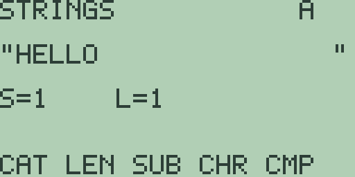

# Chapter 9: Strings and Characters

Strings are text values: names, labels, units, and messages. Free85 keeps
its string tools together on one screen, the strings editor, where you
build text in two working registers and apply the operations from the soft
keys. This chapter covers that editor, its ten operations, and the
character palette that supplies the punctuation the keyboard does not
carry.

One boundary up front: strings live in the editor, not in the expression
language. A quoted literal on the home entry line, such as `"A"`, answers
`SYNTAX ERROR`, and there is no string-typed named variable to store to
yet; the object store's string type (Chapter 18: Memory Management) awaits
the same planned work as the other typed objects of Chapter 2 (Variables
and Stored Data).

## The strings editor

Press [2nd] [6] (the `STRNG` legend) to open the editor:

Reading from the top: the banner `STRINGS` names the screen, and the
letter at the top right names the register you are looking at. There are
three: `A` and `B`, the two working strings, and `R`, where operations
leave a string result. [x-VAR] cycles the view through `A`, `B`, `R`, and
back. Below the banner, the register's text sits between two `"` marks;
the quotes are drawn by the screen, not characters in the string. The
middle of the screen carries two counters, `S=` and `L=`, used by the
substring operations described below. The soft keys hold the operations:
`CAT LEN SUB CHR CMP` on the first page and, after [MORE], `N2S S2N CPY
SWP CLR`.

[EXIT] returns to the home screen. The registers keep their contents:
leave, calculate something, and press [2nd] [6] again, and your text is
still there.

## Typing into a string

Typing edits the register on show, appending at the end:

- **Letters** go through [ALPHA], one letter at a time: press [ALPHA] and
  the indicator `ALPHA` appears above the soft keys, then press a letter
  key to append that letter. Pressing [ALPHA] twice disarms it. So
  `HELLO` is [ALPHA] [H], [ALPHA] [E], [ALPHA] [L], [ALPHA] [L],
  [ALPHA] [O], using the blue letter printed beside each key.
- **Digits and common symbols** need no prefix: [0] through [9], [.],
  [+], [×], [÷], and [,] append `0` to `9`, `.`, `+`, `*`, `/`, and `,`
  directly, and [(-)] appends `-`.
- **Everything else** comes from the character palette, described at the
  end of this chapter.

[DEL] removes the last character, and [CLEAR] empties the register on
show. A register holds up to 31 characters; a 32nd answers the notice
`STRING TOO LONG`. If the result register `R` is on show when you type,
the editor hops back to `A` and appends there, so the two editable
registers are always `A` and `B`.

## The string operations

The first soft-key page works on registers `A` and `B`. With `HELLO`
typed into `A` and `WORLD` into `B` (type the first, press [x-VAR], type
the second), every result below is quoted from the machine:

- **`CAT`** ([F1]) concatenates `A` then `B` into `R` (elsewhere
  `Concatenate`): the view switches to `R` showing `"HELLOWORLD`. The
  combined length must also fit in 31 characters, or the answer is the
  `STRING TOO LONG` notice.
- **`LEN`** ([F2]) measures `A` (elsewhere `lngth`): with `HELLO` in `A`
  it shows `5` beneath the counters.
- **`SUB`** ([F3]) copies a substring of `A` into `R` (elsewhere `sub`),
  starting at position `S=` and taking `L=` characters. [◀] and [▶] lower
  and raise `S`, [▲] and [▼] raise and lower `L`, both counting from 1.
  With `HELLO` in `A`, set `S=2` and `L=3` (press [▶] once and [▲]
  twice) and `SUB` shows `"ELL`. The copy stops at the end of the string:
  with `HE` in `A`, `S=2`, and `L=5`, `SUB` shows `"E`.
- **`CHR`** ([F4]) extracts the single character at position `S=`: with
  `HELLO` in `A` and `S=2`, `CHR` shows `"E`. It is a one-character
  substring, and it resets `L=` to 1.
- **`CMP`** ([F5]) compares `A` with `B` character by character and
  answers a number: `-1` when `A` sorts earlier, `0` when the two are
  identical, and `1` when `A` sorts later. `APPLE` against `BANANA`
  answers `-1`.

`LEN`, `SUB`, and `CHR` always read register `A`, whichever register is
on show; to measure `B`, swap it into `A` first with `SWP` below.

## Numbers in and out of strings

The second soft-key page ([MORE]) converts between strings and numbers
and manages the registers:

- **`N2S`** ([F1]) formats the home screen's most recent answer into `R`.
  Evaluate `123.5` on the home screen, press [2nd] [6] [MORE] [F1], and
  `R` shows `"123.5`.
- **`S2N`** ([F2]) parses `A` as a number. With `-12.5` in `A` (typed
  with [(-)], the digits, and [.]), `S2N` shows `-12.5`, and the value
  becomes the home screen's `ANS`: press [EXIT], then [2nd] [(-)] [+] [1]
  [ENTER], and `ANS+1` answers `= -11.5`. Text that does not parse, such
  as `HELLO`, answers the notice `INVALID NUMBER`.
- **`CPY`** ([F3]) copies `A` over `B` and shows `B`.
- **`SWP`** ([F4]) swaps `A` and `B`.
- **`CLR`** ([F5]) empties the register on show.

Only `S2N` feeds a value back to the home screen; the numeric results of
`LEN` and `CMP` are shown in the editor but leave `ANS` untouched.

## The character palette

The palette, opened with [2nd] [0] and introduced in chapter 1, is the
route to the punctuation the keyboard does not type. It holds 26
characters in a fixed loop: the space, then

`! " # $ % & ' ( ) * + , - . / : ; < = > ? @ [ ] _`

The cursor keys step through them, wrapping at both ends, and [ENTER]
inserts the character on show. The palette remembers where you came from:
opened from the home screen it inserts into the entry line, and opened
from the strings editor it appends to the active string and returns to
the editor. So from the strings editor, [2nd] [0] [▶] [ENTER] appends `!`
to the string, and a five-character `HELLO` becomes `HELLO!` with `LEN`
showing `6`.

The palette is punctuation and symbols only; the letters and digits stay
on the keyboard, and there are no Greek or accented characters yet.

> ⚠ **Planned:** Greek and international characters in the palette
> (Free85 2.0, work package 14.9).

## Strings and equations

Some calculators convert between equations and strings, so that a stored
function can be edited as text and text can become a function; their
manuals call the two directions `Eq->St` and `St->Eq`. Free85 has no
equation round trip yet: the graph equations of Chapter 4 (Cartesian
Graphing, Drawing, Formats, and Persistence) and the editor's string
registers are separate worlds.

> ⚠ **Planned:** equation-to-string and string-to-equation round trips
> (Free85 2.0, work package 14.8).
