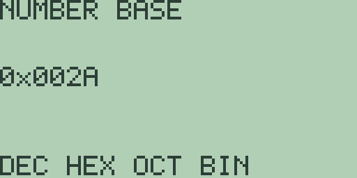

# Chapter 10: Number Bases and Boolean Operations

Everyday arithmetic in Free85 is the fourteen-digit decimal of Chapter 3
(Mathematics, Calculus, and Comparisons). For work with bits, this
chapter's tools treat a whole number as a 16-bit machine word instead:
the number-base screen displays a result in decimal, hexadecimal, octal,
or binary; prefixed literals let you type a number in any of those bases;
and eight Boolean functions operate on the word's bits. Every example
below was run on a fresh machine, and every result is quoted exactly as
the calculator displays it.

## The signed word model

A 16-bit word holds the whole numbers from `-32768` through `32767`,
stored as two's complement: the bit patterns `0x0000` through `0x7FFF`
are `0` through `32767`, and `0x8000` through `0xFFFF` continue as
`-32768` through `-1`. So all sixteen bits set, `0xFFFF`, is not 65535
but `-1`, and the pattern with only the top bit set, `0x8000`, is
`-32768`.

The word model applies exactly where this chapter says it does: the
number-base screen, the range of prefixed literals, and the Boolean
functions. Ordinary arithmetic is untouched and keeps its full decimal
range, as the last section shows.

## The number-base screen

Type `42` [ENTER] on the home screen, then press [2nd] [1] (the `BASE`
legend). The `NUMBER BASE` screen opens with the soft keys
`DEC HEX OCT BIN` on [F1] through [F4], and each shows the most recent
answer in its base:

- [F1] (`DEC`) shows `42`.
- [F2] (`HEX`) shows `0x002A`:

  

- [F3] (`OCT`) shows `0o000052`.
- [F4] (`BIN`) shows `0b0000000000101010`.

The displays are fixed-width for the full word: four hexadecimal digits,
six octal digits, and sixteen binary digits, each behind the matching
prefix. Press the soft keys in any order to hop between bases, and [EXIT]
to return home. On a fresh machine, with no answer yet, the value shown
is zero: `DEC` shows `0` and `HEX` shows `0x0000`.

Negative answers show their two's-complement pattern: evaluate `-42` and
`HEX` shows `0xFFD6`; evaluate `-1` and it shows `0xFFFF`. The screen
reads whichever value is the current answer, so the workflow for "what is
this in binary" is simply: evaluate, [2nd] [1], press a base key. These
four views are Free85's counterpart of the conversion commands spelled
`->Dec`, `->Hex`, `->Oct`, and `->Bin` on other calculators, and
appendix A files them under the labels `Dec`, `Hex`, `Oct`, and `Bin`.

The screen insists on a value the word can hold. If the answer is
fractional or out of range, any base key answers a full-screen error
naming the model: `2.5` and `32768` both stop at `SIGNED 16-BIT INT`,
with the usual `CLEAR OR EXIT` way back (chapter 1).

## Entering numbers in other bases

A literal with a base prefix is accepted anywhere a number is accepted:
`0x` for hexadecimal, `0o` for octal, and `0b` for binary. The letters
are typed with [ALPHA], and case does not matter: typing the letters
uppercase, as [ALPHA] produces them, `0X2A` answers `= 42`, and the
lowercase `0x2a` answers `= 42` just the same (press [2nd] [ALPHA] to
select lowercase entry, then [ALPHA] and a letter key as usual). This
book writes the prefixes lowercase and the hexadecimal digits uppercase,
matching the number-base screen.

- `0b101010` answers `= 42`.
- `0o52` answers `= 42`, and `0o777` answers `= 511`.
- `0x2A+1` answers `= 43`: the literal is a number like any other, so
  arithmetic carries on around it.

A prefixed literal is read as an unsigned bit pattern and lands on the
word model's signed value at sixteen bits:

- `0x7FFF` answers `= 32767`.
- `0x8000` answers `= -32768`.
- `0xFFFF` answers `= -1`, so `0xFFFF+1` answers `= 0`.

Beyond sixteen bits the literal does not fit: `0x10000` answers the
`NUMERIC OVERFLOW` error screen. Appendix A catalogues the four entry
forms as `binary-entry`, `octal-entry`, `decimal-entry`, and
`hex-entry`.

## The Boolean word operations

Eight functions operate bitwise on 16-bit words. None of them sit on a
menu: type the names with [ALPHA], paste them from the catalog, or keep
your favourites on the custom menu (chapter 1). If you are arriving from
another calculator's manual, the names map like this (Free85 spelling
first, then the name elsewhere): `AND(`, `OR(`, `XOR(`, and `NOT(` cover
`and`, `or`, `xor`, and `not`; `SHL(` and `SHR(` cover the shifts
`shftL` and `shftR`; and `ROL(` and `ROR(` cover the rotations `rotL`
and `rotR`.

The logic family takes two words (`NOT(` takes one) and combines them
bit by bit:

- `AND(6,3)` answers `= 2`: bitwise and of `110` and `011` is `010`.
- `OR(6,3)` answers `= 7`, and `XOR(6,3)` answers `= 5`.
- `NOT(0)` answers `= -1`: flipping all sixteen bits of zero gives
  `0xFFFF`, which is `-1` in the signed word. Likewise `NOT(1)` answers
  `= -2`. Note the contrast with the comparison operators of chapter 3,
  whose true-and-false results are the plain numbers `1` and `0`;
  `NOT(` is a bit flip, not a logical negation of those booleans.

Hexadecimal literals make the masks readable: `AND(0xFF00,0x0FF0)`
answers `= 3840`, which the number-base screen's `HEX` key shows as
`0x0F00`, the overlap of the two masks. In the same way, evaluate
`OR(0x2A,5)` (answer `= 47`) and the `HEX` view shows `0x002F`.

The shift and rotate family takes a word and a count from 0 through 15:

- `SHL(3,2)` answers `= 12`: shifting left doubles per step, and bits
  pushed off the top are lost. Shift into the sign bit and the signed
  value goes negative: `SHL(1,15)` answers `= -32768`.
- `SHR(` is a logical shift: zeros come in at the top, whatever the
  sign. `SHR(-1,1)` answers `= 32767`, the pattern `0xFFFF` becoming
  `0x7FFF`.
- The rotations wrap around instead of losing bits: `ROL(32767,1)`
  answers `= -2` (`0x7FFF` becomes `0xFFFE`), and `ROR(1,1)` answers
  `= -32768`, the lone bottom bit wrapping to the top. A count of zero
  is allowed: `ROL(1,0)` answers `= 1`.

All eight functions insist on the word model. A count outside 0 through
15, a fractional operand, or an operand outside the word's range answers
the `DOMAIN ERROR` screen: `ROL(1,16)`, `AND(2.5,1)`, and `AND(40000,1)`
all stop there.

## Words and ordinary arithmetic

The word model is a costume the number wears, not a different kind of
number. A prefixed literal or a Boolean result is an ordinary value the
moment it exists, and it mixes freely with the decimal arithmetic of
chapter 3: `0x2A/4` answers `= 10.5`, and `SHL(3,2)+0.5` answers
`= 12.5`. Only the base screen and the Boolean functions hold you to
whole 16-bit words; plain arithmetic keeps the full fourteen-digit range
with exponents to `127`, far beyond `32767`. When a large or fractional
result then meets a word-model tool, the errors above are the boundary
making itself known.
