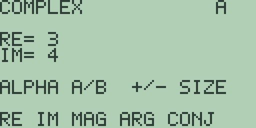

# Chapter 11: Complex Numbers

The arithmetic of Chapter 3 (Mathematics, Calculus, and Comparisons) stays
on the real line: `SQRT(-9)` on the home screen answers `DOMAIN ERROR`.
For work in the complex plane Free85 provides a dedicated screen, the
complex editor, where a number is held as a real and an imaginary part and
the soft keys carry the operations. This chapter covers the editor, the
part-reading functions, complex arithmetic, and the conversions between
rectangular and polar form. Every result below is quoted from a machine
booted fresh for that example.

## The complex editor

Press [2nd] [9] (the `CPLX` legend) to open the editor:

Reading from the top: the banner `COMPLEX` names the screen, and the
letter at the top right names the register on show. There are three, as in
the strings editor of Chapter 9 (Strings and Characters): `A` and `B`, the
two working numbers, and `R`, where every operation leaves its result.
Pressing [ALPHA] switches between `A` and `B`; note that here [ALPHA] is a
switch in its own right, not the letter prefix it is elsewhere. The two
lines `RE=` and `IM=` show the register's real and imaginary parts, so the
screenshot above reads as the number 3+4i.

Entry goes part by part. The editor opens ready for the real part: type a
value using the digits, [.], and [(-)] for a negative sign, and the hint
line changes to `EDIT` followed by what you have typed so far. [DEL]
removes the last character and [CLEAR] abandons the entry. Press [ENTER]
and the value is stored: the first [ENTER] fills `RE=`, the next fills
`IM=`, and after that the turn wraps back to `RE=`. The cursor keys hop
between the two parts without storing anything. So 3+4i is [3] [ENTER]
[4] [ENTER], and -2 alone is [(-)] [2] [ENTER].

The hint line `ALPHA A/B  +/- SIZE` is shared with the list, matrix, and
vector editors of Chapter 12 (Lists) and Chapter 13 (Matrices and
Vectors). Only its first half applies here: a complex number is always
exactly two parts, so [+] and [-] have nothing to resize.

[EXIT] returns to the home screen, and the registers keep their contents:
leave, calculate something, press [2nd] [9] again, and your numbers are
still there.

## Reading a number's parts

The first soft-key page, `RE IM MAG ARG CONJ`, takes register `A` apart.
With 3+4i in `A` ([3] [ENTER] [4] [ENTER]), each answer appears in `R`:

- **`RE`** ([F1]) extracts the real part: `RE= 3` (elsewhere `real`).
- **`IM`** ([F2]) extracts the imaginary part, delivered as the real part
  of `R`: `RE= 4` (elsewhere `imag`).
- **`MAG`** ([F3]) is the magnitude, the distance from the origin:
  `RE= 5`.
- **`ARG`** ([F4]) is the argument, the angle from the positive real
  axis (elsewhere `angle`). In the default radian mode it answers
  `RE= 0.9272952180016`; switch the mode screen of Chapter 1 (Operating
  the Calculator) to `ANGLE DEG` and the same key answers
  `RE= 53.130102354156`.
- **`CONJ`** ([F5]) is the conjugate, the sign of the imaginary part
  flipped: `RE= 3`, `IM= -4` (elsewhere `conj`).

Once a result is on show the letter at the top right reads `R`. Press
[ALPHA] to get back to an editable register and continue working.

## Arithmetic with A and B

The second soft-key page ([MORE]) is `ADD SUB MUL DIV POW`. The four
arithmetic keys combine `A` and `B` into `R`. With 3+4i in `A` and 1+2i
in `B` ([3] [ENTER] [4] [ENTER] [ALPHA] [1] [ENTER] [2] [ENTER]):

- **`ADD`** ([F1]) answers `RE= 4`, `IM= 6`.
- **`SUB`** ([F2]) answers `RE= 2`, `IM= 2`.
- **`MUL`** ([F3]) answers `RE= -5`, `IM= 10`: the product
  (3+4i)(1+2i) with its i-squared term folded in.
- **`DIV`** ([F4]) answers `RE= 2.2`, `IM= -0.4`. Division by a zero
  `B` stops at the `DIVIDE BY ZERO` error screen, the same one chapter 1
  shows for `1/0`.
- **`POW`** ([F5]) raises `A` to the second power: `RE= -7`, `IM= 24`
  for our 3+4i. It is the same squaring operation as `SQ` on the next
  page, and `B` plays no part in it.

## Roots, squares, and polar form

The third soft-key page is `RECT POLAR ROOT SQ CL`, taken here in
working order rather than key order:

- **`ROOT`** ([F3]) takes the principal square root of `A`. For 3+4i it
  answers `RE= 2`, `IM= 1`, and it is the key that finishes what the home
  screen refuses: put -9 in `A` ([(-)] [9] [ENTER]) and `ROOT` answers
  `RE= 0`, `IM= 3`, the square root of -9 that `SQRT(-9)` would not give.
- **`SQ`** ([F4]) squares `A`: 3+4i becomes `RE= -7`, `IM= 24`.
- **`POLAR`** ([F2]) converts `A` from rectangular to polar form
  (elsewhere `->Pol`). With 1+1i in `A` it answers `RE= 1.4142135623731`,
  `IM= 0.78539816339746`: the magnitude and the angle, a quarter of pi.
  After a conversion the two slots hold magnitude and angle even though
  their labels still read `RE=` and `IM=`, so read the pair by position.
- **`RECT`** ([F1]) converts the other way (elsewhere `->Rec`): treat
  `A` as magnitude and angle and answer the rectangular parts. In
  `ANGLE DEG` mode, enter magnitude 2 and angle 60 and `RECT` answers
  `RE= 0.99999999999978`, `IM= 1.732050807569`. The exact answers are 1
  and the square root of 3; fourteen-digit decimal arithmetic lands a
  whisker away and does not pretend otherwise. Other calculators also
  accept a complex number typed directly in polar form; in Free85 the
  route is this editor and the `RECT` key.
- **`CL`** ([F5]) resets all three registers to zero and shows `A`.

Both conversions and `ARG` follow the angle mode: radians in `ANGLE RAD`,
degrees in `ANGLE DEG`.

## Complex numbers elsewhere in the calculator

The editor is the whole story in this release. The expression language has
no complex literal, the catalog of chapter 1 lists no complex functions,
and a negative argument to `SQRT(` still answers `DOMAIN ERROR` rather
than hopping into the complex plane on its own.

> ⚠ **Planned:** the scalar complex operations as catalog and program
> commands (`real`, `imag`, `angle`, `conj`, `->Pol`, `->Rec`) with the
> `PolarC` and `RectC` display modes (Free85 2.0, work package 14.6).

> ⚠ **Planned:** element-wise complex results propagated across lists,
> matrices, and vectors (Free85 2.0, work package 14.6).
