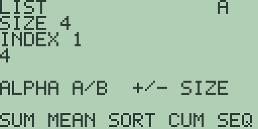

# Chapter 12: Lists

A list is an ordered collection of up to eight numbers, and Free85 keeps
its list tools together on one screen, the list editor. There you build a
list value by value and apply the operations from the soft keys: sums and
means, sorting, running totals, sequences, and element-by-element
arithmetic between two lists. This chapter covers the editor and all
fourteen of its operations, with every result quoted from the machine.

## The list editor

Press [2nd] [-] (the `LIST` legend) to open the editor. The `LIST` soft
item on the home screen's second menu page ([MORE] [F1], chapter 1) is
another door to the same place.

The banner `LIST` names the screen and the letter at the top right names
the register on show: `A` and `B` are the two working lists and `R`
receives every result, the same arrangement as the complex editor of
Chapter 11 (Complex Numbers). [ALPHA] switches between `A` and `B`.
Beneath the banner, `SIZE` is the length of the list, `INDEX` is the
position you are looking at, counting from 1, and the value at that
position sits on the line below.

A fresh machine starts with `SIZE 4`. [+] lengthens the list and [-]
shortens it, one value at a time, and the hint line's `+/- SIZE` half
names the pair. The bounds are firm in this release: press [+] repeatedly
and the counter stops at `SIZE 8`, the eight-value limit; press [-]
repeatedly and it stops at `SIZE 1`.

Entry works one position at a time. Type a value with the digits, [.],
and [(-)], and the hint line changes to `EDIT` followed by your typing;
[DEL] removes the last character and [CLEAR] abandons the entry. [ENTER]
stores the value at the current `INDEX` and steps forward, wrapping past
the end back to position 1, so a whole list is just values and [ENTER]s
in order. [▶] and [▼] step forward without storing, [◀] and [▲] step
backward, and both wrap. To change one value, step to it, type, and press
[ENTER].

[EXIT] returns to the home screen, and the registers survive the trip:
reopen the editor and the values are still there.

The examples below use the list 4, 1, 3, 2, entered from a fresh machine
as [2nd] [-] [4] [ENTER] [1] [ENTER] [3] [ENTER] [2] [ENTER].

## Sums, sorting, and sequences

The first soft-key page is `SUM MEAN SORT CUM SEQ`. Each operation reads
list `A` and leaves its answer in `R`:

- **`SUM`** ([F1]) totals the list (elsewhere `sum`): `R` becomes a
  single value, `SIZE 1` showing `10`.
- **`MEAN`** ([F2]) averages it: `2.5`.
- **`SORT`** ([F3]) delivers an ascending copy (appendix A files it as
  `sortA`): `R` is a four-value list, and stepping through it with [▶]
  reads `1`, `2`, `3`, `4`. There is no descending sort yet; see the
  callout at the end of this chapter.
- **`CUM`** ([F4]) delivers the running totals: stepping through `R`
  reads `4`, `5`, `8`, `10`.
- **`SEQ`** ([F5]) ignores the values and fills `R` with the counting
  sequence 1 through `SIZE` (appendix A files it as `seq`): our
  four-value list answers `1`, `2`, `3`, `4`, and at `SIZE 5` the same
  key answers `1` through `5`.

## Products, extremes, and spread

The second soft-key page ([MORE]) is `PROD MIN MAX MED STD`, again
reading `A` into `R`:

- **`PROD`** ([F1]) multiplies the values together (elsewhere `prod`):
  `24`.
- **`MIN`** ([F2]) and **`MAX`** ([F3]) answer the smallest and largest
  values: `1` and `4`.
- **`MED`** ([F4]) answers the median. Our list has an even size, so the
  two middle values of the sorted order are averaged; the screen lingers
  on the sorted working copy until your next keypress, so tap an arrow
  key and `R` settles to a single value, `2.5`. For an odd size the
  median is a value of the list itself, and `MED` leaves the whole
  sorted copy in `R` with `INDEX` parked on it: the three-value list
  5, 1, 9 answers a three-value `R` with `INDEX 2` showing `5`.
- **`STD`** ([F5]) answers the standard deviation: `1.1180339887499`.
  This is the population deviation, dividing by the count rather than by
  one less than the count.

## Element-by-element arithmetic

The third soft-key page is `ADD SUB MUL DIV`, and these combine `A` and
`B` position by position. With 1, 2, 3, 4 in `A` and 5, 6, 7, 8 in `B`
(type the first list, press [ALPHA], type the second):

- **`ADD`** ([F1]) answers the list `6`, `8`, `10`, `12`.
- **`MUL`** ([F3]) answers `5`, `12`, `21`, `32`, each pair multiplied
  in place, and **`SUB`** ([F2]) and **`DIV`** ([F4]) work the same way:
  the last value of the `DIV` result is `0.5`.

The two lists must be the same size; if they disagree, the answer is the
full-screen `DIMENSION ERROR` notice, with the usual `CLEAR OR EXIT` way
back (chapter 1). Dividing where `B` holds a zero stops at the
`INVALID NUMBER` notice.

## Lists and the rest of the calculator

Lists live in this editor, not in the expression language: the home
screen's entry line has no list literal, and the `LIST` soft item opens
the editor rather than inserting anything. The statistics tools of
Chapter 15 (Statistics and Statistical Plots) keep their own data. The
missing pieces of the list toolkit are scheduled work:

> ⚠ **Planned:** the list commands `dimL`, `->dimL`, and `Fill`, the
> descending sort `sortD`, and the list and vector conversions `li->vc`
> and `vc->li` (Free85 2.0, work package 14.6).
