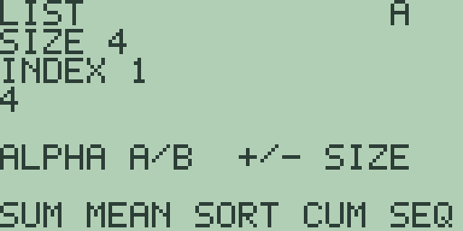
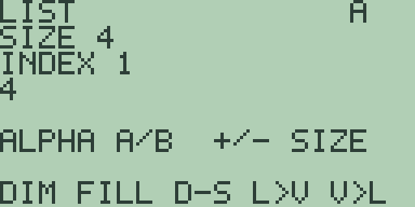

# Chapter 12: Lists

A list is an ordered collection of up to eight numbers, and Free85 keeps
its list tools together on one screen, the list editor. There you build a
list value by value and apply the operations from the soft keys: sums and
means, sorting, running totals, sequences, element-by-element arithmetic
between two lists, dimensions, fills, vector conversions, and, new in
this release, imaginary parts for every element. This chapter covers the
editor and all five of its soft-key pages, with every result quoted from
the machine.

## The list editor

Press [2nd] [-] (the `LIST` legend) to open the editor. The `LIST` soft
item on the home screen's second menu page ([MORE] [F1], chapter 1) is
another door to the same place.

The banner `LIST` names the screen and the letter at the top right names
the register on show: `A` and `B` are the two working lists and `R`
receives every result, the same arrangement as the complex editor of
Chapter 11 (Complex Numbers). [ALPHA] switches between `A` and `B`.
Beneath the banner, `SIZE` is the length of the list, `INDEX` is the
position you are looking at, counting from 1, and the value at that
position sits on the line below.

A fresh machine starts with `SIZE 4`. [+] lengthens the list and [-]
shortens it, one value at a time, and the hint line's `+/- SIZE` half
names the pair. The bounds are firm in this release: press [+] repeatedly
and the counter stops at `SIZE 8`, the eight-value limit; press [-]
repeatedly and it stops at `SIZE 1`.

Entry works one position at a time. Type a value with the digits, [.],
and [(-)], and the hint line changes to `EDIT` followed by your typing;
[DEL] removes the last character and [CLEAR] abandons the entry. [ENTER]
stores the value at the current `INDEX` and steps forward, wrapping past
the end back to position 1, so a whole list is just its values typed in
order, each followed by [ENTER]. [▶] and [▼] step forward without
storing, [◀] and [▲] step
backward, and both wrap. To change one value, step to it, type, and press
[ENTER].

[EXIT] returns to the home screen, and the registers survive the trip:
reopen the editor and the values are still there.

The examples below use the list 4, 1, 3, 2, entered from a fresh machine
as [2nd] [-] [4] [ENTER] [1] [ENTER] [3] [ENTER] [2] [ENTER].

## Sums, sorting, and sequences

The first soft-key page is `SUM MEAN SORT CUM SEQ`. Each operation reads
list `A` and leaves its answer in `R`:

- **`SUM`** ([F1]) totals the list (elsewhere `sum`): `R` becomes a
  single value, `SIZE 1` showing `10`.
- **`MEAN`** ([F2]) averages it: `2.5`.
- **`SORT`** ([F3]) delivers an ascending copy (elsewhere `sortA`):
  `R` is a four-value list, and stepping through it with [▶] reads `1`,
  `2`, `3`, `4`. The descending twin, `D-S`, lives on the fourth page
  below.
- **`CUM`** ([F4]) answers the running totals: stepping through `R`
  reads `4`, `5`, `8`, `10`.
- **`SEQ`** ([F5]) ignores the values and fills `R` with the counting
  sequence 1 through `SIZE` (elsewhere `seq`): our four-value list
  answers `1`, `2`, `3`, `4`, and at `SIZE 5` the same key answers `1`
  through `5`.

## Products, extremes, and spread

The second soft-key page ([MORE]) is `PROD MIN MAX MED STD`, again
reading `A` into `R`:

- **`PROD`** ([F1]) multiplies the values together (elsewhere `prod`):
  `24`.
- **`MIN`** ([F2]) and **`MAX`** ([F3]) answer the smallest and largest
  values: `1` and `4`.
- **`MED`** ([F4]) answers the median. Our list has an even size, so the
  two middle values of the sorted order are averaged; the screen lingers
  on the sorted working copy until your next keypress, so tap an arrow
  key and `R` settles to a single value, `2.5`.

  For an odd size the median is a value of the list itself, and `MED`
  leaves the whole sorted copy in `R` with `INDEX` parked on the median
  value's position: the three-value list 5, 1, 9 answers a three-value
  `R` with `INDEX 2` showing `5`.
- **`STD`** ([F5]) answers the standard deviation: `1.1180339887499`.
  This is the population deviation, dividing by the count rather than by
  one less than the count.

## Element-by-element arithmetic

The third soft-key page is `ADD SUB MUL DIV`, and these combine `A` and
`B` position by position. With 1, 2, 3, 4 in `A` and 5, 6, 7, 8 in `B`
(type the first list, press [ALPHA], type the second):

- **`ADD`** ([F1]) answers the list `6`, `8`, `10`, `12`.
- **`SUB`** ([F2]) answers `-4`, `-4`, `-4`, `-4`: every value of `B`
  is four more than its partner in `A`.
- **`MUL`** ([F3]) answers `5`, `12`, `21`, `32`, each pair multiplied
  in place, and **`DIV`** ([F4]) works the same way: the last value of
  its result is `0.5`.

The two lists must be the same size; if they disagree, the answer is the
full-screen `DIMENSION ERROR` notice, with the usual `CLEAR OR EXIT` way
back (chapter 1). Dividing where `B` holds a zero stops at the
`INVALID NUMBER` notice.

## Dimensions, fills, and conversions

The fourth soft-key page is `DIM FILL D-S L>V V>L`:

With the chapter's 4, 1, 3, 2 in `A`:

- **`DIM`** ([F1]) reports the length (elsewhere `dimL`): `R` becomes
  `SIZE 1` holding `4`. The [+] and [-] resizing keys are the other
  half of the story.
- **`FILL`** ([F2]) fills at `A`'s length with one value, taken from
  the first element of `B`, just as the matrix and vector editors take
  scalars from `B` (chapter 13). Press [ALPHA] in the list editor to
  select `B`, type [9] [ENTER], press [ALPHA] again if you want to
  watch `A`, and `FILL` answers a four-value `R` reading `9`, `9`,
  `9`, `9` (elsewhere `Fill`).
- **`D-S`** ([F3]) is the descending sort (elsewhere `sortD`): `R`
  reads `4`, `3`, `2`, `1`.
- **`L>V`** ([F4]) converts the list to a vector (elsewhere `li->vc`).
  A vector has at most three components (chapter 13), so our four-value
  list stops at the `DIMENSION ERROR` notice; shorten to the
  three-value 4, 1, 3 with [-] and the same key lands you in the
  vector editor with its result register holding `4`, `1`, `3`. As in
  every collection editor, [ENTER] on the `ENTER USE R` prompt copies that
  result into `A` to carry it on.
- **`V>L`** ([F5]) converts the other way (elsewhere `vc->li`),
  reading the vector editor's `A`: with a vector 7, 8, 9 stored there,
  `V>L` here answers the three-value list `7`, `8`, `9` in `R`. The
  same pair of keys appears in the vector editor (chapter 13).

## Lists with imaginary parts

The fifth soft-key page, `CSET CGET REAL IMAG CLR`, gives every element
an imaginary part, shown on an `IM` line under the element's value; the
legend runs off the right edge of the screen, so `CLR` shows only its
first letter, but [F5] answers all the same. The page works element by
element together with the complex editor of chapter 11:

- **`CSET`** ([F1]) copies the complex editor's register `A` into the
  selected element, both parts. Put 3-4i there ([2nd] [9] [3] [ENTER]
  [(-)] [4] [ENTER]), come back ([EXIT] [2nd] [-]), page to this page,
  and `CSET` makes element 1 read `3` with `IM -4` beneath it.
- **`CGET`** ([F2]) is the reverse trip: it copies the selected
  element into the complex editor's result register and opens that
  editor on it, ready for chapter 11's operations.
- **`REAL`** ([F3]) keeps the element's real part and clears its `IM`
  to zero; **`IMAG`** ([F4]) moves the imaginary part into the value
  slot, so our 3-4i element becomes `-4` with `IM 0`; **`CLR`** ([F5])
  zeroes the selected element entirely.

Typing over an element the ordinary way also clears its `IM` to zero,
so set values first and imaginary parts second. The editor pages and
registers reset to the first page and `A` each time you re-enter, so
each `CSET` trip is: enter the number in the complex editor, return,
press [MORE] four times, step to the element, [F1].

The arithmetic carries both parts. Build `A` with 2+3i and -1+2i in
elements 1 and 2 (two `CSET` trips, elements 3 and 4 staying zero),
and `B` with 1-2i and 3+4i (two more, pressing [ALPHA] after entering
the editor), and the third page's `ADD` answers an `R` whose elements
read `3` with `IM 1` and `2` with `IM 6`: the sums 3+1i and 2+6i,
visible by paging back to the fifth page. `SUM` and `PROD` keep both
parts too: summing a list holding 1+2i and 3-1i answers `4` with
`IM 1`.

## Lists and the rest of the calculator

Lists live in this editor, not in the expression language: the home
screen's entry line has no list literal, and the `LIST` soft item opens
the editor rather than inserting anything. The statistics editor of
Chapter 15 (Statistics and Statistical Plots) works on these same
registers under different names: its `X` column is list `A` and its
`Y` column is list `B`, so a sort or a fill here reorders the
statistics too.
Appendix A catalogues the resizing keys as `->dimL`, the fill as
`Fill-list`, and the position-by-position arithmetic as
`elementwise-list`, with its plain-number and complex cases filed as
`elementwise-real` and `elementwise-complex`. Eight values is not
many, but between the sorts, the sums, the conversions, and the
imaginary parts, this one screen makes them work hard.
