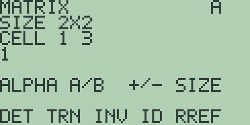
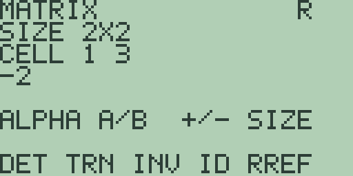
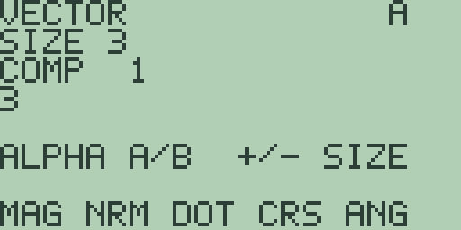

# Chapter 13: Matrices and Vectors

Matrices and vectors each have their own editor, built on the same plan
as the list editor of Chapter 12 (Lists): two working registers `A` and
`B`, a result register `R`, [ALPHA] to switch between the working pair,
and the operations on the soft keys. A matrix is at most 3 by 3 and a
vector has two or three components in this release. This chapter covers
both editors, the linear-algebra operations, and the error screens that
guard them, with every result quoted from the machine.

## The matrix editor

Press [2nd] [7] (the `MATRX` legend) to open the matrix editor; the
`MAT` soft item on the home screen's second menu page ([MORE] [F2],
chapter 1) leads to the same place.

Under the `MATRIX` banner, `SIZE 2X2` gives the dimensions, rows first;
that is also where a fresh machine starts. [+] and [-] resize one row at
a time; press [x-VAR] and the same keys resize columns instead, and
[x-VAR] again hands them back to rows. Each dimension runs from 1 up to
the release limit of 3, so pressing [+] beyond `SIZE 3X3` changes
nothing.

The `CELL` line tracks the selected cell as you move: the first figure
after `CELL` is the cell's row, and the value of the cell sits on the
line below. The second figure on the `CELL` line always reads `3` in
this release and does not follow the column, so keep count as you step,
and let the value line confirm the cell. Cells run in reading order,
left to right along row 1, then row 2, and so on. Typing and storing
work exactly as in the list
editor: digits, [.], and [(-)] build a value on the `EDIT` line, [ENTER]
stores it and steps to the next cell, wrapping at the end, and the
cursor keys step without storing. So the matrix in the screenshot is
[1] [ENTER] [2] [ENTER] [3] [ENTER] [4] [ENTER] from a fresh machine:
row one is 1 2, row two is 3 4. [EXIT] leaves for the home screen and
the registers keep their contents.

## Matrix operations

The first soft-key page is `DET TRN INV ID RREF`, each reading `A` and
answering in `R`. With the screenshot's matrix in `A`:

- **`DET`** ([F1]) answers the determinant as a 1 by 1 result: `R`
  shows `SIZE 1X1` holding `-2` (elsewhere `det`).
- **`TRN`** ([F2]) transposes (elsewhere `transpose`): `R` is
  `SIZE 2X2` and stepping through it reads `1`, `3`, `2`, `4`.
- **`INV`** ([F3]) inverts `A`: stepping through `R` reads `-2`, `1`,
  `1.5`, `-0.5`.

  

- **`ID`** ([F4]) writes an identity matrix the size of `A` into `R`
  (elsewhere `Ident`): with our 2 by 2 in `A`, stepping through the
  result reads `1`, `0`, `0`, `1`. `A` itself is only read for its
  size, so its cells — and the other registers — are untouched.
- **`RREF`** ([F5]) answers the reduced row-echelon form (elsewhere
  `rref`), which for our invertible matrix is the identity: stepping
  through `R` reads `1`, `0`, `0`, `1`.

## Matrix arithmetic and solving

The second soft-key page ([MORE]) is `ADD SUB MUL SCL SOLVE`, combining
`A` and `B`. With 1, 2, 3, 4 in `A` and 5, 6, 7, 8 in `B`:

- **`ADD`** ([F1]) answers `6`, `8`, `10`, `12`, and **`SUB`** ([F2])
  answers the differences, starting `-4`.
- **`MUL`** ([F3]) is the matrix product: `19`, `22`, `43`, `50`.
- **`SCL`** ([F4]) multiplies every cell of `A` by one scalar, taken
  from the top-left cell of `B`. With 2 stored there, `A` doubles:
  `2`, `4`, `6`, `8`.
- **`SOLVE`** ([F5]) solves the linear system whose coefficients are
  `A` and whose right-hand sides are the first column of `B`. For the
  system x+y=3, x-y=1, put 1, 1, 1, -1 in `A` and fill `B` as [3]
  [ENTER] [0] [ENTER] [1] [ENTER] [0] [ENTER], which runs 3 and 1 down
  its first column and zeroes the unused second one. `SOLVE` answers a
  `SIZE 2X1` result reading `2` then `1`: x is 2 and y is 1. Larger
  simultaneous systems have a solver of their own in Chapter 14
  (Equation, Polynomial, and Simultaneous Solving).

Two error screens guard the algebra, both with the usual `CLEAR OR EXIT`
way back. Inverting a matrix with determinant zero (try 1, 2, 2, 4)
stops at `SINGULAR MATRIX`, and combining shapes that do not fit, such
as adding a 3 by 2 to a 2 by 2, stops at `DIMENSION ERROR`.

> ⚠ **Planned:** matrix resizing and fill commands, random matrices,
> row operations, augmentation, norms, and the `LU`, `cond`, `eigVl`,
> and `eigVc` decompositions and eigensystems (Free85 2.0, work package
> 14.6).

## The vector editor

Press [2nd] [8] (the `VECTR` legend), or [MORE] [F3] (`VEC`) from the
home screen, to open the vector editor:

A vector is a single column of components: `SIZE 3` on a fresh machine,
`COMP` naming the component on show, and the same entry rules as the
other editors. [+] and [-] switch the length between 2 and 3, the two
sizes this release supports, and the second soft-key page offers the
same choice via its `2D` and `3D` keys. The vector above is [3] [ENTER]
[4] [ENTER] [0] [ENTER].

## Vector operations

The first soft-key page is `MAG NRM DOT CRS ANG`. With 3, 4, 0 in `A`
and 1, 2, 3 in `B`:

- **`MAG`** ([F1]) answers the magnitude of `A` (elsewhere `norm`):
  `5`.
- **`NRM`** ([F2]) normalises `A` to length one (elsewhere `unitV`):
  stepping through `R` reads `0.6`, `0.8`, `0`.
- **`DOT`** ([F3]) answers the dot product with `B` (elsewhere `dot`):
  `11`.
- **`CRS`** ([F4]) answers the cross product with `B` (elsewhere
  `cross`): `12`, `-9`, `2`.
- **`ANG`** ([F5]) answers the angle between `A` and `B`, following
  the angle mode of chapter 1: `0.9422435660893` in `ANGLE RAD`, and
  `53.986579610272` with the mode set to `ANGLE DEG`.

The second page ([MORE]) is `ADD SUB SCL 2D 3D`:

- **`ADD`** ([F1]) answers `4`, `6`, `3`.
- **`SUB`** ([F2]) answers the differences, ending `-3`.
- **`SCL`** ([F3]) multiplies `A` by the first component of `B`, just
  as the matrix `SCL` uses `B`'s top-left cell.
- **`2D`** ([F4]) and **`3D`** ([F5]) set the length, as above.

Normalising a vector of zeros stops at the `ZERO VECTOR` notice, and
`CRS` insists on three components: with two-component vectors it answers
`DIMENSION ERROR`, since the cross product only lives in three
dimensions.

> ⚠ **Planned:** vector dimension commands (`->dimV`), fills, and list
> conversion (Free85 2.0, work package 14.6).

> ⚠ **Planned:** cylindrical and spherical vector display and
> conversion modes `->Cyl`, `CylV`, `->Sph`, `SphereV`, and `RectV`
> (Free85 2.0, work package 14.5).
