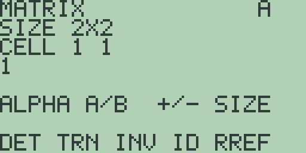
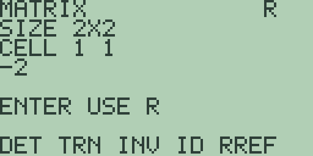
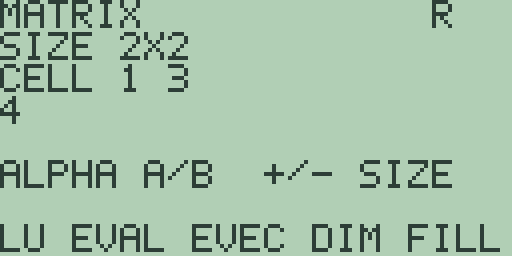
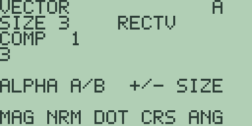

# Chapter 13: Matrices and Vectors

Matrices and vectors each have their own editor, built on the same plan
as the list editor of Chapter 12 (Lists): two working registers `A` and
`B`, a result register `R`, [ALPHA] to switch between the working pair,
and the operations on the soft keys. A matrix is at most 3 by 3 and a
vector has two or three components in this release. This chapter covers
both editors, the linear-algebra operations from determinants to
eigensystems, the coordinate conversions, and the error screens that
guard them, with every result quoted from the machine.

## The matrix editor

Press [2nd] [7] (the `MATRX` legend) to open the matrix editor; the
`MAT` soft item on the home screen's second menu page ([MORE] [F2],
chapter 1) leads to the same place.

Under the `MATRIX` banner, `SIZE 2X2` gives the dimensions, rows first;
that is also where a fresh machine starts. [+] and [-] resize one row at
a time; press [x-VAR] and the same keys resize columns instead, and
[x-VAR] again hands them back to rows. Each dimension runs from 1 up to
the release limit of 3, so pressing [+] beyond `SIZE 3X3` changes
nothing.

The `CELL` line tracks the selected cell as you move: the first figure
after `CELL` is the cell's row, and the value of the cell sits on the
line below. The second figure on the `CELL` line always reads `3` in
this release and does not follow the column, so keep count as you step,
and let the value line confirm the cell. Cells run in reading order,
left to right along row 1, then row 2, and so on. Typing and storing
work exactly as in the list
editor: digits, [.], and [(-)] build a value on the `EDIT` line, [ENTER]
stores it and steps to the next cell, wrapping at the end, and the
cursor keys step without storing. So the matrix in the screenshot is
[1] [ENTER] [2] [ENTER] [3] [ENTER] [4] [ENTER] from a fresh machine:
row one is 1 2, row two is 3 4. [EXIT] leaves for the home screen and
the registers keep their contents.

## Matrix operations

The first soft-key page is `DET TRN INV ID RREF`, each reading `A` and
answering in `R`. With the screenshot's matrix in `A`:

- **`DET`** ([F1]) answers the determinant as a 1 by 1 result: `R`
  shows `SIZE 1X1` holding `-2` (elsewhere `det`).
- **`TRN`** ([F2]) transposes (elsewhere `transpose`): `R` is
  `SIZE 2X2` and stepping through it reads `1`, `3`, `2`, `4`.
- **`INV`** ([F3]) inverts `A` (Appendix A catalogues it as
  `inverse-matrix`): stepping through `R` reads `-2`, `1`, `1.5`,
  `-0.5`.

  

- **`ID`** ([F4]) writes an identity matrix the size of `A` into `R`
  (elsewhere `Ident`): with our 2 by 2 in `A`, stepping through the
  result reads `1`, `0`, `0`, `1`. `A` itself is only read for its
  size, so its cells and the other registers are untouched.
- **`RREF`** ([F5]) answers the reduced row-echelon form (elsewhere
  `rref`), which for our invertible matrix is the identity: stepping
  through `R` reads `1`, `0`, `0`, `1`.

## Matrix arithmetic and solving

The second soft-key page ([MORE]) is `ADD SUB MUL SCL SOLVE`, combining
`A` and `B`. With 1, 2, 3, 4 in `A` and 5, 6, 7, 8 in `B`:

- **`ADD`** ([F1]) answers `6`, `8`, `10`, `12`, and **`SUB`** ([F2])
  answers the differences, starting `-4`.
- **`MUL`** ([F3]) is the matrix product: `19`, `22`, `43`, `50`.
- **`SCL`** ([F4]) multiplies every cell of `A` by one scalar, taken
  from the top-left cell of `B`. With 2 stored there, `A` doubles:
  `2`, `4`, `6`, `8`.
- **`SOLVE`** ([F5]) solves the linear system whose coefficients are
  `A` and whose right-hand sides are the first column of `B`. For the
  system x+y=3, x-y=1, put 1, 1, 1, -1 in `A` and fill `B` as [3]
  [ENTER] [0] [ENTER] [1] [ENTER] [0] [ENTER], which runs 3 and 1 down
  its first column and zeroes the unused second one. `SOLVE` answers a
  `SIZE 2X1` result reading `2` then `1`: x is 2 and y is 1. Larger
  simultaneous systems have a solver of their own in Chapter 14
  (Equation, Polynomial, and Simultaneous Solving).

Two error screens guard the algebra, both with the usual `CLEAR OR EXIT`
way back. Inverting a matrix with determinant zero (try 1, 2, 2, 4)
stops at `SINGULAR MATRIX`, and combining shapes that do not fit, such
as adding a 3 by 2 to a 2 by 2, stops at `DIMENSION ERROR`. Appendix A
catalogues the position-by-position `ADD` and `SUB` as
`elementwise-matrix`.

## Row operations and augmentation

The third soft-key page is `REF SWAP RADD RMUL AUG`; the legend is a
whisker wider than the screen, so `AUG` loses its last letter at the
right edge, but [F5] answers all the same. The row operations work on
the selected row, the row the cell cursor is sitting in, and a fresh
entry wraps the cursor back to cell 1, so the examples below all start
with row 1 selected. Where a second row is needed it is the following
row, wrapping from the bottom back to the top, and where a scale is
needed it comes from the top-left cell of `B`, just as `SCL` takes it.
With the screenshot's 1, 2, 3, 4 in `A`:

- **`REF`** ([F1]) answers the row-echelon form (elsewhere `ref`).
  For our invertible matrix the elimination reduces all the way to the
  identity, so stepping through `R` reads `1`, `0`, `0`, `1`, the same
  answer as `RREF`.
- **`SWAP`** ([F2]) swaps the selected row with the following row
  (elsewhere `rSwap`): `R` reads `3`, `4`, `1`, `2`.
- **`RADD`** ([F3]) adds the following row, scaled by `B`'s top-left
  cell, to the selected row. With 2 stored there ([ALPHA] [2] [ENTER]),
  row 1 gains twice row 2 and `R` reads `7`, `10`, `3`, `4`. Other
  calculators split this into an unscaled and a scaled form (elsewhere
  `rAdd` and `mRAdd`); Free85's one key covers both, with a scale of 1
  for the plain sum.
- **`RMUL`** ([F4]) multiplies the selected row by the same scale
  (elsewhere `multR`): with 2 in `B`, `R` reads `2`, `4`, `3`, `4`.
- **`AUG`** ([F5]) appends `B`'s columns to `A` (elsewhere `aug`).
  Shrink `B` to a 2 by 1 column ([ALPHA] [x-VAR] [-]) holding 5, 6,
  and `AUG` answers a `SIZE 2X3` result whose rows read `1`, `2`, `5`
  and `3`, `4`, `6`.

## Norms, condition, and random fills

The fourth soft-key page is `NORM RNORM CNORM COND RND`. This legend
overruns the screen by a full key: only the first four names fit, and
the fifth, `RND`, sits beyond the right edge entirely, but [F5] still
answers. With 1, 2, 3, 4 in `A`, each answer is a `SIZE 1X1` result:

- **`NORM`** ([F1]) is the Frobenius norm, the square root of the sum
  of the squared cells (Appendix A catalogues it as `norm-matrix`):
  `5.4772255750515`, fourteen-digit arithmetic's take on the square
  root of 30.
- **`RNORM`** ([F2]) is the largest row sum of absolute values
  (elsewhere `rnorm`): `7`, from the row 3, 4.
- **`CNORM`** ([F3]) is the largest column sum (elsewhere `cnorm`):
  `6`, from the column 2, 4.
- **`COND`** ([F4]) is the condition number (elsewhere `cond`), the
  Frobenius norm of `A` times the Frobenius norm of its inverse: `15`.
  A singular `A` has no inverse and no condition number; in this
  release the key then leaves a half-finished figure in `R` and the
  next keypress trips a stray `END OF ENTRY` notice, so ask `COND`
  about invertible matrices only.
- **`RND`** ([F5]) fills at `A`'s size with values from the same
  deterministic sequence as chapter 3's `RAND` (elsewhere `randM`). In
  this release the fill lands on every other cell in reading order and
  leaves zeros between: from a fresh boot a 2 by 2 answers `0.7968`,
  `0`, `0.8984`, `0`. Until a firmware release repairs the fill, count
  on the odd-numbered cells only.

## Decompositions and eigensystems

The fifth soft-key page is `LU EVAL EVEC DIM FILL`:

- **`LU`** ([F1]) factorises `A` into one combined result: the upper
  triangle `U` on and above the diagonal, and the multipliers of a
  unit-diagonal `L` below it. For 4, 3, 6, 3 the result is

  

  and stepping through `R` reads `4`, `3`, `1.5`, `-1.5`: `U` is the
  rows 4, 3 and 0, -1.5, and 1.5 is the multiplier that rebuilds row 2
  as 1.5 times row 1 plus 0, -1.5. The factorisation pivots when it
  must: a zero leading cell (try 0, 1, 2, 3) swaps the rows first and
  answers `2`, `3`, `0`, `1`, recording the row order, 2 then 1, in
  the vector editor's result register as it goes.
- **`EVAL`** ([F2]) answers the eigenvalues (elsewhere `eigVl`) as a
  `SIZE 1X2` (or `1X3`) row. The symmetric 2, 1, 1, 2 answers `3`
  then `1`. Complex pairs use the imaginary plane of the final page:
  the rotation matrix 0, -1, 1, 0 answers two cells reading `0`, and
  paging to the final soft-key page shows `IM -1` and `IM 1` beneath
  them. A 3 by 3's roots take the machine far longer to find than a
  2 by 2's, so give it time.
- **`EVEC`** ([F3]) answers the matching eigenvectors (elsewhere
  `eigVc`), normalised to length one and stored one per column. For
  2, 1, 1, 2 the result reads `0.70710678118655`, `0.70710678118655`,
  `0.70710678118655`, `-0.70710678118655`: the first column is the
  eigenvector for 3, the second for 1, each a scaled 1, 1 or 1, -1.
- **`DIM`** ([F4]) reports the dimensions: a `SIZE 1X2` result
  reading `2` then `2` for our square `A`. Appendix A catalogues it as
  `dim-matrix`, and the [+], [-], and [x-VAR] resizing keys as
  `->dimM`.
- **`FILL`** ([F5]) fills at `A`'s size with the value in `B`'s
  top-left cell (Appendix A catalogues it as `Fill-matrix`): with 9
  stored there, `R` reads `9`, `9`, `9`, `9`.

## Matrices with imaginary parts

The sixth and final soft-key page, `CSET CGET REAL IMAG CLR`, is the
same imaginary-parts page the list editor carries, worked element by
element with the complex editor: chapter 12 walks through it.
An `IM` line under the cell's value shows the selected cell's imaginary
part, `CSET` copies the complex editor's `A` into the cell, and typing
over a cell the ordinary way clears its `IM` to zero. Addition,
subtraction, `SCL`, and the matrix product `MUL` all carry both parts:
with 1+1i in `A`'s top-left cell and 2+3i in `B`'s, `ADD` answers a
top-left cell of `3` with `IM 4`.

## The vector editor

Press [2nd] [8] (the `VECTR` legend), or [MORE] [F3] (`VEC`) from the
home screen, to open the vector editor:

A vector is a single column of components: `SIZE 3` on a fresh machine,
`COMP` naming the component on show, and the same entry rules as the
other editors. [+] and [-] switch the length between 2 and 3, the two
sizes this release supports, and the second soft-key page offers the
same choice via its `2D` and `3D` keys. The `RECTV` tag beside the
size names the coordinate form on show, rectangular to begin with; the
conversions below can change it. The vector above is [3] [ENTER]
[4] [ENTER] [0] [ENTER].

## Vector operations

The first soft-key page is `MAG NRM DOT CRS ANG`. With 3, 4, 0 in `A`
and 1, 2, 3 in `B`:

- **`MAG`** ([F1]) answers the magnitude of `A` (elsewhere `norm`):
  `5`.
- **`NRM`** ([F2]) normalises `A` to length one (elsewhere `unitV`):
  stepping through `R` reads `0.6`, `0.8`, `0`.
- **`DOT`** ([F3]) answers the dot product with `B` (elsewhere `dot`):
  `11`.
- **`CRS`** ([F4]) answers the cross product with `B` (elsewhere
  `cross`): `12`, `-9`, `2`.
- **`ANG`** ([F5]) answers the angle between `A` and `B`, following
  the angle mode of chapter 1: `0.9422435660893` in `ANGLE RAD`, and
  `53.986579610272` with the mode set to `ANGLE DEG`.

The second page ([MORE]) is `ADD SUB SCL 2D 3D`:

- **`ADD`** ([F1]) answers `4`, `6`, `3`.
- **`SUB`** ([F2]) answers the differences, ending `-3`.
- **`SCL`** ([F3]) multiplies `A` by the first component of `B`, just
  as the matrix `SCL` uses `B`'s top-left cell.
- **`2D`** ([F4]) and **`3D`** ([F5]) set the length, as above.

Normalising a vector of zeros stops at the `ZERO VECTOR` notice, and
`CRS` insists on three components: with two-component vectors it answers
`DIMENSION ERROR`, since the cross product only lives in three
dimensions. Appendix A catalogues the position-by-position `ADD` and
`SUB` as `elementwise-vector`.

## Coordinate conversions

The third soft-key page, `R>CY CY>R R>SP SP>R`, converts a
three-component `A` between rectangular, cylindrical, and spherical
coordinates, and each conversion sets the tag beside `SIZE`. The angle
components follow the angle mode of chapter 1's mode screen, just as
`ARG` does in the complex editor of Chapter 11 (Complex Numbers): in
`ANGLE DEG` mode the first example below answers its angle as
`53.130102354156` instead. The worked figures in this section all
assume the fresh machine's `ANGLE RAD`. With 3, 4, 0 in `A`:

- **`R>CY`** ([F1]) converts rectangular to cylindrical (elsewhere
  `->Cyl`): `R` carries the `CYLV` tag (elsewhere the `CylV` display
  mode) and reads `5`, `0.9272952180016`, `0`: the distance from the
  vertical axis, the angle around it, and the height.
- **`CY>R`** ([F2]) reads `A` as a cylindrical triple and converts it
  back to rectangular, restoring the `RECTV` tag (elsewhere `RectV`).
  Enter 2, 1.5707963, 7 and it answers `5.34594384493E-8`,
  `1.9999999999882`, `7`: a right angle in fourteen digits lands a
  whisker off the axis, as chapter 11's polar conversions do.
- **`R>SP`** ([F3]) converts rectangular to spherical (elsewhere
  `->Sph`): the tag becomes `SPHEREV` (elsewhere `SphereV`) and our
  3, 4, 0 answers `5`, `0.9272952180016`, `1.5707963267949`: the
  distance from the origin, the same angle around the vertical axis,
  and the angle down from it, a right angle for a vector in the
  horizontal plane.
- **`SP>R`** ([F4]) reads `A` as a spherical triple and converts back:
  2, 0, 1.5707963 answers `1.9999999999882`, `0`, `5.34594384493E-8`.

The conversions read `A` even while the screen shows `R`, so pressing
`CY>R` straight after `R>CY` does not undo the trip: it reads the
rectangular 3, 4, 0 still in `A` as if it were cylindrical. Store a
result back into `A` by retyping it if you want to chain conversions.
The tag names the last conversion's form rather than tracking each
register: it survives leaving and re-entering the editor, stays put
when a list conversion delivers a plainly rectangular vector, and only
`CY>R` and `SP>R` switch it back to `RECTV`, so treat it as a note of
where the conversions last left off.

## Vector dimensions, fills, and conversions

The fourth soft-key page is `DIM FILL NORM V>L L>V`, the vector
editor's own copy of the list editor's fourth page (chapter 12). With
3, 4, 0 in `A`:

- **`DIM`** ([F1]) reports the length: `R` becomes `SIZE 1` holding
  `3`. Appendix A catalogues it as `dim-vector`, and the [+] and [-]
  resizing keys as `->dimV`.
- **`FILL`** ([F2]) fills at `A`'s length from `B`'s first component
  (Appendix A catalogues it as `Fill-vector`): with 6 stored there,
  `R` reads `6`, `6`, `6`.
- **`NORM`** ([F3]) answers the Euclidean length, `5` for our vector,
  the same figure as the first page's `MAG` (Appendix A catalogues
  this one as `norm-vector`).
- **`V>L`** ([F4]) hands the vector to the list editor (elsewhere
  `vc->li`): its result register receives `3`, `4`, `0`. **`L>V`**
  ([F5]) is the return trip for lists of at most three values
  (elsewhere `li->vc`), as chapter 12 shows.

The fifth soft-key page is the imaginary-parts page `CSET CGET REAL
IMAG CLR`, element by element as in the other editors (chapter 12);
`DOT` and `CRS` carry both parts through their products.
