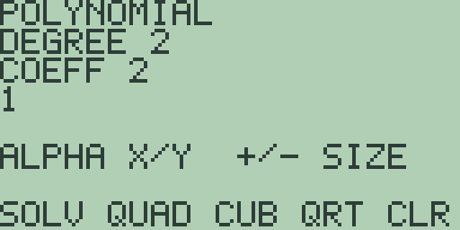
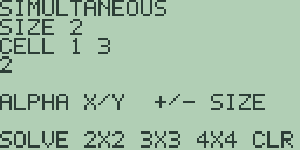

# Chapter 14: Equation, Polynomial, and Simultaneous Solving

Free85 has three solving tools. The general solver takes any expression
in `X` and hunts for a value that makes it zero. The polynomial editor
takes the coefficients of a polynomial of degree 2 to 4 and answers
every root, real or complex. The simultaneous editor takes a linear
system of up to four equations and answers the unknowns, or tells you
why it cannot. The first lives on the home screen; the other two are
editors built on the same entry rules as the collection editors of
Chapter 13 (Matrices and Vectors), whose `SOLVE` soft key is a fourth
route to small linear systems. Every figure in this chapter is quoted
from the machine.

## The general solver

The [GRAPH] key's shifted function is `SOLVER` (elsewhere `Solver`).
Chapter 4 (Cartesian Graphing, Drawing, Formats, and Persistence)
introduced it as a shortcut: with an expression in `X` on the home entry
line, [2nd] [GRAPH] stores the expression as the active graph equation,
searches for a root, and publishes it on the home screen.

To solve x^2-x-6 = 0, type [x-VAR] [x²] [-] [x-VAR] [-] [6] so the
entry line reads `X^2-X-6`, then press [2nd] [GRAPH]. The answer line
reads `= -2`. The search answers a single root, and which one you get
depends on where it starts; for the other root of this polynomial
(3), use the polynomial editor below, or press [GRAPH] to plot the
stored equation and aim the graph screen's own root finder (chapter 4)
at the crossing you want. Roots need not be whole numbers: `X^2-2`
answers `= -1.414213562373`.

An expression with no real root has nothing to answer: `X^2+1` stops at
the `NO NUMERIC RESULT` notice with the usual `CLEAR OR EXIT` way back,
and so does pressing [2nd] [GRAPH] with an empty entry line.

> ⚠ **Planned:** the full `Solver` workflow with a stored equation,
> selectable variables, editable guesses, and solution bounds
> (Free85 2.0, work package 14.7).

## The polynomial editor

Press [2nd] [PRGM] (the `POLY` legend, elsewhere `poly`) to open the
polynomial editor:

Under the `POLYNOMIAL` banner, `DEGREE 2` names the degree, and the
`COEFF` line tracks the selected coefficient by its power: `COEFF 2` is
the coefficient of x^2 and `COEFF 0` is the constant, with the selected
coefficient's value on the line below. A fresh machine holds the
polynomial x^2, a leading 1 with zeros behind it.

`QUAD` ([F2]), `CUB` ([F3]), and `QRT` ([F4]) set the degree to 2, 3,
or 4, and [+] and [-] step it one at a time between the same limits;
degree 4 is the release ceiling, so pressing [+] beyond `DEGREE 4`
changes nothing. Entry follows the editors of chapter 13: digits, [.],
and [(-)] build a value on the `EDIT` line, [ENTER] stores it and steps
to the next lower power, wrapping past the constant, and the cursor
keys step without storing. [CLEAR] abandons a half-typed `EDIT` line,
`CLR` ([F5]) resets every coefficient to the fresh polynomial, and
[EXIT] leaves for the home screen with the coefficients kept. An entry
that does not parse as a number (a bare [.], say) stops at the
`INVALID NUMBER` notice. So the screenshot's x^2-5x+6 is [1] [ENTER]
[(-)] [5] [ENTER] [6] [ENTER] from a fresh editor, the display wrapping
back to `COEFF 2` when the constant is stored.

## Reading the roots

`SOLV` ([F1]) computes the roots and replaces the coefficient display
with a root browser: `ROOT 1` names the root on show, `RE` and `IM`
give its real and imaginary parts, and [◀] and [▶] step through the
roots, as the `LEFT/RIGHT ROOT` hint says. For x^2-5x+6 the browser
opens on `ROOT 1` with `RE 3` and `IM 2E-14`, and [▶] shows `ROOT 2`
with `RE 2` and `IM 0`. The tiny imaginary part is numerical dust from
the iterative search: treat it as zero, and the roots read 3 and 2, as
they should. A value too long for the
21-character line clips at the right edge, so a long piece of dust can
lose the last digit of its exponent. [CLEAR] steps
back to the editor with the coefficients kept, and [EXIT] leaves for
the home screen.

Complex roots come out the same way. Solve x^2+2x+5 (coefficients 1, 2,
5) and `ROOT 1` reads `RE -1.0000000000001` with `IM -2.0000000000001`,
while `ROOT 2` reads `RE -1` with `IM 2`: the conjugate pair -1±2i,
the first root carrying a little dust in its last digit.

The higher degrees work the same. The cubic x^3-6x^2+11x-6
(press `CUB`, then coefficients 1, -6, 11, -6) answers `RE 3`, `RE 1`,
and `RE 2` across its three roots, each with an `IM` at or near zero.
The quartic x^4-5x^2+4 (press `QRT`, then 1, 0, -5, 0, 4) answers
`RE 2`, `RE -1`, `RE -2`, and `RE 1`. Solving with a zero leading
coefficient stops at the `LEADING COEFF ZERO` notice, since the
polynomial would really be one of lower degree.

### Quadratics with mixed-sign roots

Earlier firmware misconverged on any quadratic whose two real roots
differ in sign, and this guide once taught a degree-3 workaround for
them. This release repairs the degree-2 search, so such quadratics
solve directly. x^2-x-6 (coefficients 1, -1, -6) answers `ROOT 1` with
`RE 3` and `IM 1E-15`, then `ROOT 2` with `RE -2` and `IM 2.4E-14`:
the roots 3 and -2, with the usual dust standing in for zero. x^2-4
(1, 0, -4) answers `RE 2` and `RE -2`, and x^2-6x+8 (1, -6, 8), which
once stalled short of its roots, answers `RE 4` and `RE 2`. A negative
leading coefficient, which once upset the search at every degree, is
also safe now: -x^2+4 (coefficients -1, 0, 4) answers the same `RE 2`
and `RE -2` as x^2-4, so there is no need to multiply an equation
through by -1 before solving. The old workaround still works if you
meet it in earlier notes: `CUB` with coefficients 1, -1, -6, 0
multiplies x^2-x-6 by x, and the browser answers `RE 3`, `RE -2E-15`,
and `RE -1.9999999999999`, the true roots plus the 0 the extra factor
added. The cubic and quartic searches answered every polynomial we put
to them, at worst with a small residue in the last digits.

## The simultaneous editor

Press [2nd] [STAT] (the `SIMULT` legend, elsewhere `simult`) to open
the simultaneous-equation editor:

Under the `SIMULTANEOUS` banner, `SIZE 2` gives the number of
equations. `2X2` ([F2]), `3X3` ([F3]), and `4X4` ([F4]) set the size,
[+] and [-] step it, and 4 is the release ceiling. The `CELL` line's
first figure is the row you are in; its second figure always reads `3`
in this release, just like the matrix editor's `CELL` line in
chapter 13, so keep count as you step. Cells run row by row: each row
takes its coefficients left to right and then its right-hand side, and
[ENTER] steps through them with the same entry rules as the polynomial
editor. `CLR` ([F5]) zeroes every cell, and [EXIT] keeps the contents.

The screenshot's system is 2x+y=5 and x-y=1: from a fresh editor press
[2] [ENTER] [1] [ENTER] [5] [ENTER] [1] [ENTER] [(-)] [1] [ENTER]
[1] [ENTER]. `SOLVE` ([F1]) answers a result screen reading
`UNIQUE SOLUTION` with `X 2` and `Y 1`: x is 2 and y is 1.

The result screen answers only to [EXIT], which leaves for the home
screen; to change the system, press [2nd] [STAT] again and the editor
reopens with every cell kept. A 3 by 3 example: enter 2x+y-z=8,
-3x-y+2z=-11, and -2x+y+2z=-3 row by row and `SOLVE` answers `X 2`,
`Y 3`, and `Z -1`. At 4 by 4 the fourth unknown's label renders as `[`,
the character after `Z` in the character set, so a system whose
solution is 1, 2, 3, 4 reads `X 1`, `Y 2`, `Z 3`, and `[ 4`.

## Singular systems

A system without a unique solution gets a status screen instead of
numbers, and both states are recoverable with [EXIT]. Contradictory
equations (enter x+y=1 and x+y=2) answer `NO SOLUTION`, and dependent
equations (enter x+y=2 and 2x+2y=4) answer `UNDERDETERMINED`, meaning a
whole family of solutions fits. This mirrors the `SINGULAR MATRIX`
guard on the matrix editor's inverse (chapter 13), but here the two
degenerate cases are told apart.
