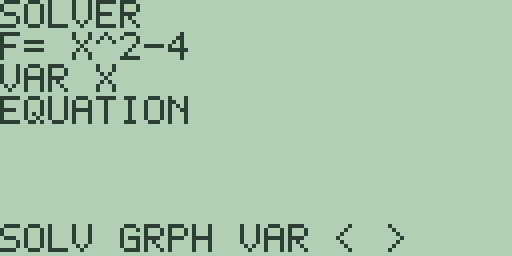
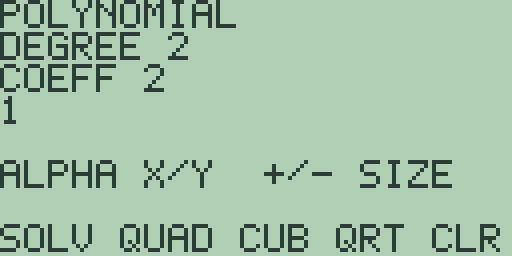
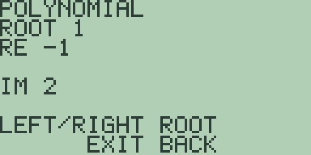
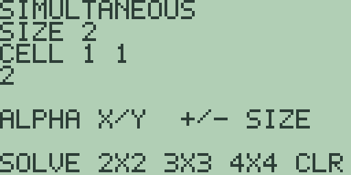
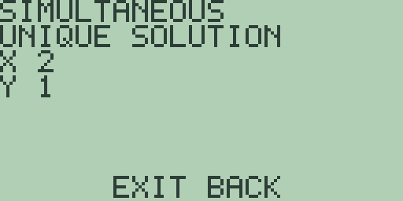

# Chapter 14: Equation, Polynomial, and Simultaneous Solving

Free85 has three solving tools. The general solver keeps an equation
in any single letter and hunts for a value that makes it zero. The
polynomial editor takes the coefficients of a polynomial of degree 2
to 4 and answers every root, real or complex. The simultaneous editor
takes a linear system of up to four equations and answers the
unknowns, or tells you why it cannot. The first is a workspace behind
[2nd] [GRAPH]; the other two are editors built on the same entry rules
as the collection editors of Chapter 13 (Matrices and Vectors), whose
`SOLVE` soft key is a fourth route to small linear systems. Every
figure in this chapter is quoted from the machine.

## The general solver

The [GRAPH] key's shifted function is `SOLVER` (elsewhere `Solver`), a
persistent workspace rather than a one-shot command. Press
[2nd] [GRAPH] and the screen changes to the `SOLVER` banner, an `F=`
line naming the stored equation, a `VAR X` line naming the unknown, a
field area, and the soft keys `SOLV GRPH VAR < >`. On a fresh machine
nothing is stored yet, so the `F=` line shows the `<HOME EXPRESSION>`
placeholder.

The equation arrives from the home screen. Whatever is on the home
entry line when you press [2nd] [GRAPH] becomes the stored equation,
so [x-VAR] [x²] [-] [4] [2nd] [GRAPH] opens the workspace with
`F= X^2-4`, as the screenshot shows. Entering with an empty entry line
keeps what is already stored, and the equation, unknown, guess, and
bounds all survive [EXIT] and a later reopen intact.

`VAR` ([F3]) steps the unknown through the letters, `X` to `Y` to `Z`
to `A` and on around the alphabet, so three presses turn `VAR X` into
`VAR A` for an equation written in `A`. The `<` and `>` keys ([F4] and
[F5]) page the field area through `EQUATION`, `VARIABLE`, `GUESS`,
`LOWER`, and `UPPER`; a fresh machine holds guess `0` with bounds
`-10` and `10`. On a numeric page, digits, [.], and [(-)] build a
value on an `EDIT` line, [ENTER] stores it and pages onward, and
[CLEAR] abandons the half-typed line, following the entry rules of the
editors below. One caveat in this release: the `LOWER` page ignores
[ENTER], so the lower bound keeps whatever it already held (`-10` on a
fresh machine); steer the search with the guess and the upper bound
instead.

`SOLV` ([F1]) hunts for a root between the bounds and publishes a
`ROOT` line and a `RES` residual line in the field area. The guess is
tried first, so a guess that already solves the equation comes back
exact: store `A^2-9`, turn `VAR X` into `VAR A`, page to the guess and
store `-3`, and `SOLV` answers a `ROOT` of `-3` with `RES` `0`. A
guess of `2` on `X^2-4` answers a `ROOT` of `2` the same way, which is
how you pick between roots. Any other guess sends the solver scanning
32 subintervals of the bounds for a sign change, then bisecting it, up
to forty halvings, until the residual passes the numeric tolerance
set with [2nd] [CLEAR], the `TOLER` legend of Chapter 3 (Mathematics,
Calculus, and Comparisons): `X^2-4` from the default guess answers a
`ROOT` of `-1.9999998807909` with `RES` `-4.768364E-7`, the -2
crossing under a little numerical dust, its residual inside the fresh
`1E-6` tolerance.

Four notices guard the search, each with the usual `CLEAR OR EXIT` way
back. `SOLV` with no stored equation stops at `ENTER EQUATION HOME`.
Bounds out of order stop at `LOWER MUST BE < UPP` (store `-20` as the
upper bound and try); the screen clips the last letters, short for
lower must be less than upper. An equation that cannot be evaluated
across the bounds, such as `LN(X)-1` over the default `-10` to `10`,
stops at `EQUATION DOMAIN ERR`, clipped the same way from equation
domain error. And an equation with no sign change between the bounds,
such as `X^2+1`, stops at `NO BOUNDED ROOT`.

`GRPH` ([F2]) hands the problem to the graph screen of Chapter 4
(Cartesian Graphing, Drawing, Formats, and Persistence). The stored
equation becomes the active graph equation with the solver's unknown
renamed to the graph variable, so `TAN(A)-1` hands off as `TAN(X)-1`;
the solver bounds become the window's horizontal range; and the plot
opens, where the graph screen's own [F1] root finder and its
companions (chapter 4) take aim at whichever crossing you can see.
Appendix A catalogues this workspace as `solver-equation`,
`solver-variables`, `solver-guesses`, `solver-bounds`, and
`solver-graph`.

## The polynomial editor

Press [2nd] [PRGM] (the `POLY` legend, elsewhere `poly`) to open the
polynomial editor:

Under the `POLYNOMIAL` banner, `DEGREE 2` names the degree, and the
`COEFF` line tracks the selected coefficient by its power: `COEFF 2` is
the coefficient of x^2 and `COEFF 0` is the constant, with the selected
coefficient's value on the line below. A fresh machine holds the
polynomial x^2, a leading 1 with zeros behind it.

`QUAD` ([F2]), `CUB` ([F3]), and `QRT` ([F4]) set the degree to 2, 3,
or 4, and [+] and [-] step it one at a time between the same limits;
degree 4 is the release ceiling, so pressing [+] beyond `DEGREE 4`
changes nothing. Entry follows the editors of chapter 13: digits, [.],
and [(-)] build a value on the `EDIT` line, [ENTER] stores it and steps
to the next lower power, wrapping past the constant, and the cursor
keys step without storing. [CLEAR] abandons a half-typed `EDIT` line,
`CLR` ([F5]) resets every coefficient to the fresh polynomial, and
[EXIT] leaves for the home screen with the coefficients kept. An entry
that does not parse as a number (a bare [.], say) stops at the
`INVALID NUMBER` notice. So the screenshot's x^2-5x+6 is [1] [ENTER]
[(-)] [5] [ENTER] [6] [ENTER] from a fresh editor, the display wrapping
back to `COEFF 2` when the constant is stored.

## Reading the roots

`SOLV` ([F1]) computes the roots and replaces the coefficient display
with a root browser: `ROOT 1` names the root on show, `RE` and `IM`
give its real and imaginary parts, and [◀] and [▶] step through the
roots, as the `LEFT/RIGHT ROOT` hint says. For x^2-5x+6 the browser
opens on `ROOT 1` with `RE 3` and `IM 0`, and [▶] shows `ROOT 2` with
`RE 2` and `IM 0`: the roots 3 and 2, as they should be. Some inputs
leave a little numerical dust from the iterative search in the last
digit or two of a root; treat it as the nearest round value. A value
too long for the 21-character line clips at the right edge. [CLEAR]
steps back to the editor with the coefficients kept, and [EXIT] leaves
for the home screen.

Complex roots come out the same way. Solve x^2+2x+5 (coefficients 1, 2,
5) and `ROOT 1` reads `RE -1.0000000000001` with `IM -2.0000000000001`,
while `ROOT 2` reads `RE -1` with `IM 2`: the conjugate pair -1±2i,
the first root carrying that dust in its last digit.

The higher degrees work the same. The cubic x^3-6x^2+11x-6
(press `CUB`, then coefficients 1, -6, 11, -6) answers `RE 3`, `RE 1`,
and `RE 2.0000000000016` across its three roots, each with `IM 0`.
The quartic x^4-5x^2+4 (press `QRT`, then 1, 0, -5, 0, 4) answers
`RE 2`, `RE -1`, `RE -2`, and `RE 1`. Solving with a zero leading
coefficient stops at the `LEADING COEFF ZERO` notice, since the
polynomial would really be one of lower degree.

### Quadratics with mixed-sign roots

Earlier firmware misconverged on any quadratic whose two real roots
differ in sign, and this guide once taught a degree-3 workaround for
them. This release repairs the degree-2 search, so such quadratics
solve directly. x^2-x-6 (coefficients 1, -1, -6) answers `ROOT 1` with
`RE 3` and `IM 0`, then `ROOT 2` with `RE -2` and `IM 0`: the roots 3
and -2 exactly. x^2-4 (1, 0, -4) answers `RE 2.0000000000001` and
`RE -2.0000000000001`, the roots 2 and -2 under a grain of dust, and
x^2-6x+8 (1, -6, 8), which once stalled short of its roots, answers
`RE 4` and `RE 2`. A negative leading coefficient, which once upset
the search at every degree, is also safe now: -x^2+4 (coefficients
-1, 0, 4) answers the same values as x^2-4, so there is no need to
multiply an equation through by -1 before solving. The old workaround
still works if you meet it in earlier notes: `CUB` with coefficients
1, -1, -6, 0 multiplies x^2-x-6 by x, and the browser answers `RE 3`,
`RE -2`, and `RE 0`, the true roots plus the 0 the extra factor added.
The cubic and quartic searches answered every polynomial we put to
them, at worst with a small residue in the last digits.

## The simultaneous editor

Press [2nd] [STAT] (the `SIMULT` legend, elsewhere `simult`) to open
the simultaneous-equation editor:

Under the `SIMULTANEOUS` banner, `SIZE 2` gives the number of
equations. `2X2` ([F2]), `3X3` ([F3]), and `4X4` ([F4]) set the size,
[+] and [-] step it, and 4 is the release ceiling. The `CELL` line's
first figure is the row you are in; its second figure always reads `3`
in this release, just like the matrix editor's `CELL` line in
chapter 13, so keep count as you step. Cells run row by row: each row
takes its coefficients left to right and then its right-hand side, and
[ENTER] steps through them with the same entry rules as the polynomial
editor. `CLR` ([F5]) zeroes every cell, and [EXIT] keeps the contents.

The screenshot's system is 2x+y=5 and x-y=1: from a fresh editor press
[2] [ENTER] [1] [ENTER] [5] [ENTER] [1] [ENTER] [(-)] [1] [ENTER]
[1] [ENTER]. `SOLVE` ([F1]) answers a result screen reading
`UNIQUE SOLUTION` with `X 2` and `Y 1`: x is 2 and y is 1.

The result screen answers only to [EXIT], which leaves for the home
screen; to change the system, press [2nd] [STAT] again and the editor
reopens with every cell kept. A 3 by 3 example: enter 2x+y-z=8,
-3x-y+2z=-11, and -2x+y+2z=-3 row by row and `SOLVE` answers `X 2`,
`Y 3`, and `Z -1`. At 4 by 4 the fourth unknown's label renders as `[`,
the character after `Z` in the character set, so a system whose
solution is 1, 2, 3, 4 reads `X 1`, `Y 2`, `Z 3`, and `[ 4`.

## Singular systems

A system without a unique solution gets a status screen instead of
numbers, and both states are recoverable with [EXIT]. Contradictory
equations (enter x+y=1 and x+y=2) answer `NO SOLUTION`, and dependent
equations (enter x+y=2 and 2x+2y=4) answer `UNDERDETERMINED`, meaning a
whole family of solutions fits. This mirrors the `SINGULAR MATRIX`
guard on the matrix editor's inverse (chapter 13), but here the two
degenerate cases are told apart.
