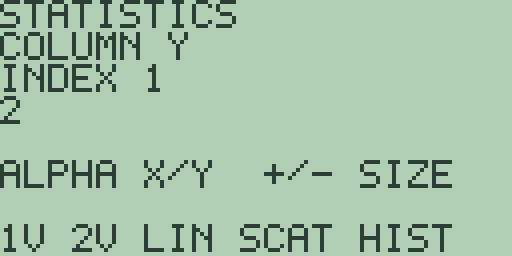
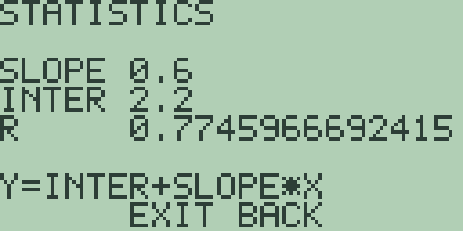
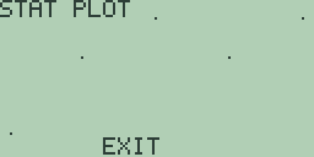
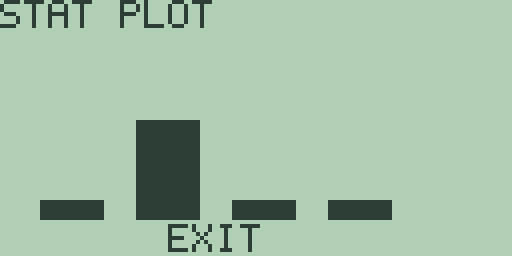
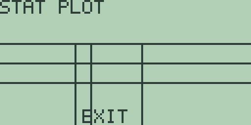

# Chapter 15: Statistics and Statistical Plots

The statistics editor holds two columns of data, computes one-variable
and two-variable summaries and a linear regression from them, and draws
three kinds of plot. Every formula states whether it uses the sample or
the population definition, and every figure in this chapter is quoted
from the machine.

## The statistics editor

Press [STAT] to open the statistics editor; the `STAT` soft item on the
home screen's second menu page ([MORE] [F4], chapter 1) leads to the
same place.

Under the `STATISTICS` banner, `COLUMN X` names the column you are in,
and [ALPHA] switches between the `X` and `Y` columns; one-variable work
uses `X` alone, and paired data puts the second coordinate in `Y`. The
`INDEX` line counts the entries, and the value of the selected entry
sits on the line below. Both columns share one length: a fresh machine
holds four entries, [+] and [-] grow and shrink the pair together, and
eight is the ceiling, the same as a list in Chapter 12 (Lists). The
editor never prints the length, so watch `INDEX`: [ENTER] wraps back to
`INDEX 1` after the last entry, and that wrap tells you where the end
is.

Entry follows the collection editors of chapter 12: digits, [.], and
[(-)] build a value on the `EDIT` line, [ENTER] stores it and steps to
the next entry, and the cursor keys step without storing, wrapping in
both directions. To correct an entry, step back to it and type the
replacement. [CLEAR] abandons a half-typed `EDIT` line, and an entry
that does not parse as a number (a bare [.], say) stops at the
`INVALID NUMBER` notice. There is no key that clears the data: shrink
the length with [-] or overwrite the cells. [EXIT] leaves for the home
screen and the columns keep their contents.

The screenshot's data is the five pairs (1,2), (2,4), (3,5), (4,4),
and (5,5): press [+] once for a length of five, type the `X` values,
press [ALPHA], and type the `Y` values.

## One-variable statistics

The first soft-key page is `1V 2V LIN SCAT HIST`, and the second and
third pages ([MORE]) hold the single-figure keys `MEAN MED VAR SSD PSD`
and `MIN MAX Q1 Q3 BOX`. For a worked example, put the eight values 2,
4, 4, 4, 5, 5, 7, 9 in the `X` column (press [+] four times, then type
them).

`1V` ([F1], elsewhere `OneVar`) computes the one-variable summary of
the `X` column and answers a result screen: `MEAN` reads `5`, `MED`
reads `4.5`, `S SD` reads `2.1380899352994`, and `P SD` reads `2`.
`S SD` is the sample standard deviation, whose squared deviations
divide by n-1; `P SD` is the population standard deviation, dividing
by n. The median is the middle value, or the mean of the middle two
when the count is even. [EXIT] leaves a result screen for the home
screen, and [STAT] reopens the editor with the data kept.

The second page's keys answer one figure at a time on the same kind of
screen: `MEAN` and `MED` repeat the summary lines, `VAR` answers the
sample variance `4.5714285714286` (the square of `S SD`; square `P SD`
for the population variance), and `SSD` and `PSD` repeat the two
standard deviations. The third page's `MIN`, `MAX`, `Q1`, and `Q3`
answer `2`, `9`, `4`, and `6`. The quartiles are the medians of the
lower and upper halves of the sorted data, and an odd count leaves the
middle value out of both halves: the column 1, 2, 3, 4, 5 answers `1.5`
for `Q1` and `4.5` for `Q3`.

## Two-variable statistics and linear regression

Enter the five pairs from the editor screenshot above. `2V` ([F2],
elsewhere `TwoVar`) computes the paired summary: `MEANX` reads `3`,
`MEANY` reads `4`, and `R`, the correlation coefficient, reads
`0.7745966692415`.

`LIN` ([F3], elsewhere `LinR`) fits the least-squares line through the
pairs, in the form its last line states: `Y=INTER+SLOPE*X`. For our
data `SLOPE` reads `0.6`, `INTER` reads `2.2`, and `R` repeats the
correlation, so the fitted line is y = 2.2 + 0.6x.

There is no forecast key yet, but the fit makes forecasting a
home-screen job: to predict y at x=6, type `2.2+0.6*6` and the answer
line
reads `= 5.8`. Watch degenerate data: a constant `X` column has no
defined slope, and rather than an error the result screen answers
`SLOPE 0`, `INTER 0`, and `R 0`, so treat an `R` of exactly zero with
suspicion.

> ⚠ **Planned:** the further regression families `LnR`, `ExpR`, `PwrR`,
> `P2Reg`, `P3Reg`, and `P4Reg` and the forecast commands `fcstx` and
> `fcsty` (Free85 2.0, work package 14.7).

> ⚠ **Planned:** the command-line analyses `OneVar`, `TwoVar`, and
> `ShwSt`, the paired sorts `Sortx` and `Sorty`, and stored result
> variables (Free85 2.0, work package 14.7).

## Statistical plots

Three soft keys turn the columns into pictures. Each plot draws under a
`STAT PLOT` banner, scales itself so the data's smallest and largest
values touch the edges of the plotting area (the graph window of
chapter 4 plays no part), draws no axes, and leaves for the home
screen with [EXIT], as
its footer says.

`SCAT` ([F4], elsewhere `Scatter`) draws one dot per pair, `X` across
and `Y` up. With the five pairs entered, the dots climb from the lower
left to the upper right, with the dip at (4,4) visible on the way:

`HIST` ([F5], elsewhere `Hist`) draws a histogram of the `X` column
alone, ignoring `Y`. It sorts the values into four equal-width bins
spanning the range from minimum to maximum and draws a bar per bin,
heights in proportion to the counts. For the eight-value column of the
one-variable example the bins hold 1, 5, 1, and 1 values, so the second
bar towers over the other three:

`BOX` (the third page's [F5]) draws the `X` column's quartile summary,
scaled so the left and right edges stand for the minimum and the
maximum: vertical bars mark the lower quartile, the median, and the
upper quartile. In this release the drawing overgrows the classic box
shape, the box's three horizontal lines running the full width of the
screen and the three vertical bars dropping from the top line to the
bottom edge, so read the bars' left-to-right positions and let the
shape go. For the eight-value column the bars sit at 4, 4.5, and 6
between edges standing for 2 and 9:

A plot with nothing to draw draws nothing: a single-entry or constant
`X` column answers an empty `STAT PLOT` frame rather than an error.

> ⚠ **Planned:** the connected paired-data plot `xyline` (Free85 2.0,
> work package 14.7).
