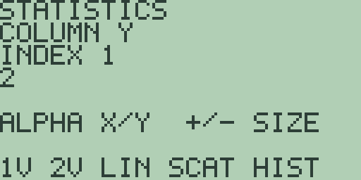
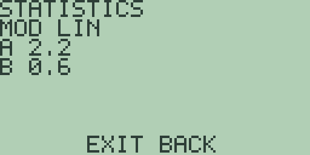
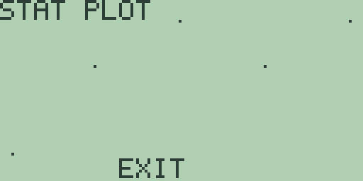
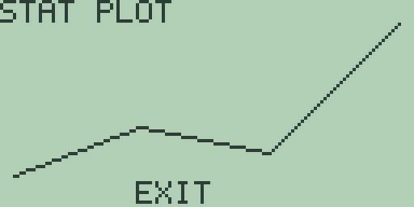
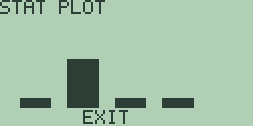
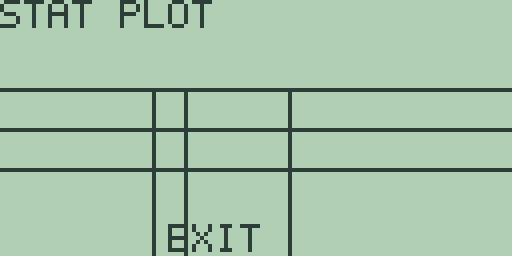

# Chapter 15: Statistics and Statistical Plots

The statistics editor holds two columns of data, computes one-variable
and two-variable summaries, fits seven regression models, forecasts
from the fitted model in either direction, and draws four kinds of
plot. Every formula states whether it uses the sample or the population
definition, and every figure in this chapter is quoted from the
machine.

## The statistics editor

Press [STAT] to open the statistics editor; the `STAT` soft item on the
home screen's second menu page ([MORE] [F4], chapter 1) leads to the
same place.

Under the `STATISTICS` banner, `COLUMN X` names the column you are in,
and [ALPHA] switches between the `X` and `Y` columns; one-variable work
uses `X` alone, and paired data puts the second coordinate in `Y`. The
`INDEX` line counts the entries, and the value of the selected entry
sits on the line below. Both columns share one length: a fresh machine
holds four entries, [+] and [-] grow and shrink the pair together, and
eight is the ceiling. The editor never prints the length, so watch
`INDEX`: [ENTER] wraps back to `INDEX 1` after the last entry, and that
wrap tells you where the end is.

The columns are not a private store: `X` is list `A` and `Y` is list
`B` of Chapter 12 (Lists), the same registers under a different banner.
A `9` stored at `INDEX 1` of the list editor's `A` greets you as the
first `X` entry here, and everything the list editor does to `A` and
`B`, the sorts and fills included, lands in the statistics columns.

Entry follows the collection editors of chapter 12: digits, [.], and
[(-)] build a value on the `EDIT` line, [ENTER] stores it and steps to
the next entry, and the cursor keys step without storing, wrapping in
both directions. To correct an entry, step back to it and type the
replacement. [CLEAR] abandons a half-typed `EDIT` line, and an entry
that does not parse as a number (a bare [.], say) stops at the
`INVALID NUMBER` notice. There is no key that clears the data: shrink
the length with [-] or overwrite the cells. [EXIT] leaves for the home
screen and the columns keep their contents.

Six pages of soft keys cycle under [MORE]: `1V 2V LIN SCAT HIST`, then
`MEAN MED VAR SSD PSD`, `MIN MAX Q1 Q3 BOX`, `LNR EXPR PWR P2 P3`,
`P4 FCX FCY SX SY`, and `SHW XYLN LIN 1V 2V`, wrapping back to the
first. The sixth page's last three keys repeat the first page's, so
the everyday summaries stay one press away from the far pages.

The screenshot's data is the five pairs (1,2), (2,4), (3,5), (4,4),
and (5,5): press [+] once for a length of five, type the `X` values,
press [ALPHA], and type the `Y` values.

## One-variable statistics

For a worked example, put the eight values 2, 4, 4, 4, 5, 5, 7, 9 in
the `X` column (press [+] four times, then type them).

`1V` ([F1], elsewhere `OneVar`) computes the one-variable summary of
the `X` column and answers a result screen: `MEAN` reads `5`, `MED`
reads `4.5`, `S SD` reads `2.1380899352994`, and `P SD` reads `2`.
`S SD` is the sample standard deviation, whose squared deviations
divide by n-1; `P SD` is the population standard deviation, dividing
by n. The median is the middle value, or the mean of the middle two
when the count is even. [EXIT] leaves a result screen for the home
screen, and [STAT] reopens the editor with the data kept.

The second page's keys answer one figure at a time on the same kind of
screen: `MEAN` and `MED` repeat the summary lines, `VAR` answers the
sample variance `4.5714285714286` (the square of `S SD`; square `P SD`
for the population variance), and `SSD` and `PSD` repeat the two
standard deviations. The third page's `MIN`, `MAX`, `Q1`, and `Q3`
answer `2`, `9`, `4`, and `6`. The quartiles are the medians of the
lower and upper halves of the sorted data, and an odd count leaves the
middle value out of both halves: the column 1, 2, 3, 4, 5 answers `1.5`
for `Q1` and `4.5` for `Q3`.

## Two-variable statistics and linear regression

Enter the five pairs from the editor screenshot above. `2V` ([F2],
elsewhere `TwoVar`) computes the paired summary: `MEANX` reads `3`,
`MEANY` reads `4`, and `R`, the correlation coefficient, reads
`0.7745966692415`.

`LIN` ([F3], elsewhere `LinR`) fits the least-squares line through the
pairs and answers a result screen: `MOD LIN` names the model, `A`, the
intercept, reads `2.2`, and `B`, the slope, reads `0.6`, so the fitted
line is y = 2.2 + 0.6x. The footer reads `EXIT BACK`, and the two
ways off the screen differ: [EXIT] leaves for the home screen, and
[CLEAR] returns to the editor. The screen stops at the coefficients:
the correlation lives on the `2V` screen alone, so read `R` there
before or after the fit.

Watch degenerate data: a constant `X` column has no defined slope, and
rather than an error the result screen answers `A 0` and `B 0`, so
treat an all-zero fit with suspicion and check the data.

## The further regression families

The fourth soft-key page holds `LNR`, `EXPR`, and `PWR` and the
polynomial fits `P2` and `P3`, with `P4` opening the fifth page. Each
key fits its model to the pairs and answers the same result screen:
`MOD` names the model, and the coefficients follow in the model's own
terms.

`LNR` ([F1], elsewhere `LnR`) fits the logarithmic model
y = A + B ln x. For the four pairs (1,1), (2,3), (4,5), (8,7), whose
y climbs by 2 per doubling of x, the screen answers `MOD LN` with `A`
reading `0.9999999999992` and `B` reading `2.8853900817765`, the
machine's account of the exact fit A = 1, B = 2/ln 2.

`EXPR` ([F2], elsewhere `ExpR`) fits the exponential model
y = A e^(Bx). The pairs (0,3), (1,6), (2,12), (3,24) double per step
from 3, and the screen answers `MOD EXP` with `A` reading
`3.0000000000026` and `B` reading `0.69314718056`, which is ln 2.

`PWR` ([F3], elsewhere `PwrR`) fits the power model y = A x^B. The
pairs (1,3), (2,12), (3,27), (4,48) lie on y = 3x^2, and the screen
answers `MOD POWER` with `A` reading `3.000000000001` and `B` reading
`1.9999999999983`.

`P2` and `P3` ([F4] and [F5], elsewhere `P2Reg` and `P3Reg`) and the
fifth page's `P4` ([F1], elsewhere `P4Reg`) fit least-squares
polynomials of degree two through four. The coefficients come in
ascending powers, `A` the constant upward: the pairs (0,1), (1,6),
(2,17), (3,34) under `P2` answer `MOD P2` with `A 1`, `B 2`, and
`C 3`, the parabola y = 1 + 2x + 3x^2 exactly, and the five pairs of
y = x^4 at x = -2 through 2 under `P4` answer `MOD P4` with `A 0`
through `D 0` and `E 1`.

Two guards protect the transformed fits. The logarithm asks for
positive data, so `LNR` with a zero or negative `X` entry, `EXPR` with
one in `Y`, or `PWR` with either answers the `POSITIVE DATA NEEDED`
notice (its final letter falls off the 21-column screen). A
polynomial needs at least one pair per coefficient, three for `P2` up
to five for `P4`; fewer answers the `NEED TWO SAMPLES` notice, whose
wording stays the same however many samples the model really wanted.
Both notices show the usual `CLEAR OR EXIT` footer, but here either
key dismisses to the home screen rather than back to the data, so
press [STAT] to return to the editor.

## Forecasting

Once a model is fitted, the fifth page's `FCY` ([F3], elsewhere
`fcsty`) forecasts y from x. Its input is the entry the editor is
standing on: `FCY` reads the selected entry's `X` value, runs it
through the model, and answers a `FORECAST` screen whose direction
line reads `X->Y`, the forecast above and the x it used below. With
the five pairs fitted by `LIN`, stepping to `INDEX 3` and pressing
[MORE] four times then [F3] answers `4` over `3`, the fitted line's
value at x = 3. To forecast at an x the data does not contain,
fit first, then grow the columns by one and store the x you want; the
fit is not recomputed until you press a regression key again.

`FCX` ([F2], elsewhere `fcstx`) inverts the model: it reads the
selected entry's `Y` value and answers the x that produces it, the
direction line reading `Y->X`. On the five pairs' linear fit, `FCX`
at `INDEX 1` (whose `Y` is 2) answers `-0.33333333333333`, the x
where 2.2 + 0.6x = 2. For the two-coefficient models the inverse is
solved directly; for `P2` through `P4` the machine searches the span
between the data's smallest and largest `X` and answers the first
crossing it finds in ascending order. When no x in that span produces
the target y, the search gives up at the `FCSTX NEEDS 2-COEFF`
notice, which dismisses to the home screen like the fitting guards
above; an inverse forecast outside the data's range needs the
two-coefficient families.

The `FORECAST` screen leaves like the result screens, [EXIT] for the
home screen and [CLEAR] for the editor, and the forecast keeps either
way: `SHW` below repaints it on demand.

## Sorting and recalling

`SX` and `SY` (the fifth page's [F4] and [F5], elsewhere `Sortx` and
`Sorty`) sort the pairs in place, ascending by the named column, and
carry the other column along so the pairs stay intact. With `X`
holding 3, 1, 4, 2 and `Y` holding 30, 10, 40, 20, `SX` leaves the
columns reading 1, 2, 3, 4 and 10, 20, 30, 40: entry by entry, each
y still rides with its x. The editor stays where it was, so step
through the entries to see the new order.

`SHW` (the sixth page's [F1], elsewhere `ShwSt`) repaints the last
result screen, whether that was a summary, a regression, or a
forecast, and is the way back to figures you left with [EXIT]. Fit
the five pairs with `LIN`, leave for the home screen, return with
[STAT], and `SHW` answers `MOD LIN` with `A 2.2` and `B 0.6` again.
Before anything has been computed the key does nothing.

## Statistical plots

Four soft keys turn the columns into pictures. Each plot draws under a
`STAT PLOT` banner, scales itself so the data's smallest and largest
values touch the edges of the plotting area (the graph window of chapter 4
plays no part), draws no axes, and leaves for the home screen with [EXIT],
as its footer says.

`SCAT` ([F4], elsewhere `Scatter`) draws one dot per pair, `X` across
and `Y` up. With the five pairs entered, the dots climb from the lower
left to the upper right, with the dip at (4,4) visible on the way:

`XYLN` (the sixth page's [F2], elsewhere `xyline`) draws the same
axes-free frame but joins consecutive pairs with line segments in
entry order, clipped to the frame. The pairs (1,2), (2,4), (3,3),
(4,8) draw a rise, a dip, and a steep climb:

Entry order is drawing order, so a column that is not sorted by `X`
draws a zig-zag; `SX` above puts the pairs in plotting order first.

`HIST` ([F5], elsewhere `Hist`) draws a histogram of the `X` column
alone, ignoring `Y`. It sorts the values into four equal-width bins
spanning the range from minimum to maximum and draws a bar per bin,
heights in proportion to the counts. For the eight-value column of the
one-variable example the bins hold 1, 5, 1, and 1 values, so the second
bar towers over the other three:

`BOX` (the third page's [F5]) draws the `X` column's quartile summary,
scaled so the left and right edges stand for the minimum and the
maximum: vertical bars mark the lower quartile, the median, and the
upper quartile. In this release the drawing overgrows the classic box
shape, the box's three horizontal lines running the full width of the
screen and the three vertical bars dropping from the top line to the
bottom edge, so read the bars' left-to-right positions and let the
shape go. For the eight-value column the bars sit at 4, 4.5, and 6
between edges standing for 2 and 9:

A plot with nothing to draw draws nothing: a single-entry or constant
`X` column answers an empty `STAT PLOT` frame rather than an error.
