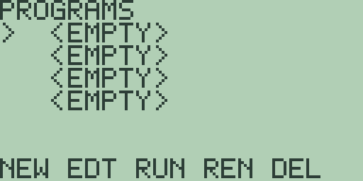
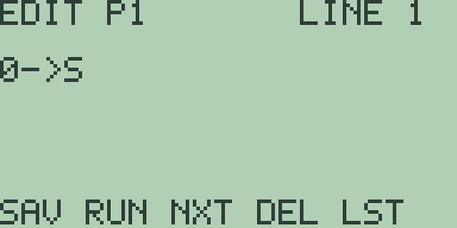
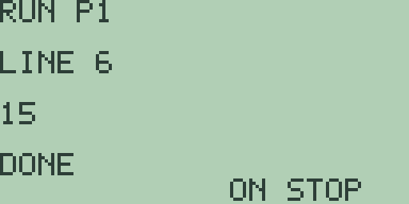

# Chapter 16: Calculator Programming

The [PRGM] key leads to a small but complete programming environment:
four stored programs, a line-at-a-time editor, and a runner that shares
the expression engine of the home screen. This chapter walks the list,
the editor, and every instruction the language understands. Every
program in it was keyed into the emulator, run, and its output quoted
exactly as the run screen shows it.

## The program list

Press [PRGM] to open the program list; the `PGM` soft item on the home
screen's second menu page ([MORE] [F5], chapter 1) leads to the same
place:



Under the `PROGRAMS` banner sit the four program slots, each reading
`<EMPTY>` on a fresh machine, with the `>` cursor marking the selected
slot. [▲] and [▼] move the cursor, wrapping at both ends, and [EXIT]
returns to the home screen. Four slots is the whole store: Free85 holds
at most four programs, and this list is all of them.

The soft keys `NEW EDT RUN REN DEL` do the work:

- **[F1] `NEW`** creates a program in the selected slot, named `P1`
  through `P4` after the slot, and opens it in the editor. The two
  keys converge on a filled slot: there `NEW` simply opens the
  program, the same as `EDT`.
- **[F2] `EDT`** opens the selected program in the editor, creating it
  first if the slot is empty.
- **[F3] `RUN`** runs the selected program. On an empty slot it answers
  the full-screen `NO PROGRAM` notice, with the usual `CLEAR OR EXIT`
  way back (chapter 1).
- **[F4] `REN`** renames the selected program: the `RENAME PROGRAM`
  screen loads the current name into an entry line, and its footer
  `ENTER SAVE` says how to finish. Names hold up to seven characters,
  typed like any program text (letters with [ALPHA]); an empty or
  overlong name answers the `BAD NAME` notice, and [EXIT] abandons the
  rename. A renamed slot shows its new name in the list.
- **[F5] `DEL`** deletes the selected program on the spot, with no
  confirmation, exactly like the bulk `PGM` clear in Chapter 18: Memory
  Management.

Programs persist: they survive leaving the screen, and a power cycle
brings all four slots back exactly as you left them.

## The program editor

`NEW` on the first slot opens the editor. The capture below shows it
after typing the first line of this chapter's worked example:



The banner names the program and the line: `EDIT P1` and `LINE 1`. A
program is eight lines of up to 48 characters each, and the editor
shows one line at a time; the line number in the banner is your
position.

Typing works like the home entry line (chapter 1), with the same
insertions: [SIN] inserts `SIN(`, [STO▶] inserts `->`, [x-VAR] inserts
`X`, and letters are typed with [ALPHA], so a bracketed letter such as
[D] means [ALPHA] then the key carrying that letter. [DEL] deletes,
[2nd] [DEL] toggles insert and overwrite, [CLEAR] empties the line, and
[◀] and [▶] move the cursor. One difference is worth flagging: in this
editor [2nd] [0] types a space character, where on the home screen the
same keys open the character palette.

Moving between lines always saves the line you are leaving:

- **[ENTER]**, **[▼]**, or **[F3] (`NXT`)** move down one line,
  stopping at line 8.
- **[▲]** moves up one line, stopping at line 1.
- **[F1] (`SAV`)** saves the line and stays put.
- **[F4] (`DEL`)** deletes the whole current line and pulls the lines
  below it up one place.
- **[F5] (`LST`)** or **[EXIT]** save and return to the program list.
- **[F2] (`RUN`)** saves and runs the program immediately.

## The language at a glance

A program is one statement per line. A statement is either an
instruction from the table below or a bare expression, and expressions
run through the same engine as the home screen, so everything in
Chapter 3 (Mathematics, Calculus, and Comparisons) works here:
`2+3->A` stores, `SIN(0)` evaluates, and the comparison operators
supply the conditions for `IF` and `WHILE`. An instruction keyword is
followed by one space, then its arguments.

| Instruction | Meaning |
| --- | --- |
| `DISP e` | evaluate `e` and show it on the run screen |
| `INPUT V` | ask for a number and store it in variable `V` |
| `IF e` ... `ELSE` ... `END` | run a block when `e` is nonzero |
| `WHILE e` ... `END` | repeat a block while `e` is nonzero |
| `FOR V,a,b` ... `END` | count `V` from `a` to `b`, one per pass |
| `CALL n` | run program `n` (1 through 4), then come back |
| `RETURN` | leave the current program at once |
| `STOP` | end the run |
| `GRAPH e` | store `e` as the active equation and plot it |
| `LSET i,e` / `LGET i,V` | write and read entry `i` of list `A` |
| `MSET r,c,e` / `MGET r,c,V` | write and read cell `r,c` of matrix `A` |

If you are arriving from another calculator's manual, the spellings map
directly: `DISP` covers `Disp`, `INPUT` covers the numeric form of
`Input` (appendix A catalogues it as `Input-number`), and `WHILE`, `FOR`,
`ELSE`, `END`, `RETURN`, and `STOP` cover `While`, `For`, `Else`, `End`,
`Return`, and `Stop`. The one structural difference is the conditional:
an `IF` line opens its block directly, with no separate `Then` line, so a
three-line `If`/`Then`/`End` block elsewhere is a two-line `IF`/`END`
block here.

## A first program

The worked example sums the numbers 1 through 5. Press [PRGM] [F1] to
create `P1`, then type these six lines, pressing [ENTER] after each to
move on (spaces are [2nd] [0]):

| Line | Text | Keys |
| --- | --- | --- |
| 1 | `0->S` | [0] [STO▶] [S] |
| 2 | `FOR A,1,5` | [F] [O] [R] [2nd] [0] [A] [,] [1] [,] [5] |
| 3 | `S+A->S` | [S] [+] [A] [STO▶] [S] |
| 4 | `END` | [E] [N] [D] |
| 5 | `DISP S` | [D] [I] [S] [P] [2nd] [0] [S] |
| 6 | `STOP` | [S] [T] [O] [P] |

Press [F2] (`RUN`) and the run screen takes over:



Reading from the top: `RUN P1` names the program, `LINE 6` is the line
the runner reached, the output line shows `15`, the sum of 1 through 5,
the status reads `DONE`, and the footer `ON STOP` names the panic
button. The output line shows the most recent `DISP` only, so a program
that displays many values leaves the last one on screen.

From the run screen, [PRGM] returns to the program list, and [EXIT]
from the list goes home. Pressing [EXIT], [CLEAR], or [ON] on the run
screen instead marks the run stopped, as the stopping section below
describes.

## Conditions

`IF` evaluates its expression and runs the following block when the
value is nonzero; a zero value falls through to the `ELSE` block, if
there is one, and `END` closes the conditional. Chapter 3's comparisons
produce exactly these values, `1` for true and `0` for false, so they
slot straight in. This program:

```text
0->A
IF A
DISP 1
ELSE
DISP 2
END
STOP
```

answers `2` on the run screen: `A` is zero, so the `ELSE` branch runs.
Change the first line to `1->A` and the same program answers `1`.

## Loops

`WHILE` re-tests its expression before every pass and leaves the block
when the value is zero. A countdown:

```text
3->A
WHILE A
A-1->A
END
DISP A
STOP
```

answers `0`, the value of `A` when the test finally failed.

`FOR` is the counted loop, and its bounds are deliberately compact: the
variable is any letter, the start and end are single digits `0` through
`9`, and the step is always 1. `FOR A,1,3` runs its block with `A` at
1, 2, and 3, and leaves `A` at 3 afterwards. This program:

```text
FOR A,1,3
DISP A*A
END
STOP
```

displays the squares 1, 4, 9 in turn and finishes with `9` on the
output line, the last `DISP` standing. For bounds beyond a single
digit, use `WHILE` with an ordinary stored variable instead.

## Asking for a number

`INPUT` names one variable, `A` through `Z`. When the runner reaches
it, the run pauses on a dedicated screen: the banner names the
variable, `INPUT A`, an empty entry line waits, and the footer reads
`ENTER VALUE`. Type a number, using the digits, [.], and [(-)] as on
the home screen, and press [ENTER]; the value is stored and the run
carries on. This program:

```text
INPUT A
DISP A*2
STOP
```

pauses at `INPUT A`; typing [6] [ENTER] resumes the run, and the
output line answers `12`. An entry that does not parse as a number (a
bare [.], say) stops the run at the `ERROR LINE  1` notice, naming the
`INPUT` line, and [EXIT] or [ON] on the input screen abandons the run
the same way as stopping it.

## Programs calling programs

`CALL` runs another of the four programs by its slot number and comes
back to the next line when that program ends or reaches `RETURN`.
Variables are shared, so a called program hands results back by storing
them. With `P1` holding:

```text
CALL 2
DISP A
STOP
```

and `P2` holding:

```text
7->A
RETURN
```

running `P1` answers `7`: the call ran `P2`, which stored `7` in `A`
and returned. `CALL` on an empty slot stops the run with an error, and
`RETURN` in the top-level program simply ends the run. Calls nest up to
four deep, as the limits section below records.

## Stopping, and when it goes wrong

`STOP` ends the run and leaves the status at `DONE`. For a program that
will not end on its own, the footer's promise holds: [ON] stops the run
at once. Key in the two-line program `WHILE 1` and `END`, run it, and
the status shows `RUNNING` with the line number ticking; press [ON] and
the screen answers `STOPPED LINE1`, naming the line it was on. [EXIT]
and [CLEAR] stop a run the same way, so the deliberate exits from a
finished run screen are [PRGM] to the list and [EXIT] from there.

A line the runner cannot make sense of stops the run with an error
notice naming the line: a program whose second line is the stray text
`HELLO` runs its first line, then stops at `ERROR LINE  2`. Fix the
line in the editor and run again; the source is never altered by a
failed run.

## Limits

The environment's bounds are fixed in this release, and the editor and
runner enforce all of them:

- four programs, of eight lines of 48 characters each;
- control frames (`IF`, `WHILE`, and `FOR` blocks) nest eight deep;
- calls nest four deep.

Exceeding a nesting bound stops the run with the `ERROR LINE` notice
on the line that went too deep.

## Reaching the rest of the calculator

Three instruction families connect programs to the rest of the machine:

- **`GRAPH e`** stores `e` as the active function slot and opens the
  graph screen, plotting exactly as [GRAPH] does from the home entry
  line: a one-line program `GRAPH X^2-4` draws the parabola of
  Chapter 4: Cartesian Graphing, Drawing, Formats, and Persistence.
- **`LSET i,e` and `LGET i,V`** write and read entry `i` (1 through 8)
  of list `A`, the list the editor of Chapter 12 (Lists) shows, growing
  the list when you write past its length. The program `LSET 2,42`,
  `LGET 2,B`, `DISP B` answers `42`, and afterwards the list editor
  shows `42` at `INDEX 2`.
- **`MSET r,c,e` and `MGET r,c,V`** do the same for matrix `A` of
  Chapter 13 (Matrices and Vectors), rows and columns 1 through 3.

Everything the expression engine offers is available inside program
expressions, but the wider command catalog is not yet callable as
statements.

> ⚠ **Planned:** the labels and jumps `Lbl` and `Goto`, the `Repeat`
> loop, the skip instructions `IS>` and `DS<`, and program menus with
> `Menu` (Free85 2.0, work package 14.8).

> ⚠ **Planned:** the further program I/O `getKy`, `Outpt`, `Pause`,
> `Prompt`, `InpSt`, `ClLCD`, `DispG`, and `PrtScrn` (Free85 2.0,
> work package 14.8).

> ⚠ **Planned:** making every catalog command callable from program
> lines (Free85 2.0, work package 14.8).

> 🔌 **Hardware:** CBL-style external-device forms of `Input` and
> `Outpt` depend on a physical device port; physical hardware
> validation is reported separately.
