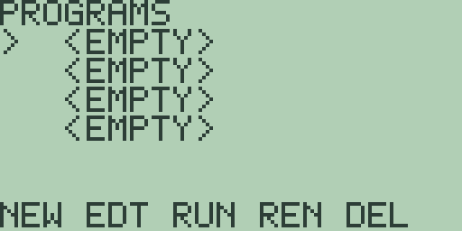
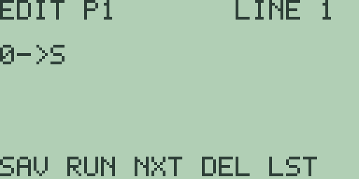
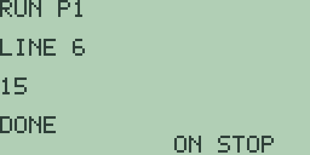
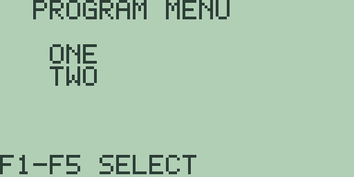

# Chapter 16: Calculator Programming

The [PRGM] key leads to a small but complete programming environment:
four stored programs, a line-at-a-time editor, and a runner that shares
the expression engine of the home screen. This chapter walks the list,
the editor, and every instruction the language understands. Every
program in it was run in the emulator and its output quoted exactly as
the screen shows it, and where the editor cannot yet type an
instruction the runner accepts, the text says so plainly.

## The program list

Press [PRGM] to open the program list; the `PGM` soft item on the home
screen's second menu page ([MORE] [F5], chapter 1) leads to the same
place:



Under the `PROGRAMS` banner sit the four program slots, each reading
`<EMPTY>` on a fresh machine, with the `>` cursor marking the selected
slot. [▲] and [▼] move the cursor, wrapping at both ends, and [EXIT]
returns to the home screen. Four slots is the whole store: Free85 holds
at most four programs, and this list is all of them.

The soft keys `NEW EDT RUN REN DEL` do the work:

- **[F1] `NEW`** creates a program in the selected slot, named `P1`
  through `P4` after the slot, and opens it in the editor. The two
  keys converge on a filled slot: there `NEW` simply opens the
  program, the same as `EDT`.
- **[F2] `EDT`** opens the selected program in the editor, creating it
  first if the slot is empty.
- **[F3] `RUN`** runs the selected program. On an empty slot it answers
  the full-screen `NO PROGRAM` notice, with the usual `CLEAR OR EXIT`
  way back (chapter 1).
- **[F4] `REN`** renames the selected program: the `RENAME PROGRAM`
  screen loads the current name into an entry line, and its footer
  `ENTER SAVE` says how to finish. Names hold up to seven characters,
  typed like any program text (letters with [ALPHA]); an empty or
  overlong name answers the `BAD NAME` notice, and [EXIT] abandons the
  rename. A renamed slot shows its new name in the list.
- **[F5] `DEL`** deletes the selected program on the spot, with no
  confirmation, exactly like the bulk `PGM` clear in Chapter 18: Memory
  Management.

Programs persist: they survive leaving the screen, and a power cycle
brings all four slots back exactly as you left them.

## The program editor

`NEW` on the first slot opens the editor. The capture below shows it
after typing the first line of this chapter's worked example:



The banner names the program and the line: `EDIT P1` and `LINE 1`. A
program is eight lines of up to 48 characters each, and the editor
shows one line at a time; the line number in the banner is your
position.

Typing works like the home entry line (chapter 1), with the same
insertions: [SIN] inserts `SIN(`, [STO▶] inserts `->`, [x-VAR] inserts
`X`, and letters are typed with [ALPHA], so a bracketed letter such as
[D] means [ALPHA] then the key carrying that letter. [DEL] deletes,
[2nd] [DEL] toggles insert and overwrite, [CLEAR] empties the line, and
[◀] and [▶] move the cursor. One difference is worth flagging: in this
editor [2nd] [0] types a space character, where on the home screen the
same keys open the character palette.

The editor has no insert menus. [MORE] answers nothing here, and
neither the catalog ([2nd] [CUSTOM]) nor the `TEST` menu of chapter 3
([2nd] [2]) opens, so every keyword is spelled out letter by letter
with [ALPHA]. That closed door leaves three characters short: `=`,
`<`, and `>` live only in menus and in the character palette, and the
palette is the very thing [2nd] [0] does not open here. A `>` can
still be manufactured, because [STO▶] inserts the two characters
`->` and [◀] [DEL] [▶] removes the `-`, leaving a bare `>` behind.
No trick reaches `=` or `<`, so although the runner understands
comparison conditions such as `REPEAT A=3` and the skip instruction
`DS< V,e`, this release's editor cannot key them in; until a firmware
release opens a way to type those characters, build conditions from
arithmetic, as the examples below do.

Moving between lines always saves the line you are leaving:

- **[ENTER]**, **[▼]**, or **[F3] (`NXT`)** move down one line,
  stopping at line 8.
- **[▲]** moves up one line, stopping at line 1.
- **[F1] (`SAV`)** saves the line and stays put.
- **[F4] (`DEL`)** deletes the whole current line and pulls the lines
  below it up one place.
- **[F5] (`LST`)** or **[EXIT]** save and return to the program list.
- **[F2] (`RUN`)** saves and runs the program immediately.

## The language at a glance

A program is one statement per line. A statement is either an
instruction from the table below or a bare expression, and expressions
run through the same engine as the home screen, so everything in
Chapter 3 (Mathematics, Calculus, and Comparisons) works here:
`2+3->A` stores and `SIN(0)` evaluates. Conditions are numeric,
nonzero meaning true; the comparison operators exist in the engine but
their characters mostly cannot be typed here, as the editor section
explains. An instruction keyword is followed by one space, then its
arguments.

| Instruction | Meaning |
| --- | --- |
| `DISP e` | evaluate `e` and show it on the run screen |
| `INPUT V` | ask for a number and store it in variable `V` |
| `PROMPT V` | the same, with the variable named in the banner |
| `INPST S` | ask for text and store it in string register `S` |
| `IF e` ... `ELSE` ... `END` | run a block when `e` is nonzero |
| `WHILE e` ... `END` | repeat a block while `e` is nonzero |
| `REPEAT e` ... `END` | repeat a block until `e` is nonzero |
| `FOR V,a,b` ... `END` | count `V` from `a` to `b`, one per pass |
| `LBL name` / `GOTO name` | mark a line and jump to it |
| `IS> V,e` / `DS< V,e` | step `V`, skipping a line on a comparison |
| `MENU one,two,...` | suspend on a soft-key chooser of labels |
| `GETKEY V` | store the last key's code in `V`, without waiting |
| `PAUSE` | wait for any key |
| `OUTPT r,c,text` | print `text` at row `r`, column `c` |
| `CLLCD` | clear the display |
| `CALL n` | run program `n` (1 through 4), then come back |
| `RETURN` | leave the current program at once |
| `STOP` | end the run |
| `GRAPH e` | store `e` as the active equation and end the run on its plot |
| `DISPG` | end the run on the graph screen |
| `STTOEQ S,n` / `EQTOST n,S` | copy a string to equation slot `n`, and back |
| `LSET i,e` / `LGET i,V` | write and read entry `i` of list `A` |
| `MSET r,c,e` / `MGET r,c,V` | write and read cell `r,c` of matrix `A` |
| `VSET i,e` / `VGET i,V` | write and read entry `i` of vector `A` |
| `VOUT text` / `VIN V` | write to and read from the virtual device |
| `PRTSCRN` | print the display to the virtual device |
| `CAT command` | run a catalog function (`CAT ` is optional) |
| `COLL n` / `STATC n` | end the run on a collection or statistics result |
| `SOLVER e` / `GMODE n` | end the run on the solver or the graph mode `n` |

If you are arriving from another calculator's manual, the spellings map
directly: `DISP` covers `Disp`, `INPUT` covers the numeric form of
`Input` (appendix A catalogues it as `Input-number`), and `WHILE`, `FOR`,
`ELSE`, `END`, `RETURN`, and `STOP` cover `While`, `For`, `Else`, `End`,
`Return`, and `Stop`. The 2.10 additions map the same way: `LBL`,
`GOTO`, `REPEAT`, and `MENU` cover `Lbl`, `Goto`, `Repeat`, and `Menu`;
`GETKEY`, `OUTPT`, `PAUSE`, `PROMPT`, `INPST`, `CLLCD`, `DISPG`, and
`PRTSCRN` cover `getKy`, `Outpt`, `Pause`, `Prompt`, `InpSt`, `ClLCD`,
`DispG`, and `PrtScrn` (appendix A catalogues the text form of `Input`
as `Input-string`); `IS>` and `DS<` keep their spellings. The one
structural difference is the conditional: an `IF` line opens its block
directly, with no separate `Then` line, so a three-line
`If`/`Then`/`End` block elsewhere is a two-line `IF`/`END` block here.

The table's last rows reach the rest of the machine, and the closing
sections walk them; appendix A files that reach as
`all-math-from-programs`, `all-graph-from-programs`,
`all-collection-from-programs`, and `all-statistics-from-programs`.

## A first program

The worked example sums the numbers 1 through 5. Press [PRGM] [F1] to
create `P1`, then type these six lines, pressing [ENTER] after each to
move on (spaces are [2nd] [0]):

| Line | Text | Keys |
| --- | --- | --- |
| 1 | `0->S` | [0] [STO▶] [S] |
| 2 | `FOR A,1,5` | [F] [O] [R] [2nd] [0] [A] [,] [1] [,] [5] |
| 3 | `S+A->S` | [S] [+] [A] [STO▶] [S] |
| 4 | `END` | [E] [N] [D] |
| 5 | `DISP S` | [D] [I] [S] [P] [2nd] [0] [S] |
| 6 | `STOP` | [S] [T] [O] [P] |

Press [F2] (`RUN`) and the run screen takes over:



Reading from the top: `RUN P1` names the program, `LINE 6` is the line
the runner reached, the output line shows `15`, the sum of 1 through 5,
the status reads `DONE`, and the footer `ON STOP` names the panic
button. The output line shows the most recent `DISP` only, so a program
that displays many values leaves the last one on screen.

From the run screen, [PRGM] returns to the program list, and [EXIT]
from the list goes home. Pressing [EXIT], [CLEAR], or [ON] on the run
screen instead marks the run stopped, as the stopping section below
describes.

## Conditions

`IF` evaluates its expression and runs the following block when the
value is nonzero; a zero value falls through to the `ELSE` block, if
there is one, and `END` closes the conditional. This program:

```text
0->A
IF A
DISP 1
ELSE
DISP 2
END
STOP
```

answers `2` on the run screen: `A` is zero, so the `ELSE` branch runs.
Change the first line to `1->A` and the same program answers `1`.
Since the editor cannot type `=` or `<`, phrase tests arithmetically:
`A-5` is nonzero exactly while `A` differs from 5.

## Loops

`WHILE` re-tests its expression before every pass and leaves the block
when the value is zero. A countdown:

```text
3->A
WHILE A
A-1->A
END
DISP A
STOP
```

answers `0`, the value of `A` when the test finally failed.

`REPEAT` (elsewhere `Repeat`) is its mirror: the block repeats until
the expression is nonzero. One real difference from its namesake:
elsewhere `Repeat` tests after the body, so the body always runs at
least once, while here the test sits at the `REPEAT` line and runs
before every pass, the first included. This program:

```text
0->A
REPEAT A
A+1->A
END
DISP A
STOP
```

answers `1`: the body ran once, `A` became nonzero, and the loop
ended. Change the first line to `3->A` and it answers `3`, the body
never entered, because the condition was already satisfied at the
first test.

`FOR` is the counted loop, and its bounds are deliberately compact: the
variable is any letter, the start and end are single digits `0` through
`9`, and the step is always 1. `FOR A,1,3` runs its block with `A` at
1, 2, and 3, and leaves `A` at 3 afterwards. This program:

```text
FOR A,1,3
DISP A*A
END
STOP
```

displays the squares 1, 4, 9 in turn and finishes with `9` on the
output line, the last `DISP` standing. For bounds beyond a single
digit, use `WHILE` with an ordinary stored variable instead.

## Labels, jumps, and skips

`LBL name` (elsewhere `Lbl`) marks a line and does nothing when the
runner walks over it; `GOTO name` (elsewhere `Goto`) jumps to the
matching `LBL` anywhere in the program. Names run up to 16 characters.
This program:

```text
GOTO SKIP
DISP 1
LBL SKIP
DISP 7
STOP
```

answers `7`, the `DISP 1` jumped over. A `GOTO` whose name has no
`LBL` stops the run at the error notice naming its own line: a program
whose second line is `GOTO MISSING` stops at `ERROR LINE  2`.

`IS> V,e` adds 1 to variable `V`, then skips the next line when the
new value exceeds `e`; `DS< V,e` subtracts 1 and skips when the new
value has dropped below `e`. Both pair naturally with `GOTO` on the
line they guard. This program:

```text
0->A
IS> A,0
DISP 0
DISP A
STOP
```

answers `1`: the increment took `A` to 1, 1 exceeds 0, and the
`DISP 0` was skipped; the `IS>` line itself is typeable through the
[STO▶] trick from the editor section. The runner carries the mirror
`DS<` too, though nothing you can type on this release reaches it,
because no trick produces the `<`; for the record, its behaviour:

```text
2->A
DS< A,2
DISP 0
DISP A
STOP
```

answers `1` from `DISP A`, the decrement landing below 2. Until a
firmware release opens a way to type `<`, count downward with `WHILE`
and a stored variable instead.

## Program menus

`MENU` (elsewhere `Menu`) lists up to five names and suspends the run
on a chooser. Each name must match a `LBL` somewhere in the program,
and the soft key jumps there. With `P1` holding:

```text
MENU ONE,TWO
LBL ONE
DISP 1
STOP
LBL TWO
DISP 2
STOP
```

running suspends on the chooser: the banner reads `PROGRAM MENU`, the
names are listed down the screen, and the footer reads `F1-F5 SELECT`:



[F2] picks `TWO`, the run jumps to `LBL TWO`, and the run screen
answers `2`. Keys other than [F1] through [F5] redraw the chooser,
except [ON], [EXIT], and [CLEAR], which stop the run. The bounds are
enforced at run time: six names or an empty list stop the run at the
`ERROR LINE` notice on the `MENU` line, and picking a name with no
matching `LBL` stops it like an unresolved `GOTO`. Names follow the
label rule, 16 characters at most.

## Asking for a number

`INPUT` names one variable, `A` through `Z`. When the runner reaches
it, the run pauses on a dedicated screen: the banner names the
variable, `INPUT A`, an empty entry line waits, and the footer reads
`ENTER VALUE`. Type a number, using the digits, [.], and [(-)] as on
the home screen, and press [ENTER]; the value is stored and the run
carries on. This program:

```text
INPUT A
DISP A*2
STOP
```

pauses at `INPUT A`; typing [6] [ENTER] resumes the run, and the
output line answers `12`. An entry that does not parse as a number (a
bare [.], say) stops the run at the `ERROR LINE  1` notice, naming the
`INPUT` line, and [EXIT] or [ON] on the input screen abandons the run
the same way as stopping it.

`PROMPT V` (elsewhere `Prompt`) asks the same way on the same screen;
the difference is the banner, which names the keyword instead of the
word `INPUT`: `PROMPT A` for variable `A`. Swap the first line above
for `PROMPT A` and the same [6] [ENTER] answers `12`.

## Asking for text

`INPST S` (elsewhere `InpSt`) suspends the run on a text-entry screen
and stores what you type into string register `A` or `B` of Chapter 9
(Strings and Characters); any other register name stops the run at the
`ERROR LINE` notice. The screen's footer reads `ENTER TEXT`, and its
banner names the register after the keyword: `INPUT STRING A` for
register `A`. Letters are typed with [ALPHA],
digits and operators directly, [x-VAR] inserts `X`, and [ENTER]
stores; the register's 31-character ceiling from chapter 9 applies.
The stored text lands in the strings editor exactly as typed, and the
equation bridge below turns it into something the calculator can run.

## Reading the keyboard

`GETKEY V` (elsewhere `getKy`) does not wait: it stores the code of
the most recently pressed key into `V` and moves on, storing `0` when
nothing has been pressed since the run began. Codes 1 through 50
number the physical keys by position, [F1] at `1` across to [ENTER]
at `50`; [SIN], for example, is `22`. The canonical use is a polling
loop, and this one is typeable as written:

```text
REPEAT A
GETKEY A
END
DISP A
STOP
```

The loop spins while `A` is zero, so the run waits until you press
something; pressing [SIN] answers `22` on the run screen.

## Writing the screen

`CLLCD` (elsewhere `ClLCD`) clears the display to blank. `OUTPT
r,c,text` (elsewhere `Outpt`) prints text at row `r` (0 through 7) and
column `c` (0 through 20). Its third argument is taken literally, not
evaluated: `OUTPT 1,0,2+2` prints `2+2`, not `4`. Text runs up to 23
characters and clips at the right edge rather than wrapping, one
positioned string shows at a time (a second `OUTPT` replaces the
first), and a row, column, or text outside the bounds stops the run at
the `ERROR LINE` notice. The program `OUTPT 3,12,HELLO` ends with the
word alone on the cleared screen:


`PAUSE` (elsewhere `Pause`), with no argument, suspends the run on a
screen reading `PAUSED` over `PRESS A KEY`; any key resumes, except
[ON], [EXIT], and [CLEAR], which stop the run. It is the natural
partner of `OUTPT` and `CLLCD`, holding a composed screen still long
enough to read.

## Programs calling programs

`CALL` runs another of the four programs by its slot number and comes
back to the next line when that program ends or reaches `RETURN`.
Variables are shared, so a called program hands results back by storing
them. With `P1` holding:

```text
CALL 2
DISP A
STOP
```

and `P2` holding:

```text
7->A
RETURN
```

running `P1` answers `7`: the call ran `P2`, which stored `7` in `A`
and returned. `CALL` on an empty slot stops the run with an error, and
`RETURN` in the top-level program simply ends the run. Calls nest up to
four deep, as the limits section below records.

## Stopping, and when it goes wrong

`STOP` ends the run and leaves the status at `DONE`. For a program that
will not end on its own, the footer's promise holds: [ON] stops the run
at once. Key in the two-line program `WHILE 1` and `END`, run it, and
the status shows `RUNNING` with the line number ticking; press [ON] and
the screen answers the stopped notice naming whichever line the runner
was on, `STOPPED LINE1` or `STOPPED LINE2` for this two-line loop.
[EXIT] and [CLEAR] stop a run the same way, so the deliberate exits
from a finished run screen are [PRGM] to the list and [EXIT] from
there. The waiting instructions are covered too: [ON] interrupts
`INPUT`, `PROMPT`, `INPST`, `PAUSE`, and a `MENU` chooser on the spot,
and a stopped run never alters the program source.

A line the runner cannot make sense of stops the run with an error
notice naming the line: a program whose second line is the stray text
`HELLO` runs its first line, then stops at `ERROR LINE  2`. Fix the
line in the editor and run again; the source is never altered by a
failed run.

## Strings and equations

`STTOEQ S,n` copies string register `S` (`A` or `B`) into graph
equation slot `n` (1 through 3) of Chapter 4 (Cartesian Graphing,
Drawing, Formats, and Persistence) and switches that slot on for
plotting; `EQTOST n,S` copies a slot back into a register. Chapter 9
records the pair's ancestry (elsewhere `St->Eq` and `Eq->St`); this is
their home, because they live in the program language only. The trip
is exact both ways, and `INPST` above completes the circle by turning
typed text into a plottable equation. This program:

```text
INPST A
STTOEQ A,1
EQTOST 1,B
STOP
```

pauses for text; typing `X+2` and pressing [ENTER] ends the run with
register `A` holding `X+2`, equation slot 1 holding the same text and
enabled, ready for [GRAPH] to plot the line, and register `B` holding
the copy that `EQTOST` read back. A slot outside 1 through 3 or a
register outside `A` and `B` stops the run at the `ERROR LINE` notice,
and the 31-character register ceiling bounds the equation text.

## The virtual device

Three instructions talk to the built-in virtual device, a 25-byte
buffer that stands in for a physical device port and is always ready
to use. `VOUT text` writes its literal text, up to 25 bytes, into the
device buffer; `VIN V` reads the buffer back, parses it as a number,
and stores it in `V`; `PRTSCRN` (elsewhere `PrtScrn`) prints the
display to the device, which in this release records the eight
characters `LCD:1024`, the display's size in bytes standing in for
pixel data. This program:

```text
VOUT 42
VIN A
DISP A
PRTSCRN
STOP
```

answers `42` on the run screen, the number having made the round trip
through the device, and leaves `LCD:1024` in the buffer. `VOUT 3.5`
followed by `VIN A` stores `3.5`, and text longer than 25 bytes stops
the run at the `ERROR LINE` notice.

> 🔌 **Hardware:** `VOUT`, `VIN`, and `PRTSCRN` drive the built-in
> virtual device standing in for the physical port that CBL-style
> external forms of `Input` and `Outpt` expect; physical hardware
> validation is reported separately.

## Reaching the rest of the calculator

Everything the expression engine offers is available inside program
expressions, and that now includes the whole command catalog of
appendix A: `SQRT(9)->A` stores `3` from a program line exactly as it
does on the home screen. The `CAT ` prefix marks a catalog call
explicitly but changes nothing: `CAT SQRT(9)->A` and `SQRT(9)->A` are
the same statement.

The collection bridges move single values without leaving the run:

- **`LSET i,e` and `LGET i,V`** write and read entry `i` (1 through 8)
  of list `A`, the list the editor of Chapter 12 (Lists) shows, growing
  the list when you write past its length. The program `LSET 2,42`,
  `LGET 2,B`, `DISP B` answers `42`, and afterwards the list editor
  shows `42` at `INDEX 2`.
- **`MSET r,c,e` and `MGET r,c,V`** do the same for matrix `A` of
  Chapter 13 (Matrices and Vectors), rows and columns 1 through 3.
- **`VSET i,e` and `VGET i,V`** do the same for vector `A`, entries 1
  through 3: `VSET 2,7`, `VGET 2,A`, `DISP A` answers `7`.

The screen-based tools are reached by commands that end the run, the
same one-way door in every case: the program cannot take the results
back, but the screen you land on holds them.

- **`GRAPH e`** stores `e` as equation slot 1, enables it, and ends
  the run on the graph screen with the plot drawn: `GRAPH X` leaves
  the machine on the plotted line, slot 1 holding `X`. Like `DISPG`
  it does not return, so lines after it never run.
- **`DISPG`** (elsewhere `DispG`) also ends the run on the graph
  screen, drawing whatever equations are already stored and enabled;
  the difference is only that `GRAPH` stores its expression first
  while `DISPG` plots the current set. Neither returns: lines after
  either never run, so both are closing statements, not display
  steps.
- **`COLL n`** runs collection operation `n` (0 through 17) and ends
  the run on that editor's result: codes 0 through 4 are the list
  keys (dimension, fill, descending sort, and the two vector
  conversions), 5 through 7 the vector keys (dimension, fill,
  magnitude), and 8 through 17 the matrix keys (echelon reduction,
  the three norms, condition number, LU factors, eigenvalues,
  eigenvectors, dimension, fill). `LSET 2,42` then `COLL 2` lands on
  the list screen with the sorted result `R` showing `42` at
  `INDEX 1`, the descending sort having carried the written value
  ahead of the zeros; the result's `SIZE 4` is a reminder that a
  fresh machine's list already holds four entries. The complex editor
  of chapter 11 is not among the codes.
- **`STATC n`** runs statistics operation `n` (0 through 10) over the
  columns of Chapter 15 (Statistics and Statistical Plots), which are
  lists `A` and `B`: 0 and 1 are `1V` and `2V`, 2 through 8 the
  regression fits `LIN`, `LNR`, `EXPR`, `PWR`, `P2`, `P3`, `P4`, and
  9 and 10 the sorts `SX` and `SY`. With the chapter's five pairs
  entered, `STATC 2` ends the run on the statistics screen reading
  `MOD LIN` with `A 2.2` and `B 0.6`.
- **`SOLVER e`** loads `e` into the solver workspace of Chapter 14
  (Solving Equations) and ends the run there: `SOLVER X-2` lands on
  the `SOLVER` screen with `F= X-2` and `VAR X` ready to solve.
- **`GMODE n`** switches the graph mode, 0 through 3 for function,
  polar, parametric, and differential-equation, and ends the run on
  the graph screen in that mode.

An opcode outside its range stops the run at the `ERROR LINE` notice
before any screen changes.

## Limits

The environment's bounds are fixed in this release, and the editor and
runner enforce all of them:

- four programs, of eight lines of 48 characters each;
- control frames (`IF`, `WHILE`, `FOR`, and `REPEAT` blocks) nest
  eight deep;
- calls nest four deep;
- label and menu names run up to 16 characters, and a menu offers at
  most five of them;
- `OUTPT` text runs up to 23 characters, on rows 0 through 7 and
  columns 0 through 20;
- string registers are `A` and `B`, equation slots 1 through 3, and
  the device buffer holds 25 bytes.

Exceeding a nesting bound stops the run with the `ERROR LINE` notice
on the line that went too deep, and every waiting instruction remains
interruptible by [ON] whatever the depth.
