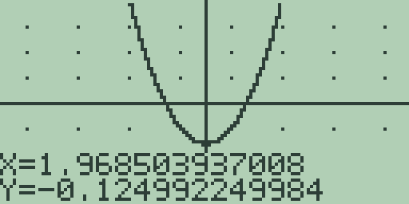
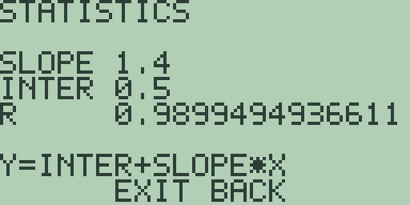
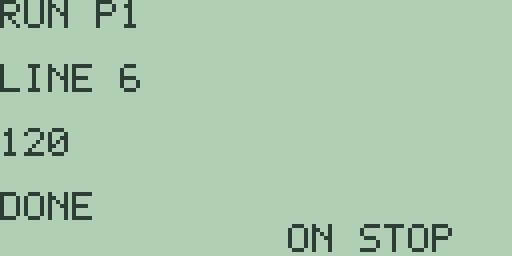

# Chapter 17: Worked Application Examples

The reference chapters cover one feature at a time; this chapter puts
them together. Three complete examples follow, one from graphing, one
from statistics, and one from programming, each solved end to end with
every keystroke listed. All three were run start to finish in the
emulator on a fresh machine, and every quoted figure is what the screen
showed.

## Example 1: finding and checking a root

**The task:** study the parabola y = x^2-4, locate a root, and check
the answer numerically.

**Plot the function.** The home entry line is the equation editor
(Chapter 4: Cartesian Graphing, Drawing, Formats, and Persistence), so
type [x-VAR] [x²] [-] [4] and press [GRAPH]. The expression `X^2-4` is
stored as `Y1` and the parabola draws, column by column. Let the plot
run to completion: the home-screen check we finish with needs one
completed plot, and after an interrupted plot it answers
`SYNTAX ERROR` instead (chapter 4's warning).

**Frame the view.** The zoom keys replot immediately: press [+] to zoom
in and watch the window halve to -5 to 5, then press [2nd] [+], the
standard-zoom key, to restore the -10 to 10 window this example uses.

**Trace towards the root.** The [▶] key traces along the curve from
the centre column, one column per press, with the exact coordinates in
the readout at the bottom. Press [▶] twelve times and the readout
shows the curve approaching its positive root near x = 2:

The readout gives `X=1.968503937008` and `Y=-0.124992249984`: just
short of x = 2, the curve sits a fraction below the axis.

**Publish a root.** Press [F1], the root key, and the calculator
answers on the home screen with `= -2` and the residual line `R=0`.
The search scans the window from its left edge, so it lands on the
leftmost root, x = -2; by the parabola's symmetry the traced root is
its mirror image at x = 2.

**Check both numerically.** From the home screen (press [CLEAR] to
empty the entry line), the calculus commands of Chapter 3:
Mathematics, Calculus, and Comparisons read the same stored equation.
Type `EVAL(2)` with the letters ([E] [V] [A] [L], chapter 1's [ALPHA]
convention) and press [ENTER]: the answer is `= 0`, confirming x = 2
is a root on the nose. Then `NDER(2)` answers `= 4`, the slope 2x at
the root, so the curve crosses the axis there rising at slope 4.

One plot, a trace, one soft key, and two home-screen commands: the
graph screen found the root and the calculus commands proved it.

## Example 2: fitting and forecasting a line

**The task:** fit a straight line through a small paired dataset and
forecast the next value.

**Enter the data.** The dataset is four pairs: (1,2), (2,3), (3,5),
and (4,6). Press [STAT] to open the statistics editor of Chapter 15:
Statistics and Statistical Plots. A fresh machine already holds four
entries, so no resizing is needed: type [1] [ENTER] [2] [ENTER] [3]
[ENTER] [4] [ENTER] to fill the `X` column, press [ALPHA] to switch to
the `Y` column, and type [2] [ENTER] [3] [ENTER] [5] [ENTER] [6]
[ENTER].

**Fit the line.** Press [F3] (`LIN`) and the regression result screen
answers:

`SLOPE` reads `1.4`, `INTER` reads `0.5`, and `R` reads
`0.9899494936611`, a strong fit, with the last line `Y=INTER+SLOPE*X`
stating the model. The fitted line is y = 0.5 + 1.4x.

**Forecast.** There is no forecast key, so chapter 15's method makes
it a home-screen job: press [EXIT] to leave the result screen, press
[CLEAR], and evaluate the model at x = 5 by typing `.5+1.4*5` and
pressing [ENTER]. The answer line reads `= 7.5`, the fitted forecast
for the fifth pair. Four pairs, one soft key, and one typed line: the
editor held the data, `LIN` named the model, and the home screen
turned it into a forecast.

## Example 3: a factorial program

**The task:** compute 5! with a program, then check the answer with a
built-in function.

**Write the program.** Press [PRGM] [F1] to create `P1` in the editor
of Chapter 16: Calculator Programming, and type these six lines,
pressing [ENTER] after each (letters with [ALPHA]; the space is
[2nd] [0]):

| Line | Text | Keys |
| --- | --- | --- |
| 1 | `1->F` | [1] [STO▶] [F] |
| 2 | `FOR A,1,5` | [F] [O] [R] [2nd] [0] [A] [,] [1] [,] [5] |
| 3 | `F*A->F` | [F] [×] [A] [STO▶] [F] |
| 4 | `END` | [E] [N] [D] |
| 5 | `DISP F` | [D] [I] [S] [P] [2nd] [0] [F] |
| 6 | `STOP` | [S] [T] [O] [P] |

Line 1 seeds the running product, the `FOR` loop multiplies it by 1
through 5, and `DISP` publishes the result.

**Run it.** Press [F2] (`RUN`):

The run screen answers `120` on its output line with the status
`DONE`: 5! computed by four working lines.

**Check it.** Press [PRGM] to return to the list and [EXIT] to go
home. The factorial function of chapter 3 sits on the `MATH` menu, so
press [F1] [F3] to insert `FACT(`, type [5] [)], and press [ENTER]:
the answer is `= 120`, matching the program exactly. The program and
the function agree because they share one arithmetic: the same
fourteen-digit engine evaluates program lines and home entries alike.
