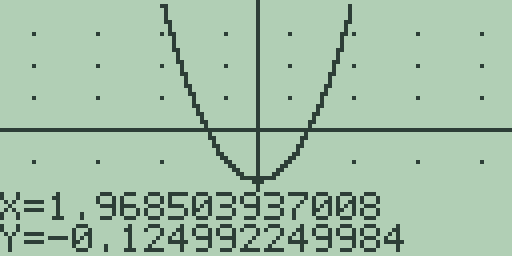
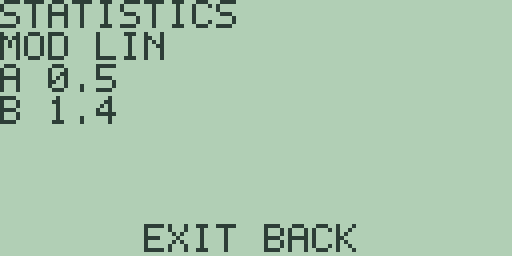
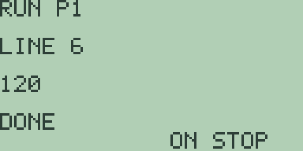

# Chapter 17: Worked Application Examples

The reference chapters cover one feature at a time; this chapter puts
them together. Four complete examples follow, one from graphing, two
from statistics, and one from programming, each solved end to end with
every keystroke listed. All four were run start to finish in the
emulator on a fresh machine, and every quoted figure is what the screen
showed.

## Example 1: finding and checking a root

**The task:** study the parabola y = x^2-4, locate a root, and check
the answer numerically.

**Plot the function.** The home entry line is the equation editor
(Chapter 4: Cartesian Graphing, Drawing, Formats, and Persistence), so
type [x-VAR] [x²] [-] [4] and press [GRAPH]. The expression `X^2-4` is
stored as `Y1` and the parabola draws, column by column. Let the plot
run to completion so the whole curve is on screen for the trace below.

**Frame the view.** The zoom keys replot immediately: press [+] to zoom
in and watch the window halve to -5 to 5, then press [2nd] [+], the
standard-zoom key, to restore the -10 to 10 window this example uses.

**Trace towards the root.** The [▶] key traces along the curve from
the centre column, one column per press, with the exact coordinates in
the readout at the bottom. Press [▶] twelve times and the readout
shows the curve approaching its positive root near x = 2:

The readout gives `X=1.968503937008` and `Y=-0.124992249984`: just
short of x = 2, the curve sits a fraction below the axis.

**Publish a root.** Press [F1], the root key, and the calculator
answers on the home screen with `= -2` and the residual line `R=0`.
The search scans the window from its left edge, so it lands on the
leftmost root, x = -2; by the parabola's symmetry the traced root is
its mirror image at x = 2.

**Check both numerically.** From the home screen (press [CLEAR] to
empty the entry line), the calculus commands of Chapter 3:
Mathematics, Calculus, and Comparisons read the same stored equation.
Type `EVAL(2)` with the letters ([E] [V] [A] [L], chapter 1's [ALPHA]
convention) and press [ENTER]: the answer is `= 0`, confirming x = 2
is a root on the nose. Then `NDER(2)` answers `= 4`, the slope 2x at
the root, so the curve crosses the axis there rising at slope 4.

One plot, a trace, one soft key, and two home-screen commands: the
graph screen found the root and the calculus commands proved it.

## Example 2: fitting and forecasting a line

**The task:** fit a straight line through a small paired dataset and
forecast the next value.

**Enter the data.** The dataset is four pairs: (1,2), (2,3), (3,5),
and (4,6). Press [STAT] to open the statistics editor of Chapter 15:
Statistics and Statistical Plots. A fresh machine already holds four
entries, so no resizing is needed: type [1] [ENTER] [2] [ENTER] [3]
[ENTER] [4] [ENTER] to fill the `X` column, press [ALPHA] to switch to
the `Y` column, and type [2] [ENTER] [3] [ENTER] [5] [ENTER] [6]
[ENTER].

**Fit the line.** Press [F3] (`LIN`) and the regression result screen
answers:

Under the `STATISTICS` banner, `MOD LIN` names the model, `A`, the
intercept, reads `0.5`, and `B`, the slope, reads `1.4`: the fitted
line is y = 0.5 + 1.4x. The footer `EXIT BACK` names chapter 15's two
ways off a result screen, [EXIT] to the home screen and [CLEAR] back
to the editor.

**Judge the fit.** The result screen stops at the coefficients, so
press [CLEAR] to return to the editor and [F2] (`2V`): the paired
summary answers `R` reading `0.9899494936611`, a strong fit.

**Forecast.** Chapter 15's `FCY` key forecasts from an entry in the
data columns, as example 4 shows; for a one-off x the two coefficients
are quicker typed by hand: press [EXIT] to leave for the home screen,
press [CLEAR], and evaluate the model at x = 5 by typing `.5+1.4*5`
and pressing [ENTER]. The answer line reads `= 7.5`, the fitted
forecast for the fifth pair. Four pairs, two soft keys, and one typed
line: the editor held the data, `LIN` named the model, and the home
screen turned it into a forecast.

## Example 3: a factorial program

**The task:** compute 5! with a program, then check the answer with a
built-in function.

**Write the program.** Press [PRGM] [F1] to create `P1` in the editor
of Chapter 16: Calculator Programming, and type these six lines,
pressing [ENTER] after each (letters with [ALPHA]; the space is
[2nd] [0]):

| Line | Text | Keys |
| --- | --- | --- |
| 1 | `1->F` | [1] [STO▶] [F] |
| 2 | `FOR A,1,5` | [F] [O] [R] [2nd] [0] [A] [,] [1] [,] [5] |
| 3 | `F*A->F` | [F] [×] [A] [STO▶] [F] |
| 4 | `END` | [E] [N] [D] |
| 5 | `DISP F` | [D] [I] [S] [P] [2nd] [0] [F] |
| 6 | `STOP` | [S] [T] [O] [P] |

Line 1 seeds the running product, the `FOR` loop multiplies it by 1
through 5, and `DISP` publishes the result.

**Run it.** Press [F2] (`RUN`):

The run screen answers `120` on its output line with the status
`DONE`: 5! computed by four working lines.

**Check it.** Press [PRGM] to return to the list, [EXIT] to go home,
and [CLEAR] to empty the entry line the run left behind. The factorial
function of chapter 3 sits on the `MATH` menu, so press [F1] [F3] to
insert `FACT(`, type [5] [)], and press [ENTER]: the answer is `= 120`,
matching the program exactly. The program and the function agree
because they share one arithmetic: the same fourteen-digit engine
evaluates program lines and home entries alike.

## Example 4: a curve through a projectile's flight

**The task:** a ball thrown straight up was measured once a second: at
1 s it stood at 25 m, at 2 s at 40 m, at 3 s at 45 m, and at 4 s at
40 m. Fit a quadratic to height against time and forecast the height
at 5 s.

**Enter the data.** Press [STAT] and fill the editor's four entries as
in example 2: type [1] [ENTER] [2] [ENTER] [3] [ENTER] [4] [ENTER]
into the `X` column for the seconds, press [ALPHA] to switch to the
`Y` column, and type [2] [5] [ENTER] [4] [0] [ENTER] [4] [5] [ENTER]
[4] [0] [ENTER] for the heights.

**Fit the parabola.** The polynomial fits sit on the editor's fourth
soft-key page (chapter 15), so press [MORE] three times and press
[F4] (`P2`). The result screen answers `MOD P2` with `A 0`, `B 30`,
and `C -5`, coefficients in ascending powers: the fitted curve is
h = 30t - 5t^2, a launch speed of 30 m/s against a pull of 10 m/s^2,
peaking at 45 m at t = 3 exactly as the data suggests.

**Forecast the fifth second.** Chapter 15's `FCY` key forecasts y from
the x of the entry the editor is standing on, so give it an entry
holding 5. Press [CLEAR] to return to the editor, [ALPHA] to switch
back to the `X` column, and [+] to grow the columns to five entries;
press [▼] four times to reach `INDEX 5` and type [5] [ENTER] to store
the time. [ENTER] wraps the selection back to `INDEX 1`, so press [▼]
four times to stand on the new entry again. The soft keys kept their
page while you edited, so a single [MORE] reaches the fifth page:
press [F3] (`FCY`) and the `FORECAST` screen answers the direction
line `X->Y` with the forecast `25` above the `5` it used. The model
puts the ball at 25 m as the fifth second ends, twenty below its peak
and falling; [EXIT] leaves for the home screen. One editor, one
polynomial key, and one forecast key: the forecast example 2 typed by
hand, this example reads straight off a screen.
