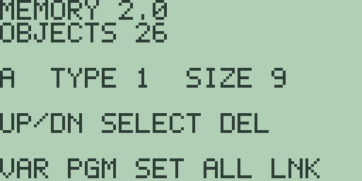

# Chapter 18: Memory Management

Chapter 2: Variables and Stored Data introduced the places Free85 stores
your data; this chapter is about looking after them. The memory browser
shows every stored object with its type and exact size, deletes objects one
at a time, performs the bulk clears and resets, and opens the link screen.
Behind it sits the typed object store of the 2.0 store format, whose
capacity rules and persistence guarantees close the chapter.

## Opening the memory browser

The [+] key's shifted function is `MEM`. Press [2nd] [+] and the browser
takes over the screen:

The same screen opens from the home screen's `MEM` soft key ([F4]) and from
the `MEM` soft key on the system mode screen ([2nd] [MORE] [F5]), so it is
never more than two presses away. [EXIT] returns you to the home screen.

Reading from the top: the title `MEMORY 2.0` names the store format, and
`OBJECTS 26` counts every object it currently holds. On a fresh machine
those twenty-six objects are the reserved variables `A` through `Z`. The
middle line describes the selected object, here `A  TYPE 1  SIZE 9`: its
name, its type number, and its exact size in bytes. The hint
`UP/DN SELECT DEL` and the soft labels `VAR PGM SET ALL LNK` list everything
the screen can do.

## Browsing by type and size

[▲] and [▼] step the selection through the directory; press [▼] once and the
middle line reads `B  TYPE 1  SIZE 9`. Every object shows the same three
facts, so the browser doubles as a memory-usage display: the sizes are the
store's own accounting, byte for byte. A real number is nine bytes.

The type numbers cover every kind of object the store can hold:

| Type | Object | Type | Object |
| --- | --- | --- | --- |
| `1` | real number | `7` | equation |
| `2` | complex number | `8` | program |
| `3` | list | `9` | constant |
| `4` | matrix | `10` | graph database |
| `5` | vector | `11` | picture |
| `6` | string | | |

In today's firmware the directory you can browse holds the twenty-six
reserved reals; the other types exist in the store's design, but nothing
creates them yet, and appendix D tracks when each arrives. If the store were
ever empty the browser would say `NO OBJECTS`.

## Deleting one object

[DEL] deletes the selected object. For the reserved variables `A` through
`Z` deletion clears the value back to `0` and keeps the directory entry, so
the object count stays at `26` and the letter remains usable. Try it: store
`5->A`, open the browser with [2nd] [+], press [DEL], then [EXIT] and
evaluate `A`. The answer is `= 0`.

For an ordinary, non-reserved object, deletion removes the directory entry
and returns its bytes to the free pool immediately.

## Bulk clears and resets

The five soft keys act on whole categories at once. None of them asks for
confirmation, so read this list before experimenting:

- **[F1] `VAR`** clears all of `A` through `Z` to `0` in one press and
  confirms with a full-screen `VARIABLES CLEARED` notice; [CLEAR] or [EXIT]
  then returns to the home screen. The five numeric memories `M1` through
  `M5` are not touched.
- **[F2] `PGM`** empties the program storage and confirms with
  `PROGRAMS CLEARED`. Chapter 16: Calculator Programming covers what lives
  there.
- **[F3] `SET`** resets the system settings: the angle mode returns to
  `RAD`, the display format to `AUTO`, and the contrast to its default. The
  screen stays on the browser, and stored data, variables, and memories all
  survive.
- **[F4] `ALL`** is the full reset. The calculator restarts on the spot,
  exactly as at first boot: variables, numeric memories, programs, and
  settings are all gone, and a fresh object store is built. There is no
  confirmation step, so treat [F4] with respect.
- **[F5] `LNK`** opens the `NATIVE LINK` status screen, the subject of
  Chapter 19: Calculator Linking.

> ⚠ **Planned:** selecting stored objects for link transfer, and
> transactional backup and restore over the link (Free85 2.0, work
> package 14.9).

> 🔌 **Hardware:** the browser, clears, and resets all run in the emulator,
> and the `LNK` screen drives the emulated link port; physical hardware
> validation is reported separately.

## Capacity and accounting

The object store keeps a directory of up to sixty-four entries backed by a
compacting heap of 22,784 bytes. The accounting is exact by design:

- deleting an object closes the gap in the heap at once and slides the
  later objects down, so free space is always one contiguous run;
- resizing an object moves everything after it and commits only after the
  capacity check succeeds;
- a request that cannot fit, whether the directory is full or the heap is
  short, is refused outright and the store is left exactly as it was.

The practical consequence is the best kind of boring: there is no
fragmentation to manage, the `SIZE` figures in the browser add up to the
truth, and running out of memory produces a refusal rather than a corrupted
store. Free85 never silently overwrites your data to make room.

## Persistence and migration

The store is built to survive. Its header is validated on every start, and a
valid store comes through a warm restart byte for byte, so switching the
calculator off with [2nd] [ON] and on again costs you nothing that was
stored.

Upgrading from a Free85 1.0 state is handled the same way. The store format
carries a version number (currently 13), so the firmware recognises an
older state on sight. It then keeps all existing data in place, rebuilds the
typed directory around it, and advances the version number only as the
final step. If a reset or power loss interrupts the process, the unchanged
version number simply causes the migration to run again from the start; it
cannot half-complete. Should the store's header itself ever be found
corrupt, the directory is rebuilt and the values of `A` through `Z` are
preserved.

Two honest caveats. A full reset from this screen ([F4] `ALL`) deliberately
discards the earlier state and builds a fresh store; that is its job. And
across firmware releases, Free85 does not promise internal-state
compatibility: an upgrade may clear the calculator's stored data, so treat
firmware upgrades like the reset they can be, and copy down anything
irreplaceable first.
