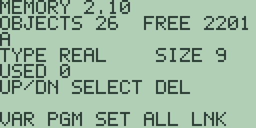

# Chapter 18: Memory Management

Chapter 2: Variables and Stored Data introduced the places Free85 stores
your data; this chapter is about looking after them. The memory browser
shows every stored object with its type named in words and its exact size
in bytes, keeps a running account of the store's used and free space,
deletes objects one at a time, performs the bulk clears and resets, and
hands objects to the link screen of Chapter 19: Calculator Linking.
Behind it sits the typed object store, in its 2.0 format, whose capacity
rules and persistence guarantees close the chapter.

## Opening the memory browser

The [+] key's shifted function is `MEM`. Press [2nd] [+] and the browser
takes over the screen:

The same screen opens from the home screen's `MEM` soft key ([F4]) and from
the `MEM` soft key on the system mode screen ([2nd] [MORE] [F5]), so it is
never more than two presses away. [EXIT] returns you to the home screen.
Appendix A catalogues this chapter's workflow as `memory-by-type`,
`object-size`, `individual-delete`, `reset`, and `leave-memory-screen`.

Reading from the top: the title `MEMORY 2.10` names the running release,
and the second line is the store's account of itself. `OBJECTS 26` counts
every object it currently holds, and `FREE` reports the unused bytes of
its data pool. On a fresh machine the free figure is 22,016, and here the
21-column screen shows its limits: the last digit falls off the right
edge, so the line reads `FREE 2201` until enough is stored to bring the
figure under five digits.

The three lines beneath describe the selected object: its name `A`, then
`TYPE REAL` beside `SIZE 9`, its kind in words and its exact size in
bytes, and then `USED 0`, the bytes of the data pool the store's objects
occupy in total. On a fresh machine those twenty-six objects are the
reserved variables `A` through `Z`, which live in their own permanent
places rather than the pool, so `USED` starts at `0`. The hint
`UP/DN SELECT DEL` and the soft labels `VAR PGM SET ALL LNK` list
everything the screen can do.

## Browsing by type and size

[▲] and [▼] step the selection through the directory, stopping at both
ends rather than wrapping; press [▼] once and the middle lines read `B`
with `TYPE REAL` and `SIZE 9`. Every entry shows the same facts, so the
browser doubles as a memory-usage display: the sizes are the store's own
accounting, byte for byte, and a real number is nine bytes.

The browser names every kind of object the store can hold with a word:
`REAL`, `COMPLEX`, `LIST`, `MATRIX`, `VECTOR`, `STRING`, `EQUATION`,
`PROGRAM`, `CONSTANT`, `GRAPH DB`, and `PICTURE` cover the eleven kinds
of chapter 2, and an entry the firmware cannot place is listed as
`UNKNOWN`. If the store were ever empty the browser would say
`NO OBJECTS`.

Beyond the reserved reals, the directory fills through the calculator's
own workflows: Chapter 8 (Physical and User Constants and Conversions)
stores user constants, and chapter 4's graph screen stores pictures and
graph databases. To see the accounting move, plot any equation, store the
image with chapter 4's `StPic` ([CUSTOM], [MORE] [MORE], [F3]), and
reopen the browser: the count reads `OBJECTS 27` and the total climbs to
`USED 1024`. Step down to the new entry and it reads `PIC1` with
`TYPE PICTURE`; its size, 1,024 bytes, is one digit more than the `SIZE`
column can show, so the line reads `SIZE 102` with the final digit off
the screen edge, and the `USED` line beneath carries the full figure.

## Deleting one object

[DEL] deletes the selected object. For the reserved variables `A` through
`Z` deletion clears the value back to `0` and keeps the directory entry, so
the object count stays at `26` and the letter remains usable. Try it: store
`5->A`, open the browser with [2nd] [+], press [DEL], then [EXIT] and
evaluate `A`. The answer is `= 0`.

For an ordinary object, deletion removes the directory entry and returns
its bytes to the free pool immediately: [DEL] on the stored `PIC1` above
drops the count back to `OBJECTS 26`, returns the total to `USED 0`, and
moves the selection to the previous entry.

## Bulk clears and resets

The five soft keys act on whole categories at once. None of them asks for
confirmation, so read this list before experimenting:

- **[F1] `VAR`** clears all of `A` through `Z` to `0` in one press and
  confirms with a full-screen `VARIABLES CLEARED` notice; [CLEAR] or [EXIT]
  then returns to the home screen. The five numeric memories `M1` through
  `M5` are not touched.
- **[F2] `PGM`** empties all four program slots and confirms with
  `PROGRAMS CLEARED`. Chapter 16: Calculator Programming covers what lives
  there; its programs keep to their own four slots and are managed here
  only by this clear.
- **[F3] `SET`** resets the system settings: the angle mode returns to
  `RAD`, the display format to `AUTO`, and the contrast to its default. The
  screen stays on the browser, and stored data, variables, and memories all
  survive.
- **[F4] `ALL`** is the full reset. The calculator restarts on the spot,
  exactly as at first boot: variables, numeric memories, programs, and
  settings are all gone, and a fresh object store is built. There is no
  confirmation step, so treat [F4] with respect.
- **[F5] `LNK`** opens the link screen of chapter 19 standing on the same
  object the browser had selected, ready to mark it for transfer.

> 🔌 **Hardware:** the browser, clears, and resets all run in the emulator,
> and the `LNK` screen leads to the emulator-run link workflow of chapter
> 19; physical hardware validation is reported separately.

## Capacity and accounting

The object store keeps a directory of up to sixty-four entries backed by a
compacting data pool of 22,016 bytes. The accounting is exact by design:

- deleting an object closes the gap in the pool at once and slides the
  later objects down, so free space is always one contiguous run;
- resizing an object moves everything after it and commits only after the
  capacity check succeeds;
- a request that cannot fit, whether the directory is full or the pool is
  short, is refused outright and the store is left exactly as it was.

The practical consequence is the best kind of boring: there is no
fragmentation to manage, the `SIZE`, `USED`, and `FREE` figures in the
browser add up to the truth, and running out of memory produces a refusal
rather than a corrupted store. Free85 never silently overwrites your data
to make room.

## Persistence and migration

The store is built to survive. Its header is validated on every start, and a
valid store comes through a warm restart byte for byte, so switching the
calculator off with [2nd] [ON] and on again costs you nothing that was
stored.

Upgrading from a Free85 1.0 state is handled the same way. The store format
carries a version number (currently 13), so the firmware recognises an
older state on sight. It then keeps all existing data in place, rebuilds the
typed directory around it, and advances the version number only as the
final step. If a reset or power loss interrupts the process, the unchanged
version number simply causes the migration to run again from the start; it
cannot half-complete. Should the store's header itself ever be found
corrupt, the directory is rebuilt and the values of `A` through `Z` are
preserved.

Two honest caveats. A full reset from this screen ([F4] `ALL`) deliberately
discards the earlier state and builds a fresh store; that is its job. And
across firmware releases, Free85 does not promise internal-state
compatibility: an upgrade may clear the calculator's stored data, so treat
firmware upgrades like the reset they can be, and copy down anything
irreplaceable first.
