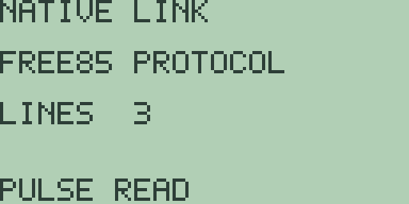

# Chapter 19: Calculator Linking

The calculator's link port is the socket on its edge that connects two
machines, and this short chapter covers what Free85 does with it today:
a native diagnostics screen that drives and reads the port's two
signal lines. Item transfer and backup over the cable are planned, and
their callouts close the chapter. Everything shown here was exercised
in the emulator, and the screen is quoted as it draws.

## The native link screen

The [x-VAR] key's shifted function is `LINK`. Press [2nd] [x-VAR] and
the link screen opens; the `LNK` soft key in the memory browser
([F5], Chapter 18: Memory Management) leads to the same place:

Three lines describe the port. The banner `NATIVE LINK` names the
screen, `FREE85 PROTOCOL` names the wire protocol the firmware speaks,
and `LINES  3` reports the state of the port's two signal lines as a
two-bit value: each line contributes one bit, so `3` means both lines
are high, the idle state of an unconnected port. The soft labels
`PULSE READ` name the two actions, and [EXIT] returns to the home
screen.

- **[F1] (`PULSE`)** writes the opposite of the current line state to
  the port, then reads the lines back. With nothing connected they
  settle straight back to idle, so the reading stays `LINES  3`; a
  different value after a pulse is the sign of a live partner holding
  the lines.
- **[F2] (`READ`)** samples the lines without writing, refreshing the
  `LINES` value. A connected device pulling a line low shows up here
  as a `2`, `1`, or `0`.

That is the whole screen, and it is deliberately a diagnostic: it
proves the port electronics respond, which is the foundation the
transfer work below builds on.

## What linking does not do yet

No data moves over the cable in this release. Stored objects cannot be
selected for sending, nothing can be received, and there is no backup
image to transmit; the memory browser of chapter 18 manages objects on
one machine only.

> 🔌 **Hardware:** item transfer over the link (selecting, sending,
> and receiving stored objects, with duplicate handling and safe
> interruption) is planned hardware-dependent work (Free85 2.0, work
> package 14.9); physical hardware validation is reported separately.

> 🔌 **Hardware:** transactional backup and restore of the whole
> calculator over the link is planned hardware-dependent work
> (Free85 2.0, work package 14.9); physical hardware validation is
> reported separately.

## The clean-room boundary

Because Free85 is written from scratch, its link protocol is its own:
it does not read or write TI file formats, token streams, backup
images, or ROM-level link calls, and a link partner is expected to be
another Free85 machine.
