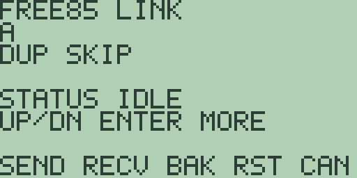
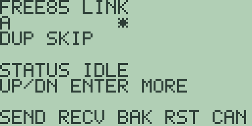

# Chapter 19: Calculator Linking

The calculator's link port is the socket on its edge that connects two
machines, and with Free85 2.10 it earns a working screen: stored
objects can be marked and sent to a partner calculator, received from
one under a duplicate policy you choose, and the whole machine can be
backed up and restored over the cable, transactionally. This chapter
covers the screen and its vocabulary; everything quoted was exercised
in the emulator, where complete transfers run between two emulated
machines.

## The link screen

The [x-VAR] key's shifted function is `LINK`. Press [2nd] [x-VAR] and
the link screen opens; the `LNK` soft key in the memory browser
([F5], Chapter 18: Memory Management) leads to the same place,
standing on whatever object the browser had selected:

The banner `FREE85 LINK` names the screen. Below it sits one object of
chapter 18's directory at a time, `A` on a fresh machine, then the
duplicate policy line `DUP SKIP`, the status line `STATUS IDLE`, the
hint `UP/DN ENTER MORE`, and the soft labels `SEND RECV BAK RST CAN`.
The screen always opens idle, and [EXIT] returns to the home screen.
Appendix A catalogues this chapter's workflow as `select-items`,
`send-items`, `receive-items`, `duplicate-skip`, `duplicate-overwrite`,
`duplicate-rename`, and `transfer-cancel`, and the backup work as
`backup-send`, `backup-confirm`, `backup-restore`, and
`backup-rollback`.

## Marking what to send

[▲] and [▼] step through the directory in the browser's order, and
[ENTER] marks the shown object for transfer, answering with a `*` on
the right of its line; [ENTER] again unmarks it:

Mark as many objects as you like, visiting each in turn. The marks
are kept in the store itself, so they survive stepping away, leaving
the screen entirely, and coming back; a transfer sends every marked
object in one go.

## The duplicate policy

The `DUP` line answers the collision question before it is asked: what
should a receiving calculator do when an incoming object carries a
name it already holds? [MORE] cycles the policy from `SKIP` to
`OVERWRITE` to `RENAME` and around again, and the setting belongs to
the receiving side:

- **`SKIP`** keeps the receiver's object and drops the incoming copy.
- **`OVERWRITE`** replaces the receiver's object with the incoming
  one.
- **`RENAME`** keeps both: the incoming copy is stored under its name
  with a letter added, so a second `RATE` arrives as `RATEA`.

## Sending and receiving

[F1] (`SEND`) posts every marked object for transfer and the status
line answers `STATUS WAITING`: the calculator is offering the objects
and waiting for a partner that is ready to take them. [F2] (`RECV`)
waits the complementary way, ready to receive whatever a partner
offers, under the `DUP` policy on show. When the two sides meet, the
transfer runs and the receiver finishes at `STATUS COMPLETE` with the
objects stored, named, and immediately usable. The status line's whole
vocabulary is `IDLE`, `WAITING`, `ACTIVE` while a transfer is running,
`COMPLETE`, `CANCELLED`, and `ERROR`.

The transfer is checked as it arrives, and it is all or nothing: a
damaged or interrupted transfer is refused whole, and one that will
not fit is refused by chapter 18's capacity rules, so the receiving
calculator keeps exactly what it had rather than a half-applied copy.

[F5] (`CAN`) cancels: the posted command is withdrawn and the status
answers `STATUS CANCELLED`. Leaving the screen with [EXIT] in the
middle of a running transfer cancels it the same way.

## Backup and restore

The last pair of soft keys moves whole machines rather than chosen
objects. [F3] (`BAK`) offers a backup of everything the calculator
stores, and [F4] (`RST`) asks a partner for one; both post their
request and wait at `STATUS WAITING` like a send. A restore replaces
the receiving calculator's stored state with the backup's, and its
previous objects go, so treat `RST` like the reset it is.

The exchange is transactional: the archive is checked whole, and a
damaged backup restores nothing at all, leaving the machine exactly as
it was rather than half-restored.

> 🔌 **Hardware:** marking, policies, statuses, and cancellation are
> quoted from the emulator's screen, and complete transfers, backups,
> and restores run between two emulated machines; physical hardware
> validation is reported separately.

## The clean-room boundary

Because Free85 is written from scratch, its link protocol is its own:
it does not read or write TI file formats, token streams, backup
images, or ROM-level link calls, and a link partner is expected to be
another Free85 machine.
