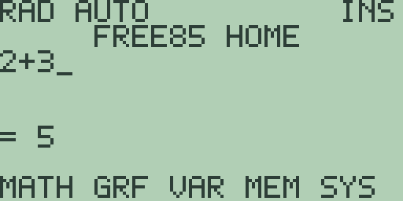
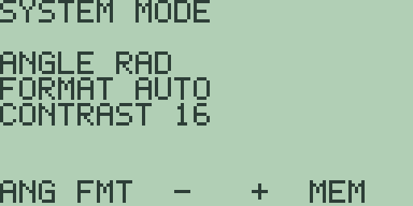
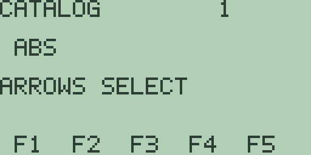

# Free85 Getting Started Manual

## Welcome

Free85 is a scientific graphing calculator that runs in your browser. It is a
complete, independently written firmware of original Z80 code, running on a
faithful emulation of a TI-85-compatible pocket calculator.

Free85 is clean-room software. Everything in it (the firmware, the font, the
screen artwork, the tests, and this manual) was written from scratch for this
project. It contains no Texas Instruments ROM code, disassembly, fonts,
artwork, or binary tables. The TI-85 is referenced only to describe the
hardware profile the firmware runs on; the project is not affiliated with or
endorsed by Texas Instruments. Because the internals are original, Free85 makes
no promise of compatibility with TI programs, files, tokens, ROM calls, or
internal data structures. What it does promise is that every physical key,
every shifted function printed above a key, and every reachable menu leads to a
real, working feature.

Free85 is open source under the MIT License. See the `LICENSE` file for the
license text and `NOTICE.md` for the project notices.

This manual gets you from a blank screen to confident everyday use: running
the calculator, understanding the keyboard and display, doing your first
calculations, adjusting modes, and finding functions in the catalog. When you
want depth (graphing, statistics, programming, and everything else), the
companion Guidebook covers each subject in its own chapter. The final section
of this manual maps out where to go.

### The hardware at a glance

The machine Free85 targets is a Z80 processor at 6 MHz driving a 128 by 64
pixel monochrome LCD, with eight 16 KiB ROM pages (131,072 bytes in all),
32 KiB of RAM, and a keyboard of 49 matrix keys plus a separate [ON] key.

## Running Free85

The easiest way to use Free85 is the browser calculator published from this
repository by GitHub Pages. It lives at
<https://chriswilson2020.github.io/Free85/> and is also linked from the
repository README in case the address changes. Open the page and the
calculator is ready to use, no installation at all.

To run it on your own machine you need Node.js 24 or newer. From the
repository root:

```sh
npm run dev
```

Then open <http://localhost:3000/> in a browser. The bundled open-source
`FREE85.ROM` loads automatically, and the page also lets you select another
compatible 128 KiB ROM if you have one.

There is also a quick terminal preview that boots the machine, presses any
keys you list, and prints an ASCII rendering of the LCD:

```sh
npm run run:free85 -- GRAPH
```

This is handy for scripting and for checking behaviour without opening a
browser. The key names it accepts are the physical key names used throughout
this manual, such as `ENTER`, `2ND`, `GRAPH`, and `F1`.

## The keyboard

The keyboard has fifty keys arranged in a few zones. Once you know the zones,
your fingers find things quickly.

- **Soft keys.** [F1] [F2] [F3] [F4] [F5] sit directly under the screen. They
  have no fixed meaning of their own: they select whatever five labels are
  currently shown along the bottom row of the display. When the labels change,
  the keys change with them.
- **Navigation and modifiers.** The next two rows share the cursor pad on
  their right-hand side: the first row holds [2nd], [EXIT], and [MORE] beside
  the [▲] and [▼] keys, and the second holds [ALPHA], [x-VAR], and [DEL]
  beside [◀] and [▶]. [EXIT] backs out one level; [2nd] [EXIT] is `QUIT`,
  which jumps straight back to the home screen.
- **Application keys.** [GRAPH], [STAT], [PRGM], [CUSTOM], and [CLEAR] open
  the major applications: graphing, statistics, programming, your custom menu,
  and clearing the entry line.
- **Function rows.** [LOG], [SIN], [COS], [TAN], [^], then [LN], [EE], [(],
  [)], [÷], then [x²] beside the digit pad. Each carries a shifted function
  printed above it and, on most keys, a letter for alpha entry.
- **Digit pad.** The digits, decimal point, [(-)] for negative numbers, the
  arithmetic operators down the right-hand side, [STO▶] for storing variables,
  and [ENTER] in the bottom corner.
- **The [ON] key.** A separate key that wakes the calculator or interrupts a
  running operation; [2nd] [ON] turns it off.

### How [2nd] works

[2nd] is a one-shot modifier. Press it once, and the *next* key you press
performs the shifted function printed above that key instead of its normal
one. For example, [^] normally types the power operator, but [2nd] [^] types
`PI`. Try it: press [2], then [2nd] [^], then [ENTER], and the calculator
evaluates `2PI` to `6.2831853071796`. The modifier applies to exactly one
keypress and then switches itself off.

### How [ALPHA] works

[ALPHA] is the letter modifier. Most keys have a letter assigned to them:
[LOG] is `A`, [SIN] is `B`, and so on through the keyboard to [.] for `Z`,
with [x-VAR] providing `x`. Press [ALPHA] once and the next key types its
letter: [ALPHA] [LOG] types `A`.

Press [ALPHA] twice and letter entry locks: the status line shows `LOCK`, and
every key types its letter until you press [ALPHA] again to unlock. For
example, [ALPHA] [ALPHA] [SIN] [ALPHA] [1] types `B1` (the lock typed `B`,
the third [ALPHA] released it, and [1] went back to being a digit).

Lowercase letters exist too. [2nd] [ALPHA] selects lowercase letter entry;
then [ALPHA] followed by a letter key types the lowercase letter. For example,
[2nd] [ALPHA] [ALPHA] [SIN] types `b`.

### What [MORE] does

Menus in Free85 show at most five choices at a time, one per soft key, and
[MORE] pages to the next set. In the `MATH` menu, for example, the first page
offers `ABS(`, `SQRT(`, `FACT(`, `NPR(`, and `NCR(`; pressing [MORE] brings
the next five, starting with `SINH(` and `COSH(`. Keep pressing [MORE] to
cycle through all the pages. The same paging works on any row of soft labels,
including the home screen's own menu row.

### Keys worth memorising

| Key | Normal | With [2nd] |
| --- | --- | --- |
| [ENTER] | Evaluate the entry | `ENTRY`: recall the previous entry |
| [(-)] | Unary minus | `ANS`: insert the previous answer |
| [CLEAR] | Clear the entry or dismiss an error | `TOLER`: change the numerical tolerance |
| [EXIT] | Back out one level | `QUIT`: return home |
| [MORE] | Next menu page | `MODE`: system mode screen |
| [DEL] | Delete at the cursor | `INS`: toggle insert/overwrite |
| [ALPHA] | Letter entry (twice to lock) | Lowercase letter entry |
| [CUSTOM] | Your custom menu | `CATALOG`: every callable function |
| [STO▶] | Store to a variable | `RCL`: recall a variable |
| [GRAPH] | The graph screen | `SOLVER`: equation solver |

Every key also has a second function and often a letter, far more than fits in
one table. Guidebook appendix B lists the complete map of all fifty keys with
their normal, shifted, and alpha meanings.

## The screen

Switch the calculator on and you see the home screen:


Reading from the top:

- **Status region.** The top line shows the calculator's current state at a
  glance: the angle mode (`RAD` or `DEG`) and display format (`AUTO`, `SCI`,
  `ENG`, or `FIX`) on the left, and the editor state on the right (`INS` for
  insert mode, `OVR` for overwrite, and `LOCK` when alpha lock is on).
- **Title banner.** `FREE85 HOME` tells you which screen you are on.
- **Entry line.** The underscore is the cursor. Whatever you type appears
  here.
- **Result area.** The middle of the screen. After you press [ENTER] the
  result appears here, introduced by `=`.
- **Soft-menu labels.** The bottom row names what [F1] through [F5] currently
  do. On the home screen these open the main menus: `MATH`, `GRF`, `VAR`,
  `MEM`, and `SYS`, with a second page under [MORE].

Menus and editors take over the screen when you open them. Press [F1] on the
home screen and the `MATH` menu appears, listing five functions with a hint
line at the bottom:


Here `F1-F5 INSERT MORE` means: press the soft key matching a listed item to
insert it into your entry, or press [MORE] for the next page. [EXIT] takes you
back to the home screen with your entry untouched.

Other screens work similarly. Press [GRAPH] and the calculator draws the
graph screen: axes and grid dots. Press [MORE] on the graph screen and the
table of values opens, with columns for `Y1`, `Y2`, and `Y3` and soft labels
`UP DN GRAPH EXIT`. Full-screen dialogs, such as error messages and the mode
screen, tell you on-screen which keys they respond to. Equations themselves
are typed on the home entry line; the Guidebook's graphing chapters explain
the workflow.

## First calculations

Time to calculate something. From the home screen, press:

[2] [+] [3] [ENTER]

The entry line shows `2+3` and the result area answers `= 5`:



Notice that the expression stays on the entry line after evaluation. That is
deliberate: you can keep typing to extend the expression and press [ENTER]
again, or press [CLEAR] to start fresh.

### The previous answer

The [(-)] key's shifted function is `ANS`, the previous answer. After the
calculation above, press [CLEAR] to empty the entry line, then:

[2nd] [(-)] [+] [1] [0] [ENTER]

The entry line reads `ANS+10` and the result is `= 15`: the `5` from before,
plus ten. `ANS` can appear anywhere in an expression, as many times as you
like, and always means the most recent numeric result.

### Recalling the previous entry

The [ENTER] key's shifted function is `ENTRY`. Press [CLEAR] to empty the
line, then [2nd] [ENTER], and the previous entry, `2+3`, reappears with the
cursor at the end, ready to edit and re-evaluate.

### Editing

The cursor keys move along the entry line, and [DEL] deletes the character
just before the cursor position. For example, type [1] [2] [3], press [◀]
once, and press [DEL]: the `2` disappears, leaving `13`.

By default the editor is in insert mode (the status line shows `INS`), and
typing pushes existing characters to the right. With `13` on the line, press
[◀] and type [2]: the line becomes `123`. Press [2nd] [DEL] to toggle
overwrite mode instead; the status line changes to `OVR`, and typing replaces
the character under the cursor, so the same [◀] [2] on `13` then produces
`12`. Press [2nd] [DEL] again to return to insert mode.

### When something goes wrong

Errors are full-screen and polite. Type [1] [÷] [0] [ENTER] and a message
screen replaces the home screen. It shows three lines: the error name
`DIVIDE BY ZERO`, the hint `CLEAR OR EXIT` beneath it, and `EXIT BACK` at the
bottom, telling you that [EXIT] returns you to your entry. Press [CLEAR] or
[EXIT] and you are back on the home screen with `1/0` intact and the cursor
at the end, so you can fix the mistake instead of retyping it.

## Modes

Press [2nd] [MORE] to open the `SYSTEM MODE` screen:



Three settings are shown, and the soft keys `ANG FMT - + MEM` adjust them:

- **Angle.** `ANGLE RAD` or `ANGLE DEG`. Press [F1] (`ANG`) to toggle between
  radians and degrees. The choice is echoed in the home-screen status line
  and affects all trigonometric functions.
- **Display format.** Press [F2] (`FMT`) to cycle `FORMAT` through four
  settings:
  - `AUTO`: ordinary decimal output, switching to an exponent for values
    outside the compact display range;
  - `SCI`: one digit before the decimal point and an explicit exponent;
  - `ENG`: one to three digits before the point and an exponent divisible by
    three;
  - `FIX`: a fixed number of decimal places with half-up rounding.

  While `FIX` is selected, [▲] and [▼] change the number of decimal places,
  from `FIX 0` up to `FIX 11`. The format changes how results are displayed,
  not the precision the calculator stores.
- **Contrast.** `CONTRAST 16` by default. [F3] (`-`) lowers the setting one
  step at a time and [F4] (`+`) raises it; the number updates as you press.

[F5] (`MEM`) opens the memory browser from here, showing the object count and
letting you inspect and delete stored objects. Press [EXIT] to leave the mode
screen and return home.

### Number-base display

Free85 can show integer results in other bases. After calculating an integer,
say `42`, press [2nd] [1] to open the `NUMBER BASE` screen. Its soft keys
`DEC HEX OCT BIN` display the previous answer in the chosen base; press [F2]
(`HEX`) and the screen shows `0x002A`. Base entry, two's-complement
behaviour, and the Boolean word operations are covered in Guidebook
chapter 10, *Number Bases and Boolean Operations*.

## The catalog and custom menu

Every function you can call lives in one alphabetical list: the catalog.
Press [2nd] [CUSTOM] to open it:



The header shows the page number and the current item (the list starts at
`ABS`), with the hint `ARROWS SELECT`. Use [▲] and [▼] to move through the
list, and press [ENTER] to paste the highlighted item into your entry line.
For example, [2nd] [CUSTOM] [▼] [▼] [ENTER] pastes `ACOSH(` at the home
screen. Press [EXIT] to leave the catalog without choosing anything.

The catalog and the custom menu work as a pair. While an item is highlighted
in the catalog, pressing one of [F1] through [F5] assigns it to that
custom-menu slot; the screen confirms with a message such as `ASSIGNED F2`.

Press [CUSTOM] (unshifted) to open your custom menu. Its five slots come
preloaded with `ABS`, `EXP`, `LIS`, `SQR`, and `STA`, shown as soft labels,
and the screen explains itself: `F1-F5 RUN SLOT` and `MORE: CATALOG`.
Pressing a soft key inserts that slot's function ([CUSTOM] [F1] pastes
`ABS(`), and pressing [MORE] jumps to the catalog so you can reassign slots.
Once you have arranged your five most-used functions here, they are always
two keypresses away.

## Where next

This manual has walked you through the front door; the Free85 Guidebook is
the full tour, one chapter per subject:

1. **Operating the Calculator**: modes, the editor, and previous entries.
2. **Variables and Stored Data**: storing, recalling, and managing named
   data.
3. **Mathematics, Calculus, and Comparisons**: functions, numerical calculus,
   and comparisons.
4. **Cartesian Graphing, Drawing, Formats, and Persistence**: plotting,
   drawing, and graph formats.
5. **Polar Graphing**: curves in polar coordinates.
6. **Parametric Graphing**: curves driven by a parameter.
7. **Differential-Equation Graphing**: graphing solutions of differential
   equations.
8. **Physical and User Constants and Conversions**: built-in values and unit
   conversions.
9. **Strings and Characters**: text values and the character palette.
10. **Number Bases and Boolean Operations**: binary, octal, and hexadecimal
    display, entry, and word logic.
11. **Complex Numbers**: arithmetic and functions beyond the reals.
12. **Lists**: ordered collections and list arithmetic.
13. **Matrices and Vectors**: linear-algebra objects and their operations.
14. **Equation, Polynomial, and Simultaneous Solving**: the equation,
    polynomial, and simultaneous solvers.
15. **Statistics and Statistical Plots**: analysis, regression, and
    statistical plots.
16. **Calculator Programming**: the on-calculator programming environment.
17. **Worked Application Examples**: complete applications, step by step.
18. **Memory Management**: browsing, inspecting, and deleting stored objects.
19. **Calculator Linking**: the link port and its diagnostics.

Four appendices round it out: appendix A is the command and function catalog,
appendix B the complete key map of all fifty keys, appendix C the system
variables and error messages, and appendix D the feature status and 2.0 gaps
ledger. Pick the chapter that matches what you want to do next, and enjoy the
calculator.
